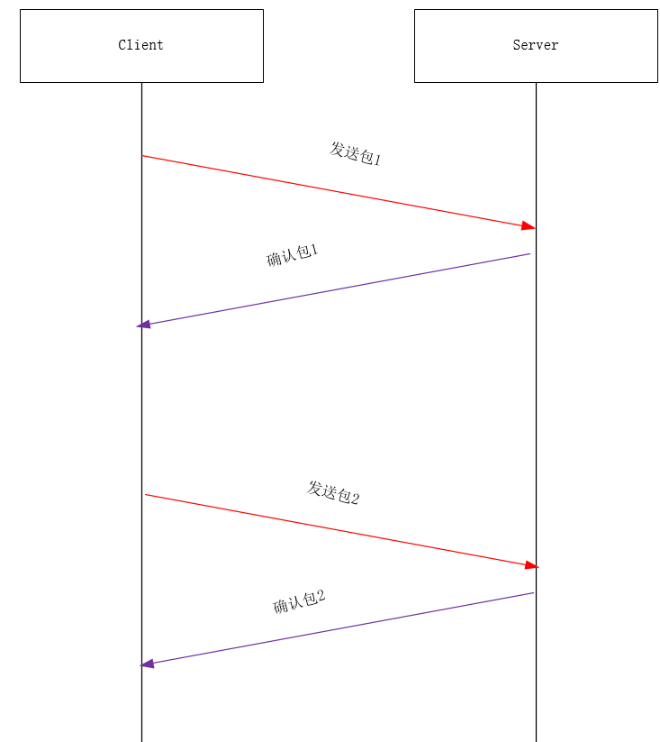

这一章主要要介绍了TCP所使用的被称为滑动窗口协议的另一种形式的流量控制方法。该协议允许发送方在停止并等待确认前可以连续发送多个分组。由于发送方不必每发一个分组就停下来等待确认，因此该协议可以加速数据的传输。

不过这一章没有一开始就说明为何需要滑动动窗口来验证，而是先做了一个实验，然后在来说明TCP 滑动窗口协议。导致个人在阅读的时候有些模糊，特别是对于为何需要滑动窗口协议这一块比较模糊。所以也找了一些资料做了补充。


想一个问题，先不管滑动窗口协议，如何来保证发送方与接收方之间，每个包都能被收到。并且是按次序的呢？




发送方发送一个包1，这时候接收方确认包1。发送包2，确认包2。就这样一直下去，知道把数据完全发送完毕，这样就结束了。那么就解决了丢包，出错，乱序等一些情况！同时也存在一些问题。

上述的方法会导致吞吐量非常的低。我们发完包1，一定要等确认包 1 我们才能发送第二个包。那么为了提高吞吐量，我们可以把几个包一起发送，然后一起确认。


如图，这个就是我们把多个包一起发送，然后一起确认。可以看出我们改进的方案比之前的好很多，所花的时间只是一个来回的时间。接下来，我们还有一个问题：一次发多少个包合适？这就是TCP-IP详情这一章需要探讨的问题。

# 实验

在探讨的TCP成块发送数据过程中涉及到的滑动窗口问题之前，我们先来验证一下成块的数据是否这样发送.

tcp server 代码

```go
func main() {
	address := "0.0.0.0:7099"

	// Create a listening socket.
	l, err := net.Listen("tcp", address)
	if err != nil {
		log.Fatal(err)
	}
	defer l.Close()

	for {
		// Accept new connections.
		c, err := l.Accept()
		if err != nil {
			log.Println(err)
			return
		}

		// Process newly accepted connection.
		go handleConnection(c)
	}
}


func handleConnection(c net.Conn) {
	fmt.Printf("Serving %s\n", c.RemoteAddr().String())

	for {
		// Read what has been sent from the client.
		netData, err := ioutil.ReadAll(c)
		if err != nil {
			log.Println(err)
			return
		}

		if len(netData) == 0 {
			break
		}else{
			log.Println(len(netData))
			log.Printf("%s\n",string(netData))
		}
	}
	c.Close()
}
```

client 的 代码

```go
const letterBytes = "abcdefghijklmnopqrstuvwxyzABCDEFGHIJKLMNOPQRSTUVWXYZ"

func RandStringBytes(n int) string {
	b := make([]byte, n)
	for i := range b {
		b[i] = letterBytes[rand.Intn(len(letterBytes))]
	}
	log.Println(len(b))
	return string(b)
}

func main() {
	address := "xx.xxx.xxx.xxx:7099"

	raddr, err := net.ResolveTCPAddr("tcp", address)
	if err != nil {
		log.Fatal(err)
	}

	// Establish a connection with the server.
	conn, err := net.DialTCP("tcp", nil, raddr)
	if err != nil {
		log.Fatal(err)
	}
	defer conn.Close()
	if err != nil {
		log.Println(err)
	}

	fmt.Println("Sending Gophers down the pipe...")

	for i:=0;i<10;i++ {
		_, err = conn.Write([]byte(RandStringBytes(1600)))
		if err != nil {
			log.Fatal(err)
		} else {
			log.Println("Send Data Success")
		}
	}


}

```

tcpdump 抓包

```shell
tcpdump -i en0  -nn 'port 7099 and tcp'
```


```
16:24:36.634707 IP 192.168.137.234.52472 > xx.xxx.xxx.xxx.7099: Flags [S], seq 377573753, win 65535, options [mss 1460,nop,wscale 6,nop,nop,TS val 381235038 ecr 0,sackOK,eol], length 0
16:24:36.703271 IP xx.xxx.xxx.xxx.7099 > 192.168.137.234.52472: Flags [S.], seq 285576607, ack 377573754, win 28960, options [mss 1460,sackOK,TS val 3224609562 ecr 381235038,nop,wscale 7], length 0
16:24:36.703398 IP 192.168.137.234.52472 > xx.xxx.xxx.xxx.7099: Flags [.], ack 1, win 2058, options [nop,nop,TS val 381235106 ecr 3224609562], length 0
16:24:36.704044 IP 192.168.137.234.52472 > xx.xxx.xxx.xxx.7099: Flags [.], seq 1:1449, ack 1, win 2058, options [nop,nop,TS val 381235106 ecr 3224609562], length 1448
16:24:36.704048 IP 192.168.137.234.52472 > xx.xxx.xxx.xxx.7099: Flags [P.], seq 1449:1601, ack 1, win 2058, options [nop,nop,TS val 381235106 ecr 3224609562], length 152
16:24:36.704169 IP 192.168.137.234.52472 > xx.xxx.xxx.xxx.7099: Flags [.], seq 1601:3049, ack 1, win 2058, options [nop,nop,TS val 381235106 ecr 3224609562], length 1448
16:24:36.704171 IP 192.168.137.234.52472 > xx.xxx.xxx.xxx.7099: Flags [P.], seq 3049:3201, ack 1, win 2058, options [nop,nop,TS val 381235106 ecr 3224609562], length 152
16:24:36.734082 IP xx.xxx.xxx.xxx.7099 > 192.168.137.234.52472: Flags [.], ack 1601, win 252, options [nop,nop,TS val 3224609592 ecr 381235106], length 0
16:24:36.734090 IP xx.xxx.xxx.xxx.7099 > 192.168.137.234.52472: Flags [.], ack 3201, win 277, options [nop,nop,TS val 3224609593 ecr 381235106], length 0
16:24:36.734180 IP 192.168.137.234.52472 > xx.xxx.xxx.xxx.7099: Flags [.], seq 3201:4649, ack 1, win 2058, options [nop,nop,TS val 381235136 ecr 3224609592], length 1448
16:24:36.734182 IP 192.168.137.234.52472 > xx.xxx.xxx.xxx.7099: Flags [.], seq 4649:6097, ack 1, win 2058, options [nop,nop,TS val 381235136 ecr 3224609592], length 1448
16:24:36.734183 IP 192.168.137.234.52472 > xx.xxx.xxx.xxx.7099: Flags [.], seq 6097:7545, ack 1, win 2058, options [nop,nop,TS val 381235136 ecr 3224609592], length 1448
16:24:36.734264 IP 192.168.137.234.52472 > xx.xxx.xxx.xxx.7099: Flags [.], seq 7545:8993, ack 1, win 2058, options [nop,nop,TS val 381235136 ecr 3224609593], length 1448
16:24:36.734266 IP 192.168.137.234.52472 > xx.xxx.xxx.xxx.7099: Flags [.], seq 8993:10441, ack 1, win 2058, options [nop,nop,TS val 381235136 ecr 3224609593], length 1448
16:24:36.800145 IP xx.xxx.xxx.xxx.7099 > 192.168.137.234.52472: Flags [.], ack 6097, win 322, options [nop,nop,TS val 3224609623 ecr 381235136], length 0
16:24:36.800153 IP xx.xxx.xxx.xxx.7099 > 192.168.137.234.52472: Flags [.], ack 7545, win 345, options [nop,nop,TS val 3224609624 ecr 381235136], length 0
16:24:36.800155 IP xx.xxx.xxx.xxx.7099 > 192.168.137.234.52472: Flags [.], ack 10441, win 390, options [nop,nop,TS val 3224609624 ecr 381235136], length 0
16:24:36.800242 IP 192.168.137.234.52472 > xx.xxx.xxx.xxx.7099: Flags [.], seq 10441:11889, ack 1, win 2058, options [nop,nop,TS val 381235201 ecr 3224609623], length 1448
16:24:36.800244 IP 192.168.137.234.52472 > xx.xxx.xxx.xxx.7099: Flags [.], seq 11889:13337, ack 1, win 2058, options [nop,nop,TS val 381235201 ecr 3224609623], length 1448
16:24:36.800245 IP 192.168.137.234.52472 > xx.xxx.xxx.xxx.7099: Flags [.], seq 13337:14785, ack 1, win 2058, options [nop,nop,TS val 381235201 ecr 3224609623], length 1448
16:24:36.800329 IP 192.168.137.234.52472 > xx.xxx.xxx.xxx.7099: Flags [FP.], seq 14785:16001, ack 1, win 2058, options [nop,nop,TS val 381235201 ecr 3224609623], length 1216
16:24:36.830640 IP xx.xxx.xxx.xxx.7099 > 192.168.137.234.52472: Flags [.], ack 13337, win 435, options [nop,nop,TS val 3224609688 ecr 381235201], length 0
16:24:36.830700 IP xx.xxx.xxx.xxx.7099 > 192.168.137.234.52472: Flags [.], ack 16002, win 477, options [nop,nop,TS val 3224609689 ecr 381235201], length 0
16:24:36.832988 IP xx.xxx.xxx.xxx.7099 > 192.168.137.234.52472: Flags [F.], seq 1, ack 16002, win 477, options [nop,nop,TS val 3224609692 ecr 381235201], length 0
16:24:36.833137 IP 192.168.137.234.52472 > xx.xxx.xxx.xxx.7099: Flags [.], ack 2, win 2058, options [nop,nop,TS val 381235232 ecr 3224609692], length 0
```

可以看到数据包确实可以一次发送出好几个。


# 参考

一篇带你读懂TCP之“滑动窗口”协议  https://juejin.im/post/6844903809995505671

TSO 介绍和操作  https://liqiang.io/post/tcp-segmentation-offload-introduction-and-operation-2f0b8949

报文超过 MTU https://gohalo.me/post/linux-network-mtu-oversize.html