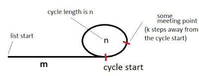

 Floyd判圈算法(Floyd Cycle Detection Algorithm)，又称龟兔赛跑算法(Tortoise and Hare Algorithm)，是一个可以在有限状态机、迭代函数或者链表上判断是否存在环，求出该环的起点与长度的算法。<!--more-->

# 算法描述

如果有限状态机、迭代函数或者链表存在环，那么一定存在一个起点可以到达某个环的某处(这个起点也可以在某个环上)。
初始状态下，假设已知某个起点节点为节点S。现设两个指针t和h，将它们均指向S。接着，同时让t和h往前推进，但是二者的速度不同：t每前进1步，h前进2步。只要二者都可以前进而且没有相遇，就如此保持二者的推进。当h无法前进，即到达某个没有后继的节点时，就可以确定从S出发不会遇到环。反之当t与h再次相遇时，就可以确定从S出发一定会进入某个环，设其为环C。如果确定了存在某个环，就可以求此环的起点与长度。

**求解环路的长度：**
上述算法刚判断出存在环C时，显然t和h位于同一节点，设其为节点M。显然，仅需令h不动，而t不断推进，最终又会返回节点M，统计这一次t推进的步数，显然这就是环C的长度。

**求解环路的起点：**
为了求出环C的起点，只要令h仍均位于节点M，而令t返回起点节点S，此时h与t之间距为环C长度的整数倍。随后，同时让t和h往前推进，且保持二者的速度相同：t每前进1步，h前进1步。持续该过程直至t与h再一次相遇，设此次相遇时位于同一节点P，则节点P即为从节点S出发所到达的环C的第一个节点，即环C的一个起点。

**对于环路起点算法的解释：**

假设出发起点到环起点的距离为m，已经确定有环，环的周长为n，（第一次）相遇点距离环的起点的距离是k。那么当两者相遇时，慢指针（t）移动的总距离$ i = m + a * n + k $ ,快指针（h）的移动距离为$ 2i $，$ 2i = m + b * n + k $。其中，a和b分别为t和h在第一次相遇时转过的圈数。让两者相减（快减慢），那么有$ i = (b - a) * n $ 。即i是圈长度的倍数。那么显然 $ m + k  $ 为 n 的倍数 ,将一个指针移到出发起点S，另一个指针仍呆在相遇节点M处两者同时移动,当两个指针相遇时候，即可环的起点。

[leetcode 案例 141](/post/leetcode/141环形链表/) 

[leetcode 案例 142](/post/leetcode/142环形链表/) 

