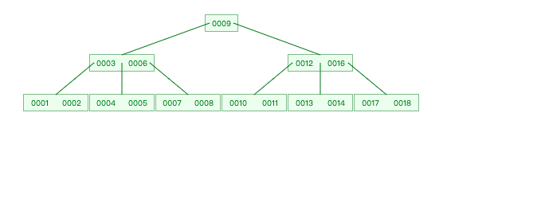
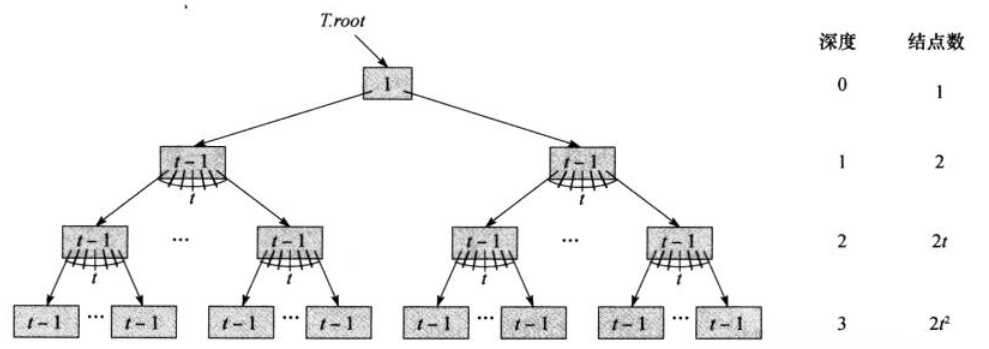
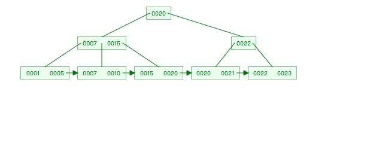

# 概述

**B 树是为磁盘或其他直接存取的辅助存储设备而设计的一种平衡二叉树。B树类似于红黑树，但它们在减低磁盘I/O操作方面效率会更高。许多数据库系统使用BTree或者B树的变种。**<!--more-->


一个 最小度为 2 的 B-Tree 




# B 树的定义

一颗B树T是具有以下性质的有根树（根为T.root）

- 每个节点 $ x $ 有一下性质

  1. $ x.n $,当前存储在节点x中的关键字个数

  2. $ x.n $ 个关键字本身 $ x.key_{1},x.key_{2},....., x.key_{x.n} $ 以非降序存放，使得$ x.key_{1} <= x.key_{2}<=..... <= x.key_{x.n} $ 
  3. $ x.leaf $ 是一个布尔值，如果 x  是 叶节点，则为true,如果x为内部节点，则为false 

- 每个节点内部还包含 $ x.n+1 $ 个指向其孩子的指针 $ x.c_1, x.c_2,......, x.c_{n+1} $。叶节点没有孩子，所以他们没有 $ c_i $ 属性定义

- 关键字  $ x.key_i $ 对存储在各个子树中的关键字范围进行分割：如果 $ k_i $ 为任意存储在以 $ x.c_i $ 为 根的子树的关键字，那么 
  $$
  k1 <= x.key_1 <= k2 <= x.key_2 <= ... <= x.key_{x.n} <= k_{x.n+1}
  $$
  
- 每个叶子节点，都有相同的深度，即 **树的高度 h**
- 每个节点所包含的关键字个数有上界和下界。用一个被称为B树最小度数（minmum degree）的固定树来固定整数 t(t >= 2)来表示这些界：
  1. 除了根节点以外的每一个节点必须至少有 t -1 个关键字。因此，除了根节点以外的每个内部节点至少有t 个孩子。如果树为非空，根节点至少有一个关键字
  2. 每个节点最多有 2t-1 个关键字，因此，一个内部节点至多可有 2t 个孩子。当一个节点恰好有2t-1个关键字，称该节点为full. t =2 时的B树是非常简单的。每个内部节点有2、3、或 4个孩子，即一颗2-3-4树。


# B Tree 的优势 

**B Tree 最大的优势：相对较小的磁盘存取次数.**
为什么呢？因为大部分的操作的时间复杂是和 B Tree 的高度成正比的 (每次查询一个节点都需要一次磁盘访问，例如查询一个叶子节点需要访问 h (高度) 个节点).

B Tree 的高度 (具体证明见书算法导论，其实也是等比数列的求和):
$$
\log_t\frac{n+1}{2}
$$



而二叉树的高度为
$$
\log_2n
$$

在n相同的情况下，即使t=2,B Tree的高度依旧比二叉树要低，而在实际情况中t的值只会比2大的多。所以其高度也就小的多。所以当这种结构运用于磁盘的读取时，其效率远远高于二叉树。


# 搜索B 树

B-Tree-Search(x,k)

```c
i = 1
while i <= x.n and k > x.keyi
    i = i +1
if i <= x.n and k == x.keyi
	return (x,i)
elseif x.leaf
	return NIL
else DISK-READ(x,ci)
	return B-Tree-Search(x.ci,k)
```


伪代码说明

- 1 到 3 行 在本节点内查找关键字
- 4 到 5 行 确认是否查找到节点
- 6 到 7 行 确认判断 该节点是否为叶子节点，如果为叶子节点，结束遍历
- 8 到 9 行 对孩子节点执行必要的DISK-READ,递归搜索x 的相应子树。（主要这里是一个for循环）


# B Tree 的插入


- 根据要插入的key的值，找到叶子结点并插入。
- 判断当前结点key的个数是否小于等于 maxDegree-1，若满足则结束，否则进行第3步。
- 以结点中间的key为中心分裂成左右两部分，然后将这个中间的key插入到父结点中，这个key的左子树指向分裂后的左半部分，这个key的右子支指向分裂后的右半部分，然后将当前结点指向父结点，继续进行第3步。


# B Tree 的删除

1. 如果当前需要删除的key位于非叶子结点上，则用后继key（这里的后继key均指后继记录的意思）覆盖要删除的key，然后在后继key所在的子支中删除该后继key。重复上述步骤，直到后继key一定位于叶子结点上，这个过程和二叉搜索树删除结点的方式类似。删除这个记录后执行第2步。

2. 该结点key个数大于等于math.ceil(maxDegree / 2) -1 ，结束删除操作，否则执行第3步。

3. 如果兄弟结点key个数大于Math.ceil(m/2)-1，则父结点中的key下移到该结点，兄弟结点中的一个key上移，删除操作结束。


# B+ Tree 

B+树是B树的一个升级版，相对于B树来说B+树更充分的利用了节点的空间，让查询速度更加稳定，并且可以支持范围的查询，为什么说B+树查找的效率要比B树更高、更稳定；我们先看看两者的区别。

- B+跟B树不同B+树的**非叶子**节点不保存关键字记录的指针，只进行数据索引，这样使得B+树每个**非叶子**节点所能保存的关键字大大增加；非叶子节点保存的数量增多的本质上就是为了压低树的高度。
- B+树**叶子**节点保存了父节点的所有关键字记录的指针，所有数据地址必须要到叶子节点才能获取到。所以每次数据查询的次数都一样；保证每次查询的稳定
- B+树叶子节点的关键字从小到大有序排列，左边结尾数据都会保存右边节点开始数据的指针。
- 非叶子节点的子节点数=关键字数（来源百度百科）（根据各种资料 这里有两种算法的实现方式，另一种为非叶节点的关键字数=子节点数-1（来源维基百科)，虽然他们数据排列结构不一样，但其原理还是一样的Mysql 的B+树是用第一种方式实现）;





# 参考

B Tree 可视化网站 https://www.cs.usfca.edu/~galles/visualization/BTree.html

 B树和B+树的插入、删除图文详解 https://www.cnblogs.com/nullzx/p/8729425.html) https://www.cnblogs.com/nullzx/p/8729425.html

【经典数据结构】B树与B+树 https://www.cnblogs.com/vincently/p/4526560.html

Introduction of B+ Tree https://www.geeksforgeeks.org/introduction-of-b-tree/

平衡二叉树、B树、B+树、B*树 理解其中一种你就都明白了 https://zhuanlan.zhihu.com/p/27700617

 

