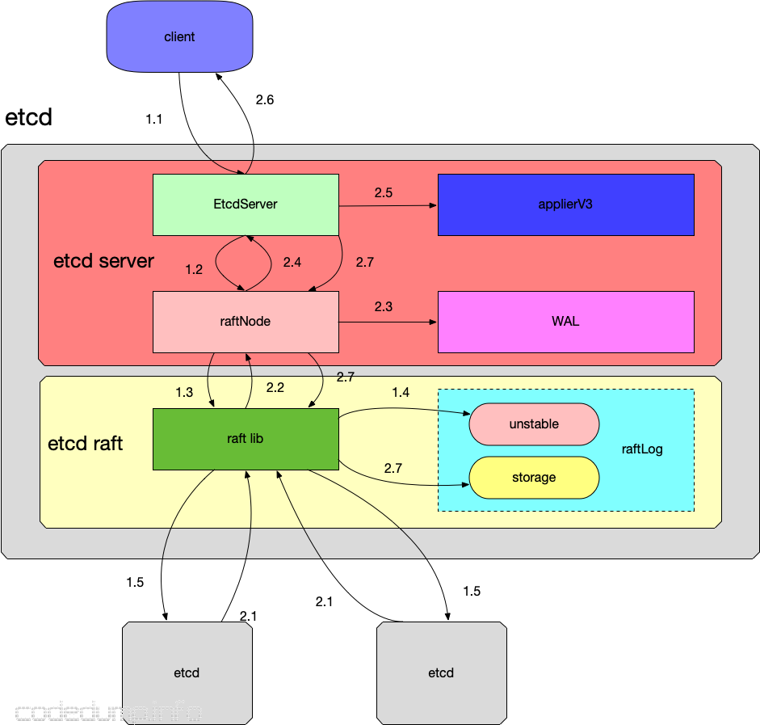

中最主要的三个部分是实现分布式共识的 Raft 模块、实现数据持久化的 WAL 模块和实现状态机存储的 MVCC 模块。这几个模块通过 etcdServer 模块进行通信与任务分配。




在上图中，一个请求与一个etcd集群交互的主要流程分为两大部分：

1. 写数据到某个etcd server中。

  - etcd server 收到客户端请求
  - etcd server将请求发送给本模块中的raft.go，这里负责与etcd raft模块进行通信。
  - raft.go将数据封装成raft日志的形式提交给raft模块。
  - raft模块会首先保存到raftLog的unstable存储部分。
  - raft模块通过raft协议与集群中其他etcd节点进行交互。

2. 该etcd server与集群中的其他etcd节点进行交互，当确保数据已经被存储之后应答客户端。

   - 集群中其他节点向leader节点应答接收这条日志数据。
   - 当超过集群半数以上节点应答接收这条日志数据时，etcd raft通过Ready结构体通知etcd server中的raft该日志数据已经commit。
   - raft.go收到Ready数据将首先将这条日志写入到WAL模块中。
   - 通知最上层的etcd server该日志已经commit。
   - etcd server调用applierV3模块将日志写入持久化存储中。
   - etcd server应答客户端该数据写入成功。
   - 最后etcd server调用etcd raft，修改其raftLog模块的数据，将这条日志写入到raftLog的storage中。

   

   从上面的流程可以看到

- etcd raft模块在应答某条日志数据已经commit之后，是首先写入到WAL模块中的，因为这个模块只是添加一条日志，所以速度会很快，即使在后面applierV3写入失败，重启的时候也可以根据WAL模块中的日志数据进行恢复。
- etcd raft中的raftLog，按照前面文章的分析，其中的数据是保存到内存中的，重启即失效，上层应用真实的数据是持久化保存到WAL和applierV3中的。


# etcd server 和 raft 的交互

etcd V3版本的API，通过GRPC协议与客户端进行交互，其相关代码在etcdserver/v3_server.go中。

```go
//接收外部的请求
func (s *EtcdServer) Put(ctx context.Context, r *pb.PutRequest) (*pb.PutResponse, error) {
	ctx = context.WithValue(ctx, traceutil.StartTimeKey, time.Now())
	resp, err := s.raftRequest(ctx, pb.InternalRaftRequest{Put: r})
	if err != nil {
		return nil, err
	}
	return resp.(*pb.PutResponse), nil
}

func (s *EtcdServer) raftRequest(ctx context.Context, r pb.InternalRaftRequest) (proto.Message, error) {
	return s.raftRequestOnce(ctx, r)
}

func (s *EtcdServer) raftRequestOnce(ctx context.Context, r pb.InternalRaftRequest) (proto.Message, error) {
	result, err := s.processInternalRaftRequestOnce(ctx, r) // 处理消息
	if err != nil {
		return nil, err
	}
	if result.err != nil {
		return nil, result.err
	}
	if startTime, ok := ctx.Value(traceutil.StartTimeKey).(time.Time); ok && result.trace != nil {
		applyStart := result.trace.GetStartTime()
		// The trace object is created in apply. Here reset the start time to trace
		// the raft request time by the difference between the request start time
		// and apply start time
		result.trace.SetStartTime(startTime)
		result.trace.InsertStep(0, applyStart, "process raft request")
		result.trace.LogIfLong(traceThreshold)
	}
	return result.resp, nil
}
```


调用 processInternalRaftRequestOnce


```go
func (s *EtcdServer) processInternalRaftRequestOnce(ctx context.Context, r pb.InternalRaftRequest) (*applyResult, error) {
	//获取applied 的索引
	ai := s.getAppliedIndex()
	// 获取 commited 的索引
	ci := s.getCommittedIndex()
	if ci > ai+maxGapBetweenApplyAndCommitIndex {
		return nil, ErrTooManyRequests
	}

	//生成一个递增的请求ID
	r.Header = &pb.RequestHeader{
		ID: s.reqIDGen.Next(),
	}

	// check authinfo if it is not InternalAuthenticateRequest
	if r.Authenticate == nil {
		authInfo, err := s.AuthInfoFromCtx(ctx)
		if err != nil {
			return nil, err
		}
		if authInfo != nil {
			r.Header.Username = authInfo.Username
			r.Header.AuthRevision = authInfo.Revision
		}
	}

	//序列化数据
	data, err := r.Marshal()
	if err != nil {
		return nil, err
	}

	//请求数据过大
	if len(data) > int(s.Cfg.MaxRequestBytes) {
		return nil, ErrRequestTooLarge
	}

	id := r.ID
	if id == 0 {
		id = r.Header.ID
	}
	//注册一个channel
	ch := s.w.Register(id)

	cctx, cancel := context.WithTimeout(ctx, s.Cfg.ReqTimeout())
	defer cancel()

	start := time.Now()
	err = s.r.Propose(cctx, data)
	if err != nil {
		proposalsFailed.Inc()
		s.w.Trigger(id, nil) // GC wait
		return nil, err
	}
	proposalsPending.Inc()
	defer proposalsPending.Dec()

	select {
	case x := <-ch:
		return x.(*applyResult), nil
	case <-cctx.Done():
		proposalsFailed.Inc()
		s.w.Trigger(id, nil) // GC wait
		return nil, s.parseProposeCtxErr(cctx.Err(), start)
	case <-s.done:
		return nil, ErrStopped
	}
}
```


其流程大致如下

- 拿到当前raft中的apply和commit索引，如果commit索引比apply索引超出太多，说明当前有很多数据都没有apply，返回ErrTooManyRequests错误。
- 调用s.reqIDGen.Next()函数生成一个针对当前请求的ID，注意这个ID并不是一个随机数而是一个严格递增的整数。同时将请求序列化为byte数据，这会做为raft的数据进行存储。
- 根据第2步中的ID，调用Wait.Register函数进行注册，这会返回一个用于通知结果的channel，后续就通过监听该channel来确定是否成功储存了提交的值。
- 调用Raft.Process函数提交数据，这里传入的参数除了前面序列化的数据之外，还有使用超时时间创建的Context。
- 监听前面的Channel以及Context对象： a. 如果context.Done返回，说明数据提交超时，使用s.parseProposeCtxErr函数返回具体的错误。 b. 如果channel返回，说明已经提交成功。


