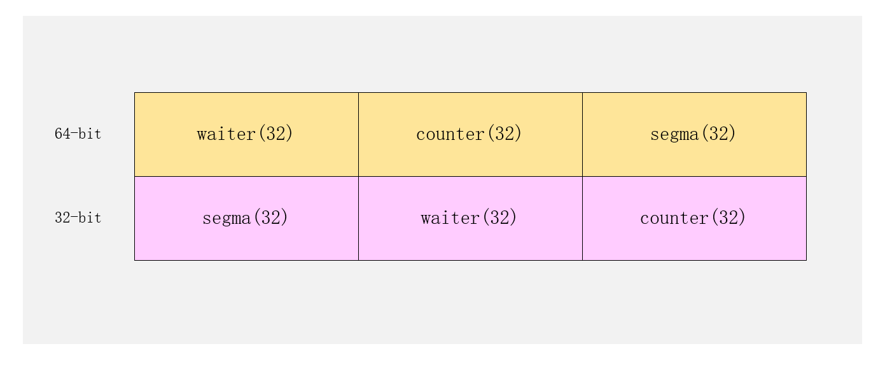

# WaitGroup 用途

[`sync.WaitGroup`](https://github.com/golang/go/blob/71239b4f491698397149868c88d2c851de2cd49b/src/sync/waitgroup.go#L20-L29) 它能够一直等到所有的goroutine执行完成，并且阻塞主线程的执行，直到所有的goroutine执行完成。

> A WaitGroup waits for a collection of goroutines to finish.The main goroutine calls Add to set the number of goroutines to wait for. Then each of the goroutines runs and calls Done when finished. At the same time,Wait can be used to block until all goroutines have finished.


# WaitGroup 的简单使用

比较常见的使用场景是批量发出 RPC 或者 HTTP 请求

```go
func main() {
	request := make([]*Request,10)

	wg := &sync.WaitGroup{}
	for i := 0;i < len(request);i++ {
		wg.Add(1)
		go HandlerReq(request[i],wg)
	}

	wg.Wait()
}

func HandlerReq(req *Request,wg *sync.WaitGroup)  {
	fmt.Println("Do Request .....")
	time.Sleep(time.Second)
	wg.Done()
}

```

# WaitGroup的结构 

[`sync.WaitGroup`](https://github.com/golang/go/blob/71239b4f491698397149868c88d2c851de2cd49b/src/sync/waitgroup.go#L20-L29) 结构体中的成员变量非常简单，其中只包含两个成员变量：

```go
// A WaitGroup must not be copied after first use.
type WaitGroup struct {
	noCopy noCopy

	// 64-bit value: high 32 bits are counter, low 32 bits are waiter count.
	// 64-bit atomic operations require 64-bit alignment, but 32-bit
	// compilers do not ensure it. So we allocate 12 bytes and then use
	// the aligned 8 bytes in them as state, and the other 4 as storage
	// for the sema.
	state1 [3]uint32
}
```

- noCopy 标志WaitGroup不允许拷贝

- statel  这个数组会存储当前结构体的状态 

  

  

  [`sync.WaitGroup`](https://github.com/golang/go/blob/71239b4f491698397149868c88d2c851de2cd49b/src/sync/waitgroup.go#L20-L29) 提供的私有方法 [`sync.WaitGroup.state`](https://github.com/golang/go/blob/4c3f26076b6a9853bcc3c7d7e43726c044ac028a/src/sync/waitgroup.go#L32-L38) 能够帮我们从 `state1` 字段中取出它的状态和信号量。


# 参考

同步原语和锁  https://draveness.me/golang/docs/part3-runtime/ch06-concurrency/golang-sync-primitives/


