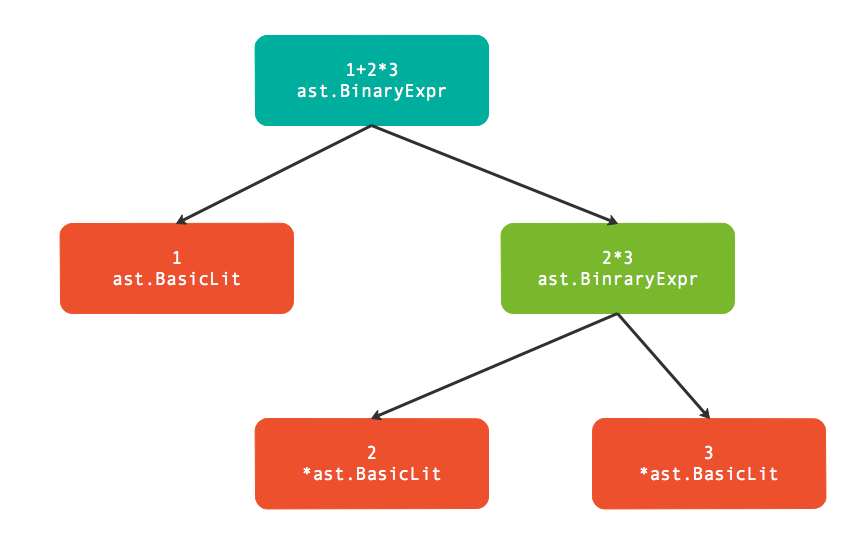

# Token 

## 什么是token 

> Token是编程语言中最小的具有独立含义的词法单元。Token不仅仅包含关键字，还包含用户自定义的标识符、运算符、分隔符和注释等。每个Token对应的词法单元有三个属性是比较重要的：首先是Token本身的值表示词法单元的类型，其次是Token在源代码中源代码文本形式，最后是Token出现的位置。在所有的Token中，注释和分号是两种比较特殊的Token：普通的注释一般不影响程序的语义，因此很多时候可以忽略注释；而Go语言中经常在行尾自动添加分号Token，而分号是分隔语句的词法单元，因此自动添加分号导致了Go语言左花括弧不能单独一行等细微的语法差异。


##  Token的语法
Go语言中的[Token](https://github.com/golang/go/blob/dev.boringcrypto.go1.15/src/go/token/token.go#L17)主要有标识符、关键字、运算符和分隔符等类型等Token组成。

### 标识符

其中标识符的语法定义如下：

```
identifier = letter { letter | unicode_digit } .
letter     = unicode_letter | "_" .
```
identifier 由字母和数字组成，开头第一个字符必须是字母。需要注意的是下划线也是作为字母，因此可以用下划线作为标识符。不过美元符号$并不属于字母，因此标识符中不能包含美元符号。

### 关键字

在标识符中有一类特殊的标识符被定义为关键字。关键字用于引导特殊的语法结构，不能将关键字作为独立的标识符

Go语言定义的25个关键字：

```go
break        default      func         interface    select
case         defer        go           map          struct
chan         else         goto         package      switch
const        fallthrough  if           range        type
continue     for          import       return       var
```


### 分隔符

除了标识符和关键字，Token还包含运算符和分隔符。下面是Go语言定义的47个符号：

```go
+    &     +=    &=     &&    ==    !=    (    )
-    |     -=    |=     ||    <     <=    [    ]
*    ^     *=    ^=     <-    >     >=    {    }
/    <<    /=    <<=    ++    =     :=    ,    ;
%    >>    %=    >>=    --    !     ...   .    :
     &^          &^=
```

## Token 的定义


Go语言中，[Token](https://github.com/golang/go/blob/dev.boringcrypto.go1.15/src/go/token/token.go#L17)被定义为一种枚举值，不同值的Token表示不同类型的词法记号：

```
// Token is the set of lexical tokens of the Go programming language.
type Token int
```

所有的Token被分为四类：

- [Special tokens ](https://github.com/golang/go/blob/dev.boringcrypto.go1.15/src/go/token/token.go#L21)  特殊类型的Token
- [Literal](https://github.com/golang/go/blob/dev.boringcrypto.go1.15/src/go/token/token.go#L26)   基础面值对应的Token
- [Operator](https://github.com/golang/go/blob/dev.boringcrypto.go1.15/src/go/token/token.go#L37) 运算符Token
- [Keyword](https://github.com/golang/go/blob/dev.boringcrypto.go1.15/src/go/token/token.go#L96) 关键字

## FileSet 和 File 

参考Go语言本身，它是由多个文件组成包，然后多个包链接为一个可执行文件，所以单个包对应的多个文件可以看作是Go语言的基本编译单元。因此`go/token`包还定义了[FileSet](https://github.com/golang/go/blob/be25192f119eb66e29a59d8c66622080852cbb58/src/go/token/position.go#L386)和[File](https://github.com/golang/go/blob/be25192f119eb66e29a59d8c66622080852cbb58/src/go/token/position.go#L99)对象，用于描述文件集和文件。

```go
// -----------------------------------------------------------------------------
// File

// A File is a handle for a file belonging to a FileSet.
// A File has a name, size, and line offset table.
//
type File struct {
	set  *FileSet
	name string // file name as provided to AddFile
	base int    // Pos value range for this file is [base...base+size]
	size int    // file size as provided to AddFile

	// lines and infos are protected by mutex
	mutex sync.Mutex
	lines []int // lines contains the offset of the first character for each line (the first entry is always 0)
	infos []lineInfo
}
// Pos is a compact encoding of a source position within a file set.
// It can be converted into a Position for a more convenient, but much
// larger, representation.
//
// The Pos value for a given file is a number in the range [base, base+size],
// where base and size are specified when a file is added to the file set.
// The difference between a Pos value and the corresponding file base
// corresponds to the byte offset of that position (represented by the Pos value)
// from the beginning of the file. Thus, the file base offset is the Pos value
// representing the first byte in the file.
//
// To create the Pos value for a specific source offset (measured in bytes),
// first add the respective file to the current file set using FileSet.AddFile
// and then call File.Pos(offset) for that file. Given a Pos value p
// for a specific file set fset, the corresponding Position value is
// obtained by calling fset.Position(p).
//
// Pos values can be compared directly with the usual comparison operators:
// If two Pos values p and q are in the same file, comparing p and q is
// equivalent to comparing the respective source file offsets. If p and q
// are in different files, p < q is true if the file implied by p was added
// to the respective file set before the file implied by q.
//
type Pos int

type FileSet struct {
	mutex sync.RWMutex // protects the file set
	base  int          // base offset for the next file
	files []*File      // list of files in the order added to the set
	last  *File        // cache of last file looked up
}
// -----------------------------------------------------------------------------
// Positions

// Position describes an arbitrary source position
// including the file, line, and column location.
// A Position is valid if the line number is > 0.
//
type Position struct {
	Filename string // filename, if any
	Offset   int    // offset, starting at 0
	Line     int    // line number, starting at 1
	Column   int    // column number, starting at 1 (byte count)
}

```


## 解析Token 

Go语言标准库`go/scanner`包提供了Scanner实现Token扫描，它是在FileSet和File抽象文件集合基础上进行词法分析。

scanner.Scanner的公开接口定义如下：

```go
type Scanner struct {
	// public state - ok to modify
	ErrorCount int // number of errors encountered
	// Has unexported fields.
}

func (s *Scanner) Init(file *token.File, src []byte,err ErrorHandler, mode Mode)
func (s *Scanner) Scan() (pos token.Pos, tok token.Token, lit string)
```

- Init 用于初始化扫描器

   - file 表示当前文件

   - src 参数表示要分析的代码

   - err 是用户自定义的错误处理函数

   - mode 可以控制是否扫描注释部分。
- Scanner 方法扫描一个Token，三个返回值分别表示Token的位置 、Token值和Token的源代码文本表示。
   	- pos Token的位置
   	- tok  token的值
   	- lit  Token的源代码文本表示。


Ex 

```go
func main() {
	src := []byte(`println("hello world")`)
	fset := token.NewFileSet()
	file := fset.AddFile("hello.go", fset.Base(), len(src))

	var s scanner.Scanner
	s.Init(file, src, nil, scanner.ScanComments)
	for {
		pos, tok, lit := s.Scan()

		if tok == token.EOF {
			break
		}
		fmt.Printf("pos : %s\t token: %s\t lit: %q\n", fset.Position(pos), tok, lit)
	}
}
```

out 

```shell
pos : hello.go:1:1       token: IDENT    lit: "println"
pos : hello.go:1:8       token: (        lit: ""
pos : hello.go:1:9       token: STRING   lit: "\"hello world\""
pos : hello.go:1:22      token: )        lit: ""
pos : hello.go:1:23      token: ;        lit: "\n"
```


# 基础面值

面值是在程序代码中直接表示的值，其它的非零初始值只能由面值常量或常量表达式生成。比如表达式`x+2*y`的`2`就是面值，而`x`和`y`则不是面值而是标识符。

## 基础面值的定义

Go语言中的基础面值的定义如下

```go
	literal_beg
	// Identifiers and basic type literals
	// (these tokens stand for classes of literals)
	IDENT  // main
	INT    // 12345
	FLOAT  // 123.45
	IMAG   // 123.45i
	CHAR   // 'a'
	STRING // "abc"
	literal_end
```

在Go语言规范中布尔类型的true和false并不在基础面值之类。但是为了方便词法解析，`go/token`包将true和false等对应的标识符也作为面值Token(IDENT)一类。

ex 

```go
func main() {
	src := []byte(`	var h bool
					var k int 
	h = true  
	k = 20 
	if h  {
		fmt.Println(h)
	}
`)
	fset := token.NewFileSet()
	file := fset.AddFile("hello.go", fset.Base(), len(src))

	var s scanner.Scanner
	s.Init(file, src, nil, scanner.ScanComments)
	for {
		pos, tok, lit := s.Scan()

		if tok == token.EOF {
			break
		}
		fmt.Printf("pos : %s\t token: %s\t lit: %q\n", fset.Position(pos), tok, lit)
	}
}

```


out 

```shell
pos : hello.go:1:2       token: var      lit: "var"
pos : hello.go:1:6       token: IDENT    lit: "h"
pos : hello.go:1:8       token: IDENT    lit: "bool"
pos : hello.go:1:12      token: ;        lit: "\n"
pos : hello.go:2:6       token: var      lit: "var"
pos : hello.go:2:10      token: IDENT    lit: "k"
pos : hello.go:2:12      token: IDENT    lit: "int"
pos : hello.go:2:16      token: ;        lit: "\n"
pos : hello.go:3:2       token: IDENT    lit: "h"
pos : hello.go:3:4       token: =        lit: ""
pos : hello.go:3:6       token: IDENT    lit: "true"
pos : hello.go:3:12      token: ;        lit: "\n"
pos : hello.go:4:2       token: IDENT    lit: "k"
pos : hello.go:4:4       token: =        lit: ""
pos : hello.go:4:6       token: INT      lit: "20"
pos : hello.go:4:9       token: ;        lit: "\n"
pos : hello.go:5:2       token: if       lit: "if"
pos : hello.go:5:5       token: IDENT    lit: "h"
pos : hello.go:5:8       token: {        lit: ""
pos : hello.go:6:3       token: IDENT    lit: "fmt"
pos : hello.go:6:6       token: .        lit: ""
pos : hello.go:6:7       token: IDENT    lit: "Println"
pos : hello.go:6:14      token: (        lit: ""
pos : hello.go:6:15      token: IDENT    lit: "h"
pos : hello.go:6:16      token: )        lit: ""
pos : hello.go:6:17      token: ;        lit: "\n"
pos : hello.go:7:2       token: }        lit: ""
```


## 基础面值语法树结构

Go语言的抽象语法树由`go/ast`包定义。其中`ast.BasicLit`表示一个基础类型的面值常量结构，它的定义如下：

```go
	// A BasicLit node represents a literal of basic type.
	type BasicLit struct {
		ValuePos token.Pos   // literal position
		Kind     token.Token // token.INT, token.FLOAT, token.IMAG, token.CHAR, or token.STRING
		Value    string      // literal string; e.g. 42, 0x7f, 3.14, 1e-9, 2.4i, 'a', '\x7f', "foo" or `\m\n\o`
	}

```

其中ValuePos成员表示该词法元素开始的字节偏移量（并不包含文件名、行号和列号等信息），Kind表示面值的类型（只有数值类型、字符和字符串三类），最后的Value是表示面值的原始代码。

```go
func main() {
	expr, _ := parser.ParseExpr(`"hello world"`)
	ast.Print(nil, expr)
	expr, _ = parser.ParseExpr("2222")
	ast.Print(nil,expr)
}
```


out 

```shell
     0  *ast.BasicLit {
     1  .  ValuePos: 1
     2  .  Kind: STRING
     3  .  Value: "\"hello world\""
     4  }
     0  *ast.BasicLit {
     1  .  ValuePos: 1
     2  .  Kind: INT
     3  .  Value: "2222"
     4  }
```

`go/parser`包提供了`parser.ParseExpr`函数用于简化表达式的解析。返回`ast.Expr`类型的`expr`和一个错误，`expr`表示表达式的语法树。然后通过`go/ast`包提供的`ast.Print`函数打印语法树。


## 标识符面值

`go/ast`包同样定义了Ident结构体，表示标识符类型：

```go
type Ident struct {
	NamePos token.Pos // identifier position
	Name    string    // identifier name
	Obj     *Object   // denoted object; or nil
}
```

NamePos表示标识符的位置，Name是标识符的名字，Obj则表示标识符的类型获取其它的扩展信息。作为内置的标识符面值来说，我们主要关注标识符的名字即可。

`go/ast`包同时提供了`NewIdent`函数用于创建简单的标识符：

```
func main() {
	ast.Print(nil, ast.NewIdent(`x`))
}
```

Ex 

```go
0  *ast.Ident {
1  .  NamePos: 0
2  .  Name: "x"
3  }
```
如果是从表达式解析标识符，则会通过Obj成员描述标识符额外的信息：


```go
func main() {
	expr, _ := parser.ParseExpr(`x`)
	ast.Print(nil, expr)
}
```


输出表达式中x标识符信息如下：


```go
0  *ast.Ident {
1  .  NamePos: 1
2  .  Name: "x"
3  .  Obj: *ast.Object {
4  .  .  Kind: bad
5  .  .  Name: ""
6  .  }
7  }
```
ast.Object是一个相对复杂的结构，其中Kind用于描述标识符的类型：

```go
type Object struct {
	Kind ObjKind
	Name string      // declared name
	Decl interface{} // corresponding Field, XxxSpec, FuncDecl, LabeledStmt, AssignStmt, Scope; or nil
	Data interface{} // object-specific data; or nil
	Type interface{} // placeholder for type information; may be nil
}
/ ObjKind describes what an object represents.
type ObjKind int

// The list of possible Object kinds.
const (
	Bad ObjKind = iota // for error handling
	Pkg                // package
	Con                // constant
	Typ                // type
	Var                // variable
	Fun                // function or method
	Lbl                // label
)
```

#  基础表达式

基础表达式是指完全由数值型面值和标识符组成的表达式。

## 解析基础表达式


`parser.ParseExpr`函数是解析的单个表达式（可以包含注释）

```go
func ParseExpr(x string) (ast.Expr, error) 
```


返回值`ast.Expr`是一个表达式抽象接口：

```go
type Expr interface {
    Node
    // contains filtered or unexported methods
}
type Node interface {
    Pos() token.Pos // position of first character belonging to the node
    End() token.Pos // position of first character immediately after the node
}
```

通过分析`go/ast`包的文档可以发现很多类型以`Expr`为后缀名：

```go
 go doc go/ast | egrep ".+Expr " 
type BadExpr struct{ ... }
type BinaryExpr struct{ ... }
type CallExpr struct{ ... }
type Expr interface{ ... }
type IndexExpr struct{ ... }
type KeyValueExpr struct{ ... }
type ParenExpr struct{ ... }
type SelectorExpr struct{ ... }
type SliceExpr struct{ ... }
type StarExpr struct{ ... }
type TypeAssertExpr struct{ ... }
type UnaryExpr struct{ ... }
```

真实的表达式种类当然并不仅仅是这些，起码前面例子中的`ast.BasicLit`类型不在其中，不过目前我们并不需要`Expr`的全部类型列表。

我们以`ast.BinaryExpr`表达的二元算术表达式开始，因为加减乘除四则运算是我们最熟悉的表达式结构：

```
func main() {
	expr, _ := parser.ParseExpr(`1+2*3`)
	ast.Print(nil, expr)
}
```


out 

```
     0  *ast.BinaryExpr {
     1  .  X: *ast.BasicLit {
     2  .  .  ValuePos: 1
     3  .  .  Kind: INT
     4  .  .  Value: "1"
     5  .  }
     6  .  OpPos: 2
     7  .  Op: +
     8  .  Y: *ast.BinaryExpr {
     9  .  .  X: *ast.BasicLit {
    10  .  .  .  ValuePos: 3
    11  .  .  .  Kind: INT
    12  .  .  .  Value: "2"
    13  .  .  }
    14  .  .  OpPos: 4
    15  .  .  Op: *
    16  .  .  Y: *ast.BasicLit {
    17  .  .  .  ValuePos: 5
    18  .  .  .  Kind: INT
    19  .  .  .  Value: "3"
    20  .  .  }
    21  .  }
    22  }
```




其中`ast.BasicLit`是基础面值类型，在前面章节已经讲过。而`ast.BinaryExpr`是表示二元表达式的结点，其定义如下：

```go
type BinaryExpr struct {
    X     Expr        // left operand
    OpPos token.Pos   // position of Op
    Op    token.Token // operator
    Y     Expr        // right operand
}
```


其中Op成员表示二元运算符，而X和Y成员则对应运算符左右两个操作数。最重要的是，X和Y操作数都是`Expr`接口类型，这就可以构成递归定义！因此在输出的结果中，最外层的Y部分被填充为`*ast.BinaryExpr`类型的子语法树（这说明后出现的乘法有着更高的优先级）。


## 求值表达式

在了解了`ast.BinaryExpr`语法树的结构之后，其实我们就可以手工对表达式求值了：

```go
func main() {
	expr, _ := parser.ParseExpr(`1+2*3`)
	fmt.Println(Eval(expr))
}

func Eval(exp ast.Expr) float64 {
	switch exp := exp.(type) {
	case *ast.BinaryExpr:
		return EvalBinaryExpr(exp)
	case *ast.BasicLit:
		f, _ := strconv.ParseFloat(exp.Value, 64)
		return f
	}
	return 0
}

func EvalBinaryExpr(exp *ast.BinaryExpr) float64 {
	switch exp.Op {
	case token.ADD:
		return Eval(exp.X) + Eval(exp.Y)
	case token.MUL:
		return Eval(exp.X) * Eval(exp.Y)
	}
	return 0
}
```

out 

```
7 
```


## 标识符：为表达式中引入变量

```go
func main() {
	expr, _ := parser.ParseExpr(`1+2*3+x`)
	fmt.Println(Eval(expr, map[string]float64{
		"x": 100,
	}))
}

func Eval(exp ast.Expr, vars map[string]float64) float64 {
	switch exp := exp.(type) {
	case *ast.BinaryExpr:
		return EvalBinaryExpr(exp, vars)
	case *ast.BasicLit:
		f, _ := strconv.ParseFloat(exp.Value, 64)
		return f
	case *ast.Ident:
		return vars[exp.Name]
	}
	return 0
}

func EvalBinaryExpr(exp *ast.BinaryExpr, vars map[string]float64) float64 {
	switch exp.Op {
	case token.ADD:
		return Eval(exp.X, vars) + Eval(exp.Y, vars)
	case token.MUL:
		return Eval(exp.X, vars) * Eval(exp.Y, vars)
	}
	return 0
}
```


在前面的例子中，我们已经尝试过数值类型的常量构成的表达式求值。我们现在尝试为表达式引入变量，变量由外部动态注入。


```go
     0  *ast.BinaryExpr {
     1  .  X: *ast.BinaryExpr {
     2  .  .  X: *ast.BasicLit {
     3  .  .  .  ValuePos: 1
     4  .  .  .  Kind: INT
     5  .  .  .  Value: "1"
     6  .  .  }
     7  .  .  OpPos: 2
     8  .  .  Op: +
     9  .  .  Y: *ast.BinaryExpr {
    10  .  .  .  X: *ast.BasicLit {
    11  .  .  .  .  ValuePos: 3
    12  .  .  .  .  Kind: INT
    13  .  .  .  .  Value: "2"
    14  .  .  .  }
    15  .  .  .  OpPos: 4
    16  .  .  .  Op: *
    17  .  .  .  Y: *ast.BasicLit {
    18  .  .  .  .  ValuePos: 5
    19  .  .  .  .  Kind: INT
    20  .  .  .  .  Value: "3"
    21  .  .  .  }
    22  .  .  }
    23  .  }
    24  .  OpPos: 6
    25  .  Op: +
    26  .  Y: *ast.Ident {
    27  .  .  NamePos: 7
    28  .  .  Name: "x"
    29  .  .  Obj: *ast.Object {
    30  .  .  .  Kind: bad
    31  .  .  .  Name: ""
    32  .  .  }
    33  .  }
    34  }

```

在Eval函数递归解析时，如果当前解析的表达式语法树结点是`*ast.Ident`类型，则直接从`vars`表格查询结果。

不过在Go语言的表达式要复杂很多，不仅仅有普通的局部变量，还有数组索引求值、管道取值、其它结构的成员求值等类型。但是标识符是引入变量最基础的方法，我们可以在此基础方法之上慢慢完善更复杂的求值函数。


# 代码结构

o语言的代码结构主要分为三个层面：目录结构、目录内部的包结构、文件内部的代码结构。标准库的`go/parser`包只提供了目录和文件解析的函数，因此我们主要从这两个函数学习和语法树相关的代码结构。

## 代码目录

Go语言代码根据目录组织，一个包由多个文件组织，文件必须属于同一个目录下。不过包的单元测试虽然也和包的普通代码文件属于同一个目录，但是测试代码可以属于一个独立的测试包（独立的测试包名是以`_test`为后缀）。标准库`go/parser`包中的`parser.ParseDir`用于解析目录内的全部Go语言文件，返回的`map[string]*ast.Package`包含多个包信息。而`parser.ParseFile`用于解析单个文件，返回的`*ast.File`包含文件内部代码信息。而每个`*ast.Package`正是由多个`*ast.File`文件组成。

```go
// A Package node represents a set of source files
// collectively building a Go package.
//
func ParseDir(fset *token.FileSet, path string, filter func(os.FileInfo) bool, mode Mode) (pkgs map[string]*ast.Package, first error) 
func ParseFile(fset *token.FileSet, filename string, src interface{}, mode Mode) (f *ast.File, err error) 


type Package struct {
	Name    string             // package name
	Scope   *Scope             // package scope across all files
	Imports map[string]*Object // map of package id -> package object
	Files   map[string]*File   // Go source files by filename
}

type File struct {
	Doc        *CommentGroup   // associated documentation; or nil
	Package    token.Pos       // position of "package" keyword
	Name       *Ident          // package name
	Decls      []Decl          // top-level declarations; or nil
	Scope      *Scope          // package scope (this file only)
	Imports    []*ImportSpec   // imports in this file
	Unresolved []*Ident        // unresolved identifiers in this file
	Comments   []*CommentGroup // list of all comments in the source file
}
```


## 文件结构

一个Go语言文件中，顶级的语法元素只有package、import、type、const、var和func这几种。

解析文件

```

func main() {
	fset := token.NewFileSet()
	f, err := parser.ParseFile(fset, "hello.go", src, parser.AllErrors)
	if err != nil {
		fmt.Println(err)
		return
	}

	ast.Print(fset, f)
}

const src = `package main

import ("a"; "b")
type SomeType int
const PI = 3.14
var Length = 1

func main() {}
`
```


out 

```go
     0  *ast.File {
     1  .  Package: hello.go:1:1
     2  .  Name: *ast.Ident {
     3  .  .  NamePos: hello.go:1:9
     4  .  .  Name: "main"
     5  .  }
     6  .  Decls: []ast.Decl (len = 5) {
     7  .  .  0: *ast.GenDecl {
     8  .  .  .  TokPos: hello.go:3:1
     9  .  .  .  Tok: import
    10  .  .  .  Lparen: hello.go:3:8
    11  .  .  .  Specs: []ast.Spec (len = 2) {
    12  .  .  .  .  0: *ast.ImportSpec {
    13  .  .  .  .  .  Path: *ast.BasicLit {
    14  .  .  .  .  .  .  ValuePos: hello.go:3:9
    15  .  .  .  .  .  .  Kind: STRING
    16  .  .  .  .  .  .  Value: "\"a\""
    17  .  .  .  .  .  }
    18  .  .  .  .  .  EndPos: -
    19  .  .  .  .  }
    20  .  .  .  .  1: *ast.ImportSpec {
    21  .  .  .  .  .  Path: *ast.BasicLit {
    22  .  .  .  .  .  .  ValuePos: hello.go:3:14
    23  .  .  .  .  .  .  Kind: STRING
    24  .  .  .  .  .  .  Value: "\"b\""
    25  .  .  .  .  .  }
    26  .  .  .  .  .  EndPos: -
    27  .  .  .  .  }
    28  .  .  .  }
    29  .  .  .  Rparen: hello.go:3:17
    30  .  .  }
    31  .  .  1: *ast.GenDecl {
    32  .  .  .  TokPos: hello.go:4:1
    33  .  .  .  Tok: type
    34  .  .  .  Lparen: -
    35  .  .  .  Specs: []ast.Spec (len = 1) {
    36  .  .  .  .  0: *ast.TypeSpec {
    37  .  .  .  .  .  Name: *ast.Ident {
    38  .  .  .  .  .  .  NamePos: hello.go:4:6
    39  .  .  .  .  .  .  Name: "SomeType"
    40  .  .  .  .  .  .  Obj: *ast.Object {
    41  .  .  .  .  .  .  .  Kind: type
    42  .  .  .  .  .  .  .  Name: "SomeType"
    43  .  .  .  .  .  .  .  Decl: *(obj @ 36)
    44  .  .  .  .  .  .  }
    45  .  .  .  .  .  }
    46  .  .  .  .  .  Assign: -
    47  .  .  .  .  .  Type: *ast.Ident {
    48  .  .  .  .  .  .  NamePos: hello.go:4:15
    49  .  .  .  .  .  .  Name: "int"
    50  .  .  .  .  .  }
    51  .  .  .  .  }
    52  .  .  .  }
    53  .  .  .  Rparen: -
    54  .  .  }
    55  .  .  2: *ast.GenDecl {
    56  .  .  .  TokPos: hello.go:5:1
    57  .  .  .  Tok: const
    58  .  .  .  Lparen: -
    59  .  .  .  Specs: []ast.Spec (len = 1) {
    60  .  .  .  .  0: *ast.ValueSpec {
    61  .  .  .  .  .  Names: []*ast.Ident (len = 1) {
    62  .  .  .  .  .  .  0: *ast.Ident {
    63  .  .  .  .  .  .  .  NamePos: hello.go:5:7
    64  .  .  .  .  .  .  .  Name: "PI"
    65  .  .  .  .  .  .  .  Obj: *ast.Object {
    66  .  .  .  .  .  .  .  .  Kind: const
    67  .  .  .  .  .  .  .  .  Name: "PI"
    68  .  .  .  .  .  .  .  .  Decl: *(obj @ 60)
    69  .  .  .  .  .  .  .  .  Data: 0
    70  .  .  .  .  .  .  .  }
    71  .  .  .  .  .  .  }
    72  .  .  .  .  .  }
    73  .  .  .  .  .  Values: []ast.Expr (len = 1) {
    74  .  .  .  .  .  .  0: *ast.BasicLit {
    75  .  .  .  .  .  .  .  ValuePos: hello.go:5:12
    76  .  .  .  .  .  .  .  Kind: FLOAT
    77  .  .  .  .  .  .  .  Value: "3.14"
    78  .  .  .  .  .  .  }
    79  .  .  .  .  .  }
    80  .  .  .  .  }
    81  .  .  .  }
    82  .  .  .  Rparen: -
    83  .  .  }
    84  .  .  3: *ast.GenDecl {
    85  .  .  .  TokPos: hello.go:6:1
    86  .  .  .  Tok: var
    87  .  .  .  Lparen: -
    88  .  .  .  Specs: []ast.Spec (len = 1) {
    89  .  .  .  .  0: *ast.ValueSpec {
    90  .  .  .  .  .  Names: []*ast.Ident (len = 1) {
    91  .  .  .  .  .  .  0: *ast.Ident {
    92  .  .  .  .  .  .  .  NamePos: hello.go:6:5
    93  .  .  .  .  .  .  .  Name: "Length"
    94  .  .  .  .  .  .  .  Obj: *ast.Object {
    95  .  .  .  .  .  .  .  .  Kind: var
    96  .  .  .  .  .  .  .  .  Name: "Length"
    97  .  .  .  .  .  .  .  .  Decl: *(obj @ 89)
    98  .  .  .  .  .  .  .  .  Data: 0
    99  .  .  .  .  .  .  .  }
   100  .  .  .  .  .  .  }
   101  .  .  .  .  .  }
   102  .  .  .  .  .  Values: []ast.Expr (len = 1) {
   103  .  .  .  .  .  .  0: *ast.BasicLit {
   104  .  .  .  .  .  .  .  ValuePos: hello.go:6:14
   105  .  .  .  .  .  .  .  Kind: INT
   106  .  .  .  .  .  .  .  Value: "1"
   107  .  .  .  .  .  .  }
   108  .  .  .  .  .  }
   109  .  .  .  .  }
   110  .  .  .  }
   111  .  .  .  Rparen: -
   112  .  .  }
   113  .  .  4: *ast.FuncDecl {
   114  .  .  .  Name: *ast.Ident {
   115  .  .  .  .  NamePos: hello.go:8:6
   116  .  .  .  .  Name: "main"
   117  .  .  .  .  Obj: *ast.Object {
   118  .  .  .  .  .  Kind: func
   119  .  .  .  .  .  Name: "main"
   120  .  .  .  .  .  Decl: *(obj @ 113)
   121  .  .  .  .  }
   122  .  .  .  }
   123  .  .  .  Type: *ast.FuncType {
   124  .  .  .  .  Func: hello.go:8:1
   125  .  .  .  .  Params: *ast.FieldList {
   126  .  .  .  .  .  Opening: hello.go:8:10
   127  .  .  .  .  .  Closing: hello.go:8:11
   128  .  .  .  .  }
   129  .  .  .  }
   130  .  .  .  Body: *ast.BlockStmt {
   131  .  .  .  .  Lbrace: hello.go:8:13
   132  .  .  .  .  Rbrace: hello.go:8:14
   133  .  .  .  }
   134  .  .  }
   135  .  }
   136  .  Scope: *ast.Scope {
   137  .  .  Objects: map[string]*ast.Object (len = 4) {
   138  .  .  .  "SomeType": *(obj @ 40)
   139  .  .  .  "PI": *(obj @ 65)
   140  .  .  .  "Length": *(obj @ 94)
   141  .  .  .  "main": *(obj @ 117)
   142  .  .  }
   143  .  }
   144  .  Imports: []*ast.ImportSpec (len = 2) {
   145  .  .  0: *(obj @ 12)
   146  .  .  1: *(obj @ 20)
   147  .  }
   148  .  Unresolved: []*ast.Ident (len = 1) {
   149  .  .  0: *(obj @ 47)
   150  .  }
   151  }
```


`parser.ParseFile`函数返回的是`*ast.File`类型的结构体：

```go
type File struct {
	Doc        *CommentGroup   // associated documentation; or nil
	Package    token.Pos       // position of "package" keyword
	Name       *Ident          // package name
	Decls      []Decl          // top-level declarations; or nil
	Scope      *Scope          // package scope (this file only)
	Imports    []*ImportSpec   // imports in this file
	Unresolved []*Ident        // unresolved identifiers in this file
	Comments   []*CommentGroup // list of all comments in the source file
}
```

`File` 结构体中最重要的其实是`File.Decls`成员，它包含了当前文件全部的包级声明信息（包含导入信息）。

Decl 的类型如下

```go
// A declaration is represented by one of the following declaration nodes.
//
type (
	// A BadDecl node is a placeholder for a declaration containing
	// syntax errors for which a correct declaration node cannot be
	// created.
	//
	BadDecl struct {
		From, To token.Pos // position range of bad declaration
	}

	// A GenDecl node (generic declaration node) represents an import,
	// constant, type or variable declaration. A valid Lparen position
	// (Lparen.IsValid()) indicates a parenthesized declaration.
	//
	// Relationship between Tok value and Specs element type:
	//
	//	token.IMPORT  *ImportSpec
	//	token.CONST   *ValueSpec
	//	token.TYPE    *TypeSpec
	//	token.VAR     *ValueSpec
	//
	GenDecl struct {
		Doc    *CommentGroup // associated documentation; or nil
		TokPos token.Pos     // position of Tok
		Tok    token.Token   // IMPORT, CONST, TYPE, VAR
		Lparen token.Pos     // position of '(', if any
		Specs  []Spec
		Rparen token.Pos // position of ')', if any
	}

	// A FuncDecl node represents a function declaration.
	FuncDecl struct {
		Doc  *CommentGroup // associated documentation; or nil
		Recv *FieldList    // receiver (methods); or nil (functions)
		Name *Ident        // function/method name
		Type *FuncType     // function signature: parameters, results, and position of "func" keyword
		Body *BlockStmt    // function body; or nil for external (non-Go) function
	}
)

```


## 诊断语法树

`go/ast`包为语法树提供了`ast.Print`函数专门打印语法树：

```go
$ go doc ast.Print
package ast // import "go/ast"

func Print(fset *token.FileSet, x interface{}) error
    Print prints x to standard output, skipping nil fields. Print(fset, x) is
    the same as Fprint(os.Stdout, fset, x, NotNilFilter).
```

通过其输出我们可以对语法树有一个直观的印象，从而为进一步分析处理语法树奠定基础。从`ast.Print`函数文档可以看出，它是`ast.Fprint`函数的再次包装（类似`fmt.Print`和`fmt.Fprint`函数的关系），这样我们不仅仅可以定义输出的目标，还可以通过过滤函数来控制要输出的内容。


此外通过`ast.Walk`可以遍历整个语法树（和`filepath.Walk`遍历目录的思想类似）：


```gi
type helloVisitor struct {
}

func (s helloVisitor) Visit(n ast.Node) (w ast.Visitor) {
	if x, ok := n.(*ast.FuncDecl); ok {
		fmt.Println("funcName is :", x.Name)
	}
	return s
}

func main() {
	fset := token.NewFileSet()
	f, err := parser.ParseFile(fset, "hello.go", src, parser.AllErrors)
	if err != nil {
		fmt.Println(err)
		return
	}

	ast.Walk(new(helloVisitor),f)
}

const src = `package main

import ("a"; "b")
type SomeType int
const PI = 3.14
var Length = 1

func main() {}
`
```

out 

```
helloVisitor.Visit: main
```

当然，我们也可以通过`ast.Inspect`函数实现同样的功能：

```go
	ast.Inspect(f, func(n ast.Node) bool {
		  if x, ok := n.(*ast.FuncDecl); ok {    
        fmt.Println("funcName is :", x.Name)  
      }
		return true
	})
```


# 函数声明

## 函数的语法

```go
在顶级声明中包含函数和方法的声明，从语法角度看函数是没有接收者参数的方法特例。函数的语法规则如下：

FunctionDecl = "func" MethodName Signature [ FunctionBody ] .
MethodDecl   = "func" Receiver MethodName Signature [ FunctionBody ] .

MethodName     = identifier .
Receiver       = Parameters .
Signature      = Parameters [ Result ] .
Result         = Parameters | Type .
Parameters     = "(" [ ParameterList [ "," ] ] ")" .
ParameterList  = ParameterDecl { "," ParameterDecl } .
ParameterDecl  = [ IdentifierList ] [ "..." ] Type .
```


其中FunctionDecl表示函数，而MethodDecl表示方法。MethodDecl表示的方法规范比函数多了Receiver语法结构，Receiver表示方法的接收者参数。然后是MethodName表示的函数或方法名，Signature表示函数的签名（或者叫类型），最后是函数的主体。需要注意的是函数的签名只有输入参数和返回值部分，因此函数或方法的名字、以及方法的接收者类型都不是函数签名的组成部分。从以上定义还可以发现，Receiver、Parameters和Result都是ParameterList定义，因此有着相同的语法结构（在语法树中也是有着相同的结构）。


##解析 


```go
package main

// main.go 
import (
	"go/ast"
	"go/parser"
	"go/token"
	"log"
	"path/filepath"
)

func main() {
	fSet := token.NewFileSet()
	path, err := filepath.Abs("./demo.go")
	if err != nil {
		log.Fatal(err)
	}

	f, err := parser.ParseFile(fSet, path, nil, parser.ParseComments)
	if err != nil {
		log.Fatal(err)
	}

	for i := 0; i < len(f.Decls); i++ {
		x, ok := f.Decls[i].(*ast.FuncDecl)
		if !ok {
			continue
		}

		ast.Print(nil,x)
	}
}

//demo.go 
package main

func Hello1(arg1 string,arg2 string)  {

}

type HellSt struct {

}

func (h *HellSt) Hello2  (arg1 string,arg2 string)    {

}
```


```shell
    0  *ast.FuncDecl {
     1  .  Recv: *ast.FieldList {
     2  .  .  Opening: 95
     3  .  .  List: []*ast.Field (len = 1) {
     4  .  .  .  0: *ast.Field {
     5  .  .  .  .  Names: []*ast.Ident (len = 1) {
     6  .  .  .  .  .  0: *ast.Ident {
     7  .  .  .  .  .  .  NamePos: 96
     8  .  .  .  .  .  .  Name: "h"
     9  .  .  .  .  .  .  Obj: *ast.Object {
    10  .  .  .  .  .  .  .  Kind: var
    11  .  .  .  .  .  .  .  Name: "h"
    12  .  .  .  .  .  .  .  Decl: *(obj @ 4)
    13  .  .  .  .  .  .  }
    14  .  .  .  .  .  }
    15  .  .  .  .  }
    16  .  .  .  .  Type: *ast.StarExpr {
    17  .  .  .  .  .  Star: 98
    18  .  .  .  .  .  X: *ast.Ident {
    19  .  .  .  .  .  .  NamePos: 99
    20  .  .  .  .  .  .  Name: "HellSt"
    21  .  .  .  .  .  .  Obj: *ast.Object {
    22  .  .  .  .  .  .  .  Kind: type
    23  .  .  .  .  .  .  .  Name: "HellSt"
    24  .  .  .  .  .  .  .  Decl: *ast.TypeSpec {
    25  .  .  .  .  .  .  .  .  Name: *ast.Ident {
    26  .  .  .  .  .  .  .  .  .  NamePos: 70
    27  .  .  .  .  .  .  .  .  .  Name: "HellSt"
    28  .  .  .  .  .  .  .  .  .  Obj: *(obj @ 21)
    29  .  .  .  .  .  .  .  .  }
    30  .  .  .  .  .  .  .  .  Assign: 0
    31  .  .  .  .  .  .  .  .  Type: *ast.StructType {
    32  .  .  .  .  .  .  .  .  .  Struct: 77
    33  .  .  .  .  .  .  .  .  .  Fields: *ast.FieldList {
    34  .  .  .  .  .  .  .  .  .  .  Opening: 84
    35  .  .  .  .  .  .  .  .  .  .  Closing: 87
    36  .  .  .  .  .  .  .  .  .  }
    37  .  .  .  .  .  .  .  .  .  Incomplete: false
    38  .  .  .  .  .  .  .  .  }
    39  .  .  .  .  .  .  .  }
    40  .  .  .  .  .  .  }
    41  .  .  .  .  .  }
    42  .  .  .  .  }
    43  .  .  .  }
    44  .  .  }
    45  .  .  Closing: 105
    46  .  }
    47  .  Name: *ast.Ident {
    48  .  .  NamePos: 107
    49  .  .  Name: "Hello2"
    50  .  }
    51  .  Type: *ast.FuncType {
    52  .  .  Func: 90
    53  .  .  Params: *ast.FieldList {
    54  .  .  .  Opening: 115
    55  .  .  .  List: []*ast.Field (len = 2) {
    56  .  .  .  .  0: *ast.Field {
    57  .  .  .  .  .  Names: []*ast.Ident (len = 1) {
    58  .  .  .  .  .  .  0: *ast.Ident {
    59  .  .  .  .  .  .  .  NamePos: 116
    60  .  .  .  .  .  .  .  Name: "arg1"
    61  .  .  .  .  .  .  .  Obj: *ast.Object {
    62  .  .  .  .  .  .  .  .  Kind: var
    63  .  .  .  .  .  .  .  .  Name: "arg1"
    64  .  .  .  .  .  .  .  .  Decl: *(obj @ 56)
    65  .  .  .  .  .  .  .  }
    66  .  .  .  .  .  .  }
    67  .  .  .  .  .  }
    68  .  .  .  .  .  Type: *ast.Ident {
    69  .  .  .  .  .  .  NamePos: 121
    70  .  .  .  .  .  .  Name: "string"
    71  .  .  .  .  .  }
    72  .  .  .  .  }
    73  .  .  .  .  1: *ast.Field {
    74  .  .  .  .  .  Names: []*ast.Ident (len = 1) {
    75  .  .  .  .  .  .  0: *ast.Ident {
    76  .  .  .  .  .  .  .  NamePos: 128
    77  .  .  .  .  .  .  .  Name: "arg2"
    78  .  .  .  .  .  .  .  Obj: *ast.Object {
    79  .  .  .  .  .  .  .  .  Kind: var
    80  .  .  .  .  .  .  .  .  Name: "arg2"
    81  .  .  .  .  .  .  .  .  Decl: *(obj @ 73)
    82  .  .  .  .  .  .  .  }
    83  .  .  .  .  .  .  }
    84  .  .  .  .  .  }
    85  .  .  .  .  .  Type: *ast.Ident {
    86  .  .  .  .  .  .  NamePos: 133
    87  .  .  .  .  .  .  Name: "string"
    88  .  .  .  .  .  }
    89  .  .  .  .  }
    90  .  .  .  }
    91  .  .  .  Closing: 139
    92  .  .  }
    93  .  }
    94  .  Body: *ast.BlockStmt {
    95  .  .  Lbrace: 144
    96  .  .  Rbrace: 147
    97  .  }
    98  }
```

函数的声明对应`*ast.FuncDecl`类型，它的定义如下：

```go
type	FuncDecl struct {
		Doc  *CommentGroup // associated documentation; or nil
		Recv *FieldList    // receiver (methods); or nil (functions)
		Name *Ident        // function/method name
		Type *FuncType     // function signature: parameters, results, and position of "func" keyword
		Body *BlockStmt    // function body; or nil for external (non-Go) function
	}
	
		// A FuncType node represents a function type.
type FuncType struct {
		Func    token.Pos  // position of "func" keyword (token.NoPos if there is no "func")
		Params  *FieldList // (incoming) parameters; non-nil
		Results *FieldList // (outgoing) results; or nil
	}

	// A BlockStmt node represents a braced statement list.
type BlockStmt struct {
		Lbrace token.Pos // position of "{"
		List   []Stmt
		Rbrace token.Pos // position of "}", if any (may be absent due to syntax error)
}
```


## 参数分组

接收者、输入和返回值参数均由ast.FieldList定义，该结构体定义如下：

```go
type FieldList struct {
	Opening token.Pos // position of opening parenthesis/brace, if any
	List    []*Field  // field list; or nil
	Closing token.Pos // position of closing parenthesis/brace, if any
}
type Field struct {
	Doc     *CommentGroup // associated documentation; or nil
	Names   []*Ident      // field/method/parameter names; or nil
	Type    Expr          // field/method/parameter type
	Tag     *BasicLit     // field tag; or nil
	Comment *CommentGroup // line comments; or nil
}
```


`ast.FieldList`其实是`[]*ast.Field`切片类型的再次包装，注意是增加了开始和结束的位置信息。每一个`ast.Field`表示一组参数，所有参数的名字由`[]*ast.Ident`切片表示，而通一组参数有着相同的类型。Type表示一组参数的类型，是一个类型表达式。

查看下面的例子：

```go
func Hello1(s0, s1 string, s2 string)
```

其中s0省略了类型，和s1共享string类型，因此s0和s1是一组参数，对应一个`ast.Field`。而s2是另一个独立的`ast.Field`。

函数的接收者、输入和返回值参数均可以省略名字，如果省略了名字则使用后面第一次出现的类型。如果全部参数都省略了名字，那么每个参数就只有类型信息，函数体内部无法再通过参数名字访问参数。

# 通用声明

通用声明是不含函数声明的包级别声明：包含导入包、类型、常量和变量四种声明。

## 导入声明

Go语言中，当package关键字成功定义一个包之后，导入语句必须在第一时间出现，然后才能是类型、常量、变量和函数等其它声明。

```go
ImportDecl  = "import" ( ImportSpec | "(" { ImportSpec ";" } ")" ) .
ImportSpec  = [ "." | PackageName ] ImportPath .
ImportPath  = string_lit .

PackageName = identifier .
```


ImportDecl定义了导入声明的完整语法，第一个出现的必须是import关键字。然后小括弧中是imprt语句之后的部分，小括弧中的竖线分隔符表示只选择其中一个（和正则表达式的语法类似），这里是`ImportSpec`（单独导入一个包）或者是`"(" { ImportSpec ";" } ")"`（按组导入包）两种形式之一。ImportSpec定义了一个包的导入方式，中括弧中的导入名字是可选择的部分，ImportPath是由字符串面值组成的导入包路径。

根据导入语法定义，创建的导入声明有以下几种形式：

```
import "pkg-a"
import pkg_b_v2 "pkg-b"
import . "pkg-c"
import _ "pkg-d"
import (
"a"
"b"
)
```


ex 

```go
func TestImportDecl()  {
	data := `package main
import "pkg-a"
import pkg_b_v2 "pkg-b"
import . "pkg-c"
import _ "pkg-d"
import (
"a"
"b"
)`
	fset := token.NewFileSet()
	f,err := parser.ParseFile(fset,"hello.go",data,parser.ImportsOnly)
	if err != nil {
		fmt.Println(err)
		return
	}

	for _,s := range f.Imports {
		fmt.Printf("import: name = %v, path = %#v\n", s.Name, s.Path)
	}
}
```

在使用`parser.ParseFile`分析文件时，采用的是`parser.ImportsOnly`模式，这样语法分析只会解析包声明和导入包的部分，其后的类型、常量、变量和函数的声明则不会解析。然后通过`ast.File`的Imports成员获取详细的导入信息.

```
import: name = <nil>, path = &ast.BasicLit{ValuePos:21, Kind:9, Value:"\"pkg-a\""}
import: name = pkg_b_v2, path = &ast.BasicLit{ValuePos:45, Kind:9, Value:"\"pkg-b\""}
import: name = ., path = &ast.BasicLit{ValuePos:62, Kind:9, Value:"\"pkg-c\""}
import: name = _, path = &ast.BasicLit{ValuePos:79, Kind:9, Value:"\"pkg-d\""}
import: name = <nil>, path = &ast.BasicLit{ValuePos:96, Kind:9, Value:"\"a\""}
import: name = <nil>, path = &ast.BasicLit{ValuePos:100, Kind:9, Value:"\"b\""}
```


其中第一个导入语句的Name是`<nil>`，表示采用的是依赖包的名字。其后的三个导入语句的Name都和我们导入声明指定的名字一致。关于导入包内部各种对象详细的定义则需要通过加载依赖的包才能获取，而内置的一些函数则需要通过手工方式和编译工具配合。


## 基础类型声明

Go语言中通过type关键字声明类型：一种是声明新的类型，另一种是为已有的类型创建一个别名。


```
TypeDecl = "type" ( TypeSpec | "(" { TypeSpec ";" } ")" ) .
TypeSpec = AliasDecl | TypeDef .

AliasDecl = identifier "=" Type .
TypeDef   = identifier Type .
Type      = identifier | "(" Type ")" .
```


Ex 

```go
func TestTypeDecl() {
	data := `package main
type MyInt1 int 
type MyInt2 = int

type (
	MyInt3 int 
	MyInt4 = int 
)
`
	fset := token.NewFileSet()
	f, err := parser.ParseFile(fset, "hello.go", data, parser.ParseComments)
	if err != nil {
		fmt.Println(err)
		return
	}

	for _, decl := range f.Decls {
		if v, ok := decl.(*ast.GenDecl); ok {
			ast.Print(nil, v)
		}
	}

}
```


返回的所有声明都在`f.Decls`列表中，而基础声明对应的是`*ast.GenDecl`类型。然后我们就可以通过以下代码，查看针对类型声明的`*ast.GenDecl.Specs`列表中每个元素的类型：


```go
     0  *ast.GenDecl {
     1  .  TokPos: 14
     2  .  Tok: type
     3  .  Lparen: 0
     4  .  Specs: []ast.Spec (len = 1) {
     5  .  .  0: *ast.TypeSpec {
     6  .  .  .  Name: *ast.Ident {
     7  .  .  .  .  NamePos: 19
     8  .  .  .  .  Name: "MyInt1"
     9  .  .  .  .  Obj: *ast.Object {
    10  .  .  .  .  .  Kind: type
    11  .  .  .  .  .  Name: "MyInt1"
    12  .  .  .  .  .  Decl: *(obj @ 5)
    13  .  .  .  .  }
    14  .  .  .  }
    15  .  .  .  Assign: 0
    16  .  .  .  Type: *ast.Ident {
    17  .  .  .  .  NamePos: 26
    18  .  .  .  .  Name: "int"
    19  .  .  .  }
    20  .  .  }
    21  .  }
    22  .  Rparen: 0
    23  }
     0  *ast.GenDecl {
     1  .  TokPos: 31
     2  .  Tok: type
     3  .  Lparen: 0
     4  .  Specs: []ast.Spec (len = 1) {
     5  .  .  0: *ast.TypeSpec {
     6  .  .  .  Name: *ast.Ident {
     7  .  .  .  .  NamePos: 36
     8  .  .  .  .  Name: "MyInt2"
     9  .  .  .  .  Obj: *ast.Object {
    10  .  .  .  .  .  Kind: type
    11  .  .  .  .  .  Name: "MyInt2"
    12  .  .  .  .  .  Decl: *(obj @ 5)
    13  .  .  .  .  }
    14  .  .  .  }
    15  .  .  .  Assign: 43
    16  .  .  .  Type: *ast.Ident {
    17  .  .  .  .  NamePos: 45
    18  .  .  .  .  Name: "int"
    19  .  .  .  }
    20  .  .  }
    21  .  }
    22  .  Rparen: 0
    23  }
     0  *ast.GenDecl {
     1  .  TokPos: 50
     2  .  Tok: type
     3  .  Lparen: 55
     4  .  Specs: []ast.Spec (len = 2) {
     5  .  .  0: *ast.TypeSpec {
     6  .  .  .  Name: *ast.Ident {
     7  .  .  .  .  NamePos: 58
     8  .  .  .  .  Name: "MyInt3"
     9  .  .  .  .  Obj: *ast.Object {
    10  .  .  .  .  .  Kind: type
    11  .  .  .  .  .  Name: "MyInt3"
    12  .  .  .  .  .  Decl: *(obj @ 5)
    13  .  .  .  .  }
    14  .  .  .  }
    15  .  .  .  Assign: 0
    16  .  .  .  Type: *ast.Ident {
    17  .  .  .  .  NamePos: 65
    18  .  .  .  .  Name: "int"
    19  .  .  .  }
    20  .  .  }
    21  .  .  1: *ast.TypeSpec {
    22  .  .  .  Name: *ast.Ident {
    23  .  .  .  .  NamePos: 71
    24  .  .  .  .  Name: "MyInt4"
    25  .  .  .  .  Obj: *ast.Object {
    26  .  .  .  .  .  Kind: type
    27  .  .  .  .  .  Name: "MyInt4"
    28  .  .  .  .  .  Decl: *(obj @ 21)
    29  .  .  .  .  }
    30  .  .  .  }
    31  .  .  .  Assign: 78
    32  .  .  .  Type: *ast.Ident {
    33  .  .  .  .  NamePos: 80
    34  .  .  .  .  Name: "int"
    35  .  .  .  }
    36  .  .  }
    37  .  }
    38  .  Rparen: 85
    39  }

```


经过运行测试，输出的是`*ast.TypeSpec`，对于类型声明在语法树的结点类型。`*ast.TypeSpec`的结构体定义如下：


```go
	// A TypeSpec node represents a type declaration (TypeSpec production).
	TypeSpec struct {
		Doc     *CommentGroup // associated documentation; or nil
		Name    *Ident        // type name
		Assign  token.Pos     // position of '=', if any
		Type    Expr          // *Ident, *ParenExpr, *SelectorExpr, *StarExpr, or any of the *XxxTypes
		Comment *CommentGroup // line comments; or nil
	}
```

## 常量声明

Go语言中常量属于编译时常量，只有布尔型、数值型和字符串三种常量类型，同时常量有分为弱类型和强类型常量。常量声明的语法规范如下：

```
ConstDecl      = "const" ( ConstSpec | "(" { ConstSpec ";" } ")" ) .
ConstSpec      = IdentifierList [ [ Type ] "=" ExpressionList ] .

IdentifierList = identifier { "," identifier } .
ExpressionList = Expression { "," Expression } .
```


ex 

```go
func TestValueDecl()  {
	data := `package main
const  Pi = 3.1415926
const  Exist = true 
const  Name = "bspp"
`
	fset := token.NewFileSet()
	f, err := parser.ParseFile(fset, "hello.go", data, parser.ParseComments)
	if err != nil {
		fmt.Println(err)
		return
	}

	for _, decl := range f.Decls {
		if v, ok := decl.(*ast.GenDecl); ok {
			ast.Print(nil, v)
		}
	}
}
```


返回的所有声明都在`f.Decls`列表中，而基础声明对应的是`*ast.GenDecl`类型。然后我们就可以通过以下代码，查看针对类型声明的`*ast.GenDecl.Specs`列表中每个元素的类型：

```
     0  *ast.GenDecl {
     1  .  TokPos: 14
     2  .  Tok: const
     3  .  Lparen: 0
     4  .  Specs: []ast.Spec (len = 1) {
     5  .  .  0: *ast.ValueSpec {
     6  .  .  .  Names: []*ast.Ident (len = 1) {
     7  .  .  .  .  0: *ast.Ident {
     8  .  .  .  .  .  NamePos: 21
     9  .  .  .  .  .  Name: "Pi"
    10  .  .  .  .  .  Obj: *ast.Object {
    11  .  .  .  .  .  .  Kind: const
    12  .  .  .  .  .  .  Name: "Pi"
    13  .  .  .  .  .  .  Decl: *(obj @ 5)
    14  .  .  .  .  .  .  Data: 0
    15  .  .  .  .  .  }
    16  .  .  .  .  }
    17  .  .  .  }
    18  .  .  .  Values: []ast.Expr (len = 1) {
    19  .  .  .  .  0: *ast.BasicLit {
    20  .  .  .  .  .  ValuePos: 26
    21  .  .  .  .  .  Kind: FLOAT
    22  .  .  .  .  .  Value: "3.1415926"
    23  .  .  .  .  }
    24  .  .  .  }
    25  .  .  }
    26  .  }
    27  .  Rparen: 0
    28  }
     0  *ast.GenDecl {
     1  .  TokPos: 36
     2  .  Tok: const
     3  .  Lparen: 0
     4  .  Specs: []ast.Spec (len = 1) {
     5  .  .  0: *ast.ValueSpec {
     6  .  .  .  Names: []*ast.Ident (len = 1) {
     7  .  .  .  .  0: *ast.Ident {
     8  .  .  .  .  .  NamePos: 43
     9  .  .  .  .  .  Name: "Exist"
    10  .  .  .  .  .  Obj: *ast.Object {
    11  .  .  .  .  .  .  Kind: const
    12  .  .  .  .  .  .  Name: "Exist"
    13  .  .  .  .  .  .  Decl: *(obj @ 5)
    14  .  .  .  .  .  .  Data: 0
    15  .  .  .  .  .  }
    16  .  .  .  .  }
    17  .  .  .  }
    18  .  .  .  Values: []ast.Expr (len = 1) {
    19  .  .  .  .  0: *ast.Ident {
    20  .  .  .  .  .  NamePos: 51
    21  .  .  .  .  .  Name: "true"
    22  .  .  .  .  }
    23  .  .  .  }
    24  .  .  }
    25  .  }
    26  .  Rparen: 0
    27  }
     0  *ast.GenDecl {
     1  .  TokPos: 57
     2  .  Tok: const
     3  .  Lparen: 0
     4  .  Specs: []ast.Spec (len = 1) {
     5  .  .  0: *ast.ValueSpec {
     6  .  .  .  Names: []*ast.Ident (len = 1) {
     7  .  .  .  .  0: *ast.Ident {
     8  .  .  .  .  .  NamePos: 64
     9  .  .  .  .  .  Name: "Name"
    10  .  .  .  .  .  Obj: *ast.Object {
    11  .  .  .  .  .  .  Kind: const
    12  .  .  .  .  .  .  Name: "Name"
    13  .  .  .  .  .  .  Decl: *(obj @ 5)
    14  .  .  .  .  .  .  Data: 0
    15  .  .  .  .  .  }
    16  .  .  .  .  }
    17  .  .  .  }
    18  .  .  .  Values: []ast.Expr (len = 1) {
    19  .  .  .  .  0: *ast.BasicLit {
    20  .  .  .  .  .  ValuePos: 71
    21  .  .  .  .  .  Kind: STRING
    22  .  .  .  .  .  Value: "\"bspp\""
    23  .  .  .  .  }
    24  .  .  .  }
    25  .  .  }
    26  .  }
    27  .  Rparen: 0
    28  }

```

这次输出的是`*ast.ValueSpec`类型，该类型的结构体定义如下：

```
	// A ValueSpec node represents a constant or variable declaration
	// (ConstSpec or VarSpec production).
	//
	ValueSpec struct {
		Doc     *CommentGroup // associated documentation; or nil
		Names   []*Ident      // value names (len(Names) > 0)
		Type    Expr          // value type; or nil
		Values  []Expr        // initial values; or nil
		Comment *CommentGroup // line comments; or nil
	}
```

## 变量声明

变量声明的语法规范和常量声明几乎是一样的，只是开始的var关键字不同而已。变量声明的语法规范如下：

```go
VarDecl = "var" ( VarSpec | "(" { VarSpec ";" } ")" ) .
VarSpec = IdentifierList [ [ Type ] "=" ExpressionList ] .

IdentifierList = identifier { "," identifier } .
ExpressionList = Expression { "," Expression } .
```


