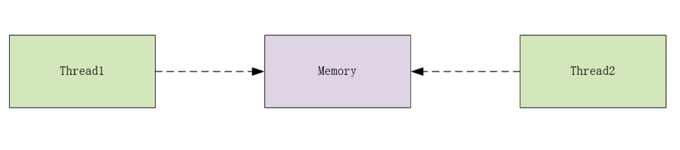
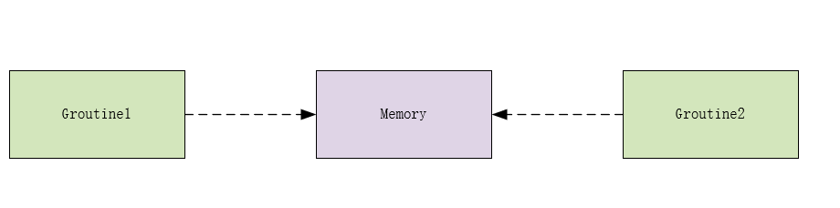
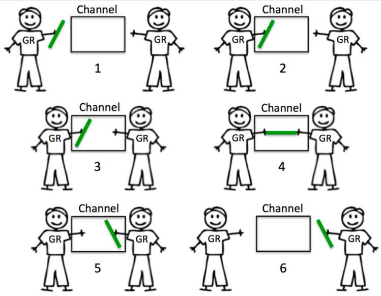
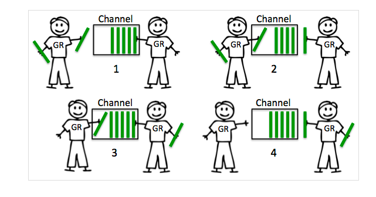
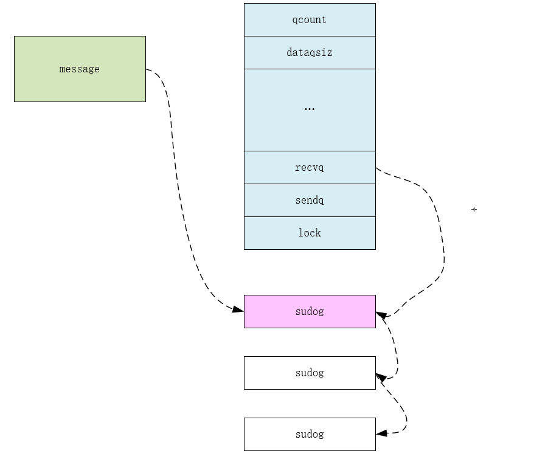
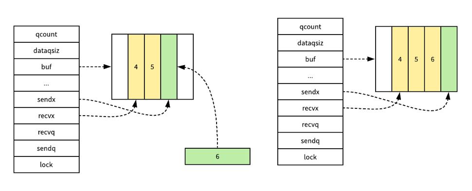

## 概述
作为 Go 语言中核心的数据结构和 Goroutine 之间的通信方式，Channel 是支撑 Go 语言高性能并发编程模型的结构之一，我们首先需要了解 Channel 背后的设计原理以及它的底层数据结构。

## 设计原理    
在 Go 语言中，**一个最常见的也是经常被人提及的设计模式就是不要通过共享内存的方式进行通信，而是应该通过通信的方式共享内存**，在很多主流的编程语言中，当我们想要并发执行一些代码时，我们往往都会在多个线程之间共享变量，同时为了解决线程冲突的问题，我们又需要在读写这些变量时加锁。



Go 语言对于并发编程的设计与上述这种共享内存的方式完全不同，虽然我们在 Golang 中也能使用共享内存加互斥锁来实现并发编程，但是与此同时，Go 语言也提供了一种不同的并发模型，也就是 CSP，即通信顺序进程（Communicating sequential processes），Goroutine 其实就是 CSP 中的实体，Channel 就是用于传递信息的通道，使用 CSP 并发模型的 Goroutine 就会通过 Channel 来传递消息。




上图中的两个 Goroutine，一个会负责向 Channel 中发送消息，另一个会负责从 Channel 中接收消息，它们两者并没有任何直接的关联，能够独立地工作和运行，但是间接地通过 Channel 完成了通信。


# 简单的使用

## 创建channel

channel 使用之前需要通过 make 创建。

```go
unBufferChan := make(chan int)  // 1
bufferChan := make(chan int, 4) // 2

```

上面的方式 1 创建的是无缓冲 channel，方式 2 创建的是缓冲 channel。如果使用 channel 之前没有 make，会出现 dead lock 错误。至于为什么是 dead lock。

```go
func main() {
    var x chan int
    go func() {
        x <- 1
    }()
    <-x
}
```


```go
fatal error: all goroutines are asleep - deadlock!

goroutine 1 [chan receive (nil chan)]:
main.main()
        /Users/linyuanpeng/workplace/go/src/github.com/bspp1314/go-common-lib/channel-lib/ex1/main.go:10 +0x4a

goroutine 5 [chan send (nil chan)]:
main.main.func1(0x0)
        /Users/linyuanpeng/workplace/go/src/github.com/bspp1314/go-common-lib/channel-lib/ex1/main.go:7 +0x37
created by main.main
        /Users/linyuanpeng/workplace/go/src/github.com/bspp1314/go-common-lib/channel-lib/ex1/main.go:6 +0x3e
exit status 2

```


## channel 读写操作


```go
func main() {
	ch := make(chan int,10)

	go func() {
		for i := 0; i < 10; i++ {
      //读操作
			ch <- i
		}
	}()

	for i := 0; i < 10; i++ {
    //写操作
    v：= <-ch 
		fmt.Println("Rev value is ",v)
	}
}

```


## channel 分裂

channel 分为无缓冲 channel 和有缓冲 channel。两者的区别如下：

- 无缓冲：发送和接收动作是同时发生的。如果没有 goroutine 读取 channel （<- channel），则发送者 (channel <-) 会一直阻塞




- 缓冲：缓冲 channel 类似一个有容量的队列。当队列满的时候发送者会阻塞；当队列空的时候接收者会阻塞。



关于关闭 channel 有几点需要注意的是：

- 重复关闭 channel 会导致 panic。
- 向关闭的 channel 发送数据会 panic。
- 从关闭的 channel 读数据不会 panic，读出 channel 中已有的数据之后再读就是 channel 类似的默认值，比如 chan int 类型的 channel 关闭之后读取到的值为 0。

对于上面的第三点，我们需要区分一下：channel 中的值是默认值还是 channel 关闭了。可以使用 ok-idiom 方式，这种方式在 map 中比较常用。

```go
ch := make(chan int, 10)
...
close(ch)

// ok-idiom 
val, ok := <-ch
if ok == false {
    // channel closed
}
```


# chan 的典型 用法

## 简单的groutine 通信

```go
func main() {
    x := make(chan int)
    go func() {
        x <- 1
    }()
    <-x
}
```


## Select 

select 一定程度上可以类比于 linux 中的 IO 多路复用中的 select。后者相当于提供了对多个 IO 事件的统一管理，而 Golang 中的 select 相当于提供了对多个 channel 的统一管理。当然这只是 select 在 channel 上的一种使用方法。

```go
select {
    case e, ok := <-ch1:
        ...
    case e, ok := <-ch2:
        ...
    default:  
}
```


## rang channel 

range channel 可以直接取到 channel 中的值。当我们使用 range 来操作 channel 的时候，一旦 channel 关闭，channel 内部数据读完之后循环自动结束。

```go
func consumer(ch <-chan int)  {
	for c := range ch {
		fmt.Println("Rev value is ",c)
	}
}

func producer(ch chan<- int)  {
	for i := 0; i < 10; i++ {
		ch <- i
	}
}

func main() {
	ch := make(chan int,1)

	go consumer(ch)
	go producer(ch)

	time.Sleep(time.Second)
}

```

out 

```shell
Rev value is  0
Rev value is  1
Rev value is  2
Rev value is  3
Rev value is  4
Rev value is  5
Rev value is  6
Rev value is  7
Rev value is  8
Rev value is  9
```


# chan 的runtime 结构

```go
type hchan struct {
  //队列中数据的个数
	qcount   uint           // total data in the queue 
	// channel 大小
  dataqsiz uint           // size of the circular queue
	//存放数据的环形数组
  buf      unsafe.Pointer // points to an array of dataqsiz elements
	//channel 中数据类型的大小
  elemsize uint16
	//表示 channel 是否关闭
  closed   uint32
  //元素数据类型
	elemtype *_type // element type
	//send 的数组索引
  sendx    uint   // send index
	// recv 的数组索引
  recvx    uint   // receive index
  // 由 recv 行为（也就是 <-ch）阻塞在 channel 上的 goroutine 队列
	recvq    waitq  // list of recv waiters
  //  send 行为 (也就是 ch<-) 阻塞在 channel 上的 goroutine 队列
	sendq    waitq  // list of send waiters

	// lock protects all fields in hchan, as well as several
	// fields in sudogs blocked on this channel.
	//
	// Do not change another G's status while holding this lock
	// (in particular, do not ready a G), as this can deadlock
	// with stack shrinking.
	lock mutex
}

type waitq struct {
    first *sudog
    last  *sudog
}
type sudog struct {
    // The following fields are protected by the hchan.lock of the
    // channel this sudog is blocking on. shrinkstack depends on
    // this for sudogs involved in channel ops.

    g          *g
    selectdone *uint32 // CAS to 1 to win select race (may point to stack)
    next       *sudog
    prev       *sudog
    elem       unsafe.Pointer // data element (may point to stack)

    // The following fields are never accessed concurrently.
    // For channels, waitlink is only accessed by g.
    // For semaphores, all fields (including the ones above)
    // are only accessed when holding a semaRoot lock.

    acquiretime int64
    releasetime int64
    ticket      uint32
    parent      *sudog // semaRoot binary tree
    waitlink    *sudog // g.waiting list or semaRoot
    waittail    *sudog // semaRoot
    c           *hchan // channel
}

```

我们可以看到 channel 其实就是一个队列加一个锁，只不过这个锁是一个轻量级锁。其中 recvq 是读操作阻塞在 channel 的 goroutine 列表，sendq 是写操作阻塞在 channel 的 goroutine 列表。列表的实现是 sudog，其实就是一个对 g 的结构的封装。


# runtime.makechan 

```go
package main

func main() {
	x := make(chan int,1)

	go func() {
		x <-1
	}()

	<- x
	close(x)
}


```

我们通过一下命令来获取上面代码的汇编

```go
 go tool compile -l -N -S main.go 
```


```go
"".main STEXT size=158 args=0x0 locals=0x28
        0x0000 00000 (main.go:3)        TEXT    "".main(SB), ABIInternal, $40-0
        0x0000 00000 (main.go:3)        MOVQ    (TLS), CX
        0x0009 00009 (main.go:3)        CMPQ    SP, 16(CX)
        0x000d 00013 (main.go:3)        PCDATA  $0, $-2
        0x000d 00013 (main.go:3)        JLS     148
        0x0013 00019 (main.go:3)        PCDATA  $0, $-1
        0x0013 00019 (main.go:3)        SUBQ    $40, SP
        0x0017 00023 (main.go:3)        MOVQ    BP, 32(SP)
        0x001c 00028 (main.go:3)        LEAQ    32(SP), BP
        0x0021 00033 (main.go:3)        FUNCDATA        $0, gclocals·69c1753bd5f81501d95132d08af04464(SB)
        0x0021 00033 (main.go:3)        FUNCDATA        $1, gclocals·9fb7f0986f647f17cb53dda1484e0f7a(SB)
        0x0021 00033 (main.go:4)        LEAQ    type.chan int(SB), AX
        0x0028 00040 (main.go:4)        MOVQ    AX, (SP)
        0x002c 00044 (main.go:4)        MOVQ    $1, 8(SP)
        0x0035 00053 (main.go:4)        PCDATA  $1, $0
        0x0035 00053 (main.go:4)        CALL    runtime.makechan(SB)
.....
```

可以看到  chan 最终的创建 函数为  `runtime.makechan`

```go
func makechan(t *chantype, size int) *hchan {
	elem := t.elem

	// compiler checks this but be safe.
  // 元素的大小不能 64k  
	if elem.size >= 1<<16 {
		throw("makechan: invalid channel element type")
	}
  //内存对齐判断
	if hchanSize%maxAlign != 0 || elem.align > maxAlign {
		throw("makechan: bad alignment")
	}

  //获取并判断chan 数据 需要的内存是否溢出
	mem, overflow := math.MulUintptr(elem.size, uintptr(size))
  // maxAlloc 为最大可分配内存
	if overflow || mem > maxAlloc-hchanSize || size < 0 {
		panic(plainError("makechan: size out of range"))
	}

	// Hchan does not contain pointers interesting for GC when elements stored in buf do not contain pointers.
	// buf points into the same allocation, elemtype is persistent.
	// SudoG's are referenced from their owning thread so they can't be collected.
	// TODO(dvyukov,rlh): Rethink when collector can move allocated objects.
	var c *hchan
	switch {
	case mem == 0:
    // 需要的内存大小为0，只需要分配hchan的内存即可
		// Queue or element size is zero.
		c = (*hchan)(mallocgc(hchanSize, nil, true))
   		
		// Race detector uses this location for synchronization.
		c.buf = c.raceaddr()
	case elem.ptrdata == 0:
    // elem 不包含指针数据
		// Elements do not contain pointers.
		// Allocate hchan and buf in one call.
		c = (*hchan)(mallocgc(hchanSize+mem, nil, true))
		c.buf = add(unsafe.Pointer(c), hchanSize)
	default:
		// Elements contain pointers.
		c = new(hchan)
		c.buf = mallocgc(mem, elem, true)
	}

	c.elemsize = uint16(elem.size)
	c.elemtype = elem
	c.dataqsiz = uint(size)
	lockInit(&c.lock, lockRankHchan)

	if debugChan {
		print("makechan: chan=", c, "; elemsize=", elem.size, "; dataqsiz=", size, "\n")
	}
	return c
}

// MulUintptr returns a * b and whether the multiplication overflowed.
// On supported platforms this is an intrinsic lowered by the compiler.
func MulUintptr(a, b uintptr) (uintptr, bool) {
	if a|b < 1<<(4*sys.PtrSize) || a == 0 {
		return a * b, false
	}
	overflow := b > MaxUintptr/a
	return a * b, overflow
}


```

makechan 的函数非常简单，就是简单的检查了一下是否可以创建chan，检查按照情况分配内存。

- mem == 0 ，说明是无缓冲，不需要为buf分配内存，将其指向其本身即可
- elem.ptrdata == 0，elem 为非指针，buf 和 hchan 分配在一块连续的内存智商
- elem 为 指针，buf 和 hchan 内存各自分配

# Send 

我们根据 go tool 命令 汇编码

```go
"".main.func1 STEXT size=72 args=0x8 locals=0x18
        0x0000 00000 (main.go:6)        TEXT    "".main.func1(SB), ABIInternal, $24-8
        0x0000 00000 (main.go:6)        MOVQ    (TLS), CX
        0x0009 00009 (main.go:6)        CMPQ    SP, 16(CX)
        0x000d 00013 (main.go:6)        PCDATA  $0, $-2
        0x000d 00013 (main.go:6)        JLS     65
        0x000f 00015 (main.go:6)        PCDATA  $0, $-1
        0x000f 00015 (main.go:6)        SUBQ    $24, SP
        0x0013 00019 (main.go:6)        MOVQ    BP, 16(SP)
        0x0018 00024 (main.go:6)        LEAQ    16(SP), BP
        0x001d 00029 (main.go:6)        FUNCDATA        $0, gclocals·1a65e721a2ccc325b382662e7ffee780(SB)
        0x001d 00029 (main.go:6)        FUNCDATA        $1, gclocals·69c1753bd5f81501d95132d08af04464(SB)
        0x001d 00029 (main.go:7)        MOVQ    "".x+32(SP), AX
        0x0022 00034 (main.go:7)        MOVQ    AX, (SP)
        0x0026 00038 (main.go:7)        LEAQ    ""..stmp_0(SB), AX
        0x002d 00045 (main.go:7)        MOVQ    AX, 8(SP)
        0x0032 00050 (main.go:7)        PCDATA  $1, $1
        0x0032 00050 (main.go:7)        CALL    runtime.chansend1(SB)
        0x0037 00055 (main.go:8)        MOVQ    16(SP), BP
        0x003c 00060 (main.go:8)        ADDQ    $24, SP

```

可以知道 go chan 发送数据时候，runtime会调用 runtime.chansend1 

```go
/ entry point for c <- x from compiled code
//go:nosplit
func chansend1(c *hchan, elem unsafe.Pointer) {
	chansend(c, elem, true, getcallerpc())
}

/*
 * generic single channel send/recv
 * If block is not nil,
 * then the protocol will not
 * sleep but return if it could
 * not complete.
 *
 * sleep can wake up with g.param == nil
 * when a channel involved in the sleep has
 * been closed.  it is easiest to loop and re-run
 * the operation; we'll see that it's now closed.
 */
func chansend(c *hchan, ep unsafe.Pointer, block bool, callerpc uintptr) bool {
  // chan 为空
	if c == nil {
    // 无需阻塞
		if !block {
			return false
		}
    // groutine 挂起
		gopark(nil, nil, waitReasonChanSendNilChan, traceEvGoStop, 2)
		throw("unreachable")
	}

	if debugChan {
		print("chansend: chan=", c, "\n")
	}

	if raceenabled {
		racereadpc(c.raceaddr(), callerpc, funcPC(chansend))
	}

	// Fast path: check for failed non-blocking operation without acquiring the lock.
	//
	// After observing that the channel is not closed, we observe that the channel is
	// not ready for sending. Each of these observations is a single word-sized read
	// (first c.closed and second full()).
	// Because a closed channel cannot transition from 'ready for sending' to
	// 'not ready for sending', even if the channel is closed between the two observations,
	// they imply a moment between the two when the channel was both not yet closed
	// and not ready for sending. We behave as if we observed the channel at that moment,
	// and report that the send cannot proceed.
	//
	// It is okay if the reads are reordered here: if we observe that the channel is not
	// ready for sending and then observe that it is not closed, that implies that the
	// channel wasn't closed during the first observation. However, nothing here
	// guarantees forward progress. We rely on the side effects of lock release in
	// chanrecv() and closechan() to update this thread's view of c.closed and full().
  // 非阻塞的且chan未关闭且chan的buff 已经满了，直接返回 
	if !block && c.closed == 0 && full(c) {
		return false
	}

	var t0 int64
	if blockprofilerate > 0 {
		t0 = cputicks()
	}

	lock(&c.lock)

  // chan 已经关闭，无法发送数据，直接抛出异常
	if c.closed != 0 {
		unlock(&c.lock)
		panic(plainError("send on closed channel"))
	}

	if sg := c.recvq.dequeue(); sg != nil {
		// Found a waiting receiver. We pass the value we want to send
		// directly to the receiver, bypassing the channel buffer (if any).
		send(c, sg, ep, func() { unlock(&c.lock) }, 3)
		return true
	}

	if c.qcount < c.dataqsiz {
		// Space is available in the channel buffer. Enqueue the element to send.
		qp := chanbuf(c, c.sendx)
		if raceenabled {
			raceacquire(qp)
			racerelease(qp)
		}
		typedmemmove(c.elemtype, qp, ep)
		c.sendx++
		if c.sendx == c.dataqsiz {
			c.sendx = 0
		}
		c.qcount++
		unlock(&c.lock)
		return true
	}

	if !block {
		unlock(&c.lock)
		return false
	}

	// Block on the channel. Some receiver will complete our operation for us.
	gp := getg()
	mysg := acquireSudog()
	mysg.releasetime = 0
	if t0 != 0 {
		mysg.releasetime = -1
	}
	// No stack splits between assigning elem and enqueuing mysg
	// on gp.waiting where copystack can find it.
	mysg.elem = ep
	mysg.waitlink = nil
	mysg.g = gp
	mysg.isSelect = false
	mysg.c = c
	gp.waiting = mysg
	gp.param = nil
	c.sendq.enqueue(mysg)
	gopark(chanparkcommit, unsafe.Pointer(&c.lock), waitReasonChanSend, traceEvGoBlockSend, 2)
	// Ensure the value being sent is kept alive until the
	// receiver copies it out. The sudog has a pointer to the
	// stack object, but sudogs aren't considered as roots of the
	// stack tracer.
	KeepAlive(ep)

	// someone woke us up.
	if mysg != gp.waiting {
		throw("G waiting list is corrupted")
	}
	gp.waiting = nil
	gp.activeStackChans = false
	if gp.param == nil {
		if c.closed == 0 {
			throw("chansend: spurious wakeup")
		}
		panic(plainError("send on closed channel"))
	}
	gp.param = nil
	if mysg.releasetime > 0 {
		blockevent(mysg.releasetime-t0, 2)
	}
	mysg.c = nil
	releaseSudog(mysg)
	return true
}
```


## 一些前置的检查

```go
func chansend(c *hchan, ep unsafe.Pointer, block bool, callerpc uintptr) bool {
  // chan 为空
	if c == nil {
    // 无需阻塞
		if !block {
			return false
		}
    // groutine 挂起
		gopark(nil, nil, waitReasonChanSendNilChan, traceEvGoStop, 2)
		throw("unreachable")
	}

	if debugChan {
		print("chansend: chan=", c, "\n")
	}

	if raceenabled {
		racereadpc(c.raceaddr(), callerpc, funcPC(chansend))
	}

  // 非阻塞的且chan未关闭且chan的buff 已经满了，直接返回 
	if !block && c.closed == 0 && full(c) {
		return false
	}

	var t0 int64
	if blockprofilerate > 0 {
		t0 = cputicks()
	}

	lock(&c.lock)

  // chan 已经关闭，无法发送数据，直接抛出异常
	if c.closed != 0 {
		unlock(&c.lock)
		panic(plainError("send on closed channel"))
	}
```

1. chan 为 nil,如果无需阻塞，直接返回false,如果需要阻塞，挂起 groutine 
2. 如果chan 为 非阻塞的且chan未关闭且chan的buff 已经满了，直接返回 
3.  chan 已经关闭，无法发送数据，直接抛出异常


## 直接发送

如果目标 Channel 没有被关闭并且已经有处于读等待的 goroutine，那么chansend 函数会通过 dequeue 从 recvq 中取出最先陷入等待的 Goroutine 并直接向它发送数据：

```go
if sg := c.recvq.dequeue(); sg != nil {
   // Found a waiting receiver. We pass the value we want to send
   // directly to the receiver, bypassing the channel buffer (if any).
   send(c, sg, ep, func() { unlock(&c.lock) }, 3)
   return true
}
```

我们可以从下面图中简单了解一下如果 Channel 中存在等待消息的 Goroutine 时，发送消息的处理过程：




```go
// send processes a send operation on an empty channel c.
// The value ep sent by the sender is copied to the receiver sg.
// The receiver is then woken up to go on its merry way.
// Channel c must be empty and locked.  send unlocks c with unlockf.
// sg must already be dequeued from c.
// ep must be non-nil and point to the heap or the caller's stack.
func send(c *hchan, sg *sudog, ep unsafe.Pointer, unlockf func(), skip int) {
	if raceenabled {
		if c.dataqsiz == 0 {
			racesync(c, sg)
		} else {
			// Pretend we go through the buffer, even though
			// we copy directly. Note that we need to increment
			// the head/tail locations only when raceenabled.
			qp := chanbuf(c, c.recvx)
			raceacquire(qp)
			racerelease(qp)
			raceacquireg(sg.g, qp)
			racereleaseg(sg.g, qp)
			c.recvx++
			if c.recvx == c.dataqsiz {
				c.recvx = 0
			}
			c.sendx = c.recvx // c.sendx = (c.sendx+1) % c.dataqsiz
		}
	}
	if sg.elem != nil {
    //将数据拷贝到目标的 sudog 上
		sendDirect(c.elemtype, sg, ep)
		sg.elem = nil
	}
	gp := sg.g
	unlockf()
	gp.param = unsafe.Pointer(sg)
	if sg.releasetime != 0 {
		sg.releasetime = cputicks()
	}
  //唤醒 目标的groutine 
	goready(gp, skip+1)
}

```


## 将数据存在缓冲区
```
func chansend(c *hchan, ep unsafe.Pointer, block bool, callerpc uintptr) bool {
    ...
    //在这里我们首先会使用 chanbuf  
    //计算出下一个可以放置待处理变量的位置，然后
    //通过 typedmemmove 将发送的消息拷贝到缓冲区中并增加 sendx
    //索引和 qcount 
    //计数器，在函数的最后会释放持有的锁。
    if c.qcount < c.dataqsiz {
        qp := chanbuf(c, c.sendx)
        typedmemmove(c.elemtype, qp, ep)
        c.sendx++
        if c.sendx == c.dataqsiz {
            c.sendx = 0
        }
        c.qcount++
        unlock(&c.lock)
        return true
    }
    
```

如果当前 `channel` 的缓冲区未满时，向 `channel` 发送数据时就会直接存储在 `channel` 中 `sendx` 索引所在的位置并将 sendx 索引加一，如果`c.sendx` 等于 `c.dataqsiz` 那么就将 `c.sendx` 设置为0 ，这是因为  缓冲区是一个队列，先进入缓冲区的数据会被取走。




## 阻塞发送

最后要介绍的就是向 Channel 发送但是遇到下游无法处理的『阻塞发送』了，当然如果传入的参数 block=false，那么就会直接释放持有的锁并返回 false 表示这一次的发送不成功。

在常见的场景中，向 Channel 发送消息的操作基本上都是阻塞的，在这时就会执行下面的代码，我们可以简单梳理一下这段代码的逻辑：

```go
func chansend(c *hchan, ep unsafe.Pointer, block bool, callerpc uintptr) bool {
  .....
// Block on the channel. Some receiver will complete our operation for us.
  // 获取当前 g 
	gp := getg()
	mysg := acquireSudog()
	mysg.releasetime = 0
	if t0 != 0 {
		mysg.releasetime = -1
	}
	// No stack splits between assigning elem and enqueuing mysg
	// on gp.waiting where copystack can find it.
	mysg.elem = ep
	mysg.waitlink = nil
	mysg.g = gp
	mysg.isSelect = false
	mysg.c = c
	gp.waiting = mysg
	gp.param = nil
	c.sendq.enqueue(mysg)
	gopark(chanparkcommit, unsafe.Pointer(&c.lock), waitReasonChanSend, traceEvGoBlockSend, 2)
	// Ensure the value being sent is kept alive until the
	// receiver copies it out. The sudog has a pointer to the
	// stack object, but sudogs aren't considered as roots of the
	// stack tracer.
	KeepAlive(ep)

	// someone woke us up.
	if mysg != gp.waiting {
		throw("G waiting list is corrupted")
	}
	gp.waiting = nil
	gp.activeStackChans = false
	if gp.param == nil {
		if c.closed == 0 {
			throw("chansend: spurious wakeup")
		}
		panic(plainError("send on closed channel"))
	}
	gp.param = nil
	if mysg.releasetime > 0 {
		blockevent(mysg.releasetime-t0, 2)
	}
	mysg.c = nil
	releaseSudog(mysg)
	return true
```

1. 调用 getg 获取发送操作时使用的 g 协程；
2. 执行 acquireSudog 函数从cache 获取一个 sudog 并设置这一次阻塞发送的相关信息，例如发送的 channel、是否在 select 控制结构中、发送数据所在的地址等；
3. 将刚刚创建并初始化的 sudog 结构体加入 sendq 等待队列，并设置到当前 goroutine 的 waiting 上，表示 goroutine 正在等待该 sudog 准备就绪；
4. 调用 goparkunlock 函数将当前的 Goroutine 更新成 Gwaiting 状态并解锁，该 Goroutine 可以被调用 goready 再次唤醒；
5. 当前的 Goroutine 其实就会在这里陷入阻塞状态等待被调度器唤醒了；
6. 如果被调度器唤醒就会执行一些收尾的工作，将一些属性置零并且释放 sudog 结构体；

在最后，函数会返回 true 表示这一次发送的结束并继续运行当前 Goroutine 应该执行的逻辑。


# 接收

接收的过程逻辑下基本一致，这里就直接放代码，不继续分析了

```go
// chanrecv receives on channel c and writes the received data to ep.
// ep may be nil, in which case received data is ignored.
// If block == false and no elements are available, returns (false, false).
// Otherwise, if c is closed, zeros *ep and returns (true, false).
// Otherwise, fills in *ep with an element and returns (true, true).
// A non-nil ep must point to the heap or the caller's stack.
func chanrecv(c *hchan, ep unsafe.Pointer, block bool) (selected, received bool) {
	// raceenabled: don't need to check ep, as it is always on the stack
	// or is new memory allocated by reflect.

	if debugChan {
		print("chanrecv: chan=", c, "\n")
	}

	if c == nil {
		if !block {
			return
		}
		gopark(nil, nil, waitReasonChanReceiveNilChan, traceEvGoStop, 2)
		throw("unreachable")
	}

	// Fast path: check for failed non-blocking operation without acquiring the lock.
	if !block && empty(c) {
		// After observing that the channel is not ready for receiving, we observe whether the
		// channel is closed.
		//
		// Reordering of these checks could lead to incorrect behavior when racing with a close.
		// For example, if the channel was open and not empty, was closed, and then drained,
		// reordered reads could incorrectly indicate "open and empty". To prevent reordering,
		// we use atomic loads for both checks, and rely on emptying and closing to happen in
		// separate critical sections under the same lock.  This assumption fails when closing
		// an unbuffered channel with a blocked send, but that is an error condition anyway.
		if atomic.Load(&c.closed) == 0 {
			// Because a channel cannot be reopened, the later observation of the channel
			// being not closed implies that it was also not closed at the moment of the
			// first observation. We behave as if we observed the channel at that moment
			// and report that the receive cannot proceed.
			return
		}
		// The channel is irreversibly closed. Re-check whether the channel has any pending data
		// to receive, which could have arrived between the empty and closed checks above.
		// Sequential consistency is also required here, when racing with such a send.
		if empty(c) {
			// The channel is irreversibly closed and empty.
			if raceenabled {
				raceacquire(c.raceaddr())
			}
			if ep != nil {
				typedmemclr(c.elemtype, ep)
			}
			return true, false
		}
	}

	var t0 int64
	if blockprofilerate > 0 {
		t0 = cputicks()
	}

	lock(&c.lock)

	if c.closed != 0 && c.qcount == 0 {
		if raceenabled {
			raceacquire(c.raceaddr())
		}
		unlock(&c.lock)
		if ep != nil {
			typedmemclr(c.elemtype, ep)
		}
		return true, false
	}

	if sg := c.sendq.dequeue(); sg != nil {
		// Found a waiting sender. If buffer is size 0, receive value
		// directly from sender. Otherwise, receive from head of queue
		// and add sender's value to the tail of the queue (both map to
		// the same buffer slot because the queue is full).
		recv(c, sg, ep, func() { unlock(&c.lock) }, 3)
		return true, true
	}

	if c.qcount > 0 {
		// Receive directly from queue
		qp := chanbuf(c, c.recvx)
		if raceenabled {
			raceacquire(qp)
			racerelease(qp)
		}
		if ep != nil {
			typedmemmove(c.elemtype, ep, qp)
		}
		typedmemclr(c.elemtype, qp)
		c.recvx++
		if c.recvx == c.dataqsiz {
			c.recvx = 0
		}
		c.qcount--
		unlock(&c.lock)
		return true, true
	}

	if !block {
		unlock(&c.lock)
		return false, false
	}

	// no sender available: block on this channel.
	gp := getg()
	mysg := acquireSudog()
	mysg.releasetime = 0
	if t0 != 0 {
		mysg.releasetime = -1
	}
	// No stack splits between assigning elem and enqueuing mysg
	// on gp.waiting where copystack can find it.
	mysg.elem = ep
	mysg.waitlink = nil
	gp.waiting = mysg
	mysg.g = gp
	mysg.isSelect = false
	mysg.c = c
	gp.param = nil
	c.recvq.enqueue(mysg)
	gopark(chanparkcommit, unsafe.Pointer(&c.lock), waitReasonChanReceive, traceEvGoBlockRecv, 2)

	// someone woke us up
	if mysg != gp.waiting {
		throw("G waiting list is corrupted")
	}
	gp.waiting = nil
	gp.activeStackChans = false
	if mysg.releasetime > 0 {
		blockevent(mysg.releasetime-t0, 2)
	}
	closed := gp.param == nil
	gp.param = nil
	mysg.c = nil
	releaseSudog(mysg)
	return true, !closed
}
```


# 关闭

```go
func closechan(c *hchan) {
  // hchan 为 nil 
   if c == nil {
      panic(plainError("close of nil channel"))
   }

   lock(&c.lock)
   // 已经关闭，抛出异常 
   if c.closed != 0 {
      unlock(&c.lock)
      panic(plainError("close of closed channel"))
   }

   if raceenabled {
      callerpc := getcallerpc()
      racewritepc(c.raceaddr(), callerpc, funcPC(closechan))
      racerelease(c.raceaddr())
   }

   c.closed = 1

   var glist gList

   // release all readers
  // recvq 队列中的数据加入到  glist 中
   for {
      sg := c.recvq.dequeue()
      if sg == nil {
         break
      }
      if sg.elem != nil {
         typedmemclr(c.elemtype, sg.elem)
         sg.elem = nil
      }
      if sg.releasetime != 0 {
         sg.releasetime = cputicks()
      }
      gp := sg.g
      gp.param = nil
      if raceenabled {
         raceacquireg(gp, c.raceaddr())
      }
      glist.push(gp)
   }

   // release all writers (they will panic)
  // snedq 队列中的数据加入到  glist 中
   for {
      sg := c.sendq.dequeue()
      if sg == nil {
         break
      }
      sg.elem = nil
      if sg.releasetime != 0 {
         sg.releasetime = cputicks()
      }
      gp := sg.g
      gp.param = nil
      if raceenabled {
         raceacquireg(gp, c.raceaddr())
      }
      glist.push(gp)
   }
   unlock(&c.lock)

   // Ready all Gs now that we've dropped the channel lock.
  //	 释放所有的 groutine 
   for !glist.empty() {
      gp := glist.pop()
      gp.schedlink = 0
      goready(gp, 3)
   }
}
```

在函数执行的最后会为所有被阻塞的 Goroutine 调用 goready 函数重新对这些协程进行调度。


# selectchan 


当我们在 Go 语言中使用 `select` 控制结构时，会遇到两个有趣的现象：

1. `select` 能在 Channel 上进行非阻塞的收发操作；
2. `select` 在遇到多个 Channel 同时响应时，会随机执行一种情况；


在分析这个机制之前，我先通过 go tool 来分析在我们调用select在runtime时会调用哪个函数


```go
func main() {
	c1 := make(chan int,1)
	c2 := make(chan  int,1)

	go func() {
		c1 <- 1
	}()

	go func() {
		c2 <-2
	}()

	select {
	case <- c1:

	case <-c2:

	default:

	}
}
```


```
go tool compile -l -N -S main.go 
.....
 67     0x0167 00359 (main.go:15)   CALL    runtime.selectgo(SB)                                                                                                                        
 68     0x016c 00364 (main.go:15)   MOVQ    24(SP), AX
 69     0x0171 00369 (main.go:15)   MOVQ    AX, ""..autotmp_6+48(SP)
 70     0x0176 00374 (main.go:15)   MOVBLZX 32(SP), AX
 71     0x017b 00379 (main.go:15)   MOVB    AL, ""..autotmp_7+47(SP)
 72     0x017f 00383 (main.go:16)   CMPQ    ""..autotmp_6+48(SP), $0
 73     0x0185 00389 (main.go:16)   JEQ 393          
 74     0x0187 00391 (main.go:16)   JMP 411          
 75     0x0189 00393 (main.go:16)   PCDATA  $1, $-1  
 76     0x0189 00393 (main.go:16)   JMP 395          

```


可以看到当我们使用select 的时候，在runtime时候会被转换成  `runtime.selectgo`

```go
// selectgo implements the select statement.
//
// cas0 points to an array of type [ncases]scase, and order0 points to
// an array of type [2*ncases]uint16 where ncases must be <= 65536.
// Both reside on the goroutine's stack (regardless of any escaping in
// selectgo).
//
// selectgo returns the index of the chosen scase, which matches the
// ordinal position of its respective select{recv,send,default} call.
// Also, if the chosen scase was a receive operation, it reports whether
// a value was received.
func selectgo(cas0 *scase, order0 *uint16, ncases int) (int, bool) {
  .......
}
```


在我们分析selectgo 之前，先来看一下 `scase` 这个结构体，这个`scase`结构体表示 `select` 控制结构中的 `case`：

```go
// Select case descriptor.
// Known to compiler.
// Changes here must also be made in src/cmd/internal/gc/select.go's scasetype.
type scase struct {
	c           *hchan         // chan
	elem        unsafe.Pointer // data element
	kind        uint16
	pc          uintptr // race pc (for race detector / msan)
	releasetime int64
}

```

因为非默认的 `case` 中都与 channel 的发送和接收有关，所以 [`runtime.scase`](https://draveness.me/golang/tree/runtime.scase) 结构体中也包含一个 [`runtime.hchan`](https://draveness.me/golang/tree/runtime.hchan) 类型的字段存储 `case` 中使用的 channel。


```go
// selectgo implements the select statement.
//
// cas0 points to an array of type [ncases]scase, and order0 points to
// an array of type [2*ncases]uint16 where ncases must be <= 65536.
// Both reside on the goroutine's stack (regardless of any escaping in
// selectgo).
//
// selectgo returns the index of the chosen scase, which matches the
// ordinal position of its respective select{recv,send,default} call.
// Also, if the chosen scase was a receive operation, it reports whether
// a value was received.
func selectgo(cas0 *scase, order0 *uint16, ncases int) (int, bool) {
	if debugSelect {
		print("select: cas0=", cas0, "\n")
	}

	// NOTE: In order to maintain a lean stack size, the number of scases
	// is capped at 65536.
	cas1 := (*[1 << 16]scase)(unsafe.Pointer(cas0))
	order1 := (*[1 << 17]uint16)(unsafe.Pointer(order0))

	scases := cas1[:ncases:ncases]
	pollorder := order1[:ncases:ncases]
	lockorder := order1[ncases:][:ncases:ncases]

	// Replace send/receive cases involving nil channels with
	// caseNil so logic below can assume non-nil channel.
	for i := range scases {
		cas := &scases[i]
		if cas.c == nil && cas.kind != caseDefault {
			*cas = scase{}
		}
	}

	var t0 int64
	if blockprofilerate > 0 {
		t0 = cputicks()
		for i := 0; i < ncases; i++ {
			scases[i].releasetime = -1
		}
	}

	// The compiler rewrites selects that statically have
	// only 0 or 1 cases plus default into simpler constructs.
	// The only way we can end up with such small sel.ncase
	// values here is for a larger select in which most channels
	// have been nilled out. The general code handles those
	// cases correctly, and they are rare enough not to bother
	// optimizing (and needing to test).

	// generate permuted order
  // 通过 runtime.fastrandn 函数引入随机性；
	for i := 1; i < ncases; i++ {
		j := fastrandn(uint32(i + 1))
		pollorder[i] = pollorder[j]
		pollorder[j] = uint16(i)
	}

	// sort the cases by Hchan address to get the locking order.
	// simple heap sort, to guarantee n log n time and constant stack footprint.
  //按照 Channel 的地址排序后确定加锁顺序；
	for i := 0; i < ncases; i++ {
		j := i
		// Start with the pollorder to permute cases on the same channel.
		c := scases[pollorder[i]].c
		for j > 0 && scases[lockorder[(j-1)/2]].c.sortkey() < c.sortkey() {
			k := (j - 1) / 2
			lockorder[j] = lockorder[k]
			j = k
		}
		lockorder[j] = pollorder[i]
	}
	for i := ncases - 1; i >= 0; i-- {
		o := lockorder[i]
		c := scases[o].c
		lockorder[i] = lockorder[0]
		j := 0
		for {
			k := j*2 + 1
			if k >= i {
				break
			}
			if k+1 < i && scases[lockorder[k]].c.sortkey() < scases[lockorder[k+1]].c.sortkey() {
				k++
			}
			if c.sortkey() < scases[lockorder[k]].c.sortkey() {
				lockorder[j] = lockorder[k]
				j = k
				continue
			}
			break
		}
		lockorder[j] = o
	}

	if debugSelect {
		for i := 0; i+1 < ncases; i++ {
			if scases[lockorder[i]].c.sortkey() > scases[lockorder[i+1]].c.sortkey() {
				print("i=", i, " x=", lockorder[i], " y=", lockorder[i+1], "\n")
				throw("select: broken sort")
			}
		}
	}

	// lock all the channels involved in the select
	sellock(scases, lockorder)
  .....
}
```


轮询顺序 `pollOrder` 和加锁顺序 `lockOrder` 分别是通过以下的方式确认的：

- 轮询顺序：通过 `runtime.fastrandn` 函数引入随机性；
- 加锁顺序：按照 Channel 的地址排序后确定加锁顺序；

随机的轮询顺序可以避免 channel 的饥饿问题，保证公平性；而根据 Channel 的地址顺序确定加锁顺序能够避免死锁的发生。这段代码最后调用的 `runtime.sellock` 会按照之前生成的加锁顺序锁定 `select` 语句中包含所有的 Channel。

## 循环

当我们为 `select` 语句锁定了所有 Channel 之后就会进入 `runtime.selectgo` 函数的主循环，它会分三个阶段查找或者等待某个 Channel 准备就绪：

```go
func selectgo(cas0 *scase, order0 *uint16, ncases int) (int, bool) {
....	
	for i := 0; i < ncases; i++ {
		casi = int(pollorder[i])
		cas = &scases[casi]
		c = cas.c

		switch cas.kind {
		case caseNil:
			continue

		case caseRecv:
			sg = c.sendq.dequeue()
			if sg != nil {
				goto recv
			}
			if c.qcount > 0 {
				goto bufrecv
			}
			if c.closed != 0 {
				goto rclose
			}

		case caseSend:
			if raceenabled {
				racereadpc(c.raceaddr(), cas.pc, chansendpc)
			}
			if c.closed != 0 {
				goto sclose
			}
			sg = c.recvq.dequeue()
			if sg != nil {
				goto send
			}
			if c.qcount < c.dataqsiz {
				goto bufsend
			}

		case caseDefault:
			dfli = casi
			dfl = cas
		}
	}

```

函数会根据不同情况通过 `goto` 语句跳转到函数内部的不同标签执行相应的逻辑，其中包括：

-  `recv` 可以从休眠的发送方获取数据
-  `bufrecv` 可以从缓冲区读取数据
- `send` 可以向休眠的接收方发送数据
- `bufsend`：可以向缓冲区写入数据；
- `rclose`：可以从关闭的 Channel 读取 EOF；
- `sclose`：向关闭的 Channel 发送数据；
- `retc`：结束调用并返回；


上述代码主要的功能是找所有 `case` 中是否有可以立刻被处理的 Channel。无论是在等待的 Goroutine 上还是缓冲区中，只要存在数据满足条件就会立刻处理，如果不能立刻找到活跃的 Channel 就会进入循环的下一阶段，按照需要将当前 Goroutine 加入到 channel 的 `sendq` 或者 `recvq` 队列中：

```go
	for _, casei := range lockorder {
		casi = int(casei)
		cas = &scases[casi]
		if cas.kind == caseNil {
			continue
		}
		c = cas.c
		sg := acquireSudog()
		sg.g = gp
		sg.isSelect = true
		// No stack splits between assigning elem and enqueuing
		// sg on gp.waiting where copystack can find it.
		sg.elem = cas.elem
		sg.releasetime = 0
		if t0 != 0 {
			sg.releasetime = -1
		}
		sg.c = c
		// Construct waiting list in lock order.
		*nextp = sg
		nextp = &sg.waitlink

		switch cas.kind {
		case caseRecv:
			c.recvq.enqueue(sg)

		case caseSend:
			c.sendq.enqueue(sg)
		}
	}
	.....
	gopark(selparkcommit, nil, waitReasonSelect, traceEvGoBlockSelect, 1)
	....
}

```

除了将当前 Goroutine 对应的 `runtime.sudog` 结构体加入队列之外，这些结构体都会被串成链表附着在 Goroutine 上。在入队之后会调用 `runtime.gopark` 挂起当前 Goroutine 等待调度器的唤醒。

等到 `select` 中的一些 Channel 准备就绪之后，当前 Goroutine 就会被调度器唤醒。

```go
unc selectgo(cas0 *scase, order0 *uint16, ncases int) (int, bool) {
	...
	sg = (*sudog)(gp.param)
	gp.param = nil

	casi = -1
	cas = nil
	sglist = gp.waiting
	for _, casei := range lockorder {
		k = &scases[casei]
		if sg == sglist {
			casi = int(casei)
			cas = k
		} else {
			c = k.c
			if int(casei) < nsends {
				c.sendq.dequeueSudoG(sglist)
			} else {
				c.recvq.dequeueSudoG(sglist)
			}
		}
		sgnext = sglist.waitlink
		sglist.waitlink = nil
		releaseSudog(sglist)
		sglist = sgnext
	}

	c = cas.c
	goto retc
	...
}
```

第三次遍历全部 `case` 时，我们会先获取当前 Goroutine 接收到的参数 `sudog` 结构，我们会依次对比所有 `case` 对应的 `sudog` 结构找到被唤醒的 `case`，获取该 `case` 对应的索引并返回。

由于当前的 `select` 结构找到了一个 `case` 执行，那么剩下 `case` 中没有被用到的 `sudog` 就会被忽略并且释放掉。为了不影响 Channel 的正常使用，我们还是需要将这些废弃的 `sudog` 从 Channel 中出队。

当我们在循环中发现缓冲区中有元素或者缓冲区未满时就会通过 `goto` 关键字跳转到 `bufrecv` 和 `bufsend` 两个代码段，这两段代码的执行过程都很简单，它们只是向 Channel 中发送数据或者从缓冲区中获取新数据：


