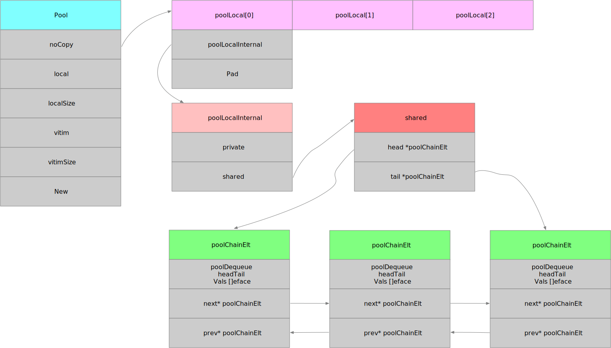

# 简介

sync.Pool 是 [sync](https://github.com/golang/go/blob/master/src/sync/pool.go) 包下的一个组件,可以保存和检索临时对象的池子。<!--more-->

> A Pool is a set of temporary objects that may be individually saved and retrieved.
>


# 使用场景

当多个 goroutine 都需要创建同⼀个对象的时候，如果 goroutine 数过多，导致对象的创建数⽬剧增，进⽽导致 GC 压⼒增大。形成 “并发⼤－占⽤内存⼤－GC 缓慢－处理并发能⼒降低－并发更⼤”这样的恶性循环。在这个时候，需要有⼀个对象池，每个 goroutine 不再⾃⼰单独创建对象，⽽是从对象池中获取出⼀个对象（如果池中已经有的话）。


# 简单的使用

```go
type User struct {
	UserName string `json:"user_name"`
}

type UserPool struct {
	*sync.Pool
}

func NewUserPool() *UserPool {
	return &UserPool{&sync.Pool{
		New: func()interface{} {
			return new(User)
		},
	}}
}

func (p *UserPool) GetUser() *User {

	return  p.Get().(*User)
}

func (p *UserPool) PutUser(u *User)  {
	p.Put(u)
}


func main() {
	pool := NewUserPool()
	u := pool.GetUser()
	u.UserName = "Hello world"
	fmt.Printf("User Addresss %p \n",u)
	fmt.Printf("User %v \n",u)
	pool.Put(u)

	u1 := pool.GetUser()
	fmt.Printf("User Addresss %p \n",u1)
	fmt.Printf("User %v ",u1)

}
```

out 

```
User Addresss 0xc000010200 
User &{Hello world} 
User Addresss 0xc000010200 
User &{Hello world} %     
```

在使用sync.Pool的时候需要的就是设置好 New 函数。当调用 Get 方法时，如果池子里缓存了对象，就直接返回缓存的对象。如果没有缓存，则调用 New 函数创建一个新的对象。另外，Get 方法取出来的对象和上次 Put 进去的对象实际上是同一个，并且没有对User 进行任务清空的处理，所以在实际的开发过程之中，还是需要我们增加清空的代码

```go
func (p *UserPool) PutUser(u *User)  {
	p.UserName = ""
	p.Put(u)
}
```


# 源码分析

## Pool 结构体

首先来看 Pool 的结构体：

```go
// A Pool must not be copied after first use.
type Pool struct {
	noCopy noCopy

	local     unsafe.Pointer // local fixed-size per-P pool, actual type is [P]poolLocal
	localSize uintptr        // size of the local array

	victim     unsafe.Pointer // local from previous cycle
	victimSize uintptr        // size of victims array

	// New optionally specifies a function to generate
	// a value when Get would otherwise return nil.
	// It may not be changed concurrently with calls to Get.
	New func() interface{}
}
```

在分析Pool结构体重各个字段性质之前，先来一张Pool整体的数据结构体




###  noCopy 

用来保证Pool结构体不被拷贝，使用 go vet  工具可以检测到用户代码是否复制了 Pool。

```go
// noCopy may be embedded into structs which must not be copied
// after the first use.
//
// See https://golang.org/issues/8005#issuecomment-190753527
// for details.
type noCopy struct{}

// Lock is a no-op used by -copylocks checker from `go vet`.
func (*noCopy) Lock()   {}
func (*noCopy) Unlock() {}
```


我们可以来看一段小代码

```go
func main() {
	p1 := sync.Pool{}
	p2 := p1
	fmt.Println(p1)
	fmt.Println(p2)
}
```

out

```go
$ go vet main.go 
# command-line-arguments
./main.go:10:8: assignment copies lock value to p2: sync.Pool contains sync.noCopy
./main.go:11:14: call of fmt.Println copies lock value: sync.Pool contains sync.noCopy
./main.go:12:14: call of fmt.Println copies lock value: sync.Pool contains sync.noCopy
```

### local  和 localSize

从注释我们可以知道local 一个 [P]poolLocal  数组，localSize表示数组的大小，P 的 id 对应  [P]poolLocal 下标索引。这里的P就是Golang里面GMP里P的概念。

#### poolLocal 

```go
// Local per-P Pool appendix.
type poolLocalInternal struct {
   // P 的私有缓存区，使用时无需要加锁
	private interface{} // Can be used only by the respective P.
  // 公共缓存区。本地 P 可以 pushHead/popHead；其他 P 则只能 popTail
	shared  poolChain   // Local P can pushHead/popHead; any P can popTail.
}

type poolLocal struct {
	poolLocalInternal

	// Prevents false sharing on widespread platforms with
	// 128 mod (cache line size) = 0 .
	pad [128 - unsafe.Sizeof(poolLocalInternal{})%128]byte
}
```

#### poolChain

poolLocalInternal 中的shard 指向一个双端的链表poolChain，其代码如下：

```go
type poolChain struct {
   // head is the poolDequeue to push to. This is only accessed
   // by the producer, so doesn't need to be synchronized.
   head *poolChainElt

   // tail is the poolDequeue to popTail from. This is accessed
   // by consumers, so reads and writes must be atomic.
   tail *poolChainElt
}
```

#### poolChainElt

链表的一个节点 Node

```go

type poolChainElt struct {
   poolDequeue

   // next and prev link to the adjacent poolChainElts in this
   // poolChain.
   //
   // next is written atomically by the producer and read
   // atomically by the consumer. It only transitions from nil to
   // non-nil.
   //
   // prev is written atomically by the consumer and read
   // atomically by the producer. It only transitions from
   // non-nil to nil.
   next, prev *poolChainElt
}
```

#### poolDequeue

poolDequeue是一个无锁、固定大小的单生产端多消费端的环形队列，单一producer可以在头部push和pop(可能和传统队列头部只能push的定义不同)，多consumer可以在尾部pop。

headtail 

1. headTail表示下标，高32位表示头下标，低32位表示尾下标，poolDequeue定义了，head tail的pack和unpack函数方便转化， 实际用的时候都会mod ( len(vals) - 1 ) 来防止溢出
2. head和tail永远只用32位表示，溢出后会从0开始，这也满足循环队列的设计
3. 队列为空的条件  tail == head
4. 队列满的条件    (tail+uint32(len(d.vals)))&(1<<dequeueBits-1) == head tail加上队列长度和head相等(实际上就是队列已有的空间都有值了,满了)

```go
// poolDequeue is a lock-free fixed-size single-producer,
// multi-consumer queue. The single producer can both push and pop
// from the head, and consumers can pop from the tail.
//
// It has the added feature that it nils out unused slots to avoid
// unnecessary retention of objects. This is important for sync.Pool,
// but not typically a property considered in the literature.
type poolDequeue struct {
	// headTail packs together a 32-bit head index and a 32-bit
	// tail index. Both are indexes into vals modulo len(vals)-1.
	//
	// tail = index of oldest data in queue
	// head = index of next slot to fill
	//
	// Slots in the range [tail, head) are owned by consumers.
	// A consumer continues to own a slot outside this range until
	// it nils the slot, at which point ownership passes to the
	// producer.
	//
	// The head index is stored in the most-significant bits so
	// that we can atomically add to it and the overflow is
	// harmless.
	headTail uint64

	// vals is a ring buffer of interface{} values stored in this
	// dequeue. The size of this must be a power of 2.
	//
	// vals[i].typ is nil if the slot is empty and non-nil
	// otherwise. A slot is still in use until *both* the tail
	// index has moved beyond it and typ has been set to nil. This
	// is set to nil atomically by the consumer and read
	// atomically by the producer.
	vals []eface
}

```


## Get 源码

```go
func (p *Pool) Get() interface{} {
	... 
	l, pid := p.pin()
	x := l.private
	l.private = nil
	if x == nil {
		// Try to pop the head of the local shard. We prefer
		// the head over the tail for temporal locality of
		// reuse.
		x, _ = l.shared.popHead()
		if x == nil {
			x = p.getSlow(pid)
		}
	}
	runtime_procUnpin()
	if race.Enabled {
		race.Enable()
		if x != nil {
			race.Acquire(poolRaceAddr(x))
		}
	}
	if x == nil && p.New != nil {
		x = p.New()
	}
	return x
}

```


1. 调用  p.pin() 函数将当前的 goroutine 和 P 绑定，禁止被抢占，返回当前 P 对应的 poolLocal，以及 pid。pin()函数的具体实现将在下面分析，这里先只关注其功能

2. 将poolLocal的private值赋值给x,并判断其是否为空。

3. 如果 x 为空，就从poolLocal的双端队列里面获取缓存的数据,并将其赋值给x,判断其是否为空。

4. 如果 x 为空，通过getSlow 从其他的P里获取缓存的数据，并将其赋值给x，判断其是否为空

5. 如果x为空，那么调用 New()函数创建一个新的 值。

###  pin 

   pin 函数的作用是用来绑定当前的goroutine和P，禁止抢占。并且返回对应的 poolLocal 以及 P 的 id。

```go
// pin pins the current goroutine to P, disables preemption and
// returns poolLocal pool for the P and the P's id.
// Caller must call runtime_procUnpin() when done with the pool.
func (p *Pool) pin() (*poolLocal, int) {
   pid := runtime_procPin()
   // In pinSlow we store to local and then to localSize, here we load in opposite order.
   // Since we've disabled preemption, GC cannot happen in between.
   // Thus here we must observe local at least as large localSize.
   // We can observe a newer/larger local, it is fine (we must observe its zero-initialized-ness).
   s := atomic.LoadUintptr(&p.localSize) // load-acquire
   l := p.local                          // load-consume
   if uintptr(pid) < s {
      return indexLocal(l, pid), pid
   }
   return p.pinSlow()
}
```

1. 通过runtime_proPin()获取到pid 。runtime_proPin()具体的实现在runtime里面

   ```go
   //go:linkname sync_runtime_procPin sync.runtime_procPin
   //go:nosplit
   func sync_runtime_procPin() int {
   	return procPin()
   }
   
   //go:nosplit
   func procPin() int {
   	_g_ := getg()
   	mp := _g_.m
   
   	mp.locks++
   	return int(mp.p.ptr().id)
   }
   ```

2. 获取local 列表，原子操作取出  p.localSize 和 p.local，如果当前 pid 小于 p.localSize，则直接取 poolLocal 数组中的 pid 索引处的元素。否则，说明 Pool 还没有创建 poolLocal，调用 p.pinSlow()  完成创建工作。

### pinSlow


   ```go
   func (p *Pool) pinSlow() (*poolLocal, int) {
   	// Retry under the mutex.
   	// Can not lock the mutex while pinned.
   	runtime_procUnpin()
   	allPoolsMu.Lock()
   	defer allPoolsMu.Unlock()
   	pid := runtime_procPin()
   	// poolCleanup won't be called while we are pinned.
   	s := p.localSize
   	l := p.local
   	if uintptr(pid) < s {
   		return indexLocal(l, pid), pid
   	}
   	if p.local == nil {
   		allPools = append(allPools, p)
   	}
   	// If GOMAXPROCS changes between GCs, we re-allocate the array and lose the old one.
   	size := runtime.GOMAXPROCS(0)
   	local := make([]poolLocal, size)
   	atomic.StorePointer(&p.local, unsafe.Pointer(&local[0])) // store-release
   	atomic.StoreUintptr(&p.localSize, uintptr(size))         // store-release
   	return &local[pid], pid
   }
   
   //go:nosplit
   func procUnpin() {
      _g_ := getg()
      _g_.m.locks--
   }
   ```

   

   1. 调用runtime_procUnpin() 将 m 的锁计算减一

   2. 调用 allPoolsMu.Lock() 对全局的pool进行加锁

   3. 判断 pid是否在p.local 大小范围之内，如果是则不用创建 poolLocal 切片，直接返回。因为 pinSlow 中途可能已经被其他的线程调用

   4. 获取当前p的数量，并创建 poolLocal链表

### poolChain.popHead 和  poolDequeue.pod
```go
func (c *poolChain) popHead() (interface{}, bool) {
	d := c.head
	for d != nil {
		if val, ok := d.popHead(); ok {
			return val, ok
		}
		// There may still be unconsumed elements in the
		// previous dequeue, so try backing up.
		d = loadPoolChainElt(&d.prev)
	}
	return nil, false
}
```

看如上代码，是从head获取，调用poolDequeue的popHead函数获取对象，如果没有获取，则根据双线链表找到pre节点，继续获取，直到遍历到最后一个节点则直接返回 我们来看下poolDequeue的popHead。

```go
// popHead removes and returns the element at the head of the queue.
// It returns false if the queue is empty. It must only be called by a
// single producer.
func (d *poolDequeue) popHead() (interface{}, bool) {
	var slot *eface
	for {
		ptrs := atomic.LoadUint64(&d.headTail)
		head, tail := d.unpack(ptrs)
		if tail == head {
			// Queue is empty.
			return nil, false
		}

		// Confirm tail and decrement head. We do this before
		// reading the value to take back ownership of this
		// slot.
		head--
		ptrs2 := d.pack(head, tail)
		if atomic.CompareAndSwapUint64(&d.headTail, ptrs, ptrs2) {
			// We successfully took back slot.
			slot = &d.vals[head&uint32(len(d.vals)-1)]
			break
		}
	}

	val := *(*interface{})(unsafe.Pointer(slot))
	if val == dequeueNil(nil) {
		val = nil
	}
	// Zero the slot. Unlike popTail, this isn't racing with
	// pushHead, so we don't need to be careful here.
	*slot = eface{}
	return val, true
}

```


# 参考连接

Golang 源码 https://github.com/golang/go/blob/master/src/sync/pool.go

Go 夜读 https://reading.hidevops.io/reading/20180817/2018-08-17-sync-pool-reading.pdf

深度解密 Go 语言之 sync.Pool https://www.cnblogs.com/qcrao-2018/p/12736031.html#pool-%E7%BB%93%E6%9E%84%E4%BD%93

golang的对象池sync.pool源码解读 https://zhuanlan.zhihu.com/p/99710992

Golang 调度器 GMP 原理与调度全分析 https://learnku.com/articles/41728#replies

Scheduling In Go : Part II - Go Scheduler  https://www.ardanlabs.com/blog/2018/08/scheduling-in-go-part2.html

理解 Go 1.13 中 sync.Pool 的设计与实现 https://zhuanlan.zhihu.com/p/110140126

golang sync.pool源码阅读 https://www.cnblogs.com/wuwangchuxin0924/p/12649775.html

