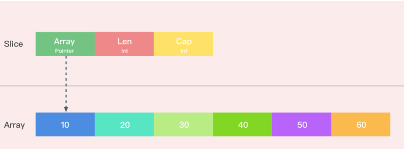

本文为转载

# 概述

切片是 Go 中的一种基本的数据结构。切片的设计想法是由动态数组概念而来，为了开发者可以更加方便的使一个数据结构可以自动增加和减少。但是切片本身并不是动态数据或者数组指针。切片常见的操作有 reslice、append、copy。<!--more-->

# 数据结构


编译期间的切片是 `Slice` 类型的，但是在运行时切片由如下的 slice 结构体表示，其中 array 字段是指向数组的指针，len 表示当前切片的长度，而 cap 表示当前切片的容量，也就是

```go
type slice struct {
    array unsafe.Pointer
    len   int
    cap   int
}
```


其在内存中的结构大概如下图所示




array 作为一个指针指向的数组是一片连续的内存空间，这片内存空间可以用于存储切片中保存的全部元素，数组中的元素只是逻辑上的概念，底层存储其实都是连续的，所以我们可以将切片理解成一片连续的内存空间加上长度与容量的标识。


# Slice的初始化

Golang 切片的初始化有一下三种

```go
arr[0:3] or slice[0:3]
slice := []int{1, 2, 3}
slice := make([]int, 10)
```

- 通过下标的方式获得数组或者切片的一部分
- 使用字面量初始化新的切片
- 使用关键字 `make` 创建切片


##  通过下标的方式获得数组或切片的一部分

使用下标创建切片是最原始也最接近汇编语言的方式，它是所有方法中最为底层的一种，`arr[0:3]` 或者 `slice[0:3]` 这些操作会由编译器转换成 `OpSliceMake` 操作，我们可以通过下面的代码来验证一下：

```go
func makeSlice() []int {
    array := [10]int{1, 2, 3, 4, 5, 6, 7, 8, 9, 10}
    s1 := array[0:3]

    return s1
}
```

通过以下命令生成中间代码（注：[全部中间码](./../slice_ssa1.html)）

```go
GOSSAFUNC=makeSlice  go build slice1.go
```

下面摘取一些关键的中间码来分析初始化的过程

```go
// SliceMake 这个操作会接受三个参数创建新的切片，元素类型、数组指针、切片大小和容量，这也就是我们在数据结构一节中提到的切片的几个字段。
v27 (5) = SliceMake <[]int> v16 v25 v26 (s1[[]int])
```

```go
b4:-
v1 (?) = InitMem <mem>
v2 (?) = SP <uintptr>
v3 (?) = SB <uintptr>
v4 (?) = LEAQ <*[]int> {~r0} v2
v6 (?) = LEAQ <*uint8> {type.[10]int} v3
v8 (+4) = MOVQstore <mem> v2 v6 v1
v9 (4) = CALLstatic <mem> {runtime.newobject} [16] v8
v10 (?) = LEAQ <**[10]int> [8] v2
v11 (4) = MOVQload <*[10]int> [8] v2 v9 (&array[*[10]int], s1.ptr[*int])
v12 (?) = LEAQ <*[10]int> {""..stmp_0} v3
v13 (4) = DUFFCOPY <mem> [826] v11 v12 v9
v14 (?) = MOVQconst <int> [3] (s1.len[int])
v17 (?) = MOVQconst <int> [10] (s1.cap[int])
v29 (7) = VarDef <mem> {~r0} v13
v26 (+7) = LEAQ <*int> {~r0} [16] v2
v21 (+7) = LEAQ <*int> {~r0} [8] v2
v22 (+7) = MOVQstore <mem> {~r0} v2 v11 v29
v25 (+7) = MOVQstoreconst <mem> {~r0} [val=3,off=8] v2 v22
v30 (+7) = MOVQstoreconst <mem> {~r0} [val=10,off=16] v2 v25
Ret v30 (+7)
name &array[*[10]int]: v11
name s1.ptr[*int]: v11 //设置指向数组的指针
name s1.len[int]: v14 // 设置slice的长度
name s1.cap[int]: v17 // 设置slice的cap
```


##  通过字面量创建

当我们使用字面量 `[]int{1, 2, 3}` 创建新的切片时，[`cmd/compile/internal/gc.slicelit`](https://github.com/golang/go/blob/f07059d949057f414dd0f8303f93ca727d716c62/src/cmd/compile/internal/gc/sinit.go#L595-L766) 函数会在编译期间将它展开成如下所示的代码片段：

```go
var vstat [3]int
vstat[0] = 1
vstat[1] = 2
vstat[2] = 3
var vauto *[3]int = new([3]int)
*vauto = vstat
slice := vauto[:]
```

1. 根据切片中的元素数量对底层数组的大小进行推断并创建一个数组；
2. 将这些字面量元素存储到初始化的数组中；
3. 创建一个同样指向 `[3]int` 类型的数组指针；
4. 将静态存储区的数组 `vstat` 赋值给 `vauto` 指针所在的地址；
5. 通过 `[:]` 操作获取一个底层使用 `vauto` 的切片；

第 5 步中的 `[:]` 就是使用下标创建切片的方法，从这一点我们也能看出 `[:]` 操作是创建切片最底层的一种方法。


## 通过make 创建

用字面量的方式创建切片，大部分的工作就都会在编译期间完成，但是当我们使用 `make` 关键字创建切片时，很多工作都需要运行时的完成。

当使用make创建slice的时候,go会在运行时调用makeslice创建slice 

```go
func makeslice(et *_type, len, cap int) unsafe.Pointer {
	mem, overflow := math.MulUintptr(et.size, uintptr(cap))
	if overflow || mem > maxAlloc || len < 0 || len > cap {
		// NOTE: Produce a 'len out of range' error instead of a
		// 'cap out of range' error when someone does make([]T, bignumber).
		// 'cap out of range' is true too, but since the cap is only being
		// supplied implicitly, saying len is clearer.
		// See golang.org/issue/4085.
		mem, overflow := math.MulUintptr(et.size, uintptr(len))
		if overflow || mem > maxAlloc || len < 0 {
			panicmakeslicelen()
		}
		panicmakeslicecap()
	}

	return mallocgc(mem, et, true)
}
```

makeslice的主要工作就是计算当前切片占用的内存空间并在堆上申请一片连续的内存并返回，在申请内存之前，makeslice会对要申请的切片做三个检查:

- 内存空间是否发生溢出
- 申请的内存是否大于最大可分配内存
- len < 0 || len > cap


# 切片的追加和扩容

在切片的使用过程中，我们常常会涉及到追加的操作，在Go语言中，使用append向切片追加元素。中间代码生成阶段 cmd/compile/internal/gc/ssa.g 中的append方法会拆分 `append` 关键字，该方法追加元素会根据返回值是否会覆盖原变量，分别进入两种流程。

append 返回的新切片不需要赋值原来的变量

```go
// append(slice, 1, 2, 3)
ptr, len, cap := slice
newlen := len + 3
if newlen > cap {
    ptr, len, cap = growslice(slice, newlen)
    newlen = len + 3
}
*(ptr+len) = 1
*(ptr+len+1) = 2
*(ptr+len+2) = 3
return makeslice(ptr, newlen, cap)
```

append 返回的新切片需要赋值原来的变量

```go
// slice = append(slice, 1, 2, 3)
a := &slice
ptr, len, cap := slice
newlen := len + 3
if uint(newlen) > uint(cap) {
   newptr, len, newcap = growslice(slice, newlen)
   vardef(a)
   *a.cap = newcap
   *a.ptr = newptr
}
newlen = len + 3
*a.len = newlen
*(ptr+len) = 1
*(ptr+len+1) = 2
```


从上面代码可以看到，当append切片不需要赋值原来的变量会调用makeslice 重新分配内存。

## growslice 函数分析

从上面的代码可以看出但是当切片的容量不足时就会调用 [`runtime.growslice`](https://github.com/golang/go/blob/440f7d64048cd94cba669e16fe92137ce6b84073/src/runtime/slice.go#L76-L191) 函数为切片扩容，扩容就是为切片分配一块新的内存空间并将原切片的元素全部拷贝过去。

```go
func growslice(et *_type, old slice, cap int) slice {
	.....
  
  //分配策略
	newcap := old.cap
	doublecap := newcap + newcap
  //如果期望容量大于当前容量的两倍就会使用期望容量
	if cap > doublecap {
		newcap = cap
	} else {//
		if old.len < 1024 {
			newcap = doublecap //如果当前切片的长度小于 1024 就会将容量翻倍
		} else {  //切片的长度大于 1024 就会每次增加 25% 的容量，直到新容量大于期望容量
			// Check 0 < newcap to detect overflow
			// and prevent an infinite loop.
			for 0 < newcap && newcap < cap {
				newcap += newcap / 4
			}
			// Set newcap to the requested cap when
			// the newcap calculation overflowed.
			if newcap <= 0 {
				newcap = cap
			}
		}
	}

  //内存验证
	var overflow bool
	var lenmem, newlenmem, capmem uintptr
	// Specialize for common values of et.size.
	// For 1 we don't need any division/multiplication.
	// For sys.PtrSize, compiler will optimize division/multiplication into a shift by a constant.
	// For powers of 2, use a variable shift.
	switch {
	case et.size == 1:
		lenmem = uintptr(old.len)
		newlenmem = uintptr(cap)
		capmem = roundupsize(uintptr(newcap))
		overflow = uintptr(newcap) > maxAlloc
		newcap = int(capmem)
	case et.size == sys.PtrSize:
		lenmem = uintptr(old.len) * sys.PtrSize
		newlenmem = uintptr(cap) * sys.PtrSize
		capmem = roundupsize(uintptr(newcap) * sys.PtrSize)
		overflow = uintptr(newcap) > maxAlloc/sys.PtrSize
		newcap = int(capmem / sys.PtrSize)
	case isPowerOfTwo(et.size):
		var shift uintptr
		if sys.PtrSize == 8 {
			// Mask shift for better code generation.
			shift = uintptr(sys.Ctz64(uint64(et.size))) & 63
		} else {
			shift = uintptr(sys.Ctz32(uint32(et.size))) & 31
		}
		lenmem = uintptr(old.len) << shift
		newlenmem = uintptr(cap) << shift
		capmem = roundupsize(uintptr(newcap) << shift)
		overflow = uintptr(newcap) > (maxAlloc >> shift)
		newcap = int(capmem >> shift)
	default:
		lenmem = uintptr(old.len) * et.size
		newlenmem = uintptr(cap) * et.size
		capmem, overflow = math.MulUintptr(et.size, uintptr(newcap))
		capmem = roundupsize(capmem)
		newcap = int(capmem / et.size)
	}

	// The check of overflow in addition to capmem > maxAlloc is needed
	// to prevent an overflow which can be used to trigger a segfault
	// on 32bit architectures with this example program:
	//
	// type T [1<<27 + 1]int64
	//
	// var d T
	// var s []T
	//
	// func main() {
	//   s = append(s, d, d, d, d)
	//   print(len(s), "\n")
	// }
	if overflow || capmem > maxAlloc {
		panic(errorString("growslice: cap out of range"))
	}

	var p unsafe.Pointer
  //分配新的内存，并拷贝
	if et.ptrdata == 0 {
		p = mallocgc(capmem, nil, false)
		// The append() that calls growslice is going to overwrite from old.len to cap (which will be the new length).
		// Only clear the part that will not be overwritten.
		memclrNoHeapPointers(add(p, newlenmem), capmem-newlenmem)
	} else {
		// Note: can't use rawmem (which avoids zeroing of memory), because then GC can scan uninitialized memory.
		p = mallocgc(capmem, et, true)
		if lenmem > 0 && writeBarrier.enabled {
			// Only shade the pointers in old.array since we know the destination slice p
			// only contains nil pointers because it has been cleared during alloc.
			bulkBarrierPreWriteSrcOnly(uintptr(p), uintptr(old.array), lenmem)
		}
	}
	memmove(p, old.array, lenmem)

	return slice{p, old.len, newcap}
}
```

growslice 方法主要分为三大快

- 计算新数组的长度

- 新数组长度内存验证

- 分配新内存和拷贝   

从上面的代码可以看出来当我们对slice进行append操作时，slice中的array地址是有可能发生改变的，可以用如下代码验证猜测

```go
func main() {
 a := make([]int64,10,15)
 fmt.Printf("%p\n",a)
 a = append(a,[]int64{1,2,3,4}...)
 fmt.Printf("%p\n",a)
 a = append(a,[]int64{1,2,3,4,}...)
 fmt.Printf("%p\n",a)
}

//out 
0xc000090000
0xc000090000
0xc000094000
```


无论是初始化切片，还是对切片进行追加或扩容都需要运行时的支持，需要注意的是在遇到大切片扩容或者复制时可能会发生大规模的内存拷贝，一定要在使用时减少这种情况的发生避免对程序的性能造成影响。  

  

# 参考连接

转载 Go语言的设计和实现之切片 [https://draveness.me/golang/docs/part2-foundation/ch03-datastructure/golang-array-and-slice/#321-%E6%95%B0%E6%8D%AE%E7%BB%93%E6%9E%84](https://draveness.me/golang/docs/part2-foundation/ch03-datastructure/golang-array-and-slice/#321-数据结构)

