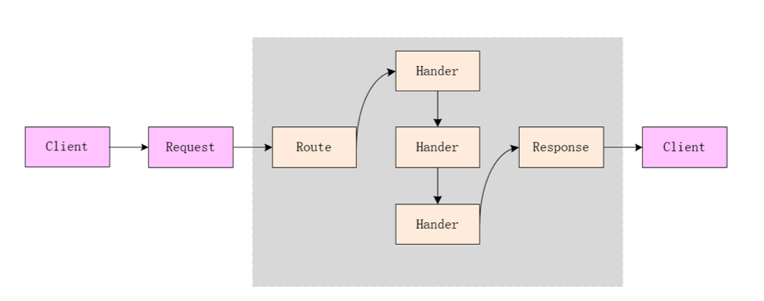

# 简单的使用

对于Golang来说，实现一个简单的`http server`非常容易，只需要短短几行代码。我们直接来看一个简单的例子。<!--more-->

```go
func main() {
    http.HandleFunc("/hello", func(w http.ResponseWriter, r *http.Request) {
        w.Write([]byte("Hello World"))
    })

    if err := http.ListenAndServe(":8000", nil); err != nil {
        fmt.Println("start http server fail:", err)
    }
}

```

然后运行代码，并用curl 请求

```shell
curl   http://0.0.0.0:8000/hello 
Hello World
```


# HTTP 服务

 于HTTP构建的网络应用包括两个端，即客户端(`Client`)和服务端(`Server`)。两个端的交互行为包括从客户端发出`request`、服务端接受`request`进行处理并返回`response`以及客户端处理`response` 其流程大致如下




在`TCP/IP五层模型下`, `HTTP`位于`应用层`, 需要有`传输层`来承载`HTTP`协议. 传输层比较常见的协议是`TCP`,`UDP`, `SCTP`等.在HTTP1.1和HTTP/2都是用TCP来实现HTTP的运输层，HTTP/3 在 UDP 协议上实现了新的传输层协议 QUIC 并使用 QUIC 传输数据，这也意味着 HTTP 既可以跑在 TCP 上，也可以跑在 UDP 上。当然对大多数HTTP服务都是使用基于TCP的HTTP服务，所以这里我们也主要分析的是基于TCP的HTTP服务。


# HTTP 服务端的大体流程

既然HTTP是建立在TCP服务之上的，那么, 不管server代码如何封装, 都离不开`bind`,`listen`,`accept`这些函数,所以我们看代码的时候需要重点关注这些函数的实现。

## 注册路由


```
 http.HandleFunc("/hello", func(w http.ResponseWriter, r *http.Request) {
        w.Write([]byte("Hello World"))
    })
```

当我们直接调用 net/http.HandleFunc 注册处理器时，标准库会使用默认的 HTTP 服务器 net/http.DefaultServeMux处理请求，该方法会直接调用 net/http.ServeMux.HandleFunc：

```go
func HandleFunc(pattern string, handler func(ResponseWriter, *Request)) {
	DefaultServeMux.HandleFunc(pattern, handler)
}
```

而DefaultServeMux 实际上是ServeMux,所以上述方法会将处理器转换成 net/http.Handler 接口类型调用 net/http.ServeMux.Handle注册处理器：

```go

// HandleFunc registers the handler function for the given pattern.
func (mux *ServeMux) HandleFunc(pattern string, handler func(ResponseWriter, *Request)) {
	if handler == nil {
		panic("http: nil handler")
	}
	mux.Handle(pattern, HandlerFunc(handler))
}

// Handle registers the handler for the given pattern.
// If a handler already exists for pattern, Handle panics.
func (mux *ServeMux) Handle(pattern string, handler Handler) {
	mux.mu.Lock()
	defer mux.mu.Unlock()

	if pattern == "" {
		panic("http: invalid pattern")
	}
	if handler == nil {
		panic("http: nil handler")
	}
	if _, exist := mux.m[pattern]; exist {
		panic("http: multiple registrations for " + pattern)
	}

	if mux.m == nil {
		mux.m = make(map[string]muxEntry)
	}
	e := muxEntry{h: handler, pattern: pattern}
	mux.m[pattern] = e
	if pattern[len(pattern)-1] == '/' {
		mux.es = appendSorted(mux.es, e)
	}

	if pattern[0] != '/' {
		mux.hosts = true
	}
}

// The HandlerFunc type is an adapter to allow the use of
// ordinary functions as HTTP handlers. If f is a function
// with the appropriate signature, HandlerFunc(f) is a
// Handler that calls f.
type HandlerFunc func(ResponseWriter, *Request)

// ServeHTTP calls f(w, r).
func (f HandlerFunc) ServeHTTP(w ResponseWriter, r *Request) {
	f(w, r)
}
```

可以看到http原生的路由注册非常的简单，实际上就是一个kv的映射。


## 服务监听及响应

上面路由已经注册到`net/http`了, 下面就该如何建立socket了, 以及最后又如何取到已经注册到的路由, 将正确的响应信息从handler中取出来返回给客户端。我们直接看ListenAndServe这个函数

```go
// ListenAndServe always returns a non-nil error.
func ListenAndServe(addr string, handler Handler) error {
	server := &Server{Addr: addr, Handler: handler}
	return server.ListenAndServe()
}

func (srv *Server) ListenAndServe() error {
	if srv.shuttingDown() {
		return ErrServerClosed
	}
	addr := srv.Addr
	if addr == "" {
		addr = ":http"
	}
	ln, err := net.Listen("tcp", addr) //注意这个函数，这个函数就是用来启动tcp服务的。
	if err != nil {
		return err
	}
	return srv.Serve(ln)
}
```


```go
func (srv *Server) Serve(l net.Listener) error {
	//...上面这些代码先不管

	ctx := context.WithValue(baseCtx, ServerContextKey, srv)
	for {
		rw, err := l.Accept() //注意这个函数，开始等待tcp请求
		if err != nil {
			select {
			case <-srv.getDoneChan():
				return ErrServerClosed
			default:
			}
			if ne, ok := err.(net.Error); ok && ne.Temporary() {
				if tempDelay == 0 {
					tempDelay = 5 * time.Millisecond
				} else {
					tempDelay *= 2
				}
				if max := 1 * time.Second; tempDelay > max {
					tempDelay = max
				}
				srv.logf("http: Accept error: %v; retrying in %v", err, tempDelay)
				time.Sleep(tempDelay)
				continue
			}
			return err
		}
		connCtx := ctx
		if cc := srv.ConnContext; cc != nil {
			connCtx = cc(connCtx, rw)
			if connCtx == nil {
				panic("ConnContext returned nil")
			}
		}
		tempDelay = 0
		c := srv.newConn(rw)
		c.setState(c.rwc, StateNew) // before Serve can return
		go c.serve(connCtx) // 开始处理连接请求
	}
}
```


```go
// Serve a new connection.
func (c *conn) serve(ctx context.Context) {
	// 上面这些先不管。。。。 

	// HTTP/1.x from here on.

	ctx, cancelCtx := context.WithCancel(ctx)
	c.cancelCtx = cancelCtx
	defer cancelCtx()

	c.r = &connReader{conn: c}
	c.bufr = newBufioReader(c.r)
	c.bufw = newBufioWriterSize(checkConnErrorWriter{c}, 4<<10)

	for {
    	w, err := c.readRequest(ctx) //读取request 请求，并将其放置于w即response 中.
		//这些先不管。。。。 
		// HTTP cannot have multiple simultaneous active requests.[*]
		// Until the server replies to this request, it can't read another,
		// so we might as well run the handler in this goroutine.
		// [*] Not strictly true: HTTP pipelining. We could let them all process
		// in parallel even if their responses need to be serialized.
		// But we're not going to implement HTTP pipelining because it
		// was never deployed in the wild and the answer is HTTP/2.
		serverHandler{c.server}.ServeHTTP(w, w.req) //看这个ServeHTTP这个函数，这个就是用来处理请求
		w.cancelCtx()
		if c.hijacked() {
			return
		}
		w.finishRequest()
		//这些先不管。。。。 
		c.rwc.SetReadDeadline(time.Time{})
	}
```


```go
func (sh serverHandler) ServeHTTP(rw ResponseWriter, req *Request) {
	handler := sh.srv.Handler
	if handler == nil {
		handler = DefaultServeMux
	}
	if req.RequestURI == "*" && req.Method == "OPTIONS" {
		handler = globalOptionsHandler{}
	}
	handler.ServeHTTP(rw, req)  //处理请求
}
```

这里的hander就是服务器初始化处理的的hander,在net.http里面默认的hander是ServeMux，所以接下来我们需要看这个

```go
// net/http/server.go:L2352-2362
func (mux *ServeMux) ServeHTTP(w ResponseWriter, r *Request) {
	if r.RequestURI == "*" {
		if r.ProtoAtLeast(1, 1) {
			w.Header().Set("Connection", "close")
		}
		w.WriteHeader(StatusBadRequest)
		return
	}
	h, _ := mux.Handler(r) // <--- 获取处理请求的函数
	h.ServeHTTP(w, r) // 处理请求
}

// net/http/server.go:L1963-1965
func (f HandlerFunc) ServeHTTP(w ResponseWriter, r *Request) {
	f(w, r)//就是他
}


```

golang的net.http重要的一个接口是 net/http.Handler 实现了处理 HTTP 请求的逻辑，处理的过程中会调用 net/http.ResponseWriter 接口的方法构造 HTTP 响应，它提供的三个接口 `Header`、`Write` 和 `WriteHeader` 分别会获取 HTTP 响应、将数据写入负载以及写入响应头。

```go
type Handler interface {
    ServeHTTP(ResponseWriter, *Request)
}

type ResponseWriter interface {
	Header() Header
	Write([]byte) (int, error)
	WriteHeader(statusCode int)
}

// 在默认的net.http 中 实现 ResponseWriter是由 http.response 实现，
```


# 参考

gin源码阅读之一  net/http的大概流程 https://www.haohongfan.com/2019/02/gin

深入理解Golang之http server