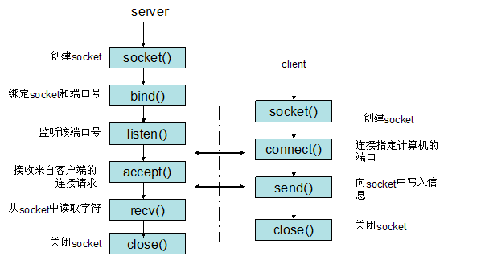

# Socket 通信流程

socket是"打开—读/写—关闭"模式的实现，以使用TCP协议通讯的socket为例，其交互流程大概是这样子的





# 源码分析

## 简单的TCP Server的例子

```go
func main() {
	address := "0.0.0.0:7099"

	// Create a listening socket.
	l, err := net.Listen("tcp", address)
	if err != nil {
		log.Fatal(err)
	}
	defer l.Close()

	for {
		// Accept new connections.
		c, err := l.Accept()
		if err != nil {
			log.Println(err)
			return
		}

		// Process newly accepted connection.
		go handleConnection(c)
	}
}


func handleConnection(c net.Conn) {
	fmt.Printf("Serving %s\n", c.RemoteAddr().String())

	for {
		// Read what has been sent from the client.
		netData, err := ioutil.ReadAll(c)
		if err != nil {
			log.Println(err)
			return
		}

		if len(netData) == 0 {
			break
		}else{
			log.Println(len(netData))
			log.Printf("%s\n",string(netData))
		}
	}
	c.Close()
}
```

## Listen 

我们直接来看Listen 

```go

func Listen(network, address string) (Listener, error) {
	var lc ListenConfig
	return lc.Listen(context.Background(), network, address)
}

/ Listen announces on the local network address.
//
// See func Listen for a description of the network and address
// parameters.
func (lc *ListenConfig) Listen(ctx context.Context, network, address string) (Listener, error) {
	//解析地址
  addrs, err := DefaultResolver.resolveAddrList(ctx, "listen", network, address, nil)
	if err != nil {
		return nil, &OpError{Op: "listen", Net: network, Source: nil, Addr: nil, Err: err}
	}
	sl := &sysListener{
		ListenConfig: *lc,
		network:      network,
		address:      address,
	}
	var l Listener
	la := addrs.first(isIPv4)
	switch la := la.(type) {
	case *TCPAddr:
		l, err = sl.listenTCP(ctx, la)
	.....
	return l, nil
}

func (sl *sysListener) listenTCP(ctx context.Context, laddr *TCPAddr) (*TCPListener, error) {
	//创建socket 
  fd, err := internetSocket(ctx, sl.network, laddr, nil, syscall.SOCK_STREAM, 0, "listen", sl.ListenConfig.Control)
	if err != nil {
		return nil, err
	}
	return &TCPListener{fd: fd, lc: sl.ListenConfig}, nil
}

func internetSocket(ctx context.Context, net string, laddr, raddr sockaddr, sotype, proto int, mode string, ctrlFn func(string, string, syscall.RawConn) error) (fd *netFD, err error) {
	if (runtime.GOOS == "aix" || runtime.GOOS == "windows" || runtime.GOOS == "openbsd") && mode == "dial" && raddr.isWildcard() {
		raddr = raddr.toLocal(net)
	}
	family, ipv6only := favoriteAddrFamily(net, laddr, raddr, mode)
	return socket(ctx, net, family, sotype, proto, ipv6only, laddr, raddr, ctrlFn)
}

  
  
```

通过上面的一通调用，最终目的进行创建一个tcp 的socket 


```go
/ socket returns a network file descriptor that is ready for
// asynchronous I/O using the network poller.
func socket(ctx context.Context, net string, family, sotype, proto int, ipv6only bool, laddr, raddr sockaddr, ctrlFn func(string, string, syscall.RawConn) error) (fd *netFD, err error) {
 // 创建底层socket，设置属性为O_NONBLOCK
	s, err := sysSocket(family, sotype, proto)
	if err != nil {
		return nil, err
	}
  //设置socket 的默认属性
	if err = setDefaultSockopts(s, family, sotype, ipv6only); err != nil {
		poll.CloseFunc(s)
		return nil, err
	}
	 // 创建新netFD结构
	if fd, err = newFD(s, family, sotype, net); err != nil {
		poll.CloseFunc(s)
		return nil, err
	}

	// This function makes a network file descriptor for the
	// following applications:
	//
	// - An endpoint holder that opens a passive stream
	//   connection, known as a stream listener
	//
	// - An endpoint holder that opens a destination-unspecific
	//   datagram connection, known as a datagram listener
	//
	// - An endpoint holder that opens an active stream or a
	//   destination-specific datagram connection, known as a
	//   dialer
	//
	// - An endpoint holder that opens the other connection, such
	//   as talking to the protocol stack inside the kernel
	//
	// For stream and datagram listeners, they will only require
	// named sockets, so we can assume that it's just a request
	// from stream or datagram listeners when laddr is not nil but
	// raddr is nil. Otherwise we assume it's just for dialers or
	// the other connection holders.

	if laddr != nil && raddr == nil {
		switch sotype {
		case syscall.SOCK_STREAM, syscall.SOCK_SEQPACKET:
      //调用底层的listen 来监听创建的socket 
			if err := fd.listenStream(laddr, listenerBacklog(), ctrlFn); err != nil {
				fd.Close()
				return nil, err
			}
			return fd, nil
		case syscall.SOCK_DGRAM:
			if err := fd.listenDatagram(laddr, ctrlFn); err != nil {
				fd.Close()
				return nil, err
			}
			return fd, nil
		}
	}
	if err := fd.dial(ctx, laddr, raddr, ctrlFn); err != nil {
		fd.Close()
		return nil, err
	}
	return fd, nil
}

func (fd *netFD) listenStream(laddr sockaddr, backlog int, ctrlFn func(string, string, syscall.RawConn) error) error {
	var err error
	if err = setDefaultListenerSockopts(fd.pfd.Sysfd); err != nil {
		return err
	}
	var lsa syscall.Sockaddr
	if lsa, err = laddr.sockaddr(fd.family); err != nil {
		return err
	}
	if ctrlFn != nil {
		c, err := newRawConn(fd)
		if err != nil {
			return err
		}
		if err := ctrlFn(fd.ctrlNetwork(), laddr.String(), c); err != nil {
			return err
		}
	}
   // Bind绑定至该socket
	if err = syscall.Bind(fd.pfd.Sysfd, lsa); err != nil {
		return os.NewSyscallError("bind", err)
	}
   
  //监听该socket
	if err = listenFunc(fd.pfd.Sysfd, backlog); err != nil {
		return os.NewSyscallError("listen", err)
	}
   
  //初始化fd，也就是把socket放入epoll中，进入
	if err = fd.init(); err != nil {
		return err
	}
	lsa, _ = syscall.Getsockname(fd.pfd.Sysfd)
	fd.setAddr(fd.addrFunc()(lsa), nil)
	return nil
}

```


listenStream 函数创建了一个监听端口的tcp连接的socket接口，也就是创建了socket fd，接下来为了监听该socket对象就需要把这个socket fd加入到eventpoll中了。查看runtime_pollServerInit，是对epoll_create的封装。

```go
//最终跳转到该处，主要关注两个函数runtime_pollServerInit，runtime_pollOpen，
//这两个函数都是runtime实现的，将epoll交由runtime来管理
func (pd *pollDesc) init(fd *FD) error {
  //sync.once方法，调用epoll_create创建eventpoll对象
  serverInit.Do(runtime_pollServerInit)
  //将当前的fd加到epoll中，底层调用epollctl函数
  ctx, errno := runtime_pollOpen(uintptr(fd.Sysfd))
  //如果出错，处理相应的fd，删除epoll中fd以及解除状态等操作
  if errno != 0 {
    if ctx != 0 {
      runtime_pollUnblock(ctx)
      runtime_pollClose(ctx)
    }
    return errnoErr(syscall.Errno(errno))
  }
  pd.runtimeCtx = ctx
  return nil
}

//go:linkname poll_runtime_pollServerInit internal/poll.runtime_pollServerInit
func poll_runtime_pollServerInit() {
	netpollGenericInit()
}

//go:linkname poll_runtime_pollOpen internal/poll.runtime_pollOpen
func poll_runtime_pollOpen(fd uintptr) (*pollDesc, int) {
	pd := pollcache.alloc()
	lock(&pd.lock)
	if pd.wg != 0 && pd.wg != pdReady {
		throw("runtime: blocked write on free polldesc")
	}
	if pd.rg != 0 && pd.rg != pdReady {
		throw("runtime: blocked read on free polldesc")
	}
	pd.fd = fd
	pd.closing = false
	pd.everr = false
	pd.rseq++
	pd.rg = 0
	pd.rd = 0
	pd.wseq++
	pd.wg = 0
	pd.wd = 0
	unlock(&pd.lock)

	var errno int32
	errno = netpollopen(fd, pd)
	return pd, int(errno)
}

func netpollopen(fd uintptr, pd *pollDesc) int32 {
	var ev epollevent
	ev.events = _EPOLLIN | _EPOLLOUT | _EPOLLRDHUP | _EPOLLET
	*(**pollDesc)(unsafe.Pointer(&ev.data)) = pd
	return -epollctl(epfd, _EPOLL_CTL_ADD, int32(fd), &ev)
}
```


这里的poll实际上是对底层的I/O多路复用的封装，不同的操作系统各有不同，典型的linux是使用epoll 

```go
//src/runtime/netpoll_epoll.go 
func epollcreate(size int32) int32
func epollcreate1(flags int32) int32

//go:noescape
func epollctl(epfd, op, fd int32, ev *epollevent) int32

//go:noescape
func epollwait(epfd int32, ev *epollevent, nev, timeout int32) int32
func closeonexec(fd int
```


# Accept 


# 参考

  简单理解Socket https://www.cnblogs.com/dolphinx/p/3460545.html

 百万 Go TCP 连接的思考: epoll方式减少资源占用  https://colobu.com/2019/02/23/1m-go-tcp-connection/