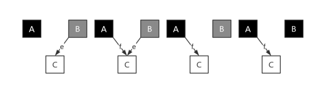
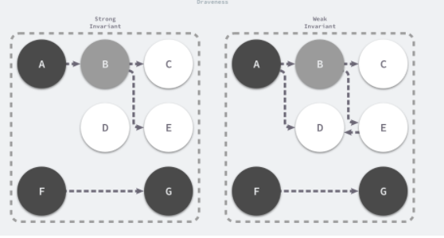
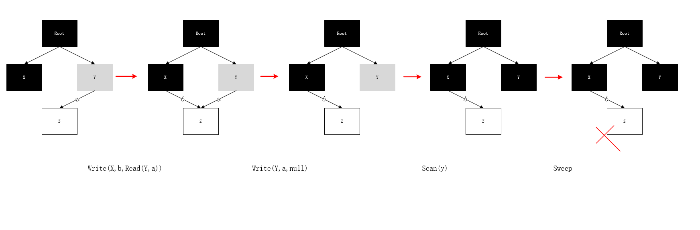
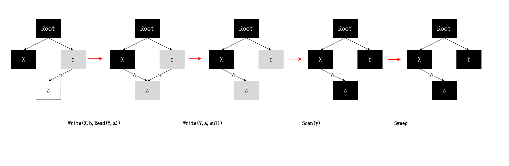
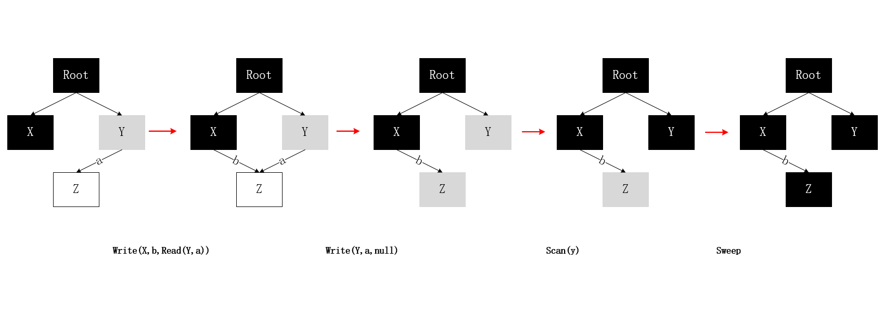
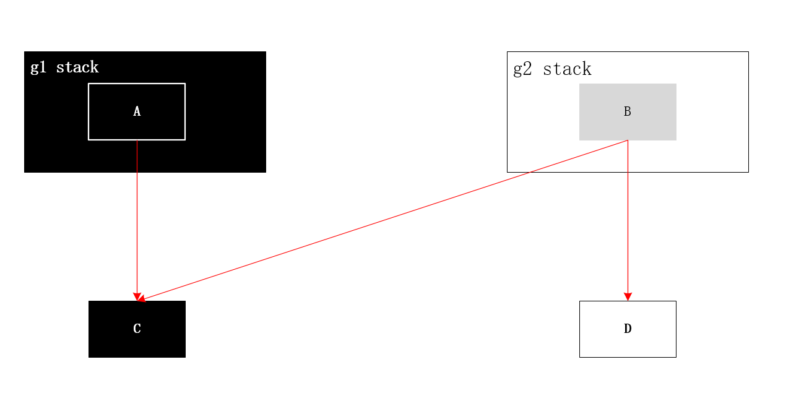
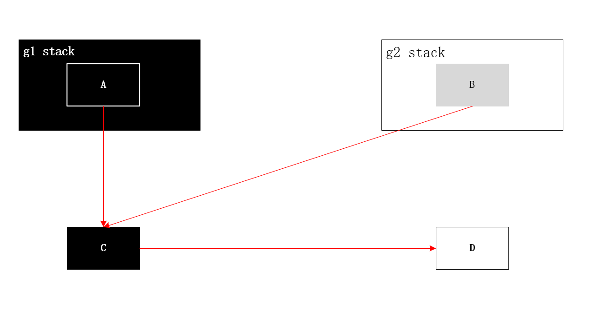

# 什么是GC

当程序向操作系统申请的内存不再需要时，垃圾回收主动将其回收并供其他代码进行内存申请时候复用，或者将其归还给操作系统，这种针对内存级别资源的自动回收过程，即为垃圾回收。而负责垃圾回收的程序组件，即为垃圾回收器。


通常，垃圾回收器的执行过程被划分为两个半独立的组件：

- 赋值器（Mutator）：这一名称本质上是在指代用户态的代码。因为对垃圾回收器而言，用户态的代码仅仅只是在修改对象之间的引用关系，也就是在对象图（对象之间引用关系的一个有向图）上进行操作。
- 回收器（Collector）：负责执行垃圾回收的代码。


# 根对象是什么

根对象在垃圾回收的术语中又叫做根集合，它是垃圾回收器在标记过程时最先检查的对象，包括：

1. 全局变量：程序在编译期就能确定的那些存在于程序整个生命周期的变量。
2. 执行栈：每个 goroutine 都包含自己的执行栈，这些执行栈上包含栈上的变量及指向分配的堆内存区块的指针。
3. 寄存器：寄存器的值可能表示一个指针，参与计算的这些指针可能指向某些赋值器分配的堆内存区块。


# 标记清除

标记清除（Mark-Sweep）算法是最常见的垃圾收集算法，。内存单元并不会在变成垃圾立刻回收，而是保持不可达状态，直到到达某个阈值或者固定时间长度。这个时候系统会挂起用户程序，也就是 STW，转而执行垃圾回收程序。垃圾回收程序对所有的存活单元进行一次全局遍历确定哪些单元可以回收。算法分两个部分：标记（mark）和清扫（sweep）。

1. 标记阶段 从根对象出发查找并标记堆中所有存活的对象；
2. 清除阶段 **遍历堆中的全部对象，回收未被标记的垃圾对象并将回收的内存加入空闲链表；**


标记阶段表明所有的存活单元，清扫阶段将垃圾单元回收。可视化可以


**标记-清扫算法的优点也就是基于追踪的垃圾回收算法具有的优点：避免了引用计数算法的缺点（不能处理循环引用，需要维护指针）。缺点也很明显，需要 STW。**


# 三色标记算法

采用原始的标记清除算法带来的长时间 STW，多数现代的追踪式垃圾收集器都会实现三色标记算法的变种以缩短 STW 的时间。三色标记算法将程序中的对象分成白色、黑色和灰色三类。

- 白色对象 — 尚未访问过,潜在的垃圾，其内存可能会被垃圾收集器回收；
- 黑色对象 — 本对象已访问过，而且本对象引用到的其他对象也全部访问过了。
- 灰色对象 — 本对象已访问过，但是本对象引用到的其他对象尚未全部访问完。全部访问后，会转换为黑色。


假设现在有白、灰、黑三个集合（表示当前对象的颜色），其遍历访问过程为：

1. 初始时，所有对象都在【白色集合】中；
2. 将 GC Roots 直接引用到的对象挪到 【灰色集合】中；
3. 从灰色集合中获取对象：
   3.1. 将本对象引用到的其他对象全部挪到 【灰色集合】中；
   3.2. 将本对象挪到【黑色集合】里面。
4. 重复步骤3，直至【灰色集合】为空时结束。
5. 结束后，仍在【白色集合】的对象即为 GC Roots 不可达，可以进行回收。


**标记过程需的要STW，因为对象引用关系如果在标记阶段做了修改，会影响标记结果的正确性。例如下图，灰色对象B中包含指向白色对象C的指针e，对象C尚未被扫描，此时，如有其他程序，将e指针从B对象中删除，并将指向对象C的新指针f插入到黑色对象A中，由于对象A早已完成扫描，对象C就会一直保持白色状态直到被回收。本来不应该被回收的对象却被回收了，这在内存管理中是非常严重的错误，我们将这种错误称为悬挂指针，即指针没有指向特定类型的合法对象，影响了内存的安全性**




为了防止这种现象的发生，最简单的方式就是STW，直接禁止掉其他用户程序对对象引用关系的干扰，但是STW的过程有明显的资源浪费，对所有的用户程序都有很大影响，如何能在保证对象不丢失的情况下合理的尽可能的提高GC效率，减少STW时间呢？


**在Golang中使用并发的垃圾回收，也就是多个赋值器与回收器并发执行，与此同时，应用屏障技术来保证回收器的正确性。其原理主要就是破坏上述两个条件之一。**


# 屏障技术

## 什么是屏障技术

1. 内存屏障只是对应一段特殊的代码
2. 内存屏障这段代码在**编译期间**生成
3. 内存屏障本质上在**运行期间**拦截内存写操作，相当于一个 hook 调用


想要在并发或者增量的标记算法中保证正确性，我们需要达成以下两种三色不变性（Tri-color invariant）中的一种：

- 强三色不变性 — 黑色对象不会指向白色对象，只会指向灰色对象或者黑色对象；
- 弱三色不变性 — 黑色对象指向的白色对象必须包含一条从灰色对象经由多个白色对象的可达路径




# 插入写屏障

## 伪代码

```go
Write(src, i, val):
    src[i] <- val
```

我们的插入写屏障就是在这段赋值代码中，添加一段 hook 代码，这段 hook 代码就是所谓的屏障代码，由编译器在编译期生成。写屏障的实现有多种，golang 使用的是 Dijkstra 算法实现：

```go
atomic Write(src, i, ref)
    src[i] <- ref
    if isBlack(src)
        shade(ref)
```


这段伪代码我们非常容易看懂，就是加了后面的一个判读逻辑，如果 src 已经是黑色的，那么就把指向的新对象置灰色

## 对象丢失的必要条件

- 条件1:赋值器把白色对象的引用写入给黑色对象了（换句话说，黑色对象指向白色对象了）
- 条件2:从灰色对象出发，最终到达该白色对象的所有路径都被赋值器破坏（换句话说，这个已经被黑色指向的白色对象，还没有在灰色对象的保护下）




1. 赋值器操作一：X -> Z
2. 赋值器操作二：Y -> null
3. 回收器操作一：Scan Y
4. 回收器操作二：回收 Z （这就有问题了）


## 写屏障是怎么解决的




插入写屏障就是这么简单。只要你保证时时刻刻没有黑色对象指向白色对象的条件出现，那么回收的正确性就能保证。

### 插入写屏障的总结

1. 如果是纯粹的插入写屏障是满足强三色不变式的（永远不会出现黑色对象指向白色对象）；
2. 但是由于栈上对象无写屏障（不 hook），那么导致黑色的栈可能指向白色的堆对象，所以必须假定赋值器（mutator）是灰色赋值器，扫描结束之后，必须 STW 重新扫描栈才能确保不丢对象；
3. STW 重新扫描栈再 goroutine 量大且活跃的场景，延迟不可控，经验值平均 10-100ms；


# 删除写屏障

**删除写屏障**：也叫做基于其实快照的解决方案（snapshot-at-the-begining）。故名思义，就是在开始 gc 之前，必须 STW ，对整个根做一次起始快照。当赋值器（业务线程）从灰色或者白色对象中删除白色脂针时候，写屏障会捕捉这一行为，将这一行为通知给回收器。 这样，基于起始快照的解决方案保守地将其目标对象当作存活的对象，这样就绝对不会有被误回收的对象，并且还有工作量浮动放大的风险。术语叫做追踪波面的回退。


```
atomic Write(src, i, ref)
shade(src[i])
src[i] <- ref
```

上述代码会在老对象的引用被删除时，将白色的老对象涂成灰色，这样删除写屏障就可以保证弱三色不变性，老对象引用的下游对象一定可以被灰色对象引用。



## 删除写屏障总结

1. 除写屏障也叫基于快照的写屏障方案，必须在起始时，STW 扫描整个栈（注意了，是所有的 goroutine 栈），保证**所有堆上在用的对象**都处于灰色保护下，保证的是弱三色不变式；
2. 由于起始快照的原因，起始也是执行 STW，删除写屏障不适用于栈特别大的场景，栈越大，STW 扫描时间越长，对于现代服务器上的程序来说，栈地址空间都很大，所以删除写屏障都不适用，一般适用于很小的栈内存，比如嵌入式，物联网的一些程序；
3. 并且删除写屏障会导致扫描进度（波面）的后退，所以扫描精度不如插入写屏障；

### 思考问题

我不整机暂停 STW 栈，而是一个栈一个栈的快照，这样也没有 STW 了，是否可以满足要求？（这个就是当前 golang 混合写屏障的时候做的哈，虽然没有 STW 了，但是扫描到某一个具体的栈的时候，还是要暂停这一个 goroutine 的）

不行，纯粹的删除写屏障，起始必须整个栈打快照，要把所有的堆对象都处于灰色保护中才行。

**举例**：如果没有把栈完全扫黑，那么可能出现丢数据，如下：

**初始状态**：

1. A 是 g1 栈的一个对象，g1栈已经扫描完了，并且 C 也是扫黑了的对象；
2. B 是 g2 栈的对象，指向了 C 和 D，g2 完全还没扫描，B 是一个灰色对象，D 是白色对象；




**步骤一**：g2 进行赋值变更，把 C 指向 D 对象，这个时候黑色的 C 就指向了白色的 D（由于是删除屏障，这里是不会触发hook的）

**步骤二**：把 B 指向 C 的引用删除，由于是栈对象操作，不会触发删除写屏障；



**步骤三**：清理，因为 C 已经是黑色对象了，所以不会再扫描，所以 D 就会被错误的清理掉。

**解决办法有如下**：

- 栈上对象也 hook，所有对象赋值（插入，删除）都 hook（这个就不实际了）;

  所有的插入，删除如果都 hook ，那么一定都不会有问题，虽然本轮精度很差，但是下轮回收可以回收了。但是还是那句话，栈，寄存器的赋值 hook 是不现实的。

- 起始快照整栈跨找，扫黑，使得整个堆上的在用对象都处于灰色保护；这种方法上面已经表述了不太可行。

  整栈扫黑，那么在用的堆上的对象是一定处于灰色堆对象的保护下的，之后配合堆对象删除写屏障就能保证在用对象不丢失。

- 加入插入写屏障的逻辑，C 指向 D 的时候，把 D 置灰，这样扫描也没问题。这样就能去掉起始 STW 扫描，从而可以并发，一个一个栈扫描。


**细品下，这不就成了当前在用的混合写屏障了，所以我觉得正确的理解方式应该是：混合写屏障 = 删除写屏障 + 插入写屏障，必须先理解下删除写屏障，你才能理解混合写屏障。**


# 混合写屏障

golang 1.5 之后已经实现了插入写屏障，但是由于栈对象赋值无法 hook 的原因，导致扫描完之后还有一次 STW 重新扫描栈的整机停顿，混合写屏障就是解决这个问题的。

论文里的伪代码：

```go
writePointer(slot, ptr):
    shade(*slot)
    if current stack is grey:
        shade(ptr)
    *slot = ptr
```


## 总结

- 混合写屏障继承了插入写屏障的优点，起始无需 STW 打快照，直接并发扫描垃圾即可；
- 混合写屏障继承了删除写屏障的优点，赋值器是黑色赋值器，扫描过一次就不需要扫描了，这样就消除了插入写屏障时期最后 STW 的重新扫描栈；
- 混合写屏障扫描精度继承了删除写屏障，比插入写屏障更低，随着带来的是 GC 过程全程无 STW；
- 混合写屏障扫描栈虽然没有 STW，但是扫描某一个具体的栈的时候，还是要停止这个 goroutine 赋值器的工作的哈（针对一个 goroutine 栈来说，是暂停扫的，要么全灰，要么全黑哈，原子状态切换）；


# Golang GC 实现

Go 语言的垃圾收集可以分成清除终止、标记、标记终止和清除四个不同阶段，它们分别完成了不同的工作

| 状态                                | 赋值其转态 |
| ----------------------------------- | ---------- |
| SweepTermination (清理终止阶段)     | STW        |
| Mark & Sweep Termination (标记阶段) | 并发       |
| Mark Termination  (标记终止阶段)    | STW        |
| Off(Sweep) 清理阶段；               | 并发       |

1. 清理终止阶段

   1. STW,所有的处理器在这时会进入安全点（Safe point）；

   2. 如果当前垃圾收集循环是强制触发的，我们还需要处理还未被清理的内存管理单元；

2. 标记阶段

   1. 将状态切换至 `_GCmark`、开启写屏障、用户程序协助（Mutator Assiste）并将根对象入队；
   2. 恢复执行程序，标记进程和用于协助的用户程序会开始并发标记内存中的对象，写屏障会将被覆盖的指针和新指针都标记成灰色，而所有新创建的对象都会被直接标记成黑色；
   3. 开始扫描根对象，包括所有 Goroutine 的栈、全局对象以及不在堆中的运行时数据结构，扫描 Goroutine 栈期间会暂停当前处理器；
   4. 依次处理灰色队列中的对象，将对象标记成黑色并将它们指向的对象标记成灰色；
   5. 使用分布式的终止算法检查剩余的工作，发现标记阶段完成后进入标记终止阶段；

3. 标记终止阶段；

   1. **暂停程序**、将状态切换至 `_GCmarktermination` 并关闭辅助标记的用户程序；
   2. 清理处理器上的线程缓存；

4. 清理阶段；

   1. 将状态切换至 `_GCoff` 开始清理阶段，初始化清理状态并关闭写屏障；
   2. 恢复用户程序，所有新创建的对象会标记成白色；
   3. 后台并发清理所有的内存管理单元，当 Goroutine 申请新的内存管理单元时就会触发清理；

运行时虽然只会使用 `_GCoff`、`_GCmark` 和 `_GCmarktermination` 三个状态表示垃圾收集的全部阶段，但是在实现上却复杂很多，本节将按照垃圾收集的不同阶段详细分析其实现原理。


## 触发时机


运行时会通过如下所示的 runtime.gcTrigger.test 方法决定是否需要触发垃圾收集，当满足触发垃圾收集的基本条件时 — 允许垃圾收集、程序没有崩溃并且没有处于垃圾收集循环，该方法会根据三种不同方式触发进行不同的检查：

```go
type gcTriggerKind int

const (
	// gcTriggerHeap indicates that a cycle should be started when
	// the heap size reaches the trigger heap size computed by the
	// controller.
	gcTriggerHeap gcTriggerKind = iota

	// gcTriggerTime indicates that a cycle should be started when
	// it's been more than forcegcperiod nanoseconds since the
	// previous GC cycle.
	gcTriggerTime

	// gcTriggerCycle indicates that a cycle should be started if
	// we have not yet started cycle number gcTrigger.n (relative
	// to work.cycles).
	gcTriggerCycle
)

// test reports whether the trigger condition is satisfied, meaning
// that the exit condition for the _GCoff phase has been met. The exit
// condition should be tested when allocating.
func (t gcTrigger) test() bool {
	if !memstats.enablegc || panicking != 0 || gcphase != _GCoff {
		return false
	}
	switch t.kind {
	case gcTriggerHeap:
		// Non-atomic access to heap_live for performance. If
		// we are going to trigger on this, this thread just
		// atomically wrote heap_live anyway and we'll see our
		// own write.
		return memstats.heap_live >= memstats.gc_trigger
	case gcTriggerTime:
		if gcpercent < 0 {
			return false
		}
		lastgc := int64(atomic.Load64(&memstats.last_gc_nanotime))
		return lastgc != 0 && t.now-lastgc > forcegcperiod
	case gcTriggerCycle:
		// t.n > work.cycles, but accounting for wraparound.
		return int32(t.n-work.cycles) > 0
	}
	return true

}
```

1.  gcTriggerHeap — 堆内存的分配达到达控制器计算的触发堆大小；
2. gcTriggerTime — 如果一定时间内没有触发，就会触发新的循环，该出发条件由 runtime.forcegcperiod 变量控制，默认为 2 分钟；
3. gcTriggerCycle — 如果当前没有开启垃圾收集，则触发新的循环；


用户开启垃圾收集的方法runtime.gcStart会接收一个runtime.gcTrigger类型的参数，所有出现 runtime.gcTrigger结构体的位置都是触发垃圾收集的代码：

- runtime.sysmon 和 runtime.forcegchelper — 后台运行定时检查和垃圾收集(gcTriggerTime )；
- Runtime.GC  用户程序手动触发垃圾收集 gcTriggerCycle 
- runtime.mallocgc  申请内存时根据堆大小触发垃圾收集 gcTriggerHeap 


### 后台触发

运行时会在应用程序启动时在后台开启一个用于强制触发垃圾收集的 Goroutine，该 Goroutine 的职责非常简单 — 调用 [`runtime.gcStart`](https://draveness.me/golang/tree/runtime.gcStart) 尝试启动新一轮的垃圾收集：

```go
// start forcegc helper goroutine
func init() {
	go forcegchelper()
}

func forcegchelper() {
	forcegc.g = getg()
	lockInit(&forcegc.lock, lockRankForcegc)
	for {
		lock(&forcegc.lock)
		if forcegc.idle != 0 {
			throw("forcegc: phase error")
		}
		atomic.Store(&forcegc.idle, 1)
		goparkunlock(&forcegc.lock, waitReasonForceGCIdle, traceEvGoBlock, 1)
		// this goroutine is explicitly resumed by sysmon
		if debug.gctrace > 0 {
			println("GC forced")
		}
		// Time-triggered, fully concurrent.
		gcStart(gcTrigger{kind: gcTriggerTime, now: nanotime()})
	}
}
```

为了减少对计算资源的占用，该 Goroutine 会在循环中调用 runtime.goparkunlock 主动陷入休眠等待其他 Goroutine 的唤醒，runtime.forcegchelper`]在大多数时间都是陷入休眠的，但是它会被系统监控器 runtime.sysmon在满足垃圾收集条件时唤醒：

```go
func sysmon() {
	...
	for {
		...
		if t := (gcTrigger{kind: gcTriggerTime, now: now}); t.test() && atomic.Load(&forcegc.idle) != 0 {
			lock(&forcegc.lock)
			forcegc.idle = 0
			var list gList
			list.push(forcegc.g)
			injectglist(&list)
			unlock(&forcegc.lock)
		}
	}
}


```

系统监控在每个循环中都会主动构建一个 runtime.gcTrigger并检查垃圾收集的触发条件是否满足，如果满足条件，系统监控会将 runtime.forcegc状态中持有的 Goroutine 加入全局队列等待调度器的调度。


###  手动触发

```go
// GC runs a garbage collection and blocks the caller until the
// garbage collection is complete. It may also block the entire
// program.
func GC() {
	// We consider a cycle to be: sweep termination, mark, mark
	// termination, and sweep. This function shouldn't return
	// until a full cycle has been completed, from beginning to
	// end. Hence, we always want to finish up the current cycle
	// and start a new one. That means:
	//
	// 1. In sweep termination, mark, or mark termination of cycle
	// N, wait until mark termination N completes and transitions
	// to sweep N.
	//
	// 2. In sweep N, help with sweep N.
	//
	// At this point we can begin a full cycle N+1.
	//
	// 3. Trigger cycle N+1 by starting sweep termination N+1.
	//
	// 4. Wait for mark termination N+1 to complete.
	//
	// 5. Help with sweep N+1 until it's done.
	//
	// This all has to be written to deal with the fact that the
	// GC may move ahead on its own. For example, when we block
	// until mark termination N, we may wake up in cycle N+2.

	// Wait until the current sweep termination, mark, and mark
	// termination complete.
	n := atomic.Load(&work.cycles)
	gcWaitOnMark(n)

	// We're now in sweep N or later. Trigger GC cycle N+1, which
	// will first finish sweep N if necessary and then enter sweep
	// termination N+1.
	gcStart(gcTrigger{kind: gcTriggerCycle, n: n + 1})

	// Wait for mark termination N+1 to complete.
	gcWaitOnMark(n + 1)

	// Finish sweep N+1 before returning. We do this both to
	// complete the cycle and because runtime.GC() is often used
	// as part of tests and benchmarks to get the system into a
	// relatively stable and isolated state.
	for atomic.Load(&work.cycles) == n+1 && sweepone() != ^uintptr(0) {
		sweep.nbgsweep++
		Gosched()
	}

	// Callers may assume that the heap profile reflects the
	// just-completed cycle when this returns (historically this
	// happened because this was a STW GC), but right now the
	// profile still reflects mark termination N, not N+1.
	//
	// As soon as all of the sweep frees from cycle N+1 are done,
	// we can go ahead and publish the heap profile.
	//
	// First, wait for sweeping to finish. (We know there are no
	// more spans on the sweep queue, but we may be concurrently
	// sweeping spans, so we have to wait.)
	for atomic.Load(&work.cycles) == n+1 && atomic.Load(&mheap_.sweepers) != 0 {
		Gosched()
	}

	// Now we're really done with sweeping, so we can publish the
	// stable heap profile. Only do this if we haven't already hit
	// another mark termination.
	mp := acquirem()
	cycle := atomic.Load(&work.cycles)
	if cycle == n+1 || (gcphase == _GCmark && cycle == n+2) {
		mProf_PostSweep()
	}
	releasem(mp)
}

```

1. 在正式开始垃圾收集前，运行时需要通过 runtime.gcWaitOnMark 等待上一个循环的标记终止、标记和清除终止阶段完成；
2. 调用runtime.gcStart 触发新一轮的垃圾收集并通过 runtime.gcWaitOnMark等待该轮垃圾收集的标记终止阶段正常结束；
3. 持续调用  runtime.sweepone  清理全部待处理的内存管理单元并等待所有的清理工作完成，等待期间会调用 runtime.Gosched  让出处理器；
4. 完成本轮垃圾收集的清理工作后，通过 runtime.mProf_PostSweep 将该阶段的堆内存状态快照发布出来，我们可以获取这时的内存状态；


### 申请内存

最后一个可能会触发垃圾收集的就是 runtime.mallocgc了，我们在上一节内存分配器中曾经介绍过运行时会将堆上的对象按大小分成微对象、小对象和大对象三类，这三类对象的创建都可能会触发新的垃圾收集循环：

```go
func mallocgc(size uintptr, typ *_type, needzero bool) unsafe.Pointer {
	shouldhelpgc := false
	...
	if size <= maxSmallSize {
		if noscan && size < maxTinySize {
			...
			v := nextFreeFast(span)
			if v == 0 {
				v, _, shouldhelpgc = c.nextFree(tinySpanClass)
			}
			...
		} else {
			...
			v := nextFreeFast(span)
			if v == 0 {
				v, span, shouldhelpgc = c.nextFree(spc)
			}
		  ...
		}
	} else {
		shouldhelpgc = true
		...
	}
	...
	if shouldhelpgc {
		if t := (gcTrigger{kind: gcTriggerHeap}); t.test() {
			gcStart(t)
		}
	}

	return x
}
Go

```


1. 前线程的内存管理单元中不存在空闲空间时，创建微对象和小对象需要调用 runtime.mcache.nextFreehe.nextFree 从中心缓存或者页堆中获取新的管理单元，在这时就可能触发垃圾收集；
2. 当用户程序申请分配 32KB 以上的大对象时，一定会构建 runtime.gcTrigger 结构体尝试触发垃圾收集；

## gcStart 

golang 通过runtime.gcStart来启动垃圾回收机制，它的主要职责是修改全局的垃圾收集状态到 `_GCmark` 并做一些准备工作。其实现包括以下几部分

1. 两次调用 runtime.gcTrigger.test检查是否满足垃圾收集条件；
2. 暂停程序、在后台启动用于处理标记任务的工作 Goroutine、确定所有内存管理单元都被清理以及其他标记阶段开始前的准备工作；
3. 进入标记阶段、准备后台的标记工作、根对象的标记工作以及微对象、恢复用户程序，进入并发扫描和标记阶段；


```go
// gcStart starts the GC. It transitions from _GCoff to _GCmark (if
// debug.gcstoptheworld == 0) or performs all of GC (if
// debug.gcstoptheworld != 0).
//
// This may return without performing this transition in some cases,
// such as when called on a system stack or with locks held.
func gcStart(trigger gcTrigger) {
	// Since this is called from malloc and malloc is called in
	// the guts of a number of libraries that might be holding
	// locks, don't attempt to start GC in non-preemptible or
	// potentially unstable situations.
  // 获取当前m  
	mp := acquirem()
	if gp := getg(); gp == mp.g0 || mp.locks > 1 || mp.preemptoff != "" {
		releasem(mp)
		return
	}
	releasem(mp)
	mp = nil
	// Pick up the remaining unswept/not being swept spans concurrently
	//
	// This shouldn't happen if we're being invoked in background
	// mode since proportional sweep should have just finished
	// sweeping everything, but rounding errors, etc, may leave a
	// few spans unswept. In forced mode, this is necessary since
	// GC can be forced at any point in the sweeping cycle.
	//
	// We check the transition condition continuously here in case
	// this G gets delayed in to the next GC cycle.
  //验证垃圾收集条件的同时，该方法还会在循环中不断调用 runtime.sweepone 清理已经被标记的内存单元，完成上一个垃圾收集循环的收尾工作：
	for trigger.test() && sweepone() != ^uintptr(0) {
		sweep.nbgsweep++
	}

	// Perform GC initialization and the sweep termination
	// transition.
	semacquire(&work.startSema)
	// Re-check transition condition under transition lock.
	if !trigger.test() {
		semrelease(&work.startSema)
		return
	}
  .....
}
```


验证垃圾收集条件的同时，该方法还会在循环中不断调用 runtime.sweepone 清理已经被标记的内存单元，完成上一个垃圾收集循环的收尾工作：


```go
func gcStart(trigger gcTrigger) {
	...
	semacquire(&worldsema)
	gcBgMarkStartWorkers()
	work.stwprocs, work.maxprocs = gomaxprocs, gomaxprocs
	...

	systemstack(stopTheWorldWithSema)
	systemstack(func() {
		finishsweep_m()
	})

	work.cycles++
	gcController.startCycle()
	...
}
```


 


# 参考 

Golang 垃圾回收剖析 http://legendtkl.com/2017/04/28/golang-gc/

7.2 垃圾收集器  https://draveness.me/golang/docs/part3-runtime/ch07-memory/golang-garbage-collector/#%E6%A0%87%E8%AE%B0%E6%B8%85%E9%99%A4

JVM系列十六（三色标记法与读写屏障）https://www.cnblogs.com/jmcui/p/14165601.html)

Golang垃圾回收 屏障技术 https://zhuanlan.zhihu.com/p/74853110

为什么 Go 在 GC 时 STW 的时间很短？ https://www.zhihu.com/question/326191221

golang 垃圾回收（二）屏障技术 https://mp.weixin.qq.com/s?__biz=MzAxMTA4Njc0OQ==&mid=2651440873&idx=3&sn=bad0723879e38d593aad1e5e88fb76c4&chksm=80bb181bb7cc910d1eefe9ff751780dcc72ff2cc0509ac14acc8f63d618bc31a4c5283f7b284&scene=21#wechat_redirect

[golang 垃圾回收（五）混合写屏障](https://liqingqiya.github.io/golang/gc/垃圾回收/写屏障/2020/07/24/gc5.html)

GC https://qcrao91.gitbook.io/go/gc/gc


