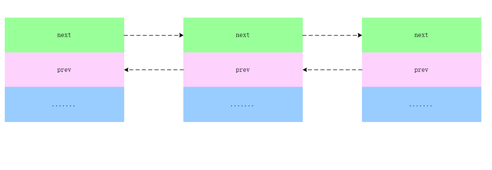
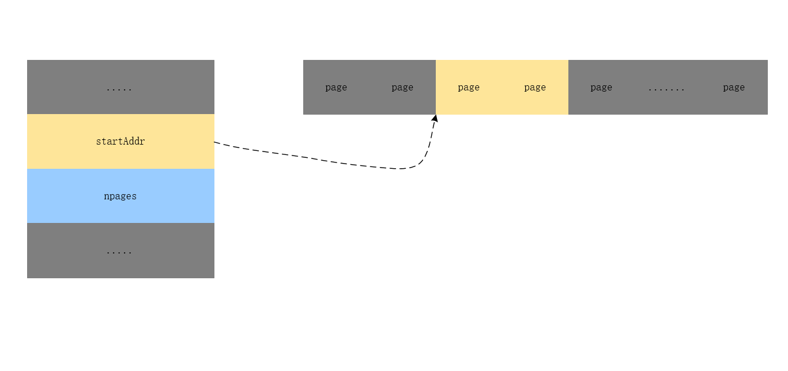
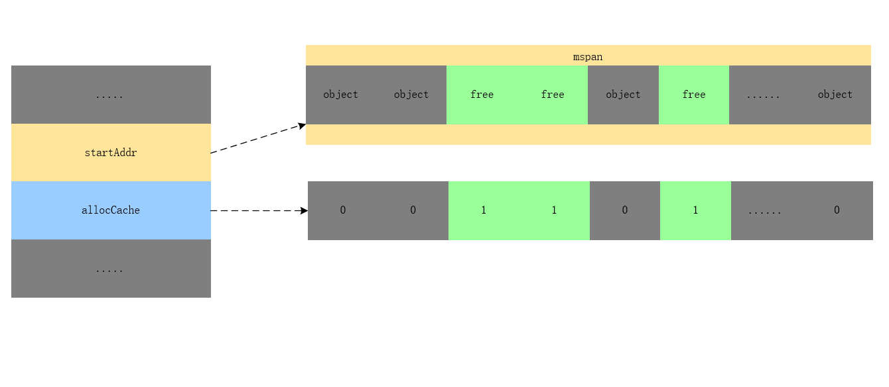
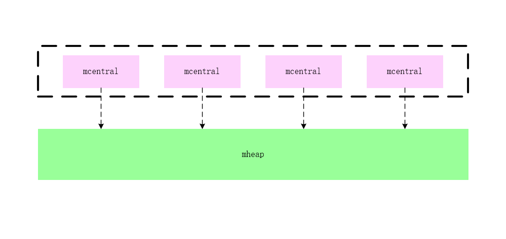
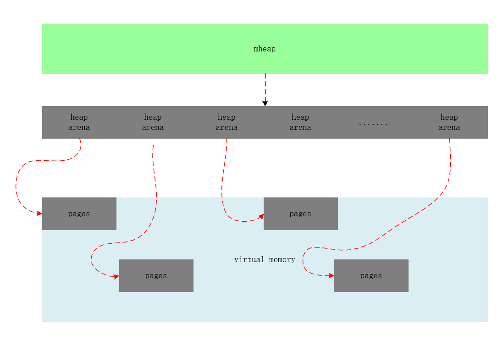

Go 的内存分配器基于 Thread-Cache Malloc ，tcmalloc为每一个线程实现了一个本地cache,区分了小对象（小于 32kb）和大对象分配两种分配类型，其管理的内存单元称为 span。不过由于Golang 本身并没有显示的内存申请和释放, Go 的内存分配器与 tcmalloc 存在一定差异。

# 逃逸分析

在官网 (golang.org) FAQ 上有一个关于变量分配的问题如下：

How do I know whether a variable is allocated on the heap or the stack?

> From a correctness standpoint, you don’t need to know. Each variable in Go exists as long as there are references to it. The storage location chosen by the implementation is irrelevant to the semantics of the language.
>
> The storage location does have an effect on writing efficient programs. When possible, the Go compilers will allocate variables that are local to a function in that function’s stack frame. However, if the compiler cannot prove that the variable is not referenced after the function returns, then the compiler must allocate the variable on the garbage-collected heap to avoid dangling pointer errors. Also, if a local variable is very large, it might make more sense to store it on the heap rather than the stack.
>
> In the current compilers, if a variable has its address taken, that variable is a candidate for allocation on the heap. However, a basic *escape analysis* recognizes some cases when such variables will not live past the return from the function and can reside on the stack.

从上面我们可以看到出现两种情况下 Golang的内存会被分配到堆上

- compiler cannot prove that the variable is not referenced after the function returns
- local variable is very large, it might make more sense to store it on the heap rather than the stack.


我们可以通过以下代码来验证一下

```go
type smallObj struct {
	arr [1 << 10]byte
}

type largeObj struct {
	arr [1 << 26]byte
}

func f1() int {
	x := new(int)
	*x = 1
	return *x
}

func f2() *int {
	y := 2
	return &y
}

func f3() {
	large := largeObj{}
	_ = large
}

func f4() {
	small := smallObj{}
	_ = small
}

func main() {
	f1()
	f2()
	f3()
	f4()
}
```


```shell
 go build -gcflags "-N -l -m" -ldflags=-compressdwarf=false  main.go
# command-line-arguments
./main.go:12:10: new(int) does not escape
./main.go:18:2: moved to heap: y
./main.go:23:2: moved to heap: large
```

可以看到 f2 中 y 的指针被返回，进而发生了逃逸；f3 中 large 无法被一个执行栈装下，即便没有返回，也会直接在堆上分配；我们可以再看一下其汇编指令
```go
"".f2 STEXT size=103 args=0x8 locals=0x20
    0x0000 00000 (main.go:17)   TEXT    "".f2(SB), ABIInternal, $32-8
		.....
    0x0031 00049 (main.go:18)   PCDATA  $1, $0
    0x0031 00049 (main.go:18)   CALL    runtime.newobject(SB)
		....
    0x005a 00090 (main.go:19)   RET 
```
```go
"".f3 STEXT size=82 args=0x0 locals=0x20
		0x0000 00000 (main.go:22)   TEXT    "".f3(SB), ABIInternal, $32-0
    0x0000 00000 (main.go:22)   MOVQ    (TLS), CX
    0x0009 00009 (main.go:22)   CMPQ    SP, 16(CX)
		.....
    0x0028 00040 (main.go:23)   CALL    runtime.newobject(SB)
````

可以发现，对于产生在 Go 堆上分配对象的情况，均调用了运行时的 `runtime.newobject` 方法。 所以 `runtime.newobject` 就是内存分配的入口了。


# 主要的结构

Golang的内存分配器主要包含了一下几个核心部分

- mheap  在页大小为8K的粒度进行管理
- mspan 是 mheap 上管理的一连串的页

## heapArena 

Golang

```go
const (
	pageSize = 8192 // 8K
	heapArenaBytes =  67108864  // 64M 
	heapArenaBitmapBytes = heapArenaBytes / 32       //  2097152 2M 
	pagesPerArena        = heapArenaBytes / pageSize  // 8192 8K 
)

type heapArena struct {
	bitmap       [heapArenaBitmapBytes]byte  //[2M]byte
	spans        [pagesPerArena]*mspan      // [8K]*mspan mspan 
	pageInUse    [pagesPerArena / 8]uint8   //标记页使用 
	pageMarks    [pagesPerArena / 8]uint8
	pageSpecials [pagesPerArena / 8]uint8
	checkmarks   *checkmarksMap
	zeroedBase   uintptr
} 
```

- bitmap 一个2MB个byte数组来标记这个heap area 64M 内存的使用情况，bitmap位图主要为GC标记数组，用2bits标记8(PtrSize) 个byte的使用情况。之所以用2个bits，一是标记对应地址中是否存在对象，另外是标记此对象是否被gc标记过。一个功能一个bit位，所以， heap bitmaps用两个bit位. 

  ```
  1M ---- 64M
  1bit --- 64bit --- 8 bytes 
  ```

  

- spans：是一个8192（pagesPerArena）大小的指针数组，每个mspan是8KB；

- pageInUse：是一个位图，使用1024 * 8 bit来标记 8192个页(8192*8KB = 64MB)中哪些页正在使用中；

- pageMarks：标记页，与GC相关；

## mspan 

 由于arena 管理的内存粒度比较大，并不符合事件。所以，在Golang 中所有的堆对象都通过 span 按照预先设定好的 大小等级分别分配，小于 32KB 的小对象则分配在固定大小等级的 span 上，否则直接从 mheap 上进行分配。mspan结构体包含 `next` 和 `prev` 两个字段，它们分别指向了前一个和后一个 mspn


```go
//go:notinheap
type mspan struct { //双向链表
	next *mspan     // next span in list, or nil if none
	prev *mspan     // previous span in list, or nil if none
	.....
}

```



## 页和内存

每个runtime.mspan 都管理 npages 个大小为 8k 的页，这里的页不是操作系统中的内存页，它们是操作系统内存页的整数倍，该结构体会使用下面这些字段来管理内存页的分配和回收：

```go
//go:notinheap
type mspan struct {
   startAddr uintptr // address of first byte of span aka s.base() 
   npages    uintptr // number of pages in span

   manualFreeList gclinkptr // list of free objects in mSpanManual spans

   // freeindex is the slot index between 0 and nelems at which to begin scanning
   // for the next free object in this span.
   // Each allocation scans allocBits starting at freeindex until it encounters a 0
   // indicating a free object. freeindex is then adjusted so that subsequent scans begin
   // just past the newly discovered free object.
   //
   // If freeindex == nelem, this span has no free objects.
   //
   // allocBits is a bitmap of objects in this span.
   // If n >= freeindex and allocBits[n/8] & (1<<(n%8)) is 0
   // then object n is free;
   // otherwise, object n is allocated. Bits starting at nelem are
   // undefined and should never be referenced.
   //
   // Object n starts at address n*elemsize + (start << pageShift).
   freeindex uintptr
   // TODO: Look up nelems from sizeclass and remove this field if it
   // helps performance.
   nelems uintptr // number of object in the span.

   // Cache of the allocBits at freeindex. allocCache is shifted
   // such that the lowest bit corresponds to the bit freeindex.
   // allocCache holds the complement of allocBits, thus allowing
   // ctz (count trailing zero) to use it directly.
   // allocCache may contain bits beyond s.nelems; the caller must ignore
   // these.
   allocCache uint64

   // allocBits and gcmarkBits hold pointers to a span's mark and
   // allocation bits. The pointers are 8 byte aligned.
   // There are three arenas where this data is held.
   // free: Dirty arenas that are no longer accessed
   //       and can be reused.
   // next: Holds information to be used in the next GC cycle.
   // current: Information being used during this GC cycle.
   // previous: Information being used during the last GC cycle.
   // A new GC cycle starts with the call to finishsweep_m.
   // finishsweep_m moves the previous arena to the free arena,
   // the current arena to the previous arena, and
   // the next arena to the current arena.
   // The next arena is populated as the spans request
   // memory to hold gcmarkBits for the next GC cycle as well
   // as allocBits for newly allocated spans.
   //
   // The pointer arithmetic is done "by hand" instead of using
   // arrays to avoid bounds checks along critical performance
   // paths.
   // The sweep will free the old allocBits and set allocBits to the
   // gcmarkBits. The gcmarkBits are replaced with a fresh zeroed
   // out memory.
   allocBits  *gcBits  //这是个指针数组
   gcmarkBits *gcBits  //这是个指针数组
  ......
}
//type gcBits uint8
```

- startAddr 该span管理的内存页的开始地址
- npages  一个 mspan 中的page数量

- freeindex mspan 管理的空闲内存页的开始地址
- allocBits   和  gcmarkBits 分别用于标记内存的占用和回收情况；
- allocCache  `allocBits` 的补码，可以用于快速查找内存中未被使用的内存；  



当用户程序或线程向runtime.mspan 申请内存时候，它会使用 `allocCache` 字段以对象为单位在管理的内存中快速查找待分配的空间。



## spanClass

spanclass 是用来记录mspan管理的object的大小和个数,Go 语言的内存管理模块中一共包含 67 种 spanClasss.

```go
type mspan struct {
	...
	spanclass   spanClass
	...
}

```


| class | bytes/obj | bytes/span | objects | tail waste | max waste |
| :---: | --------: | ---------: | ------: | :--------: | :-------: |
|   1   |         8 |       8192 |    1024 |     0      |  87.50%   |
|   2   |        16 |       8192 |     512 |     0      |  43.75%   |
|   3   |        24 |       8192 |     341 |     0      |  29.24%   |
|   4   |        32 |       8192 |     256 |     0      |  46.88%   |
|   5   |        48 |       8192 |     170 |     32     |  31.52%   |
|   6   |        64 |       8192 |     128 |     0      |  23.44%   |
|   7   |        80 |       8192 |     102 |     32     |  19.07%   |
|   …   |         … |          … |       … |     …      |     …     |
|  66   |     32768 |      32768 |       1 |     0      |  12.50%   |

上表展示了对象大小从 8B 到 32KB，总共 66(备注：不同板块可以有差别) 种跨度类的大小、存储的对象数以及浪费的内存空间.


我们以跨度类为 5 的 mspan 中对象的大小上限为 48 字节、管理 1 个页、最多可以存储 170 个对象。因为内存需要按照页进行管理，所以在尾部会浪费 32 字节的内存，当页中存储的对象都是 33 字节时，最多会浪费 31.52% 的资源：
$$
\frac{（48-33）*170 + 32}{8192} = 31.52\%
$$


跨度类中除了存储类别的 ID 之外，它还会存储一个 `noscan` 标记位，该标记位表示对象是否包含指针，垃圾回收会对包含指针的 runtime.mspan结构体进行扫描。我们可以通过下面的几个函数和方法了解 ID 和标记位的底层存储方式


```go
type spanClass uint8

const (
	numSpanClasses = _NumSizeClasses << 1
	tinySpanClass  = spanClass(tinySizeClass<<1 | 1)
)

//获取span的类型
func makeSpanClass(sizeclass uint8, noscan bool) spanClass {
	return spanClass(sizeclass<<1) | spanClass(bool2int(noscan))
}

//获取span的大小
func (sc spanClass) sizeclass() int8 {
	return int8(sc >> 1)
}

//判断是否是指针
func (sc spanClass) noscan() bool {
	return sc&1 != 0
}
```


除了上述 66 个跨度类之外，运行时中还包含 ID 为 0 的特殊跨度类，它能够管理大于 32KB 的特殊对象，我们会在后面详细介绍大对象的分配过程，在这里就不展开说明了。

# mcache 

mcache 是每一个线程的缓存,它会与线程上的处理器一一绑定，用来处理小微对象的内存，并且使用他的时候不需加锁。每一个线程缓存都持有 $ \_NumSizeClasses << 1$ 个 runtime.mspan，这些内存管理单元都存储在结构体的 `alloc` 字段中：

```go
// Per-thread (in Go, per-P) cache for small objects.
// No locking needed because it is per-thread (per-P).
//
// mcaches are allocated from non-GC'd memory, so any heap pointers
// must be specially handled.
//
//go:notinheap
type mcache struct {
	// The following members are accessed on every malloc,
	// so they are grouped here for better caching.
	next_sample uintptr // trigger heap sample after allocating this many bytes
	local_scan  uintptr // bytes of scannable heap allocated

	// Allocator cache for tiny objects w/o pointers.
	// See "Tiny allocator" comment in malloc.go.

	// tiny points to the beginning of the current tiny block, or
	// nil if there is no current tiny block.
	//
	// tiny is a heap pointer. Since mcache is in non-GC'd memory,
	// we handle it by clearing it in releaseAll during mark
	// termination.
	tiny             uintptr
	tinyoffset       uintptr
	local_tinyallocs uintptr // number of tiny allocs not counted in other stats

	// The rest is not accessed on every malloc.

	alloc [numSpanClasses]*mspan // spans to allocate from, indexed by spanClass

	stackcache [_NumStackOrders]stackfreelist

	// Local allocator stats, flushed during GC.
	local_largefree  uintptr                  // bytes freed for large objects (>maxsmallsize)
	local_nlargefree uintptr                  // number of frees for large objects (>maxsmallsize)
	local_nsmallfree [_NumSizeClasses]uintptr // number of frees for small objects (<=maxsmallsize)

	// flushGen indicates the sweepgen during which this mcache
	// was last flushed. If flushGen != mheap_.sweepgen, the spans
	// in this mcache are stale and need to the flushed so they
	// can be swept. This is done in acquirep.
	flushGen uint32
}
```

## 初始化

运行时在初始化处理器时会调用  runtime.allocmcache初始化线程缓存.

```go
/ init initializes pp, which may be a freshly allocated p or a
// previously destroyed p, and transitions it to status _Pgcstop.
func (pp *p) init(id int32) {
	.....
	pp.wbBuf.reset()
	if pp.mcache == nil {
		if id == 0 {
			if mcache0 == nil {
				throw("missing mcache?")
			}
			// Use the bootstrap mcache0. Only one P will get
			// mcache0: the one with ID 0.
			pp.mcache = mcache0
		} else {
			pp.mcache = allocmcache()
		}
	}
	.....
}

// dummy mspan that contains no free objects.
var emptymspan mspan

func allocmcache() *mcache {
	var c *mcache
	systemstack(func() {
		lock(&mheap_.lock)
    //从 mheap上分配一个mcahce 
		c = (*mcache)(mheap_.cachealloc.alloc())
		c.flushGen = mheap_.sweepgen
		unlock(&mheap_.lock)
	})
  // mcache.alloc 设置为空
	for i := range c.alloc {
		c.alloc[i] = &emptymspan
	}
	c.next_sample = nextSample()
	return c
}


```


## 从mheap 获取 mspan 

mcahce.refill会为线程缓存获取一个指定跨度类的内存管理单元，被替换的单元不能包含空闲的内存空间，而获取的单元中需要至少包含一个空闲对象用于分配内存.


```go
/// refill acquires a new span of span class spc for c. This span will
// have at least one free object. The current span in c must be full.
//
// Must run in a non-preemptible context since otherwise the owner of
// c could change.
func (c *mcache) refill(spc spanClass) {
	// Return the current cached span to the central lists.
	s := c.alloc[spc]

	if uintptr(s.allocCount) != s.nelems {
		throw("refill of span with free space remaining")
	}
	if s != &emptymspan {
		// Mark this span as no longer cached.
		if s.sweepgen != mheap_.sweepgen+3 {
			throw("bad sweepgen in refill")
		}
		if go115NewMCentralImpl {
			mheap_.central[spc].mcentral.uncacheSpan(s)
		} else {
			atomic.Store(&s.sweepgen, mheap_.sweepgen)
		}
	}

	// Get a new cached span from the central lists.
	s = mheap_.central[spc].mcentral.cacheSpan()
	if s == nil {
		throw("out of memory")
	}

	if uintptr(s.allocCount) == s.nelems {
		throw("span has no free space")
	}

	// Indicate that this span is cached and prevent asynchronous
	// sweeping in the next sweep phase.
	s.sweepgen = mheap_.sweepgen + 3

	c.alloc[spc] = s
}
```


# mcentral 

mcentral 是内存分配器的中心缓存，与线程缓存不同，访问中心缓存中的内存管理单元需要使用互斥锁：

```go
// Central list of free objects of a given size.
//
//go:notinheap
type mcentral struct {
	lock      mutex
	spanclass spanClass

	// For !go115NewMCentralImpl.
	nonempty mSpanList // list of spans with a free object, ie a nonempty free list
	empty    mSpanList // list of spans with no free objects (or cached in an mcache)

	// partial and full contain two mspan sets: one of swept in-use
	// spans, and one of unswept in-use spans. These two trade
	// roles on each GC cycle. The unswept set is drained either by
	// allocation or by the background sweeper in every GC cycle,
	// so only two roles are necessary.
	//
	// sweepgen is increased by 2 on each GC cycle, so the swept
	// spans are in partial[sweepgen/2%2] and the unswept spans are in
	// partial[1-sweepgen/2%2]. Sweeping pops spans from the
	// unswept set and pushes spans that are still in-use on the
	// swept set. Likewise, allocating an in-use span pushes it
	// on the swept set.
	//
	// Some parts of the sweeper can sweep arbitrary spans, and hence
	// can't remove them from the unswept set, but will add the span
	// to the appropriate swept list. As a result, the parts of the
	// sweeper and mcentral that do consume from the unswept list may
	// encounter swept spans, and these should be ignored.
	pacrtial [2]spanSet // list of spans with a free object
	full    [2]spanSet // list of spans with no free objects

	// nmalloc is the cumulative count of objects allocated from
	// this mcentral, assuming all spans in mcaches are
	// fully-allocated. Written atomically, read under STW.
	nmalloc uint64
}
```

- partial  包含空闲对象的内存管理单元。

  ​	partial 表示包含两个空闲列表，一个是还没有经过gc扫描的 空闲列表，一个是经常gc扫描的空闲列表。在每个gc的周期内，gc会轮流扫描这两个列表。由于在每一个gc的周期之内sweepgen 会增加2，所以 用 partial[sweepgen/2%2] 表示已经被扫描的spans,用partial[1-sweepgen/2%2]表示未被扫描的spans 

- full 不包含空闲对象的内存管理单元。
	


我们再来看 mcache.refill	 调用的 mcentral.cacheSpan 来分配mspan 

```go
/ Allocate a span to use in an mcache.
func (c *mcentral) cacheSpan() *mspan {
	....
	sg := mheap_.sweepgen
	....
	// If we sweep spanBudget spans without finding any free
	// space, just allocate a fresh span. This limits the amount
	// of time we can spend trying to find free space and
	// amortizes the cost of small object sweeping over the
	// benefit of having a full free span to allocate from. By
	// setting this to 100, we limit the space overhead to 1%.
	//
	// TODO(austin,mknyszek): This still has bad worst-case
	// throughput. For example, this could find just one free slot
	// on the 100th swept span. That limits allocation latency, but
	// still has very poor throughput. We could instead keep a
	// running free-to-used budget and switch to fresh span
	// allocation if the budget runs low.
	spanBudget := 100

	var s *mspan

	// Try partial swept spans first.
  //从清理过的、包含空闲空间的runtime.spanSet结构中查找可以使用的内存管理单元；
	if s = c.partialSwept(sg).pop(); s != nil {
		goto havespan
	}

	// Now try partial unswept spans.
  //从未被清理过的、有空闲对象的 runtime.spanSet 结构中查找可以使用的内存管理单元；
	for ; spanBudget >= 0; spanBudget-- {
		s = c.partialUnswept(sg).pop()
		if s == nil {
			break
		}
		if atomic.Load(&s.sweepgen) == sg-2 && atomic.Cas(&s.sweepgen, sg-2, sg-1) {
			// We got ownership of the span, so let's sweep it and use it.
			s.sweep(true)
			goto havespan
		}
		// We failed to get ownership of the span, which means it's being or
		// has been swept by an asynchronous sweeper that just couldn't remove it
		// from the unswept list. That sweeper took ownership of the span and
		// responsibility for either freeing it to the heap or putting it on the
		// right swept list. Either way, we should just ignore it (and it's unsafe
		// for us to do anything else).
	}
	// Now try full unswept spans, sweeping them and putting them into the
	// right list if we fail to get a span.
  //
	for ; spanBudget >= 0; spanBudget-- {
   // 调用 runtime.mcentral.fullUnswept 获取未被清理的、不包含空闲空间的 runtime.spanSet 中获取内存管理单元并通过 runtime.mspan.sweep 清理它的内存空间；
		s = c.fullUnswept(sg).pop()
		if s == nil {
			break
		}
		if atomic.Load(&s.sweepgen) == sg-2 && atomic.Cas(&s.sweepgen, sg-2, sg-1) {
			// We got ownership of the span, so let's sweep it.
			s.sweep(true)
			// Check if there's any free space.
			freeIndex := s.nextFreeIndex()
			if freeIndex != s.nelems {
				s.freeindex = freeIndex
				goto havespan
			}
			// Add it to the swept list, because sweeping didn't give us any free space.
			c.fullSwept(sg).push(s)
		}
		// See comment for partial unswept spans.
	}
	if trace.enabled {
		traceGCSweepDone()
		traceDone = true
	}

	// We failed to get a span from the mcentral so get one from mheap.
  //调用 runtime.mcentral.grow 从堆中申请新的内存管理单元；
	s = c.grow()
	if s == nil {
		return nil
	}

	// At this point s is a span that should have free slots.
havespan:
	if trace.enabled && !traceDone {
		traceGCSweepDone()
	}
	n := int(s.nelems) - int(s.allocCount)
	if n == 0 || s.freeindex == s.nelems || uintptr(s.allocCount) == s.nelems {
		throw("span has no free objects")
	}
	// Assume all objects from this span will be allocated in the
	// mcache. If it gets uncached, we'll adjust this.
	atomic.Xadd64(&c.nmalloc, int64(n))
	usedBytes := uintptr(s.allocCount) * s.elemsize
	atomic.Xadd64(&memstats.heap_live, int64(spanBytes)-int64(usedBytes))
	if trace.enabled {
		// heap_live changed.
		traceHeapAlloc()
	}
	if gcBlackenEnabled != 0 {
		// heap_live changed.
		gcController.revise()
	}
	freeByteBase := s.freeindex &^ (64 - 1)
	whichByte := freeByteBase / 8
	// Init alloc bits cache.
	s.refillAllocCache(whichByte)

	// Adjust the allocCache so that s.freeindex corresponds to the low bit in
	// s.allocCache.
	s.allocCache >>= s.freeindex % 64

	return s
}


```

其步骤大概如下

1. 从清理过的、包含空闲空间的runtime.spanSet结构中查找可以使用的内存管理单元；如果查找到，那么跳到5 ，否则继续下一步
2. 从未被清理过的、有空闲对象的 runtime.spanSet 结构中查找可以使用的内存管理单元；如果查找到，那么跳到5 ，否则继续下一步
3. 调用 runtime.mcentral.fullUnswept 获取未被清理的、不包含空闲空间的 runtime.spanSet 中获取内存管理单元并通过 runtime.mspan.sweep 清理它的内存空间；如果查找到，那么跳到5 ，否则继续下一步
4. 调用 runtime.mcentral.grow 从堆中申请新的内存管理单元；
5. 更新内存管理单元的 `allocCache` 等字段帮助快速分配内存；


中心缓存的扩容方法 runtime.mcentral.grow 会根据预先计算的 class_to_allocnpages 和 class_to_size 获取待分配的页数以及跨度类并调用 runtime.mheap.alloc 获取新的 runtime.mspan 结构

```go
// grow allocates a new empty span from the heap and initializes it for c's size class.
func (c *mcentral) grow() *mspan {
	npages := uintptr(class_to_allocnpages[c.spanclass.sizeclass()])
	size := uintptr(class_to_size[c.spanclass.sizeclass()])

	s := mheap_.alloc(npages, c.spanclass, true)
	if s == nil {
		return nil
	}

	// Use division by multiplication and shifts to quickly compute:
	// n := (npages << _PageShift) / size
	n := (npages << _PageShift) >> s.divShift * uintptr(s.divMul) >> s.divShift2
	s.limit = s.base() + size*n
	heapBitsForAddr(s.base()).initSpan(s)
	return s
}
```


# mheap 

runtime.mheap 是Golang内存分配管理的最核心,所有堆上初始化的所有对象都由该结构体统一管理。mheap_是一个全局变量，会在系统初始化的时候初始化（在函数 mallocinit() 中）。

```go
// Main malloc heap.
// The heap itself is the "free" and "scav" treaps,
// but all the other global data is here too.
//
// mheap must not be heap-allocated because it contains mSpanLists,
// which must not be heap-allocated.
//
//go:notinheap
type mheap struct {
	// lock must only be acquired on the system stack, otherwise a g
	// could self-deadlock if its stack grows with the lock held.
	lock      mutex
	pages     pageAlloc // page allocation data structure
	sweepgen  uint32    // sweep generation, see comment in mspan; written during STW
	sweepdone uint32    // all spans are swept
	sweepers  uint32    // number of active sweepone calls

	// allspans is a slice of all mspans ever created. Each mspan
	// appears exactly once.
	//
	// The memory for allspans is manually managed and can be
	// reallocated and move as the heap grows.
	//
	// In general, allspans is protected by mheap_.lock, which
	// prevents concurrent access as well as freeing the backing
	// store. Accesses during STW might not hold the lock, but
	// must ensure that allocation cannot happen around the
	// access (since that may free the backing store).
	allspans []*mspan // all spans out there

	// sweepSpans contains two mspan stacks: one of swept in-use
	// spans, and one of unswept in-use spans. These two trade
	// roles on each GC cycle. Since the sweepgen increases by 2
	// on each cycle, this means the swept spans are in
	// sweepSpans[sweepgen/2%2] and the unswept spans are in
	// sweepSpans[1-sweepgen/2%2]. Sweeping pops spans from the
	// unswept stack and pushes spans that are still in-use on the
	// swept stack. Likewise, allocating an in-use span pushes it
	// on the swept stack.
	//
	// For !go115NewMCentralImpl.
	sweepSpans [2]gcSweepBuf

	_ uint32 // align uint64 fields on 32-bit for atomics

	// Proportional sweep
	//
	// These parameters represent a linear function from heap_live
	// to page sweep count. The proportional sweep system works to
	// stay in the black by keeping the current page sweep count
	// above this line at the current heap_live.
	//
	// The line has slope sweepPagesPerByte and passes through a
	// basis point at (sweepHeapLiveBasis, pagesSweptBasis). At
	// any given time, the system is at (memstats.heap_live,
	// pagesSwept) in this space.
	//
	// It's important that the line pass through a point we
	// control rather than simply starting at a (0,0) origin
	// because that lets us adjust sweep pacing at any time while
	// accounting for current progress. If we could only adjust
	// the slope, it would create a discontinuity in debt if any
	// progress has already been made.
	pagesInUse         uint64  // pages of spans in stats mSpanInUse; updated atomically
	pagesSwept         uint64  // pages swept this cycle; updated atomically
	pagesSweptBasis    uint64  // pagesSwept to use as the origin of the sweep ratio; updated atomically
	sweepHeapLiveBasis uint64  // value of heap_live to use as the origin of sweep ratio; written with lock, read without
	sweepPagesPerByte  float64 // proportional sweep ratio; written with lock, read without
	// TODO(austin): pagesInUse should be a uintptr, but the 386
	// compiler can't 8-byte align fields.

	// scavengeGoal is the amount of total retained heap memory (measured by
	// heapRetained) that the runtime will try to maintain by returning memory
	// to the OS.
	scavengeGoal uint64

	// Page reclaimer state

	// reclaimIndex is the page index in allArenas of next page to
	// reclaim. Specifically, it refers to page (i %
	// pagesPerArena) of arena allArenas[i / pagesPerArena].
	//
	// If this is >= 1<<63, the page reclaimer is done scanning
	// the page marks.
	//
	// This is accessed atomically.
	reclaimIndex uint64
	// reclaimCredit is spare credit for extra pages swept. Since
	// the page reclaimer works in large chunks, it may reclaim
	// more than requested. Any spare pages released go to this
	// credit pool.
	//
	// This is accessed atomically.
	reclaimCredit uintptr

	// Malloc stats.
	largealloc  uint64                  // bytes allocated for large objects
	nlargealloc uint64                  // number of large object allocations
	largefree   uint64                  // bytes freed for large objects (>maxsmallsize)
	nlargefree  uint64                  // number of frees for large objects (>maxsmallsize)
	nsmallfree  [_NumSizeClasses]uint64 // number of frees for small objects (<=maxsmallsize)

	// arenas is the heap arena map. It points to the metadata for
	// the heap for every arena frame of the entire usable virtual
	// address space.
	//
	// Use arenaIndex to compute indexes into this array.
	//
	// For regions of the address space that are not backed by the
	// Go heap, the arena map contains nil.
	//
	// Modifications are protected by mheap_.lock. Reads can be
	// performed without locking; however, a given entry can
	// transition from nil to non-nil at any time when the lock
	// isn't held. (Entries never transitions back to nil.)
	//
	// In general, this is a two-level mapping consisting of an L1
	// map and possibly many L2 maps. This saves space when there
	// are a huge number of arena frames. However, on many
	// platforms (even 64-bit), arenaL1Bits is 0, making this
	// effectively a single-level map. In this case, arenas[0]
	// will never be nil.
	arenas [1 << arenaL1Bits]*[1 << arenaL2Bits]*heapArena

	// heapArenaAlloc is pre-reserved space for allocating heapArena
	// objects. This is only used on 32-bit, where we pre-reserve
	// this space to avoid interleaving it with the heap itself.
	heapArenaAlloc linearAlloc

	// arenaHints is a list of addresses at which to attempt to
	// add more heap arenas. This is initially populated with a
	// set of general hint addresses, and grown with the bounds of
	// actual heap arena ranges.
	arenaHints *arenaHint

	// arena is a pre-reserved space for allocating heap arenas
	// (the actual arenas). This is only used on 32-bit.
	arena linearAlloc

	// allArenas is the arenaIndex of every mapped arena. This can
	// be used to iterate through the address space.
	//
	// Access is protected by mheap_.lock. However, since this is
	// append-only and old backing arrays are never freed, it is
	// safe to acquire mheap_.lock, copy the slice header, and
	// then release mheap_.lock.
	allArenas []arenaIdx

	// sweepArenas is a snapshot of allArenas taken at the
	// beginning of the sweep cycle. This can be read safely by
	// simply blocking GC (by disabling preemption).
	sweepArenas []arenaIdx

	// markArenas is a snapshot of allArenas taken at the beginning
	// of the mark cycle. Because allArenas is append-only, neither
	// this slice nor its contents will change during the mark, so
	// it can be read safely.
	markArenas []arenaIdx

	// curArena is the arena that the heap is currently growing
	// into. This should always be physPageSize-aligned.
	curArena struct {
		base, end uintptr
	}

	// _ uint32 // ensure 64-bit alignment of central

	// central free lists for small size classes.
	// the padding makes sure that the mcentrals are
	// spaced CacheLinePadSize bytes apart, so that each mcentral.lock
	// gets its own cache line.
	// central is indexed by spanClass.
	central [numSpanClasses]struct {
		mcentral mcentral
		pad      [cpu.CacheLinePadSize - unsafe.Sizeof(mcentral{})%cpu.CacheLinePadSize]byte
	}

	spanalloc             fixalloc // allocator for span*
	cachealloc            fixalloc // allocator for mcache*
	specialfinalizeralloc fixalloc // allocator for specialfinalizer*
	specialprofilealloc   fixalloc // allocator for specialprofile*
	speciallock           mutex    // lock for special record allocators.
	arenaHintAlloc        fixalloc // allocator for arenaHints

	unused *specialfinalizer // never set, just here to force the specialfinalizer type into DWARF
}

var mheap_ mheap
```

- mcentral 

  mcentral 是一个长度为 136 的 $ \_NumSizeClasses << 1$ 数组，其中 $ \_NumSizeClasses $个为跨度类需要 `scan` 的中心缓存，另外的 $ \_NumSizeClasses $个是 `noscan` 的中心缓存：	

```go
 type mheap struct {
 ...
 	central [numSpanClasses]struct {
		mcentral mcentral
		pad      [cpu.CacheLinePadSize - unsafe.Sizeof(mcentral{})%cpu.CacheLinePadSize]byte
	}
	...
 }
```


​	pad 可以认为是一个字节填充，为了避免伪共享（false sharing）问题的。False Sharing 可以参考 [False Sharing - wikipedia](https://en.wikipedia.org/wiki/False_sharing)




- arenas

  area是一个二维矩阵 runtime.heapArena 管理，这个二维矩阵管理的内存可以是不连续的




- allspans 

  allspans []*mspan: 所有的 spans 都是通过 mheap_ 申请，所有申请过的 mspan 都会记录在 allspans。结构体中的 lock 就是用来保证并发安全的。注释中有关于 STW 的说明，这个之后会在 Golang 的 GC 文章中细说。

  

  ## 初始化

  

堆区mheap 使用runtime.mheap.init 进行初始化，主要包含以下几部分

-  锁的初始化话
- spanalloc,cachealloc,specialfinalizeralloc,specialprofilealloc,arenaHintAlloc 这些 runtime.fixalloc类型的空闲链表分配器
- central 切片中的runtime.mcentral 的初始化 

```go
// Initialize the heap.
func (h *mheap) init() {
  
   lockInit(&h.lock, lockRankMheap)
   lockInit(&h.sweepSpans[0].spineLock, lockRankSpine)
   lockInit(&h.sweepSpans[1].spineLock, lockRankSpine)
   lockInit(&h.speciallock, lockRankMheapSpecial)

   h.spanalloc.init(unsafe.Sizeof(mspan{}), recordspan, unsafe.Pointer(h), &memstats.mspan_sys)
   h.cachealloc.init(unsafe.Sizeof(mcache{}), nil, nil, &memstats.mcache_sys)
   h.specialfinalizeralloc.init(unsafe.Sizeof(specialfinalizer{}), nil, nil, &memstats.other_sys)
   h.specialprofilealloc.init(unsafe.Sizeof(specialprofile{}), nil, nil, &memstats.other_sys)
   h.arenaHintAlloc.init(unsafe.Sizeof(arenaHint{}), nil, nil, &memstats.other_sys)

   // Don't zero mspan allocations. Background sweeping can
   // inspect a span concurrently with allocating it, so it's
   // important that the span's sweepgen survive across freeing
   // and re-allocating a span to prevent background sweeping
   // from improperly cas'ing it from 0.
   //
   // This is safe because mspan contains no heap pointers.
   h.spanalloc.zero = false

   // h->mapcache needs no init

   for i := range h.central {
      h.central[i].mcentral.init(spanClass(i))
   }

   h.pages.init(&h.lock, &memstats.gc_sys)
}
```

其中 runtime.fixalloc 是一个用来分配固定对象的空闲列表分配器。

```go
type fixalloc struct {
	size   uintptr
	first  func(arg, p unsafe.Pointer) // called first time p is returned
	arg    unsafe.Pointer
	list   *mlink
	chunk  uintptr // use uintptr instead of unsafe.Pointer to avoid write barriers
	nchunk uint32
	inuse  uintptr // in-use bytes now
	stat   *uint64
	zero   bool // zero allocations
}


```

它提供了以下两个用于分配和释放内存的方法

- fixalloc.alloc  获取下一个空闲的内存空间；
- fixalloc.free 释放指针指向的内存空间


## 内存管理单元

runtime.mheap 在运行时会通过它的 runtime.mheap.alloc 方法在系统栈中获取新的 runtime.mspan 单元：

```go
// alloc allocates a new span of npage pages from the GC'd heap.
//
// spanclass indicates the span's size class and scannability.
//
// If needzero is true, the memory for the returned span will be zeroed.
func (h *mheap) alloc(npages uintptr, spanclass spanClass, needzero bool) *mspan {
	// Don't do any operations that lock the heap on the G stack.
	// It might trigger stack growth, and the stack growth code needs
	// to be able to allocate heap.
	var s *mspan
	systemstack(func() {
		// To prevent excessive heap growth, before allocating n pages
		// we need to sweep and reclaim at least n pages.
		if h.sweepdone == 0 {
      //为了阻止内存占用和堆的增长，调用reclaim回收部分内存页 
			h.reclaim(npages)
		}
   //调用allocSpan 分配内存
		s = h.allocSpan(npages, false, spanclass, &memstats.heap_inuse)
	})

	if s != nil {
		if needzero && s.needzero != 0 {
			memclrNoHeapPointers(unsafe.Pointer(s.base()), s.npages<<_PageShift)
		}
		s.needzero = 0
	}
	return s
}
```


runtime.mheap.alloc 在进行内存分配之前会调用runtime.mheap.reclaim来回收部分内存，这么做是为了阻止内存的大量占用和堆的增长。随后会调用runtime.mheap.allocSpan来分配新的内存管理单元。runtime.mheap.allocSpan可以分为两部分：

	- 从堆上分配新的内存页和内存管理单元
	- 初始化内存管理单元并将其加入 runtime.mheap 持有内存单元列表；


```go
// allocSpan allocates an mspan which owns npages worth of memory.
//
// If manual == false, allocSpan allocates a heap span of class spanclass
// and updates heap accounting. If manual == true, allocSpan allocates a
// manually-managed span (spanclass is ignored), and the caller is
// responsible for any accounting related to its use of the span. Either
// way, allocSpan will atomically add the bytes in the newly allocated
// span to *sysStat.
//
// The returned span is fully initialized.
//
// h must not be locked.
//
// allocSpan must be called on the system stack both because it acquires
// the heap lock and because it must block GC transitions.
//
//go:systemstack
func (h *mheap) allocSpan(npages uintptr, manual bool, spanclass spanClass, sysStat *uint64) (s *mspan) {
	// Function-global state.
	gp := getg()
	base, scav := uintptr(0), uintptr(0)

	// If the allocation is small enough, try the page cache!
  // 如果需要分配的内存比较小，就从  page cache 分配内存
	pp := gp.m.p.ptr()
	if pp != nil && npages < pageCachePages/4 {
		c := &pp.pcache

		// If the cache is empty, refill it.
		if c.empty() {
			lock(&h.lock)
      //填充 page cache 
			*c = h.pages.allocToCache()
			unlock(&h.lock)
		}

		// Try to allocate from the cache.
		base, scav = c.alloc(npages)
		if base != 0 {
			s = h.tryAllocMSpan()

			if s != nil && gcBlackenEnabled == 0 && (manual || spanclass.sizeclass() != 0) {
        //从 page cache 分配内存成功
				goto HaveSpan
			}
			// We're either running duing GC, failed to acquire a mspan,
			// or the allocation is for a large object. This means we
			// have to lock the heap and do a bunch of extra work,
			// so go down the HaveBaseLocked path.
			//
			// We must do this during GC to avoid skew with heap_scan
			// since we flush mcache stats whenever we lock.
			//
			// TODO(mknyszek): It would be nice to not have to
			// lock the heap if it's a large allocation, but
			// it's fine for now. The critical section here is
			// short and large object allocations are relatively
			// infrequent.
		}
	}

	// For one reason or another, we couldn't get the
	// whole job done without the heap lock.
	lock(&h.lock)
  
  if base == 0 {
		// Try to acquire a base address.
    // 
		base, scav = h.pages.alloc(npages)
		if base == 0 {
			if !h.grow(npages) {
				unlock(&h.lock)
				return nil
			}
			base, scav = h.pages.alloc(npages)
			if base == 0 {
				throw("grew heap, but no adequate free space found")
			}
		}
	}
	if s == nil {
		// We failed to get an mspan earlier, so grab
		// one now that we have the heap lock.
		s = h.allocMSpanLocked()
	}

```

allocSpan 分配内存页和内存管理单元过程如下

1. ​	 If the allocation is small enough, try the page cache 如果需要分配的内存比较小，就从  page cache 分配内存。

2. ​    如果从page cache 上无法分配到内存或者内存比较大，从runtime.pageAlloc.alloc 在 页堆上分配内存。如果发现页堆中的内存不足，会通过runtime.mheap.grow 扩容 页堆并重新调用 runtime.pageAlloc.alloc 分配内存

   - 如果申请到内存，意味着扩容成功；

   - 如果没有申请到内存，意味着扩容失败，宿主机可能不存在空闲内存，运行时会直接中止当前程序；

     

无论通过哪种方式获得内存页，我们都会在该函数中分配新的 runtime.mspan结构体；该方法的剩余部分会通过页数、内存空间以及跨度类等参数初始化它的多个字段：

```go
func (h *mheap) alloc(npages uintptr, spanclass spanClass, needzero bool) *mspan {
	...
HaveSpan:
	s.init(base, npages)

	...

	s.freeindex = 0
	s.allocCache = ^uint64(0)
	s.gcmarkBits = newMarkBits(s.nelems)
	s.allocBits = newAllocBits(s.nelems)
	h.setSpans(s.base(), npages, s)
	return s
}
```


# 内存分配

Golang中所有堆上所有的对象都会通过调用 runtime.newobject 函数来分配内存。

```go
func newobject(typ *_type) unsafe.Pointer {
	return mallocgc(typ.size, typ, true)

}

/ Allocate an object of size bytes.
// Small objects are allocated from the per-P cache's free lists.
// Large objects (> 32 kB) are allocated straight from the heap.
func mallocgc(size uintptr, typ *_type, needzero bool) unsafe.Pointer {
	if gcphase == _GCmarktermination {
		throw("mallocgc called with gcphase == _GCmarktermination")
	}

	if size == 0 {
		return unsafe.Pointer(&zerobase)
	}

	if debug.sbrk != 0 {
		align := uintptr(16)
		if typ != nil {
			// TODO(austin): This should be just
			//   align = uintptr(typ.align)
			// but that's only 4 on 32-bit platforms,
			// even if there's a uint64 field in typ (see #599).
			// This causes 64-bit atomic accesses to panic.
			// Hence, we use stricter alignment that matches
			// the normal allocator better.
			if size&7 == 0 {
				align = 8
			} else if size&3 == 0 {
				align = 4
			} else if size&1 == 0 {
				align = 2
			} else {
				align = 1
			}
		}
		return persistentalloc(size, align, &memstats.other_sys)
	}

	// assistG is the G to charge for this allocation, or nil if
	// GC is not currently active.
	var assistG *g
	if gcBlackenEnabled != 0 {
		// Charge the current user G for this allocation.
		assistG = getg()
		if assistG.m.curg != nil {
			assistG = assistG.m.curg
		}
		// Charge the allocation against the G. We'll account
		// for internal fragmentation at the end of mallocgc.
		assistG.gcAssistBytes -= int64(size)

		if assistG.gcAssistBytes < 0 {
			// This G is in debt. Assist the GC to correct
			// this before allocating. This must happen
			// before disabling preemption.
			gcAssistAlloc(assistG)
		}
	}

	// Set mp.mallocing to keep from being preempted by GC.
	mp := acquirem()
	if mp.mallocing != 0 {
		throw("malloc deadlock")
	}
	if mp.gsignal == getg() {
		throw("malloc during signal")
	}
	mp.mallocing = 1

	shouldhelpgc := false
	dataSize := size
	var c *mcache
	if mp.p != 0 {
		c = mp.p.ptr().mcache
	} else {
		// We will be called without a P while bootstrapping,
		// in which case we use mcache0, which is set in mallocinit.
		// mcache0 is cleared when bootstrapping is complete,
		// by procresize.
		c = mcache0
		if c == nil {
			throw("malloc called with no P")
		}
	}
	var span *mspan
	var x unsafe.Pointer
	noscan := typ == nil || typ.ptrdata == 0
	if size <= maxSmallSize {
		if noscan && size < maxTinySize {
			// Tiny allocator.
			//
			// Tiny allocator combines several tiny allocation requests
			// into a single memory block. The resulting memory block
			// is freed when all subobjects are unreachable. The subobjects
			// must be noscan (don't have pointers), this ensures that
			// the amount of potentially wasted memory is bounded.
			//
			// Size of the memory block used for combining (maxTinySize) is tunable.
			// Current setting is 16 bytes, which relates to 2x worst case memory
			// wastage (when all but one subobjects are unreachable).
			// 8 bytes would result in no wastage at all, but provides less
			// opportunities for combining.
			// 32 bytes provides more opportunities for combining,
			// but can lead to 4x worst case wastage.
			// The best case winning is 8x regardless of block size.
			//
			// Objects obtained from tiny allocator must not be freed explicitly.
			// So when an object will be freed explicitly, we ensure that
			// its size >= maxTinySize.
			//
			// SetFinalizer has a special case for objects potentially coming
			// from tiny allocator, it such case it allows to set finalizers
			// for an inner byte of a memory block.
			//
			// The main targets of tiny allocator are small strings and
			// standalone escaping variables. On a json benchmark
			// the allocator reduces number of allocations by ~12% and
			// reduces heap size by ~20%.
			off := c.tinyoffset
			// Align tiny pointer for required (conservative) alignment.
			if size&7 == 0 {
				off = alignUp(off, 8)
			} else if size&3 == 0 {
				off = alignUp(off, 4)
			} else if size&1 == 0 {
				off = alignUp(off, 2)
			}
			if off+size <= maxTinySize && c.tiny != 0 {
				// The object fits into existing tiny block.
				x = unsafe.Pointer(c.tiny + off)
				c.tinyoffset = off + size
				c.local_tinyallocs++
				mp.mallocing = 0
				releasem(mp)
				return x
			}
			// Allocate a new maxTinySize block.
			span = c.alloc[tinySpanClass]
			v := nextFreeFast(span)
			if v == 0 {
				v, span, shouldhelpgc = c.nextFree(tinySpanClass)
			}
			x = unsafe.Pointer(v)
			(*[2]uint64)(x)[0] = 0
			(*[2]uint64)(x)[1] = 0
			// See if we need to replace the existing tiny block with the new one
			// based on amount of remaining free space.
			if size < c.tinyoffset || c.tiny == 0 {
				c.tiny = uintptr(x)
				c.tinyoffset = size
			}
			size = maxTinySize
		} else {
			var sizeclass uint8
			if size <= smallSizeMax-8 {
				sizeclass = size_to_class8[divRoundUp(size, smallSizeDiv)]
			} else {
				sizeclass = size_to_class128[divRoundUp(size-smallSizeMax, largeSizeDiv)]
			}
			size = uintptr(class_to_size[sizeclass])
			spc := makeSpanClass(sizeclass, noscan)
			span = c.alloc[spc]
			v := nextFreeFast(span)
			if v == 0 {
				v, span, shouldhelpgc = c.nextFree(spc)
			}
			x = unsafe.Pointer(v)
			if needzero && span.needzero != 0 {
				memclrNoHeapPointers(unsafe.Pointer(v), size)
			}
		}
	} else {
		shouldhelpgc = true
		systemstack(func() {
			span = largeAlloc(size, needzero, noscan)
		})
		span.freeindex = 1
		span.allocCount = 1
		x = unsafe.Pointer(span.base())
		size = span.elemsize
	}

	var scanSize uintptr
	if !noscan {
		// If allocating a defer+arg block, now that we've picked a malloc size
		// large enough to hold everything, cut the "asked for" size down to
		// just the defer header, so that the GC bitmap will record the arg block
		// as containing nothing at all (as if it were unused space at the end of
		// a malloc block caused by size rounding).
		// The defer arg areas are scanned as part of scanstack.
		if typ == deferType {
			dataSize = unsafe.Sizeof(_defer{})
		}
		heapBitsSetType(uintptr(x), size, dataSize, typ)
		if dataSize > typ.size {
			// Array allocation. If there are any
			// pointers, GC has to scan to the last
			// element.
			if typ.ptrdata != 0 {
				scanSize = dataSize - typ.size + typ.ptrdata
			}
		} else {
			scanSize = typ.ptrdata
		}
		c.local_scan += scanSize
	}

	// Ensure that the stores above that initialize x to
	// type-safe memory and set the heap bits occur before
	// the caller can make x observable to the garbage
	// collector. Otherwise, on weakly ordered machines,
	// the garbage collector could follow a pointer to x,
	// but see uninitialized memory or stale heap bits.
	publicationBarrier()

	// Allocate black during GC.
	// All slots hold nil so no scanning is needed.
	// This may be racing with GC so do it atomically if there can be
	// a race marking the bit.
	if gcphase != _GCoff {
		gcmarknewobject(span, uintptr(x), size, scanSize)
	}

	if raceenabled {
		racemalloc(x, size)
	}

	if msanenabled {
		msanmalloc(x, size)
	}

	mp.mallocing = 0
	releasem(mp)

	if debug.allocfreetrace != 0 {
		tracealloc(x, size, typ)
	}

	if rate := MemProfileRate; rate > 0 {
		if rate != 1 && size < c.next_sample {
			c.next_sample -= size
		} else {
			mp := acquirem()
			profilealloc(mp, x, size)
			releasem(mp)
		}
	}

	if assistG != nil {
		// Account for internal fragmentation in the assist
		// debt now that we know it.
		assistG.gcAssistBytes -= int64(size - dataSize)
	}

	if shouldhelpgc {
		if t := (gcTrigger{kind: gcTriggerHeap}); t.test() {
			gcStart(t)
		}
	}

	return x
}

```


Golang 给 object 根据请求的内存大小将其分为 微对象、小对象、大对象，其申请流程大致如下：

1. object size < 16 byte，使用 mcache 的小对象分配器 tiny 直接分配。 
2. object size > 16 byte && size <=32K byte 时，先使用 mcache 中对应的 size class 分配。如果mcachem对应的size class 的span 已经没有可用的cache,那么向mcentral 请求。如果 mcentral 也没有可用的块，则向 mheap 申请，并切分。如果 mheap 也没有合适的 span，则想操作系统申请。
3. object size > 32K，则使用 mheap 直接分配。


## 微对象

对于小于 16 byte 的内存块获取非指针类对象划分为微对象，mcache 有个专门的内存区域 tiny 用来分配，tiny 是指针，指向开始地址，tinyoffset为偏移量。

我们主要使用它来分配较小的字符串以及逃逸的临时变量。微分配器可以将多个较小的内存分配请求合入同一个内存块中，只有当内存块中的所有对象都需要被回收时，整片内存才可能被回收。


```go
func mallocgc(...) {
    ...
     	if noscan && size < maxTinySize {
			// Tiny allocator.
			//
			// Tiny allocator combines several tiny allocation requests
			// into a single memory block. The resulting memory block
			// is freed when all subobjects are unreachable. The subobjects
			// must be noscan (don't have pointers), this ensures that
			// the amount of potentially wasted memory is bounded.
			//
			// Size of the memory block used for combining (maxTinySize) is tunable.
			// Current setting is 16 bytes, which relates to 2x worst case memory
			// wastage (when all but one subobjects are unreachable).
			// 8 bytes would result in no wastage at all, but provides less
			// opportunities for combining.
			// 32 bytes provides more opportunities for combining,
			// but can lead to 4x worst case wastage.
			// The best case winning is 8x regardless of block size.
			//
			// Objects obtained from tiny allocator must not be freed explicitly.
			// So when an object will be freed explicitly, we ensure that
			// its size >= maxTinySize.
			//
			// SetFinalizer has a special case for objects potentially coming
			// from tiny allocator, it such case it allows to set finalizers
			// for an inner byte of a memory block.
			//
			// The main targets of tiny allocator are small strings and
			// standalone escaping variables. On a json benchmark
			// the allocator reduces number of allocations by ~12% and
			// reduces heap size by ~20%.
			off := c.tinyoffset
			// Align tiny pointer for required (conservative) alignment.
      //内存对齐
			if size&7 == 0 {
				off = alignUp(off, 8)
			} else if size&3 == 0 {
				off = alignUp(off, 4)
			} else if size&1 == 0 {
				off = alignUp(off, 2)
			}
       //判断 tiny是否够用
			if off+size <= maxTinySize && c.tiny != 0 {
        // 分配成功
				// The object fits into existing tiny block.
				x = unsafe.Pointer(c.tiny + off)
				c.tinyoffset = off + size
				c.local_tinyallocs++
				mp.mallocing = 0
				releasem(mp)
				return x
			}
			// Allocate a new maxTinySize block.
      // tiny 剩余的空间不够用，则重新申请一个 16 byte 的内存块，并分配给 object。如果有结余，则记录在 tiny 上。
			span = c.alloc[tinySpanClass]
			v := nextFreeFast(span)
			if v == 0 {
				v, span, shouldhelpgc = c.nextFree(tinySpanClass)
			}
			x = unsafe.Pointer(v)
			(*[2]uint64)(x)[0] = 0
			(*[2]uint64)(x)[1] = 0
			// See if we need to replace the existing tiny block with the new one
			// based on amount of remaining free space.
			if size < c.tinyoffset || c.tiny == 0 {
				c.tiny = uintptr(x)
				c.tinyoffset = size
			}
			size = maxTinySize
}
```

如上所示，tinyoffset 表示 tiny 当前分配到什么地址了，之后的分配根据 tinyoffset 寻址。先根据要分配的对象大小进行地址对齐，比如 size 是 8 的倍数，tinyoffset 和 8 对齐。然后就是进行分配。如果 tiny 剩余的空间不够用，则重新申请一个 16 byte 的内存块，并分配给 object。如果有结余，则记录在 tiny 上。


# 参考


Golang 内存管理 http://legendtkl.com/2017/04/02/golang-alloc/

TCMalloc : Thread-Caching Malloc  http://goog-perftools.sourceforge.net/doc/tcmalloc.html

第 7 章 内存分配 https://golang.design/under-the-hood/zh-cn/part2runtime/ch07alloc/

tcmalloc 介绍 http://legendtkl.com/2015/12/11/go-memory/

False sharing https://en.wikipedia.org/wiki/False_sharing

Golang和假共享(false sharing) https://www.xwxwgo.com/post/2019/07/09/golang%E5%92%8Cfalse-sharing/

Go runtime剖析系列（一）：内存管理 https://zhuanlan.zhihu.com/p/323915446