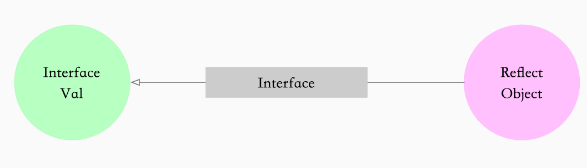

#  反射的概念

在计算机科学领域，反射是指一类应用，它们能够自描述和自控制。也就是说，这类应用通过采用某种机制来实现对自己行为的描述（self-representation）和监测（examination），并能根据自身行为的状态和结果，调整或修改应用所描述行为的状态和相关的语义。<!--more-->


# reflect.TypeOf 和 reflect.ValueOf

Golang 反射包中有两对非常重要的函数和类型，[`reflect.TypeOf`](https://github.com/golang/go/blob/52c4488471ed52085a29e173226b3cbd2bf22b20/src/reflect/type.go#L1365-L1368) 能获取类型信息，[`reflect.ValueOf`](https://github.com/golang/go/blob/52c4488471ed52085a29e173226b3cbd2bf22b20/src/reflect/value.go#L2316-L2328) 能获取数据的运行时表示，另外两个类型是 `Type` 和 `Value`.

```
TypeOf   ------------> Type
ValueOf  ------------> Value
```


类型Type 是反射包定义的一个接口，我们可以使用 [`reflect.TypeOf`](https://github.com/golang/go/blob/52c4488471ed52085a29e173226b3cbd2bf22b20/src/reflect/type.go#L1365-L1368) 函数获取任意变量的类型。

```go
type Type interface {
	Align() int
	FieldAlign() int

	// Method returns the i'th method in the type's method set.
	// It panics if i is not in the range [0, NumMethod()).
	//
	// For a non-interface type T or *T, the returned Method's Type and Func
	// fields describe a function whose first argument is the receiver.
	//
	// For an interface type, the returned Method's Type field gives the
	// method signature, without a receiver, and the Func field is nil.
	//
	// Only exported methods are accessible and they are sorted in
	// lexicographic order.
	Method(int) Method 

	// MethodByName returns the method with that name in the type's
	// method set and a boolean indicating if the method was found.
	//
	// For a non-interface type T or *T, the returned Method's Type and Func
	// fields describe a function whose first argument is the receiver.
	//
	// For an interface type, the returned Method's Type field gives the
	// method signature, without a receiver, and the Func field is nil.
	MethodByName(string) (Method, bool)

	// NumMethod returns the number of exported methods in the type's method set.
	NumMethod() int

	// Name returns the type's name within its package for a defined type.
	// For other (non-defined) types it returns the empty string.
	Name() string

	// PkgPath returns a defined type's package path, that is, the import path
	// that uniquely identifies the package, such as "encoding/base64".
	// If the type was predeclared (string, error) or not defined (*T, struct{},
	// []int, or A where A is an alias for a non-defined type), the package path
	// will be the empty string.
	PkgPath() string

	// Size returns the number of bytes needed to store
	// a value of the given type; it is analogous to unsafe.Sizeof.
	Size() uintptr

	// String returns a string representation of the type.
	// The string representation may use shortened package names
	// (e.g., base64 instead of "encoding/base64") and is not
	// guaranteed to be unique among types. To test for type identity,
	// compare the Types directly.
	String() string

	// Kind returns the specific kind of this type.
	Kind() Kind

	// Implements reports whether the type implements the interface type u.
	Implements(u Type) bool

	// AssignableTo reports whether a value of the type is assignable to type u.
	AssignableTo(u Type) bool

	// ConvertibleTo reports whether a value of the type is convertible to type u.
	ConvertibleTo(u Type) bool

	// Comparable reports whether values of this type are comparable.
	Comparable() bool
	Bits() int
	ChanDir() ChanDir
	IsVariadic() bool

	// Elem returns a type's element type.
	// It panics if the type's Kind is not Array, Chan, Map, Ptr, or Slice.
	Elem() Type

	// Field returns a struct type's i'th field.
	// It panics if the type's Kind is not Struct.
	// It panics if i is not in the range [0, NumField()).
	Field(i int) StructField

	// FieldByIndex returns the nested field corresponding
	// to the index sequence. It is equivalent to calling Field
	// successively for each index i.
	// It panics if the type's Kind is not Struct.
	FieldByIndex(index []int) StructField

	// FieldByName returns the struct field with the given name
	// and a boolean indicating if the field was found.
	FieldByName(name string) (StructField, bool)

	// FieldByNameFunc returns the struct field with a name
	// that satisfies the match function and a boolean indicating if
	// the field was found.
	//
	// FieldByNameFunc considers the fields in the struct itself
	// and then the fields in any embedded structs, in breadth first order,
	// stopping at the shallowest nesting depth containing one or more
	// fields satisfying the match function. If multiple fields at that depth
	// satisfy the match function, they cancel each other
	// and FieldByNameFunc returns no match.
	// This behavior mirrors Go's handling of name lookup in
	// structs containing embedded fields.
	FieldByNameFunc(match func(string) bool) (StructField, bool)

	// In returns the type of a function type's i'th input parameter.
	// It panics if the type's Kind is not Func.
	// It panics if i is not in the range [0, NumIn()).
	In(i int) Type

	// Key returns a map type's key type.
	// It panics if the type's Kind is not Map.
	Key() Type

	// Len returns an array type's length.
	// It panics if the type's Kind is not Array.
	Len() int

	// NumField returns a struct type's field count.
	// It panics if the type's Kind is not Struct.
	NumField() int

	// NumIn returns a function type's input parameter count.
	// It panics if the type's Kind is not Func.
	NumIn() int

	// NumOut returns a function type's output parameter count.
	// It panics if the type's Kind is not Func.
	NumOut() int

	// Out returns the type of a function type's i'th output parameter.
	// It panics if the type's Kind is not Func.
	// It panics if i is not in the range [0, NumOut()).
	Out(i int) Type

	common() *rtype
	uncommon() *uncommonType
}
```

这里可以看一下一些常见的接口

- Method(int) Method  通过index返回Type中的Method 
- MethodByName(name) Methon 通过方法名获取Methon
- NumMethod 获取Method 的数量

- PkgPath 包路径

- Implements 判断是否继承摸个接口

- Name 返回类型的名字

- Fields 返回结构体中的字段

  

reflect中的Value类型被声明成了结构体。这个结构体没有对外暴露字段，但是提供了获取或写入数据的方法
```go
type Value struct {
	// typ holds the type of the value represented by a Value.
	typ *rtype //存储数据的类型

	// Pointer-valued data or, if flagIndir is set, pointer to data.
	// Valid when either flagIndir is set or typ.pointers() is true.
	ptr unsafe.Pointer

	// flag holds metadata about the value.
	// The lowest bits are flag bits:
	//	- flagStickyRO: obtained via unexported not embedded field, so read-only
	//	- flagEmbedRO: obtained via unexported embedded field, so read-only
	//	- flagIndir: val holds a pointer to the data
	//	- flagAddr: v.CanAddr is true (implies flagIndir)
	//	- flagMethod: v is a method value.
	// The next five bits give the Kind of the value.
	// This repeats typ.Kind() except for method values.
	// The remaining 23+ bits give a method number for method values.
	// If flag.kind() != Func, code can assume that flagMethod is unset.
	// If ifaceIndir(typ), code can assume that flagIndir is set.
	flag

	// A method value represents a curried method invocation
	// like r.Read for some receiver r. The typ+val+flag bits describe
	// the receiver r, but the flag's Kind bits say Func (methods are
	// functions), and the top bits of the flag give the method number
	// in r's type's method table.
}
```


# 反射的三大法则

- Reflection goes from interface value to reflection object.(从interface从interface变量可以反射出反射对象))
- Reflection goes from reflection object to interface value （从反射对象获取获取interface{}变量）
- To modify a reflection object, the value must be settable.（要修改反射对象，其值必须设置）


## 从interface变量可以反射出反射对象

反射的第一法则是我们能将 Go 语言的 `interface{}` 变量转换成反射对象。为了实现从接口变量到反射对象的转换，需要我们上面提到过的

reflect.TypeOf()和reflect.ValueOf()这两个方法。通过TypeOf我们可以获取到变量的类型，通过ValueOf我们可以获取到遍历的值。


举个例子，看下这两个方法是如何使用的

```go
type User struct {
	Name string
}

func (u *User) GetName() string {
	return u.Name
}

func main() {
	u := User{Name: "kk1"}

	fmt.Println(reflect.ValueOf(u))
	fmt.Println(reflect.TypeOf(u))
}

```

Out

```go
{kk1}
main.User
```

有了变量的类型之后，我们可以通过 `Method` 方法获得类型实现的方法，通过 `Field` 获取类型包含的全部字段。对于不同的类型，我们也可以调用不同的方法获取相关信息：

- 结构体：获取字段的数量并通过下标和字段名获取字段 `StructField`；

- 哈希表：获取哈希表的 `Key` 类型；

- 函数或方法：获取入参和返回值的类型；

- .....

## 从反射对象获取获取interface{}变量

和第一法则刚好相反，第法则律描述的是，从反射对象到接口变量的转换。Golang  中 [`reflect`](https://golang.org/pkg/reflect/) 中的 [`reflect.Value.Interface`](https://github.com/golang/go/blob/52c4488471ed52085a29e173226b3cbd2bf22b20/src/reflect/value.go#L992-L994) 方法就能完成这项工作。



举个例子

```go
func main() {
	user1 := User{Name: "kk1"}

	fmt.Println("user1 is ",user1)
	fmt.Printf("user1 address is %p \n",&user1)
	rv := reflect.ValueOf(user1)
	user2,ok := rv.Interface().(User)
	if ok {
		fmt.Println("user2 is ", user2)
		fmt.Printf("user2 address is %p \n",&user2)
	}else{
		fmt.Println("Get user failed ")
	}
}
```

out

```
user1 is  {kk1}
user1 address is 0xc00008e1e0 
user2 is  {kk1}
user2 address is 0xc00008e210 
```

从上面的调用 我们可以看到 [`reflect.Value.Interface`](https://github.com/golang/go/blob/52c4488471ed52085a29e173226b3cbd2bf22b20/src/reflect/value.go#L992-L994) 方法只能获得 `interface{}` 类型的变量，如果想要将其还原成最原始的状态还需要经过如下所示的显式类型转换。


## 要修改反射对象，其值必须设置

最后一个法则说的是如果我们想要更新一个 `reflect.Value`，那么它持有的值一定是可以被更新的。

举个例子

```go
func main() {
	x := User{}
	v := reflect.ValueOf(x)
	v.FieldByName("Name").SetString("hello")
	fmt.Println(x)
}
```

out 

```go
panic: reflect: reflect.Value.SetString using unaddressable value

goroutine 1 [running]:
reflect.flag.mustBeAssignableSlow(0x98)
        /usr/local/go/src/reflect/value.go:259 +0x138
reflect.flag.mustBeAssignable(...)
        /usr/local/go/src/reflect/value.go:246
reflect.Value.SetString(0x10b21c0, 0x119d3c0, 0x98, 0x10cbd69, 0x5)
        /usr/local/go/src/reflect/value.go:1732 +0x37
main.main()
        /Users/linyuanpeng/workplace/go/src/github.com/bspp1314/go-common-lib/reflect-lib/ex3/main.go:19 +0x105

```


至于原因是非常简单的，因为Go的函数调用都是传值的，所以我们得到的反射对象跟最开始的变量没有任何关系，所以直接对它修改会导致崩溃。如果我们想要修改原有的变量，可以通过如下的方法进行修改

```go
func main() {
	x := &User{}
	v := reflect.ValueOf(x)
	e := v.Elem()
	e.FieldByName("Name").SetString("hello")
	fmt.Println(x)
}

```

out 

```
&{hello}
```


1. 调用 [`reflect.ValueOf`](https://github.com/golang/go/blob/52c4488471ed52085a29e173226b3cbd2bf22b20/src/reflect/value.go#L2316-L2328) 函数获取变量指针
2. 调用 [`reflect.Value.Elem`](https://github.com/golang/go/blob/52c4488471ed52085a29e173226b3cbd2bf22b20/src/reflect/value.go#L788-L821) 方法获取指针指向的变量
3. 调动 [reflect.Value.FieldByName](https://golang.org/src/reflect/value.go?s=28449:28510#L903) 获取结构体里面的变量
4. 调用 [`reflect.Value.SetString`](https://github.com/golang/go/blob/52c4488471ed52085a29e173226b3cbd2bf22b20/src/reflect/value.go#L1600-L1616) 方法更新变量的值


# 参考

Golang的反射reflect深入理解和示例 https://juejin.im/post/6844903559335526407

The Laws of Reflection   https://blog.golang.org/laws-of-reflection

反射 https://draveness.me/golang/docs/part2-foundation/ch04-basic/golang-reflect/

图解反射 https://juejin.im/post/6844904177009688589

 

