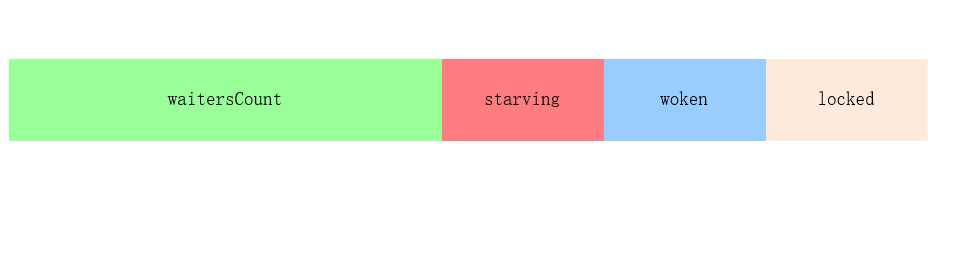

# Mutex 

[sync.Mutex](https://golang.org/pkg/sync/#Mutex)是Go标准库中常用的一个互斥锁。当一个 goroutine 获得了这个锁的拥有权后， 其它请求锁的 goroutine 就会阻塞在 `Lock` 方法的调用上，直到锁被释放。


## sync.Mutex 简单的使用

```go
type Source struct {
	counter  int64
	sync.Mutex
}

func (s *Source) Add(counter int64)  {
	s.Lock()
	s.counter += counter
	defer s.Unlock()
}

func (s *Source)Counter() int64  {
	s.Lock()
	defer s.Unlock()

	return s.counter
}

func main() {
	// 互斥锁
	s := &Source{}
	for i:=0;i< 50 ;i++ {
		go func() {
			s.Add(10)
		}()
	}

	time.Sleep(1 * time.Second)

	fmt.Println(s.Counter())
}

```

#sync.Mutex 的结构

sync.Mutex 由两个字段state 和 sema 组成。`state` 表示当前互斥锁的状态，而 `sema` 是用于控制锁状态的信号量。


```go
// A Mutex is a mutual exclusion lock.
// The zero value for a Mutex is an unlocked mutex.
//
// A Mutex must not be copied after first use.
type Mutex struct {
	state int32
	sema  uint32
}

const (
	mutexLocked = 1 << iota // mutex is locked 
	mutexWoken      // 表示从正常模式被从唤醒
	mutexStarving   // 饥饿模式
	mutexWaiterShift = iota
	starvationThresholdNs = 1e6 //饥饿模式阈值：超1ms获取不到锁则进入饥饿模式
)

```

互斥锁的状态比较多，如下图所示，最低三位分别表示 `mutexLocked`、`mutexWoken` 和 `mutexStarving`，剩下的位置用来表示当前有多少个 Goroutine 在等待互斥锁的释放



在默认情况下，互斥锁的所有状态位都是 0，`int32` 中的不同位分别表示了不同的状态：

- `mutexLocked` — 表示互斥锁的锁定状态；
- `mutexWoken` — 表示从正常模式被从唤醒；
- `mutexStarving` — 当前的互斥锁进入饥饿状态；
- `waitersCount` — 当前互斥锁上等待的 Goroutine 个数；


# 源码

Go Mutex 中有一段注释来解释为何需要饥饿模式 

```
// Mutex fairness.
//
// Mutex can be in 2 modes of operations: normal and starvation.
// In normal mode waiters are queued in FIFO order, but a woken up waiter
// does not own the mutex and competes with new arriving goroutines over
// the ownership. New arriving goroutines have an advantage -- they are
// already running on CPU and there can be lots of them, so a woken up
// waiter has good chances of losing. In such case it is queued at front
// of the wait queue. If a waiter fails to acquire the mutex for more than 1ms,
// it switches mutex to the starvation mode.
//
// In starvation mode ownership of the mutex is directly handed off from
// the unlocking goroutine to the waiter at the front of the queue.
// New arriving goroutines don't try to acquire the mutex even if it appears
// to be unlocked, and don't try to spin. Instead they queue themselves at
// the tail of the wait queue.
//
// If a waiter receives ownership of the mutex and sees that either
// (1) it is the last waiter in the queue, or (2) it waited for less than 1 ms,
// it switches mutex back to normal operation mode.
//
// Normal mode has considerably better performance as a goroutine can acquire
// a mutex several times in a row even if there are blocked waiters.
// Starvation mode is important to prevent pathological cases of tail latency.
```

大概的意思是

```
// 公平锁
//
// 锁有两种模式：正常模式和饥饿模式。
// 在正常模式下，所有的等待锁的goroutine都会存在一个先进先出的队列中（轮流被唤醒）
// 但是一个被唤醒的goroutine并不是直接获得锁，而是仍然需要和那些新请求锁的（new arrivial）
// 的goroutine竞争，而这其实是不公平的，因为新请求锁的goroutine有一个优势——它们正在CPU上
// 运行，并且数量可能会很多。所以一个被唤醒的goroutine拿到锁的概率是很小的。在这种情况下，
// 这个被唤醒的goroutine会加入到队列的头部。如果一个等待的goroutine有超过1ms（写死在代码中）
// 都没获取到锁，那么就会把锁转变为饥饿模式。
//
// 在饥饿模式中，锁的所有权会直接从释放锁(unlock)的goroutine转交给队列头的goroutine，
// 新请求锁的goroutine就算锁是空闲状态也不会去获取锁，并且也不会尝试自旋。它们只是排到队列的尾部。
//
// 如果一个goroutine获取到了锁之后，它会判断以下两种情况：
// 1. 它是队列中最后一个goroutine；
// 2. 它拿到锁所花的时间小于1ms；
// 以上只要有一个成立，它就会把锁转变回正常模式。

// 正常模式会有比较好的性能，因为即使有很多阻塞的等待锁的goroutine，
// 一个goroutine也可以尝试请求多次锁。
// 饥饿模式对于防止尾部延迟来说非常的重要。
```


#  Lock

```go
// Lock locks m.
// If the lock is already in use, the calling goroutine
// blocks until the mutex is available.
func (m *Mutex) Lock() {
		// 锁的状态是 0 时，将 mutexLocked 位置成 1
   if atomic.CompareAndSwapInt32(&m.state, 0, mutexLocked) {
      if race.Enabled {
         race.Acquire(unsafe.Pointer(m))
      }
      return
   }
   // Slow path (outlined so that the fast path can be inlined)
   m.lockSlow()
}


```

如果互斥锁的状态不是 0 时就会调用 [`sync.Mutex.lockSlow`](https://draveness.me/golang/tree/sync.Mutex.lockSlow) 尝试通过自旋（Spinnig）等方式等待锁的释放，该方法的主体是一个非常大 for 循环，这里将它分成几个部分介绍获取锁的过程：

1. 判断当前 Goroutine 能否进入自旋；

2. 通过自旋等待互斥锁的释放；

3. 计算互斥锁的最新状态；

4. 更新互斥锁的状态并获取锁；


## 判断当前的Gourtine 能否进入自旋

```go
func (m *Mutex) lockSlow() {
  //标记本goroutine的等待时间
	var waitStartTime int64
  //是否处于饥饿模式
	starving := false
  //goroutine是否已唤醒
	awoke := false
  //自旋的次数
	iter := 0
	//获取当前锁的状态
	old := m.state
	for {
    // old&(mutexLocked|mutexStarving) == mutexLocked  表示 
    // old mutexLocked = 1
    // old mutexStarving = 0 
		if old&(mutexLocked|mutexStarving) == mutexLocked && runtime_canSpin(iter) {
			// Active spinning makes sense.
			// Try to set mutexWoken flag to inform Unlock
			// to not wake other blocked goroutines.
       // 自旋的过程中如果发现state还没有设置woken标识，则设置它的woken标识， 并标记自己为被唤醒。
			if !awoke && old&mutexWoken == 0 && old>>mutexWaiterShift != 0 &&
				atomic.CompareAndSwapInt32(&m.state, old, old|mutexWoken) {
				awoke = true
			}
      //自旋获取锁
			runtime_doSpin()
			iter++
			old = m.state
			continue
		}
    
```

自旋是一种多线程同步机制，当前的进程在进入自旋的过程中会一直保持 CPU 的占用，持续检查某个条件是否为真，耗费较多的资源。所以 Goroutine 进入自旋的条件非常苛刻。

- 运行在多 CPU 的机器上；
- 当前 Goroutine 为了获取该锁进入自旋的次数小于四次；
- 至少存在一个P 且 local q 队列中的g是空

runtime_canSpin 最终会被指向runtime 中的 [`runtime.sync_runtime_canSpin`](https://draveness.me/golang/tree/runtime.sync_runtime_canSpin) ,runtime_doSpin最终会指向[`runtime.sync_runtime_doSpin`](https://draveness.me/golang/tree/runtime.sync_runtime_doSpin)

```go
// Active spinning for sync.Mutex.
//go:linkname sync_runtime_canSpin sync.runtime_canSpin
//go:nosplit
func sync_runtime_canSpin(i int) bool {
	// sync.Mutex is cooperative, so we are conservative with spinning.
	// Spin only few times and only if running on a multicore machine and
	// GOMAXPROCS>1 and there is at least one other running P and local runq is empty.
	// As opposed to runtime mutex we don't do passive spinning here,
	// because there can be work on global runq or on other Ps.
  // 运行在多 CPU 的机器上；
  // 当前 Goroutine 为了获取该锁进入自旋的次数小于四次；
  // 至少存在一个P 且 local q 队列中的g是空
	if i >= active_spin || ncpu <= 1 || gomaxprocs <= int32(sched.npidle+sched.nmspinning)+1 {
		return false
	}
	if p := getg().m.p.ptr(); !runqempty(p) {
		return false
	}
	return true
}

func sync_runtime_doSpin() 
	procyield(active_spin_cnt) // active_spin_cnt = 30 
}

TEXT runtime·procyield(SB),NOSPLIT,$0-0
	MOVL	cycles+0(FP), AX  // AX = 30 
again:
	PAUSE   //PAUSE指令。PAUSE指令什么都不做，但是会消耗CPU时间，在执行PAUSE指令时， CPU不会对他做不必要的优化。
	SUBL	$1, AX  //
	JNZ	again
	RET
```


处理了自旋相关的特殊逻辑之后，互斥锁会根据上下文计算当前互斥锁最新的状态。几个不同的条件分别会更新 `state` 字段中存储的不同信息 — `mutexLocked`、`mutexStarving`、`mutexWoken` 和 `mutexWaiterShift`：

```go
		new := old
		//如果old state状态不是饥饿状态, new state 设置锁， 尝试通过CAS获取锁,
		if old&mutexStarving == 0 {
			new |= mutexLocked
		}
	
		// 锁属于锁定状态或者饥饿状，将等待队列的等待者的数量加1
		if old&(mutexLocked|mutexStarving) != 0 {
			new += 1 << mutexWaiterShift
		}
		
		// 如果当前goroutine已经处于饥饿状态， 并且old state的已被加锁,
    // 将new state的状态标记为饥饿状态, 将锁转变为饥饿状态.
		if starving && old&mutexLocked != 0 {
			new |= mutexStarving
		}
	// 如果本goroutine已经设置为唤醒状态, 需要清除new state的唤醒标记, 因为本goroutine要么获得了锁，要么进入休眠，
  // 总之state的新状态不再是woken状态.
	if awoke {
			// The goroutine has been woken from sleep,
			// so we need to reset the flag in either case.
			if new&mutexWoken == 0 {
				throw("sync: inconsistent mutex state")
			}
			new &^= mutexWoken
	}


```


- 
   	2. 当前groutine 为了获取该锁进入自旋的次数小于四次
   	3. 当前机器上至少存在一个正在运行的处理器 P 并且处理的运行队列为空


处理了自旋相关的特殊逻辑之后，互斥锁会根据上下文计算当前互斥锁最新的状态。几个不同的条件分别会更新 `state` 字段中存储的不同信息 — `mutexLocked`、`mutexStarving`、`mutexWoken` 和 `mutexWaiterShift`：

```go
		new := old
	// Don't try to acquire starving mutex, new arriving goroutines must queue.
	// 如果old state状态不是饥饿状态, new state 设置锁， 尝试通过CAS获取锁,
  //如果old state状态是饥饿状态, 则不设置new state的锁，因为饥饿状态下锁直接转给等待队列的第一个.
	if old&mutexStarving == 0 {
			new |= mutexLocked
		}

	 //锁属于锁定状态或者饥饿状，将等待队列的等待者的数量加1
	if old&(mutexLocked|mutexStarving) != 0 {
			new += 1 << mutexWaiterShift
	}
   // 如果当前goroutine已经处于饥饿状态， 并且old state的已被加锁,
    // 将new state的状态标记为饥饿状态, 将锁转变为饥饿状态.
		if starving && old&mutexLocked != 0 {
			new |= mutexStarving
		}
		// 如果本goroutine已经设置为唤醒状态, 需要清除new state的唤醒标记, 因为本goroutine要么获得了锁，要么进入休眠，
    // 总之state的新状态不再是woken状态.
		if awoke {
			new &^= mutexWoken
		}

```


计算了新的互斥锁状态之后，会使用 CAS 函数 [`sync/atomic.CompareAndSwapInt32`](https://draveness.me/golang/tree/sync/atomic.CompareAndSwapInt32) 更新状态：


```go
if atomic.CompareAndSwapInt32(&m.state, old, new) {
  		// old state 没有被改写，且old为非锁或饥饿状态，说明通过cas 获取到了锁
			if old&(mutexLocked|mutexStarving) == 0 { 
				break // locked the mutex with CAS
			}
			// If we were already waiting before, queue at the front of the queue.
  	
			queueLifo := waitStartTime != 0
  		// 等待锁的时间
			if waitStartTime == 0 {
				waitStartTime = runtime_nanotime()
			}
  		//过信号量保证资源不会被两个 Goroutine 获取。runtime.sync_runtime_SemacquireMutex 
			//会在方法中不断尝试获取锁并陷入休眠等待信号量的释放，一旦当前 Goroutine 可以获取信号量，它就会立刻返回，说明当前的locked 0 
			runtime_SemacquireMutex(&m.sema, queueLifo, 1)
			starving = starving || runtime_nanotime()-waitStartTime > starvationThresholdNs
			old = m.state
      
  		
  		//处于饥饿状态，在饥饿模式下，当前 Goroutine 会获得互斥锁
			if old&mutexStarving != 0 {
				// If this goroutine was woken and mutex is in starvation mode,
				// ownership was handed off to us but mutex is in somewhat
				// inconsistent state: mutexLocked is not set and we are still
				// accounted as waiter. Fix that.
				if old&(mutexLocked|mutexWoken) != 0 || old>>mutexWaiterShift == 0 {
					throw("sync: inconsistent mutex state")
				}
				delta := int32(mutexLocked - 1<<mutexWaiterShift)
				if !starving || old>>mutexWaiterShift == 1 {
					// Exit starvation mode.
					// Critical to do it here and consider wait time.
					// Starvation mode is so inefficient, that two goroutines
					// can go lock-step infinitely once they switch mutex
					// to starvation mode.
					delta -= mutexStarving
				}
				atomic.AddInt32(&m.state, delta)
				break
			}
			awoke = true
			iter = 0
		} else {
			old = m.state
		}
```


# UnLock

```go
func (m *Mutex) Unlock() {
	new := atomic.AddInt32(&m.state, -mutexLocked)
	if new != 0 {
		m.unlockSlow(new)
	}
}

func (m *Mutex) unlockSlow(new int32) {
	if (new+mutexLocked)&mutexLocked == 0 {
		throw("sync: unlock of unlocked mutex")
	}
	if new&mutexStarving == 0 { //正常模式
		old := new
		for {
			// If there are no waiters or a goroutine has already
			// been woken or grabbed the lock, no need to wake anyone.
			// In starvation mode ownership is directly handed off from unlocking
			// goroutine to the next waiter. We are not part of this chain,
			// since we did not observe mutexStarving when we unlocked the mutex above.
			// So get off the way.
      // 互斥锁不存在等待者
      // `mutexLocked`、`mutexStarving`、`mutexWoken` 状态不都为 0，
			if old>>mutexWaiterShift == 0 || old&(mutexLocked|mutexWoken|mutexStarving) != 0 {
				return
			}
			// Grab the right to wake someone.
     //  如果互斥锁存在等待者，会通过 [`sync.runtime_Semrelease`](https://draveness.me/golang/tree/sync.runtime_Semrelease) 唤醒等待者并移交锁的所有权；
			new = (old - 1<<mutexWaiterShift) | mutexWoken
			if atomic.CompareAndSwapInt32(&m.state, old, new) {
				runtime_Semrelease(&m.sema, false, 1)
				return
			}
			old = m.state
		}
	} else { //饥饿模式
		// Starving mode: handoff mutex ownership to the next waiter, and yield
		// our time slice so that the next waiter can start to run immediately.
		// Note: mutexLocked is not set, the waiter will set it after wakeup.
		// But mutex is still considered locked if mutexStarving is set,
		// so new coming goroutines won't acquire it.
		runtime_Semrelease(&m.sema, true, 1)//当前锁交给下一个正在尝试获取锁的等待者，等待者被唤醒后会得到锁，在这时互斥锁还不会退出饥饿状态；

==
	}
}

```


