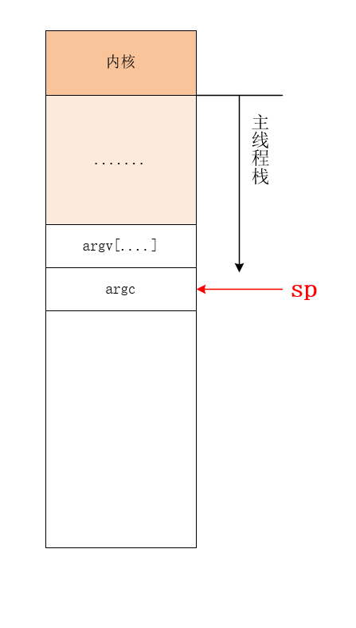
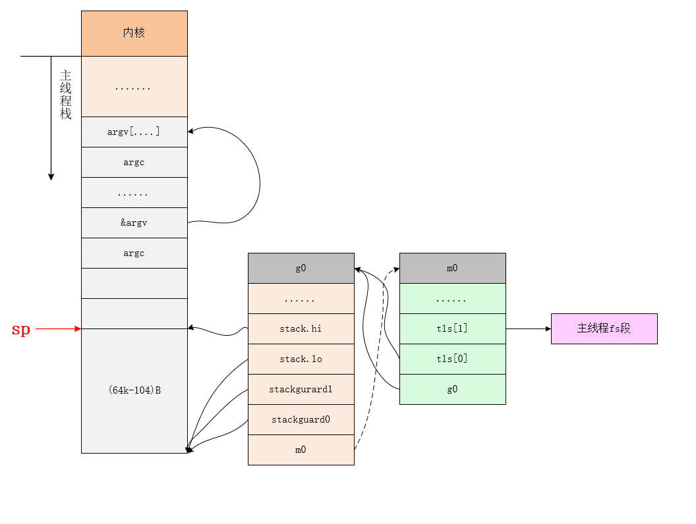
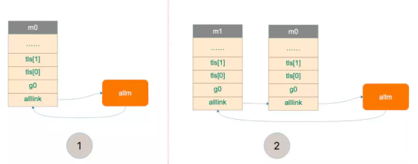
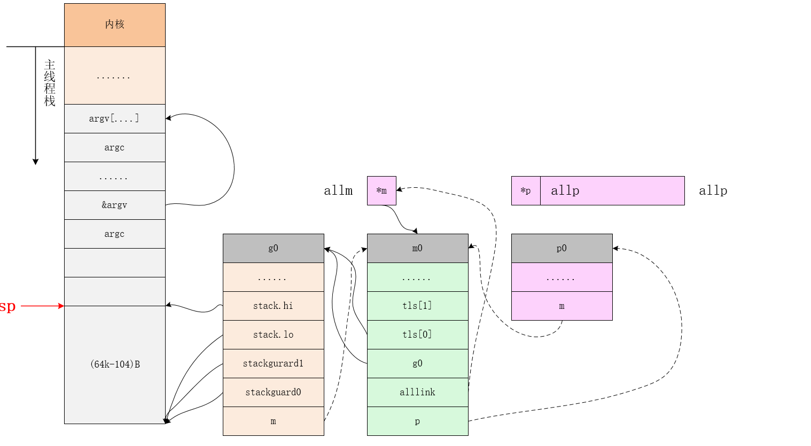

# 开始

我们从一个 `HelloWorld` 的例子来回顾一下 Go 程序初始化的过程：

```go
package main

import "fmt"

func main() {
	fmt.Println("Hello")
}

```


在项目根目录下执行：

```
go build -gcflags "-N -l" -o hello main.go
```

`-gcflags"-N -l"` 是为了关闭编译器优化和函数内联，防止后面在设置断点的时候找不到相对应的代码位置。

得到了可执行文件 `hello`，执行：

```shell
 sudo gdb hello 
GNU gdb (GDB) 10.1
Copyright (C) 2020 Free Software Foundation, Inc.
License GPLv3+: GNU GPL version 3 or later <http://gnu.org/licenses/gpl.html>
This is free software: you are free to change and redistribute it.
There is NO WARRANTY, to the extent permitted by law.
Type "show copying" and "show warranty" for details.
This GDB was configured as "x86_64-apple-darwin19.6.0".
Type "show configuration" for configuration details.
For bug reporting instructions, please see:
<https://www.gnu.org/software/gdb/bugs/>.
Find the GDB manual and other documentation resources online at:
    <http://www.gnu.org/software/gdb/documentation/>.

For help, type "help".
Type "apropos word" to search for commands related to "word"...
Reading symbols from hello...
(No debugging symbols found in hello)
Loading Go Runtime support.
(gdb) info files
Symbols from "/Users/linyuanpeng/workplace/go/src/github.com/bspp1314/go-common-lib/sched-lib/hello".
Local exec file:
        `/Users/linyuanpeng/workplace/go/src/github.com/bspp1314/go-common-lib/sched-lib/hello', file type mach-o-x86-64.
        Entry point: 0x1063c80
        0x0000000001001000 - 0x00000000010a6b73 is .text
        0x00000000010a6b80 - 0x00000000010ee254 is __TEXT.__rodata
        0x00000000010ee260 - 0x00000000010ee386 is __TEXT.__symbol_stub1
        0x00000000010ee3a0 - 0x00000000010eeb40 is __TEXT.__typelink
        0x00000000010eeb40 - 0x00000000010eebb0 is __TEXT.__itablink
        0x00000000010eebb0 - 0x00000000010eebb0 is __TEXT.__gosymtab
        0x00000000010eebc0 - 0x0000000001155cb0 is __TEXT.__gopclntab
        0x0000000001156000 - 0x0000000001156020 is __DATA.__go_buildinfo
        0x0000000001156020 - 0x00000000011561a8 is __DATA.__nl_symbol_ptr
        0x00000000011561c0 - 0x00000000011646c0 is __DATA.__noptrdata
        0x00000000011646c0 - 0x000000000116b7f0 is .data
        0x000000000116b800 - 0x000000000119b830 is .bss
        0x000000000119b840 - 0x000000000119df08 is __DATA.__noptrbss
(gdb) b *0x1063c80
```

这样我们就得到了入口函数,接下来我们就不用改用dlv来调试了

```go
 dlv exec hello 
Type 'help' for list of commands.
(dlv) break *0x106e660
Breakpoint 1 set at 0x106e660 for _rt0_amd64_darwin() /usr/local/go/src/runtime/rt0_darwin_amd64.s:8
```

该打开golang的源码

```go
/usr/local/go/src/runtime/rt0_darwin_amd64.s:8
TEXT _rt0_amd64_darwin(SB),NOSPLIT,$-8
	JMP	_rt0_amd64(SB)
```

跳转到 _rt0_amd64(SB)

```go
// /usr/local/go/src/runtime/asm_amd64.s:10
// _rt0_amd64 is common startup code for most amd64 systems when using
// internal linking. This is the entry point for the program from the
// kernel for an ordinary -buildmode=exe program. The stack holds the
// number of arguments and the C-style argv.
TEXT _rt0_amd64(SB),NOSPLIT,$-8
	MOVQ	0(SP), DI	// argc  //将参数 argc的内存地址 存放在 寄存器 DI 里面
	LEAQ	8(SP), SI	// argv  /计算内存地址，然后把内存地址本身放进寄存器里，也就是把 argv 的地址放到了 SI 寄存器中。最后跳转到 rumtine.rt0_go
	JMP	runtime·rt0_go(SB)
```

# rt0_go 

主要是把 argc，argv 从内存拉到了寄存器。这里 LEAQ 是计算内存地址，然后把内存地址本身放进寄存器里，也就是把 argv 的地址放到了 SI 寄存器中。最后跳转到 rumtine.rt0_go

```go
TEXT runtime·rt0_go(SB),NOSPLIT,$0
	// copy arguments forward on an even stack
	MOVQ	DI, AX		// argc
	MOVQ	SI, BX		// argv
	
  //// 调整栈顶寄存器使其按 16 个字节对齐
	SUBQ	$(4*8+7), SP		
	ANDQ	$~15, SP

	//拷贝寄存器的值到stack 
	MOVQ	AX, 16(SP)
	MOVQ	BX, 24(SP)

	// create istack out of the given (operating system) stack.
	// _cgo_init may update stackguard.
	// 初始化 g0 
	MOVQ	$runtime·g0(SB), DI
	LEAQ	(-64*1024+104)(SP), BX
	MOVQ	BX, g_stackguard0(DI)
	MOVQ	BX, g_stackguard1(DI)
	MOVQ	BX, (g_stack+stack_lo)(DI)
	MOVQ	SP, (g_stack+stack_hi)(DI)

	// find out information about the processor we're on
	MOVL	$0, AX
	CPUID
	MOVL	AX, SI
	CMPL	AX, $0
	JE	nocpuinfo

	// Figure out how to serialize RDTSC.
	// On Intel processors LFENCE is enough. AMD requires MFENCE.
	// Don't know about the rest, so let's do MFENCE.
	CMPL	BX, $0x756E6547  // "Genu"
	JNE	notintel
	CMPL	DX, $0x49656E69  // "ineI"
	JNE	notintel
	CMPL	CX, $0x6C65746E  // "ntel"
	JNE	notintel
	MOVB	$1, runtime·isIntel(SB)
	MOVB	$1, runtime·lfenceBeforeRdtsc(SB)
notintel:

	// Load EAX=1 cpuid flags
	MOVL	$1, AX
	CPUID
	MOVL	AX, runtime·processorVersionInfo(SB)

nocpuinfo:
	// if there is an _cgo_init, call it.
	MOVQ	_cgo_init(SB), AX
	TESTQ	AX, AX
	JZ	needtls
	// arg 1: g0, already in DI
	MOVQ	$setg_gcc<>(SB), SI // arg 2: setg_gcc
#ifdef GOOS_android
	MOVQ	$runtime·tls_g(SB), DX 	// arg 3: &tls_g
	// arg 4: TLS base, stored in slot 0 (Android's TLS_SLOT_SELF).
	// Compensate for tls_g (+16).
	MOVQ	-16(TLS), CX
#else
	MOVQ	$0, DX	// arg 3, 4: not used when using platform's TLS
	MOVQ	$0, CX
#endif
#ifdef GOOS_windows
	// Adjust for the Win64 calling convention.
	MOVQ	CX, R9 // arg 4
	MOVQ	DX, R8 // arg 3
	MOVQ	SI, DX // arg 2
	MOVQ	DI, CX // arg 1
#endif
	CALL	AX

	// update stackguard after _cgo_init
	MOVQ	$runtime·g0(SB), CX
	MOVQ	(g_stack+stack_lo)(CX), AX
	ADDQ	$const__StackGuard, AX
	MOVQ	AX, g_stackguard0(CX)
	MOVQ	AX, g_stackguard1(CX)

#ifndef GOOS_windows
	JMP ok
#endif
needtls:
#ifdef GOOS_plan9
	// skip TLS setup on Plan 9
	JMP ok
#endif
#ifdef GOOS_solaris
	// skip TLS setup on Solaris
	JMP ok
#endif
#ifdef GOOS_illumos
	// skip TLS setup on illumos
	JMP ok
#endif
#ifdef GOOS_darwin
	// skip TLS setup on Darwin
	JMP ok
#endif

	LEAQ	runtime·m0+m_tls(SB), DI
	CALL	runtime·settls(SB)

	// store through it, to make sure it works
	get_tls(BX)
	MOVQ	$0x123, g(BX)
	MOVQ	runtime·m0+m_tls(SB), AX
	CMPQ	AX, $0x123
	JEQ 2(PC)
	CALL	runtime·abort(SB)
ok:
	// set the per-goroutine and per-mach "registers"
	get_tls(BX)
	LEAQ	runtime·g0(SB), CX
	MOVQ	CX, g(BX)
	LEAQ	runtime·m0(SB), AX

	// save m->g0 = g0
	MOVQ	CX, m_g0(AX)
	// save m0 to g0->m
	MOVQ	AX, g_m(CX)

	CLD				// convention is D is always left cleared
	CALL	runtime·check(SB)

	MOVL	16(SP), AX		// copy argc
	MOVL	AX, 0(SP)
	MOVQ	24(SP), AX		// copy argv
	MOVQ	AX, 8(SP)
	CALL	runtime·args(SB)
	CALL	runtime·osinit(SB)
	CALL	runtime·schedinit(SB)

	// create a new goroutine to start program
	MOVQ	$runtime·mainPC(SB), AX		// entry
	PUSHQ	AX
	PUSHQ	$0			// arg size
	CALL	runtime·newproc(SB)
	POPQ	AX
	POPQ	AX

	// start this M
	CALL	runtime·mstart(SB)

	CALL	runtime·abort(SB)	// mstart should never return
	RET

	// Prevent dead-code elimination of debugCallV1, which is
	// intended to be called by debuggers.
	MOVQ	$runtime·debugCallV1(SB), AX
	RET

DATA	runtime·mainPC+0(SB)/8,$runtime·main(SB)
GLOBL	runtime·mainPC(SB),RODATA,$8

TEXT runtime·breakpoint(SB),NOSPLIT,$0-0
	BYTE	$0xcc
	RET

TEXT runtime·asminit(SB),NOSPLIT,$0-0
	// No per-thread init.
	RET
```

下面就开始初始化 g0化全局变量,g0的主要作用是提供一个栈供runtime代码执行，下面这段代码主要对g0进行一些初始化

```go
	// 将 g0的内存地址放入 DI 之中
	MOVQ	$runtime·g0(SB), DI
	// BX = SP - 64*1024+104
	LEAQ	(-64*1024+104)(SP), BX
	//g0.stackguard0 = SP - 64*1024 + 104
	MOVQ	BX, g_stackguard0(DI)
	//go.stackguard1 = SP - 64*1024 + 104
	MOVQ	BX, g_stackguard1(DI)
	//g0.stack.lo  = SP - 64*1024 + 104
	MOVQ	BX, (g_stack+stack_lo)(DI)
  //g0.stack.hi  = SP  
	MOVQ	SP, (g_stack+stack_hi)(DI)
```

运行完这段代码之后,运行完上面这几行指令后g0与栈之间的关系如下图所示：




# 主线程和m0的绑定

```go
	
  // set DI = &(m0.tls) 
	LEAQ	runtime·m0+m_tls(SB), DI
	///调用settls设置线程本地存储，settls函数的参数在DI寄存器中
  CALL	runtime·settls(SB)

	// store through it, to make sure it works
	//验证tls是否可以正常工作,获取fs段基地址并放入BX寄存器，其实就是m0.tls[1]的地址，get_tls的代码由编译器生成
  get_tls(BX)
	//把整型常量0x123拷贝到fs段基地址偏移-8的内存位置，也就是m0.tls[0] = 0x123
	MOVQ	$0x123, g(BX)
	//获取  AX = m0.tls[0]
	MOVQ	runtime·m0+m_tls(SB), AX
	//检查m0.tls[0]的值是否是通过线程本地存储存入的0x123来验证tls功能是否正常
	CMPQ	AX, $0x123
	JEQ 2(PC)
	CALL	runtime·abort(SB)//如果线程本地存储不能正常工作，退出程序
```


settls 是干嘛的？

> 因为 m0 是全局变量，而 m0 又要绑定到工作线程才能执行。我们又知道，runtime 会启动多个工作线程，每个线程都会绑定一个 m0。而且，代码里还得保持一致，都是用 m0 来表示。这就要用到线程本地存储的知识了，也就是常说的 TLS（Thread Local Storage）。简单来说，TLS 就是线程本地的私有的全局变量。
> 一般而言，全局变量对进程中的多个线程同时可见。进程中的全局变量与函数内定义的静态（static）变量，是各个线程都可以访问的共享变量。一个线程修改了，其他线程就会“看见”。要想搞出一个线程私有的变量，就需要用到 TLS 技术。
> 如果需要在一个线程内部的各个函数调用都能访问、但其它线程不能访问的变量（被称为 static memory local to a thread，线程局部静态变量），就需要新的机制来实现。这就是 TLS。


settl是每种操作系统都不一样，由于mac系统tls已经由系统实现，所以我们这里可以看linux 

```go
// set tls base to DI
TEXT runtime·settls(SB),NOSPLIT,$32
	...
	// 这里DI保存的是m0.tls[0]的地址
	// 执行	ADDQ	$8, DI，DI保存的就是 m0.tls[1]的地址
	ADDQ	$8, DI	// ELF wants to use -8(FS)
	// move di to si 
	MOVQ	DI, SI
  //mv 0x1002 to di，si holds second argument to the  arch_prctl system call 
	MOVQ	$0x1002, DI	// ARCH_SET_FS,di holds first argument to the  arch_prctl system call 
  MOVQ	$SYS_arch_prctl, AX   // 系统调用编号
	SYSCALL
	CMPQ	AX, $0xfffffffffffff001
	JLS	2(PC)
	MOVL	$0xf1, 0xf1  // crash //系统调用失败退出
	RET

```

[arch_prtl是干嘛](https://mp.weixin.qq.com/s?__biz=MzU1OTg5NDkzOA==&mid=2247483769&idx=1&sn=3d77609a293d87e64639afc8d2219e1c&scene=19#wechat_redirect) 

> arch_prctl系统调用把m0.tls[1]的地址设置成了fs段的段基址。CPU中有个叫fs的段寄存器与之对应，而每个线程都有自己的一组CPU寄存器值，操作系统在把线程调离CPU运行时会帮我们把所有寄存器中的值保存在内存中，调度线程起来运行时又会从内存中把这些寄存器的值恢复到CPU，这样，在此之后，工作线程代码就可以通过fs寄存器来找到m.tls，读者可以参考上面初始化tls之后对tls功能验证的代码来理解这一过程。


继续看源码， m0.tls 地址存储到 DI 寄存器，再调用 settls 完成 tls 的设置，tls 是 m 结构体中的一个数组。

```go
// thread-local storage (for x86 extern register)
tls [6]uintptr
```

设置完 tls 之后，又来了一段验证上面 settls 是否能正常工作。如果不能，会直接 crash。

```go
	get_tls(BX)
	MOVQ	$0x123, g(BX)
	MOVQ	runtime·m0+m_tls(SB), AX
	CMPQ	AX, $0x123
	JEQ 2(PC)
	CALL	runtime·abort(SB)
```


第一行代码，获取 tls， `get_tls(BX)` 的代码由编译器生成，源码中并没有看到，可以理解为将 `m.tls` 的地址存入 BX 寄存器。

L2 将一个数 `0x123` 放入 `m.tls[0]` 处，L3 则将 `m.tls[0]` 处的数据取出来放到 AX 寄存器，L4 则比较两者是否相等。如果相等，则跳过 L6 行的代码，否则执行 L6，程序 crash。

继续看代码：


继续下一段代码


```go
	// set the per-goroutine and per-mach "registers"
	// 获取fs段基地址并放入BX寄存器
	get_tls(BX)
	// CX = &g0 
	LEAQ	runtime·g0(SB), CX
	//把g0的地址保存在线程本地存储里面，也就是m0.tls[0]=&g0
	MOVQ	CX, g(BX)
	// AX = &m0 
	LEAQ	runtime·m0(SB), AX

	// save m->g0 = g0
	// m0.g0 = g0
	MOVQ	CX, m_g0(AX)
	// save m0 to g0->m
	// g0.m0 = m0 
	MOVQ	AX, g_m(CX)
```

这一段代码的主要功能是将m0 和 go 进行版本

```go
tls[0] = g0
m0.g0 = &g0
g0.m = &m0
```

这一段执行完之后，就把 m0，g0，m.tls[0] 串联起来了。通过 m.tls[0] 可以找到 g0，通过 g0 可以找到 m0（通过 g 结构体的 m 字段）。并且，通过 m 的字段 g0，m0 也可以找到 g0。于是，主线程和 m0，g0 就关联起来了。




继续看一下代码

```go
	MOVL	16(SP), AX		// copy argc
	MOVL	AX, 0(SP)
	MOVQ	24(SP), AX		// copy argv
	MOVQ	AX, 8(SP)
	// set args and env 
	CALL	runtime·args(SB)
	// set cpu num and page size 
	CALL	runtime·osinit(SB)
	CALL	runtime·schedinit(SB)
```
这段代码初始是 初始化一些系统设置和调度，我们主要来看 schedinit 

# 初始化schedule 


```go
func schedinit() {
  //初始化锁
	lockInit(&sched.lock, lockRankSched)
	...
  
	// raceinit must be the first call to race detector.
	// In particular, it must be done before mallocinit below calls racemapshadow.
	// 获取当前的 g 
   //getg函数在源代码中没有对应的定义，由编译器插入类似下面两行代码
   //get_tls(CX)
   //MOVQ g(CX), BX; BX存器里面现在放的是当前g结构体对象的地址,g0的地址保存在线程本地存储里面，也就是m0.tls[0]=&g0
  _g_ := getg()
	if raceenabled {
		_g_.racectx, raceprocctx0 = raceinit()
	}

   //设置最多启动10000个操作系统线程，也是最多10000个M
	sched.maxmcount = 10000

	tracebackinit()
	moduledataverify()
	stackinit()
	mallocinit()
	fastrandinit() // must run before mcommoninit
	mcommoninit(_g_.m, -1)
	cpuinit()       // must run before alginit
	alginit()       // maps must not be used before this call
	modulesinit()   // provides activeModules
	typelinksinit() // uses maps, activeModules
	itabsinit()     // uses activeModules

	msigsave(_g_.m)
	initSigmask = _g_.m.sigmask

	goargs()
	goenvs()
	parsedebugvars()
	gcinit()

	sched.lastpoll = uint64(nanotime())
	procs := ncpu//系统中有多少核，就创建和初始化多少个p结构体对象
	if n, ok := atoi32(gogetenv("GOMAXPROCS")); ok && n > 0 {
    //如果环境变量指定了GOMAXPROCS，则创建指定数量的p
		procs = n
	}
	if procresize(procs) != nil {//创建和初始化全局变量allp
		throw("unknown runnable goroutine during bootstrap")
	}

	// For cgocheck > 1, we turn on the write barrier at all times
	// and check all pointer writes. We can't do this until after
	// procresize because the write barrier needs a P.
	if debug.cgocheck > 1 {
		writeBarrier.cgo = true
		writeBarrier.enabled = true
		for _, p := range allp {
			p.wbBuf.reset()
		}
	}

	if buildVersion == "" {
		// Condition should never trigger. This code just serves
		// to ensure runtime·buildVersion is kept in the resulting binary.
		buildVersion = "unknown"
	}
	if len(modinfo) == 1 {
		// Condition should never trigger. This code just serves
		// to ensure runtime·modinfo is kept in the resulting binary.
		modinfo = ""
	}
}
```

这个函数开头的注释很贴心地把 Go 程序初始化的过程又说了一遍：

1. call osinit。初始化系统核心数。
2. call schedinit。初始化调度器。
3. make & queue new G。创建新的 goroutine。
4. call runtime·mstart。调用 mstart，启动调度。
5. The new G calls runtime·main。在新的 goroutine 上运行 runtime.main 函数。

函数首先调用 `getg()` 函数获取当前正在运行的 `g`， `getg()` 在 `src/runtime/stubs.go` 中声明，真正的代码由编译器生成。


继续往下看：

```
sched.maxmcount = 10000
```

设置最多只能创建 10000 个工作线程。

然后，调用了一堆 init 函数，初始化各种配置，现在不去深究。只关心本小节的重点，m0 的初始化：


# 初始化 m0 

```go
// Pre-allocated ID may be passed as 'id', or omitted by passing -1.
func mcommoninit(mp *m, id int64) {
  //初始化过程中_g_ = g0
	_g_ := getg()

	// g0 stack won't make sense for user (and is not necessary unwindable).
	if _g_ != _g_.m.g0 {
    //函数调用栈traceback
		callers(1, mp.createstack[:])
	}

	lock(&sched.lock)

	if id >= 0 {
		mp.id = id
	} else {
    //生成以及检查id是否超出项目，1000
		mp.id = mReserveID()
	}
	
  //随机种子
	mp.fastrand[0] = uint32(int64Hash(uint64(mp.id), fastrandseed))
	mp.fastrand[1] = uint32(int64Hash(uint64(cputicks()), ^fastrandseed))
	if mp.fastrand[0]|mp.fastrand[1] == 0 {
		mp.fastrand[1] = 1
	}

  // 初始化 gsignal
	mpreinit(mp)
	if mp.gsignal != nil {
		mp.gsignal.stackguard1 = mp.gsignal.stack.lo + _StackGuard
	}

	// Add to allm so garbage collector doesn't free g->m
	// when it is just in a register or thread-local storage.
  //将 m 挂到全局变量 allm 上，allm 是一个指向 m 的的指针。
	mp.alllink = allm

	// NumCgoCall() iterates over allm w/o schedlock,
	// so we need to publish it safely.
 // 这一行将 allm 变成 m 的地址，这样变成了一个循环链表。之后再新建 m 的时候，新 m 的 alllink 就会指向本次的 m，最后 allm 又会指向新创建的 m。
	atomicstorep(unsafe.Pointer(&allm), unsafe.Pointer(mp))
	unlock(&sched.lock)

	// Allocate memory to hold a cgo traceback if the cgo call crashes.
	if iscgo || GOOS == "solaris" || GOOS == "illumos" || GOOS == "windows" {
		mp.cgoCallers = new(cgoCallers)
	}
}

```

因为 sched 是一个全局变量，多个线程同时操作 sched 会有并发问题，因此先要加锁，操作结束之后再解锁。

```go
if id >= 0 {
		mp.id = id
	} else {
		mp.id = mReserveID()
	}
	
// mReserveID returns the next ID to use for a new m. This new m is immediately
// considered 'running' by checkdead.
//
// sched.lock must be held.
func mReserveID() int64 {
	if sched.mnext+1 < sched.mnext {
		throw("runtime: thread ID overflow")
	}
	id := sched.mnext
	sched.mnext++
	checkmcount()
	return id
}	
```

可以看到，m0 的 id 是 0，并且之后创建的 m 的 id 是递增的。`checkmcount()` 函数检查已创建系统线程是否超过了数量限制（10000）。


```
mp.alllink = allm
```

将 m 挂到全局变量 allm 上，allm 是一个指向 m 的的指针。

```
atomicstorep(unsafe.Pointer(&allm), unsafe.Pointer(mp))
```

这一行将 allm 变成 m 的地址，这样变成了一个循环链表。之后再新建 m 的时候，新 m 的 alllink 就会指向本次的 m，最后 allm 又会指向新创建的 m。




上图中，1 将 m0 挂在 allm 上。之后，若新创建 m，则 m1 会和 m0 相连。


# 初始化 allp 

从schedule 跳过一些其他的初始化代码，继续往后看：

```go
	procs := ncpu
	if n, ok := atoi32(gogetenv("GOMAXPROCS")); ok && n > 0 {
		procs = n
	}
	if procresize(procs) != nil {
		throw("unknown runnable goroutine during bootstrap")
	}

```

这里就是设置 procs，它决定创建 P 的数量。ncpu 这里已经被赋上了系统的核心数，因此代码里不设置 GOMAXPROCS 也是没问题的。这里还限制了 procs 的最大值，为 1024。

来看最后一个核心的函数：

```go
// Change number of processors. The world is stopped, sched is locked.
// gcworkbufs are not being modified by either the GC or
// the write barrier code.
// Returns list of Ps with local work, they need to be scheduled by the caller.
func procresize(nprocs int32) *p {
  //系统初始化时 gomaxprocs = 0
	old := gomaxprocs
	.....
  
	// Grow allp if necessary.
  if nprocs > int32(len(allp)) {//系统初始好时候len(allp) == 0 
		// Synchronize with retake, which could be running
		// concurrently since it doesn't run on a P.
		lock(&allpLock)
		if nprocs <= int32(cap(allp)) {
			allp = allp[:nprocs]
		} else {
      //初始化时进入此分支，创建allp 切片
			nallp := make([]*p, nprocs)
			// Copy everything up to allp's cap so we
			// never lose old allocated Ps.
			copy(nallp, allp[:cap(allp)])
			allp = nallp
		}
		unlock(&allpLock)
	}

	// initialize new P's
    //循环创建nprocs个p并完成基本初始化
	for i := old; i < nprocs; i++ {
		pp := allp[i]
		if pp == nil {
			pp = new(p)//调用内存分配器从堆上分配一个struct p
		}
		pp.init(i)
		atomicstorep(unsafe.Pointer(&allp[i]), unsafe.Pointer(pp))
	}

	_g_ := getg()
	if _g_.m.p != 0 && _g_.m.p.ptr().id < nprocs {//初始化时m0->p还未初始化，所以不会执行这个分支
		// continue to use the current P
		_g_.m.p.ptr().status = _Prunning
		_g_.m.p.ptr().mcache.prepareForSweep()
	} else {
		// release the current P and acquire allp[0].
		//
		// We must do this before destroying our current P
		// because p.destroy itself has write barriers, so we
		// need to do that from a valid P.
		if _g_.m.p != 0 {//初始化时这里不执行
			if trace.enabled {
				// Pretend that we were descheduled
				// and then scheduled again to keep
				// the trace sane.
				traceGoSched()
				traceProcStop(_g_.m.p.ptr())
			}
			_g_.m.p.ptr().m = 0
		}
    
		_g_.m.p = 0
		p := allp[0]
		p.m = 0
		p.status = _Pidle
    //把p和m0关联起来
		acquirep(p)
		if trace.enabled {
			traceGoStart()
		}
	}

	// g.m.p is now set, so we no longer need mcache0 for bootstrapping.
	mcache0 = nil

	// release resources from unused P's
	for i := nprocs; i < old; i++ {
		p := allp[i]
		p.destroy()
		// can't free P itself because it can be referenced by an M in syscall
	}

	// Trim allp.
	if int32(len(allp)) != nprocs {
		lock(&allpLock)
		allp = allp[:nprocs]
		unlock(&allpLock)
	}

	var runnablePs *p
	for i := nprocs - 1; i >= 0; i-- {
		p := allp[i]
		if _g_.m.p.ptr() == p {
			continue
		}
		p.status = _Pidle
		if runqempty(p) {
			pidleput(p)
		} else {
			p.m.set(mget())
			p.link.set(runnablePs)
			runnablePs = p
		}
	}
	stealOrder.reset(uint32(nprocs))
	var int32p *int32 = &gomaxprocs // make compiler check that gomaxprocs is an int32
	atomic.Store((*uint32)(unsafe.Pointer(int32p)), uint32(nprocs))
	return runnablePs
}
```

代码比较长，这个函数不仅是初始化的时候会执行到，在中途改变 procs 的值的时候，仍然会调用它。所有存在很多一般不用关心的代码，因为一般不会在中途重新设置 procs 的值。我把初始化无关的代码删掉了，这样会更清晰一些。

函数先是从堆上创建了 nproc 个 P，并且把 P 的状态设置为 _Pgcstop，现在全局变量 allp 里就维护了所有的 P。

接着，调用函数 acquirep 将 p0 和 m0 关联起来。我们来详细看一下：

```go
// Associate p and the current m.
//
// This function is allowed to have write barriers even if the caller
// isn't because it immediately acquires _p_.
//
//go:yeswritebarrierrec
func acquirep(_p_ *p) {
	// Do the part that isn't allowed to have write barriers.
	wirep(_p_)

	// Have p; write barriers now allowed.

	// Perform deferred mcache flush before this P can allocate
	// from a potentially stale mcache.
	_p_.mcache.prepareForSweep()

	if trace.enabled {
		traceProcStart()
	}
}

// wirep is the first step of acquirep, which actually associates the
// current M to _p_. This is broken out so we can disallow write
// barriers for this part, since we don't yet have a P.
//
//go:nowritebarrierrec
//go:nosplit
func wirep(_p_ *p) {
	_g_ := getg()

	if _g_.m.p != 0 {
		throw("wirep: already in go")
	}
	if _p_.m != 0 || _p_.status != _Pidle {
		id := int64(0)
		if _p_.m != 0 {
			id = _p_.m.ptr().id
		}
		print("wirep: p->m=", _p_.m, "(", id, ") p->status=", _p_.status, "\n")
		throw("wirep: invalid p state")
	}
	_g_.m.p.set(_p_)
	_p_.m.set(_g_.m)
	_p_.status = _Prunning
}

```

可以看到就是一些字段相互设置，执行完成后：
```
g0.m.p = p0
p0.m = m0
```

并且，p0 的状态变成了 _Prunning。

接下来是一个循环，它将除了 p0 的所有非空闲的 P，放入 P 链表 runnablePs，并返回给 procresize 函数的调用者，并由调用者来“调度”这些 P。

函数 runqempty 用来判断一个 P 是否是空闲，依据是 P 的本地 run queue 队列里有没有 runnable 的 G，如果没有，那 P 就是空闲的

```go
// runqempty reports whether _p_ has no Gs on its local run queue.
// It never returns true spuriously.
func runqempty(_p_ *p) bool {
	// Defend against a race where 1) _p_ has G1 in runqnext but runqhead == runqtail,
	// 2) runqput on _p_ kicks G1 to the runq, 3) runqget on _p_ empties runqnext.
	// Simply observing that runqhead == runqtail and then observing that runqnext == nil
	// does not mean the queue is empty.
	for {
		head := atomic.Load(&_p_.runqhead)
		tail := atomic.Load(&_p_.runqtail)
		runnext := atomic.Loaduintptr((*uintptr)(unsafe.Pointer(&_p_.runnext)))
		if tail == atomic.Load(&_p_.runqtail) {
			return head == tail && runnext == 0
		}
	}
}
```

并不是简单地判断 head == tail 并且 runnext == nil 为真，就可以说明 runq 是空的。因为涉及到一些数据竞争，例如在比较 head == tail 时为真，但此时 runnext 上其实有一个 G，之后再去比较 runnext == nil 的时候，这个 G 又通过 runqput跑到了 runq 里去了或者通过 runqget 拿走了，runnext 也为真，于是函数就判断这个 P 是空闲的，这就会形成误判。

因此 runqempty 函数先是通过原子操作取出了 head，tail，runnext，然后再次确认 tail 没有发生变化，最后再比较 head == tail 以及 runnext == nil，保证了在观察三者都是在“同时”观察到的，因此，返回的结果就是正确的。

说明一下，runnext 上有时会绑定一个 G，这个 G 是被当前 G 唤醒的，相比其他 G 有更高的执行优先级，因此把它单独拿出来。

函数的最后，初始化了一个“随机分配器”：

```go
stealOrder.reset(uint32(nprocs))
```

将来有些 m 去偷工作的时候，会遍历所有的 P，这时为了偷地随机一些，就会用到 stealOrder 来返回一个随机选择的 P，后面的文章会再讲。





# 参考 

TLS--线程局部存储 https://www.cnblogs.com/stli/archive/2010/11/03/1867852.html

arch_prctl https://www.yiibai.com/unix_system_calls/arch_prctl.html

TLS variable in Linux http://cwndmiao.github.io/operating%20system/2013/12/07/TLS/

86汇编之——8086寄存器讲解 https://zhuanlan.zhihu.com/p/115915986

Go语言goroutine调度器初始化 https://mp.weixin.qq.com/s?__biz=MzU1OTg5NDkzOA==&mid=2247483769&idx=1&sn=3d77609a293d87e64639afc8d2219e1c&scene=19#wechat_redirect

深入golang runtime的调度 https://zboya.github.io/post/go_scheduler/#%E7%90%86%E8%A7%A3%E8%B0%83%E5%BA%A6%E5%99%A8%E5%90%AF%E5%8A%A8