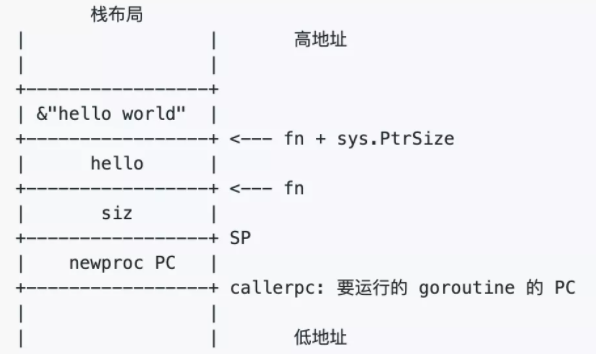
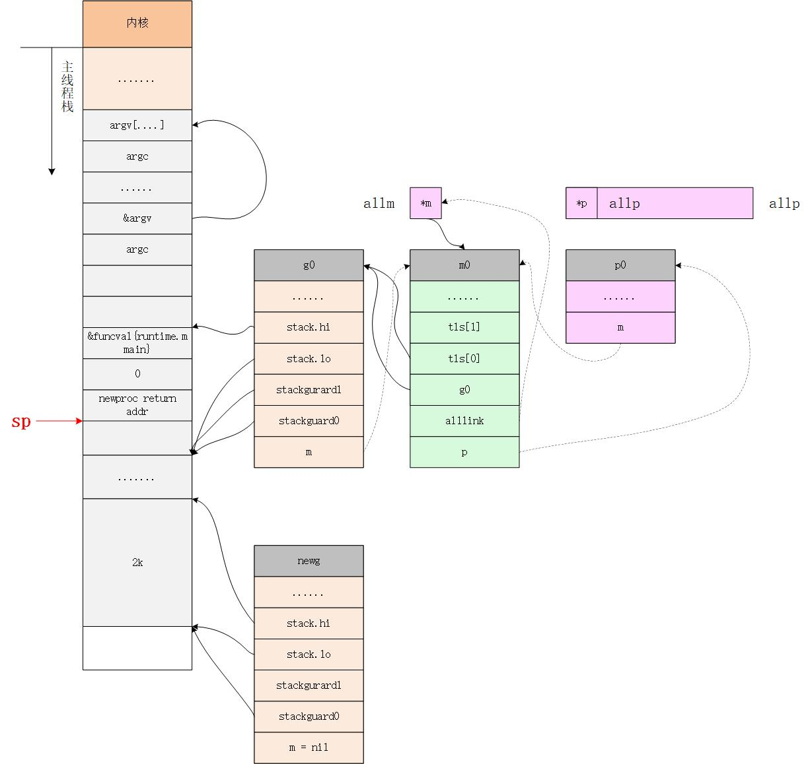
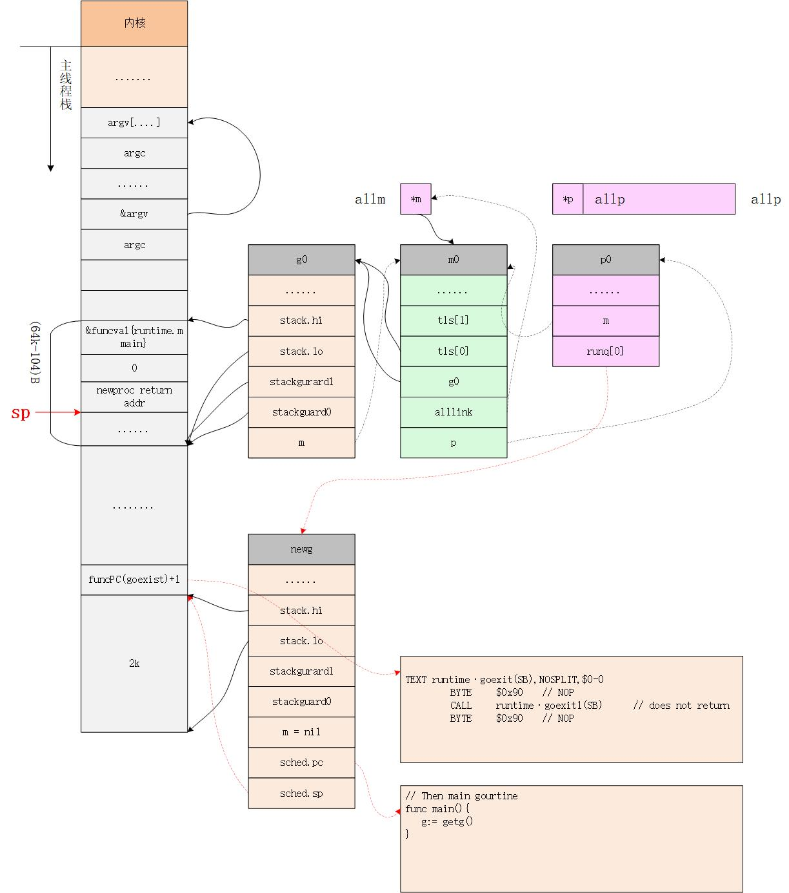

​	

# 创建 main gourtine 


schedinit完成调度系统初始化后，返回到rt0_go函数中开始调用newproc() ,创建一个新的goroutine用于执行mainPC所对应的runtime·main函数

```go 
  // create a new goroutine to start program
	MOVQ	$runtime·mainPC(SB), AX		// entry mainPC是runtime.main
	//ewproc的第二个参数入栈，也就是新的goroutine需要执行的函数
	PUSHQ	AX       // AX = &funcval{runtime·main},
	PUSHQ	$0			// arg size
	CALL	runtime·newproc(SB) //newproc的第一个参数入栈，该参数表示runtime.main函数需要的参数大小，因为runtime.main没有参数，所以这里是0
	POPQ	AX  // 出栈第一个参数
	POPQ	AX  // 出栈第二个参数

	// start this M
	CALL	runtime·mstart(SB)

	CALL	runtime·abort(SB)	// mstart should never return
	RET
```


其中 L2 中的 runtime·mainPC(SB) 定义如下

```go
DATA	runtime·mainPC+0(SB)/8,$runtime·main(SB)
```


所以 mainPC 就是runtime.main  

通过  L4 ~ L5 调用 runtime.newproc函数 

# newproc

newproce 主要的功能是创建一个一个新的 g，运行 fn 函数，需要 siz byte 的参数

```go
// Create a new g running fn with siz bytes of arguments.
// Put it on the queue of g's waiting to run.
// The compiler turns a go statement into a call to this.
// 创建一个新的g,运行 fn 函数，需要 siz bby
// The stack layout of this call is unusual: it assumes that the
// arguments to pass to fn are on the stack sequentially immediately
// after &fn. Hence, they are logically part of newproc's argument
// frame, even though they don't appear in its signature (and can't
// because their types differ between call sites).
//
// This must be nosplit because this stack layout means there are
// untyped arguments in newproc's argument frame. Stack copies won't
// be able to adjust them and stack splits won't be able to copy them.
//go:nosplit
func newproc(siz int32, fn *funcval) {
  ......
  // fn 函数的地址
  // &fn 存放函数的栈地址
  // argp 指向fn函数的第一个参数
	argp := add(unsafe.Pointer(&fn), sys.PtrSize)
  .....
}
```

newproc 参数

-  第一个参数则是 runtime.main 函数的地址参数的大小。
- 第二个参数则是 runtime.main 函数的地址


为什么要给 `newproc` 传一个表示 fn 的参数大小的参数呢？


> 我们知道，goroutine 和线程一样，都有自己的栈，不同的是 goroutine 的初始栈比较小，只有 2K，而且是可伸缩的，这也是创建 goroutine 的代价比创建线程代价小的原因。
>
> 换句话说，每个 goroutine 都有自己的栈空间，newproc 函数会新创建一个新的 goroutine 来执行 fn 函数，在新 goroutine 上执行指令，就要用新 goroutine 的栈。而执行函数需要参数，这个参数又是在老的 goroutine 上，所以需要将其拷贝到新 goroutine 的栈上。拷贝的起始位置就是栈顶，这好办，那拷贝多少数据呢？由 siz 来确定。


继续看代码，newproc 函数的第二个参数：

```go
type funcval struct{
    fn uintptr
		// variable-size, fn-specific data here

}
```

它是一个变长结构，第一个字段是一个指针 fn，内存中，紧挨着 fn 的是函数的参数。

我们来看一个例子

```go
package main
func hello(msg string) {
    println(msg)
}
func main() {
    go hello("hello world")
}
```

其栈布局是这样的




栈顶是 siz，再往上是函数的地址，再往上就是传给 hello 函数的参数，string 在这里是一个地址。因此前面代码里先 push 参数的地址，再 push 参数大小。


```go
func newproc(siz int32, fn *funcval) {
	.....
  //获取正在运行的g，初始化时是m0.g0
	gp := getg()
  // 返回调用者的下一个执行地址,对于我们现在这个场景来说，pc就是CALLruntime·newproc(SB)指令后面的POPQ AX这条指令的地址
	pc := getcallerpc()
  //systemstack的作用是切换到g0栈执行作为参数的函数
  //我们这个场景现在本身就在g0栈
	systemstack(func() {
		newg := newproc1(fn, argp, siz, gp, pc)

		_p_ := getg().m.p.ptr()
		runqput(_p_, newg, true)

		if mainStarted {
			wakep()
		}
	})
}
```

接着通过 getcallerpc 获取调用者的指令地址，也就是调用 newproc 时由 call 指令压栈的函数返回地址，也就是 `runtime·rt0_go` 函数里 `CALL runtime·newproc(SB)` 指令后面的 `POPQ AX` 这条指令的地址


最后，调用 systemstack 函数在 g0 栈执行 fn 函数。由于本文讲述的是初始化过程中，由 `runtime·rt0_go` 函数调用，本身是在 g0 栈执行，因此会直接执行 fn 函数。而如果是我们在程序中写的 `go xxx` 代码，在执行时，就会先切换到 g0 栈执行，然后再切回来。

# newproc1 

newproc1通过调用 newproc1来创建一个信息的g，并把其放入当前的p中，等待调度，有于 newproc1比较长，所以需要一段一段的查看

```go

func newproc1(fn *funcval, argp unsafe.Pointer, narg int32, callergp *g, callerpc uintptr) *g {
  //因为已经切换到g0栈，所以无论什么场景都有 _g_ = g0，当然这个g0是指当前工作线程的g0
  //当前工作线程是主线程，所以这里的g0 = m0.g0
	_g_ := getg()

	if fn == nil {
		_g_.m.throwing = -1 // do not dump full stacks
		throw("go of nil func value")
	}
  //禁用标志位
	acquirem() // disable preemption because it can be holding p in a local var
	//参数加返回值所需要的空间（经过内存对齐）
  siz := narg
	siz = (siz + 7) &^ 7

	// We could allocate a larger initial stack if necessary.
	// Not worth it: this is almost always an error.
	// 4*sizeof(uintreg): extra space added below
	// sizeof(uintreg): caller's LR (arm) or return address (x86, in gostartcall).
	if siz >= _StackMin-4*sys.RegSize-sys.RegSize {
		throw("newproc: function arguments too large for new goroutine")
	}

  //当前工作绑定的p 
  // 始化时_p_ = g0.m.p，也就是allp[0]
	_p_ := _g_.m.p.ptr()
  //从p的本地缓冲里获取一个没有使用的g，初始化时没有，返回nil
	newg := gfget(_p_)
	if newg == nil {
    //  //new一个g结构体对象，然后从堆上为其分配栈，并设置g的stack成员和两个stackgard成员，StackMin为2k
		newg = malg(_StackMin)
		//初始化 g 的状态为 _Gdead
    casgstatus(newg, _Gidle, _Gdead)
		//放入全局变量 allgs 切片中
    allgadd(newg) // publishes with a g->status of Gdead so GC scanner doesn't look at uninitialized stack.
	}
	if newg.stack.hi == 0 {
		throw("newproc1: newg missing stack")
	}

	if readgstatus(newg) != _Gdead {
		throw("newproc1: new g is not Gdead")
	}

  
  // 计算运行空间大小，对齐
	totalSize := 4*sys.RegSize + uintptr(siz) + sys.MinFrameSize // extra space in case of reads slightly beyond frame
  totalSize += -totalSize & (sys.SpAlign - 1)                  // align to spAlign
	// 确定 sp 位置
  sp := newg.stack.hi - totalSize
  //确定参数入栈位置 
	spArg := sp
	if usesLR {
		// caller's LR
		*(*uintptr)(unsafe.Pointer(sp)) = 0
		prepGoExitFrame(sp)
		spArg += sys.MinFrameSize
	}
	if narg > 0 {
    //将参数从执行 newproc 函数的栈拷贝到新 g 的栈
		memmove(unsafe.Pointer(spArg), argp, uintptr(narg))
		...... 
	}
```

当前代码在 g0 栈上执行，因此执行完 `_g_:=getg()` 之后，无论是在什么情况下都可以得到 `_g_=g0`。之后通过 g0 找到其绑定的 P，也就是 p0。

接着，尝试从 p0 上找一个空闲的 G：

```go
// 从 p 的本地缓冲里获取一个没有使用的 g，初始化时为空，返回 nilnewg := gfget(_p_)
```


如果拿不到，则会在堆上创建一个新的 G，为其分配 2KB 大小的栈，并设置好新 goroutine 的 stack 成员，设置其状态为 _Gdead，并将其添加到全局变量 allgs 中。创建完成之后，我们就在堆上有了一个 2K 大小的栈





#  g0 栈和用户栈切换

`g0` 栈用于执行调度器的代码，执行完之后，要跳转到执行用户代码的地方，如何跳转？这中间涉及到栈和寄存器的切换。要知道，函数调用和返回主要靠的也是 CPU 寄存器的切换。 `goroutine` 的切换和此类似。


继续看 `proc1` 函数的代码。中间有一段调整运行空间的代码，计算出的结果一般为 0，也就是一般不会调整 SP 的位置，忽略好了。

```go
// 确定参数入栈位置
spArg := sp
```

参数的入参位置也是从 SP 处开始，通过：

```go
// 将参数从执行 newproc 函数的栈拷贝到新 g 的栈
memmove(unsafe.Pointer(spArg), unsafe.Pointer(argp), uintptr(narg))
```


将 fn 的参数从 g0 栈上拷贝到 newg 的栈上，memmove 函数需要传入源地址、目的地址、参数大小。由于 main 函数在这里没有参数需要拷贝，因此这里相当于没做什么。

接着，初始化 newg 的各种字段，而且涉及到最重要的 pc，sp 等字段


```go
func newproc1(fn *funcval, argp unsafe.Pointer, narg int32, callergp *g, callerpc uintptr) *g {
... 

// 把 newg.sched 分配内存
	memclrNoHeapPointers(unsafe.Pointer(&newg.sched), unsafe.Sizeof(newg.sched))
	//设置 newg 的 sched 成员，调度器需要依靠这些字段才能把 goroutine 调度到 CPU 上运行
  newg.sched.sp = sp//newg的栈顶
	newg.stktopsp = sp 
	 //newg.sched.pc表示当newg被调度起来运行时从这个地址开始执行指令
   //把pc设置成了goexit这个函数偏移1（sys.PCQuantum等于1）的位置，
   //至于为什么要这么做需要等到分析完gostartcallfn函数才知道
  newg.sched.pc = funcPC(goexit) + sys.PCQuantum // +PCQuantum so that previous instruction is in same function
	newg.sched.g = guintptr(unsafe.Pointer(newg))
	gostartcallfn(&newg.sched, fn)//调整sched成员和newg的栈
 return ...  
}
```

上面的代码首先对newg的sched 进行初始化,包含了调度器代码在调度gourtine到CPU运行时所必须的一些信息。

其中sched的sp成员表示newg被调度起来运行时使用的栈顶。

sched的pc成员表示当newg被调度起来运行时从这个地址开始执行指令

然而从上面的代码可以看到，new.sched.pc被设置成了goexit函数的第二条指令的地址而不是fn.fn，这是为什么呢？

```go
  newg.sched.pc = funcPC(goexit) + sys.PCQuantum // +PCQuantum so that previous instruction is in same function
```


## gostartcallfn 

要回答这个问题，必须深入到gostartcallfn函数中做进一步分析。


```go
// adjust Gobuf as if it executed a call to fn
// and then did an immediate gosave.
func gostartcallfn(gobuf *gobuf, fv *funcval) {
	var fn unsafe.Pointer
  //fv 不为空,从参数fv中提取出函数地址（初始化时是runtime.main），然后继续调用gostartcall函数。
	if fv != nil {
		fn = unsafe.Pointer(fv.fn)
	} else {
		fn = unsafe.Pointer(funcPC(nilfunc))
	}
	gostartcall(gobuf, fn, unsafe.Pointer(fv))
}

// adjust Gobuf as if it executed a call to fn with context ctxt
// and then did an immediate gosave.
func gostartcall(buf *gobuf, fn, ctxt unsafe.Pointer) {
  //newg的栈顶,目前newg栈上只有fn函数的参数，sp指向的是fn的第一参数
	sp := buf.sp
	if sys.RegSize > sys.PtrSize {
		sp -= sys.PtrSize
		*(*uintptr)(unsafe.Pointer(sp)) = 0
	}
  //这里在伪装fn是被goexit函数调用的，使得fn执行完后返回到goexit继续执行，从而完成清理工作

	sp -= sys.PtrSize
  //这里在伪装fn是被goexit函数调用的，使得fn执行完后返回到goexit继续执行，从而完成清理工作
	*(*uintptr)(unsafe.Pointer(sp)) = buf.pc//重新设置newg的栈顶寄存器
	buf.sp = sp
  //设置newg被CPU调度起来之后要执行的指令，这里就是runtime.main, 从而使newg得以在cpu上真正的运行起来
	buf.pc = uintptr(fn)
	buf.ctxt = ctxt
}


```

gostartcall函数的主要作用有两个：

1. **调整newg的栈空间，把goexit函数的第二条指令的地址入栈，伪造成goexit函数调用了fn，从而使fn执行完成后执行ret指令时返回到goexit继续执行完成最后的清理工作；**
2. **重新设置newg.buf.pc 为需要执行的函数的地址，即fn，我们这个场景为runtime.main函数的地址。**


调整完成newg的栈和sched成员之后，返回到newproc1函数，我们继续往下看，

```go

	 newg.gopc = callerpc//调用者的callerpc 
	newg.ancestors = saveAncestors(callergp)
 //设置newg的startpc为fn.fn，该成员主要用于函数调用栈的traceback和栈收缩
    //newg真正从哪里开始执行并不依赖于这个成员，而是sched.pc
	newg.startpc = fn.fn
.......
  //设置g的状态为_Grunnable，表示这个g代表的goroutine可以运行了
	casgstatus(newg, _Gdead, _Grunnable)

	//每个 P 每次会批量（16个）申请 id，每次调用 newproc 函数，新创建一个 goroutine，id 加 1。因此 g0 的 id 是 0，而 main goroutine 的 id 就是 1。
	if _p_.goidcache == _p_.goidcacheend {
		// Sched.goidgen is the last allocated id,
		// this batch must be [sched.goidgen+1, sched.goidgen+GoidCacheBatch].
		// At startup sched.goidgen=0, so main goroutine receives goid=1.
		_p_.goidcache = atomic.Xadd64(&sched.goidgen, _GoidCacheBatch)
		_p_.goidcache -= _GoidCacheBatch - 1
		_p_.goidcacheend = _p_.goidcache + _GoidCacheBatch
	}
	newg.goid = int64(_p_.goidcache)
	_p_.goidcache++

	return newg
}
```


`newg` 的状态变成可执行后（Runnable），就可以将它加入到 P 的本地运行队列里，等待调度。

```go
_p_ := getg().m.p.ptr()
		runqput(_p_, newg, true)


// runqput tries to put g on the local runnable queue.
// If next is false, runqput adds g to the tail of the runnable queue.
// If next is true, runqput puts g in the _p_.runnext slot.
// If the run queue is full, runnext puts g on the global queue.
// Executed only by the owner P.
func runqput(_p_ *p, gp *g, next bool) {
	if randomizeScheduler && next && fastrand()%2 == 0 {
		next = false
	}

 
	if next {
	retryNext:
		oldnext := _p_.runnext
		if !_p_.runnext.cas(oldnext, guintptr(unsafe.Pointer(gp))) {
			goto retryNext
		}
		if oldnext == 0 {
			return
		}
		// Kick the old runnext out to the regular run queue.
	// 原本存放在 runnext 的 gp 放入 runq 的尾部
    gp = oldnext.ptr()
	}

retry:
	h := atomic.LoadAcq(&_p_.runqhead) // load-acquire, synchronize with consumers
	t := _p_.runqtail
	if t-h < uint32(len(_p_.runq)) {
		_p_.runq[t%uint32(len(_p_.runq))].set(gp)
		atomic.StoreRel(&_p_.runqtail, t+1) // store-release, makes the item available for consumption
		return
	}
	if runqputslow(_p_, gp, h, t) {
		return
	}
	// the queue is not full, now the put above must succeed
	goto retry
}
```


runqput 函数的就是把 g 加入到 P里面，这里有三种情况

- next  is false,将g加入 p 里面g队列添加到可运行队列的尾部
- next is false, 将g放入 p.runnext
- 如果 run queue 满了，runnext 将 g 放到全局队列里


