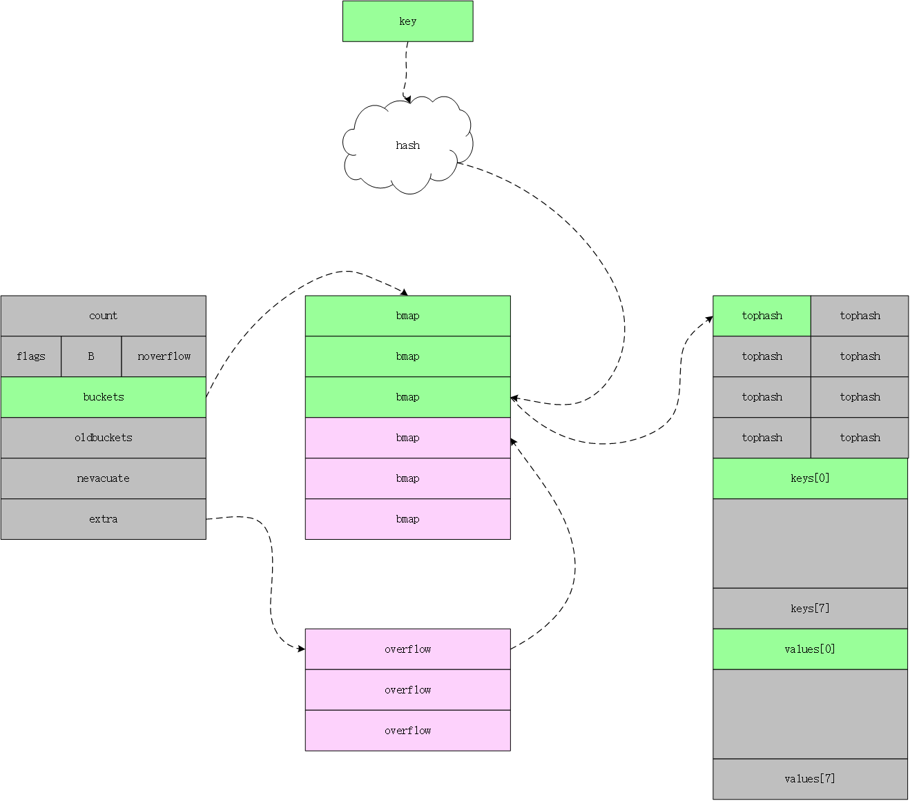

哈希表的设计思想

- map 内部采用的是数组存储 KV，每个数组元素可以认为是一个桶
- key 经过哈希算法后再与 map的数组长度取模映射到某个桶中
- 如果多个 key 映射到了相同的桶，就意味着出现了哈希冲突，解决冲突的方式有两种：开放寻址法和链表法
- 当 KV 过多时，map 就需要扩容（因为数组是固定大小的），扩容的策略是新分配一个更大的数组，然后在插入和删除 key 的时候，将对应的桶的数据搬移到新分配的数组的桶中。这种方式把扩容所需要的 O(n) 时间开销均摊到了 O(1) 的插入和删除操作中。
- map 中用装载因子（map中元素的个数 / map的容量）来表示空闲位置的情况。装载因子越大，说明空闲位置越少，冲突越多。


Go 语言运行时同时使用了多个数据结构组合表示哈希表，其中使用 [`hmap`](https://github.com/golang/go/blob/ed15e82413c7b16e21a493f5a647f68b46e965ee/src/runtime/map.go#L115-L129) 结构体来表示哈希

```go
// A header for a Go map.
type hmap struct {
	// Note: the format of the hmap is also encoded in cmd/compile/internal/gc/reflect.go.
	// Make sure this stays in sync with the compiler's definition.
	count     int // # live cells == size of map.  Must be first (used by len() builtin)
	flags     uint8
	B         uint8  // log_2 of # of buckets (can hold up to loadFactor * 2^B items)
	noverflow uint16 // approximate number of overflow buckets; see incrnoverflow for details
	hash0     uint32 // hash seed

	buckets    unsafe.Pointer // array of 2^B Buckets. may be nil if count==0.
	oldbuckets unsafe.Pointer // previous bucket array of half the size, non-nil only when growing
	nevacuate  uintptr        // progress counter for evacuation (buckets less than this have been evacuated)

	extra *mapextra // optional fields
}

// A bucket for a Go map.
type bmap struct {
	// tophash generally contains the top byte of the hash value
	// for each key in this bucket. If tophash[0] < minTopHash,
	// tophash[0] is a bucket evacuation state instead.
	tophash [bucketCnt]uint8
	// Followed by bucketCnt keys and then bucketCnt elems.
	// NOTE: packing all the keys together and then all the elems together makes the
	// code a bit more complicated than alternating key/elem/key/elem/... but it allows
	// us to eliminate padding which would be needed for, e.g., map[int64]int8.
	// Followed by an overflow pointer.
}
```

- count 表示当前哈希表中的元素数量
- B 表示当前哈希表持有的 `buckets` 数量，但是因为哈希表中桶的数量都 2 的倍数，所以该字段会存储对数，也就是 `len(buckets) == 2^B`
- `hash0` 是哈希的种子，它能为哈希函数的结果引入随机性，这个值在创建哈希表时确定，并在调用哈希函数时作为参数传入
- buckets 桶
- oldbuckets 是哈希在扩容时用于保存之前 `buckets` 的字段，它的大小是当前 `buckets` 的一半；

`hmap` 的桶就是 `bmap`，每一个 `bmap` 都能存储 8 个键值对，当哈希表中存储的数据过多，单个桶无法装满时就会使用 `extra.overflow` 中桶存储溢出的数据。上述两种不同的桶在内存中是连续存储的，我们在这里将它们分别称为正常桶和溢出桶。





# 初始化


```go
// makemap implements Go map creation for make(map[k]v, hint).
// If the compiler has determined that the map or the first bucket
// can be created on the stack, h and/or bucket may be non-nil.
// If h != nil, the map can be created directly in h.
// If h.buckets != nil, bucket pointed to can be used as the first bucket.
func makemap(t *maptype, hint int, h *hmap) *hmap {
	mem, overflow := math.MulUintptr(uintptr(hint), t.bucket.size)
	if overflow || mem > maxAlloc {
		hint = 0
	}

	// initialize Hmap
	//初始化好 hamp 
  if h == nil {
		h = new(hmap)
	}
	h.hash0 = fastrand()

	// Find the size parameter B which will hold the requested # of elements.
	// For hint < 0 overLoadFactor returns false since hint < bucketCnt.
	B := uint8(0)
  // 找到满足 loadFactor * 2^B >= hint 的 B，其中 loadFactor = loadFactorNum / loadFactorDen = 13 / 2 = 6.5 
	for overLoadFactor(hint, B) {
		B++
	}
	h.B = B

	// allocate initial hash table
	// if B == 0, the buckets field is allocated lazily later (in mapassign)
	// If hint is large zeroing this memory could take a while.
	if h.B != 0 {
		var nextOverflow *bmap
    // // makeBucketArray 中会判断 h.B 是否 >= 4，如果是，则会分配 nextOverflow，即overflow bucket
		h.buckets, nextOverflow = makeBucketArray(t, h.B, nil)
		if nextOverflow != nil {
			h.extra = new(mapextra)
			h.extra.nextOverflow = nextOverflow
		}
	}

	return h
}

```


```go
// makeBucketArray initializes a backing array for map buckets.
// 1<<b is the minimum number of buckets to allocate.
// dirtyalloc should either be nil or a bucket array previously
// allocated by makeBucketArray with the same t and b parameters.
// If dirtyalloc is nil a new backing array will be alloced and
// otherwise dirtyalloc will be cleared and reused as backing array.
func makeBucketArray(t *maptype, b uint8, dirtyalloc unsafe.Pointer) (buckets unsafe.Pointer, nextOverflow *bmap) {
	base := bucketShift(b)
	nbuckets := base
	// For small b, overflow buckets are unlikely.
	// Avoid the overhead of the calculation.
  //如果 b >=4 ,就会额外创建 2 << 4  个溢出桶
	if b >= 4 {
		// Add on the estimated number of overflow buckets
		// required to insert the median number of elements
		// used with this value of b.
		nbuckets += bucketShift(b - 4)
		sz := t.bucket.size * nbuckets
		up := roundupsize(sz)
		if up != sz {
			nbuckets = up / t.bucket.size
		}
	}

	if dirtyalloc == nil {
		buckets = newarray(t.bucket, int(nbuckets))
	} else {
		......
	}
	if base != nbuckets {
		// We preallocated some overflow buckets.
		// To keep the overhead of tracking these overflow buckets to a minimum,
		// we use the convention that if a preallocated overflow bucket's overflow
		// pointer is nil, then there are more available by bumping the pointer.
		// We need a safe non-nil pointer for the last overflow bucket; just use buckets.
		nextOverflow = (*bmap)(add(buckets, base*uintptr(t.bucketsize)))
		last := (*bmap)(add(buckets, (nbuckets-1)*uintptr(t.bucketsize)))
		last.setoverflow(t, (*bmap)(buckets))
	}
	return buckets, nextOverflow
}

```

当桶的数量小于 $2^4$ 时，由于数据较少、使用溢出桶的可能性较低，这时就会省略创建的过程以减少额外开销；当桶的数量多于 $2^4$ 时，就会额外创建 $2^{B-4}$ 个溢出桶，根据上述代码，我们能确定正常桶和溢出桶在内存中的存储空间是连续的，只是被 `hmap` 中的不同字段引用。