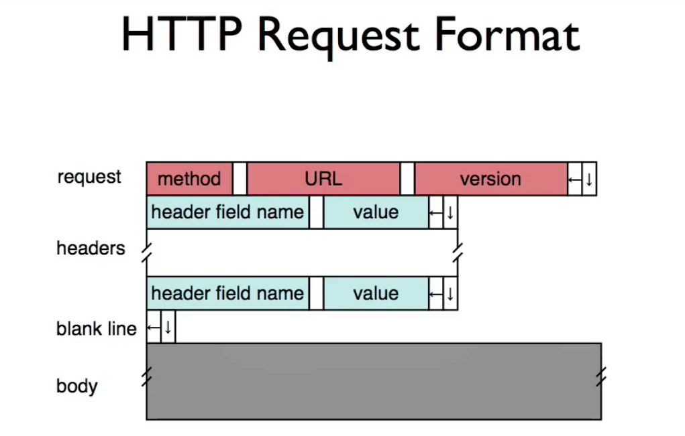
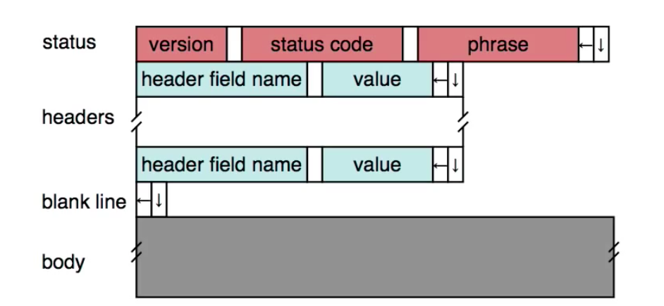
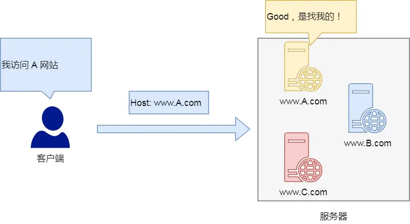
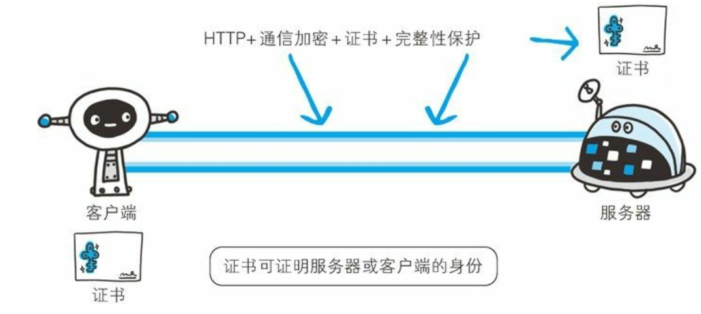
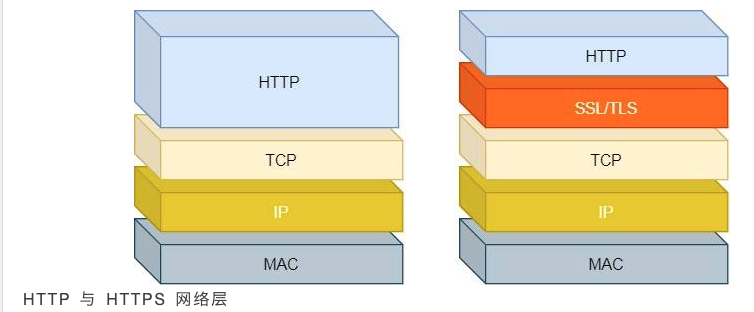
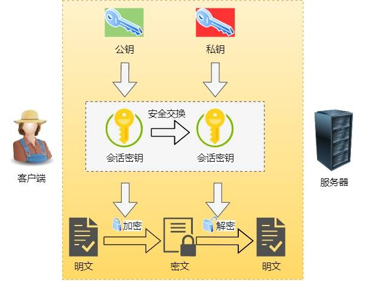
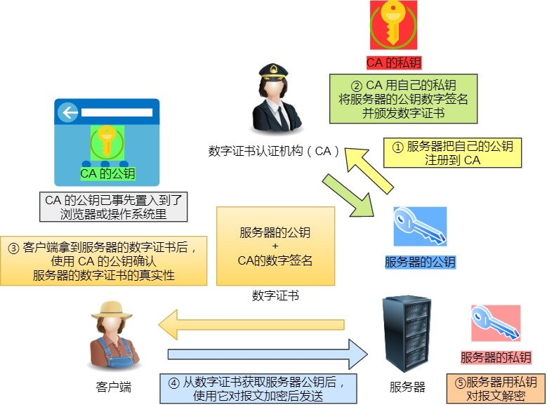
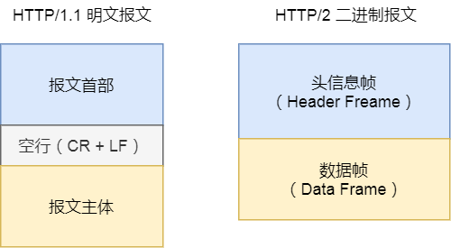
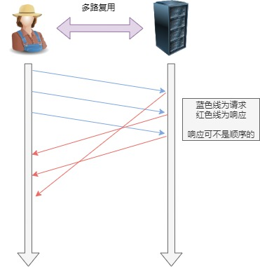

# HTTP 的基本概念


## HTTP 是什么 ？ 

HTTP 是超文本传输协议，也就是**H**yperText **T**ransfer **P**rotocol。


## HTTP 报文



```http
GET / HTTP/1.1
Host: www.baidu.com
User-Agent: curl/7.64.1
Accept: */*

HTTP/1.1 200 OK
Accept-Ranges: bytes
Cache-Control: private, no-cache, no-store, proxy-revalidate, no-transform
Connection: keep-alive
Content-Length: 2381
Content-Type: text/html
Date: Mon, 05 Apr 2021 07:35:01 GMT
Etag: "588604c8-94d"
Last-Modified: Mon, 23 Jan 2017 13:27:36 GMT
Pragma: no-cache
Server: bfe/1.0.8.18
Set-Cookie: BDORZ=27315; max-age=86400; domain=.baidu.com; path=/
<!DOCTYPE html>
....
</htmp>
```


HTTP 请求报文的格式

```
方法 URL   协议版本
//请求首部字段
// body
```


HTTP 响应报文格式



```
版本号 状态码 状态码信息
//请求首部字段
// body
```


## HTTP 常见的状态码

| 状态码 | 具体含义                                               | 常见的状态码   |
| ------ | ------------------------------------------------------ | -------------- |
| 1XX    | 提示信息，表示目前协议处理的中间状态，还需要后需要操作 |                |
| 2XX    | 成功，报文已经收到并被正确处理                         | 200 204 206    |
| 3XX    | 重定向，资源位置发生变动，需要客户端重新发起请求       | 301 302 304    |
| 4XX    | 客户端错误                                             | 400 404 405    |
| 5XX    | 服务器错误                                             | 500 501 502 50 |

- 1XX

  `1XX` 类状态码属于**提示信息**，是协议处理中的一种中间状态，实际用到的比较少。

- 2XX

  `2XX` 类状态码表示服务器**成功**处理了客户端的请求，也是我们最愿意看到的状态。

  - 「**200 OK**」是最常见的成功状态码，表示一切正常。如果是非 `HEAD` 请求，服务器返回的响应头都会有 body 数据。
  
- 「**204 No Content**」也是常见的成功状态码，与 200 OK 基本相同，但响应头没有 body 数据。
  
  - 「**206 Partial Content**」是应用于 HTTP 分块下载或断点续传，表示响应返回的 body 数据并不是资源的全部，而是其中的一部分，也是服务器处理成功的状态。
  
- 3XX 

  类状态码表示客户端请求的资源发送了变动，需要客户端用新的 URL 重新发送请求获取资源，也就是**重定向**。

  - 「**301 Moved Permanently**」表示永久重定向，说明请求的资源已经不存在了，需改用新的 URL 再次访问。
  - 「**302 Found**」表示临时重定向，说明请求的资源还在，但暂时需要用另一个 URL 来访问。301 和 302 都会在响应头里使用字段 `Location`，指明后续要跳转的 URL，浏览器会自动重定向新的 URL。
  - 「**304 Not Modified**」不具有跳转的含义，表示资源未修改，重定向已存在的缓冲文件，也称缓存重定向，用于缓存控制。

- 4XX

  `4XX` 类状态码表示客户端发送的**报文有误**，服务器无法处理，也就是错误码的含义。

  - 「**400 Bad Request**」表示客户端请求的报文有错误，但只是个笼统的错误。

  - 「**403 Forbidden**」表示服务器禁止访问资源，并不是客户端的请求出错。

  - 「**404 Not Found**」表示请求的资源在服务器上不存在或未找到，所以无法提供给客户端。

- 5XX

  `5XX` 类状态码表示客户端请求报文正确，但是**服务器处理时内部发生了错误**，属于服务器端的错误码。

  			- 「**500 Internal Server Error**」与 400 类型，是个笼统通用的错误码，服务器发生了什么错误，我们并不知道。
  			-  「**501 Not Implemented**」表示客户端请求的功能还不支持，类似“即将开业，敬请期待”的意思。
  			- 「**502 Bad Gateway**」通常是服务器作为网关或代理时返回的错误码，表示服务器自身工作正常，访问后端服务器发生了错误。
  			-   「**503 Service Unavailable**」表示服务器当前很忙，暂时无法响应服务器，类似“网络服务正忙，请稍后重试”的意思


## HTTP 头部常见字段

### Host 字段

客户端发送请求时，用来指定服务器的域名。




有了 `Host` 字段，就可以将请求发往「同一台」服务器上的不同网站。


### Content-Length 字段

服务器在返回数据时，会有 `Content-Length` 字段，表明本次回应的数据长度。

```
Content-Length: 1000
```

如上面则是告诉浏览器，本次服务器回应的数据长度是 1000 个字节，后面的字节就属于下一个回应了。


### Connection 字段

`Connection` 字段最常用于客户端要求服务器使用 TCP 持久连接，以便其他请求复用。


HTTP/1.1 版本的默认连接都是持久连接，但为了兼容老版本的 HTTP，需要指定 `Connection` 首部字段的值为 `Keep-Alive`。

```
Connection: keep-alive
```

一个可以复用的 TCP 连接就建立了，直到客户端或服务器主动关闭连接。但是，这不是标准字段。


### Content-Type 字段

`Content-Type` 字段用于服务器回应时，告诉客户端，本次数据是什么格式。

常见的Content-Type 有如下

常见的媒体格式类型如下：

- text/html ： HTML格式
- text/plain ：纯文本格式
- application/json： JSON数据格式
- application/octet-stream ： 二进制流数据（如常见的文件下载）


### Content-Encoding 字段

`Content-Encoding` 字段说明数据的压缩方法。表示服务器返回的数据使用了什么压缩格式。

```
Content-Encoding: gzip
```


上面表示服务器返回的数据采用了 gzip 方式压缩，告知客户端需要用此方式解压。

客户端在请求时，用 `Accept-Encoding` 字段说明自己可以接受哪些压缩方法。

```
Accept-Encoding: gzip, deflate
```


# HTTP 和 HTTPS 

## HTTP 的缺点


HTTP 主要有这些不足， 例举如下。

- 通信使用明文（ 不加密） ， 内容可能会被窃听，比如通信链路上可以获取通信内容，用户号容易没。
- 不验证通信方的身份， 因此有可能遭遇伪装，比如冒充淘宝网站，用户钱容易没。
- 无法证明报文的完整性， 所以有可能已遭篡改，比如强制植入垃圾广告，视觉污染，用户眼容易瞎。


## HTTPS

如果在 `HTTP` 协议通信过程中使用未经加密的明文， 比如在 `Web` 页面中输入信用卡号， 如果这条通信线路遭到窃听， 那么信用卡号就暴露了。另外， 对于 HTTP 来说， 服务器也好， 客户端也好， 都是没有办法确认通信方的。 因为很有可能并不是和原本预想的通信方在实际通信。并且还需要考虑到接收到的报文在通信途中已经遭到篡改这一可能
性。


为了统一解决上述这些问题， 需要在 HTTP 上再加入加密处理和认证等机制。 我们把添加了加密及认证机制的 HTTP 称为 HTTPS（HTTP
Secure） 。




### 什么是HTTPS


`HTTPS` 并非是应用层的一种新协议。 只是 `HTTP` 通信接口部分用SSL（Secure Socket Layer） 和 `TLS（Transport Layer Security）` 协议代替而已。通常，` HTTP `直接和 `TCP` 通信。 当使用 `SSL`时， 则演变成先和 `SSL`通信， 再由 SSL和 `TCP` 通信了。 简言之， 所谓 `HTTPS`， 其实就是身披`SSL`协议这层外壳的 `HTTP`。





- **信息加密**：交互信息无法被窃取，但你的号会因为「自身忘记」账号而没。
- **校验机制**：无法篡改通信内容，篡改了就不能正常显示，但百度「竞价排名」依然可以搜索垃圾广告。
- **身份证书**：证明淘宝是真的淘宝网，但你的钱还是会因为「剁手」而没。


### HTTPS 是如何解决上面的三个风险的


- **混合加密**的方式实现信息的**机密性**，解决了窃听的风险。
- **摘要算法**的方式来实现**完整性**，它能够为数据生成独一无二的「指纹」，指纹用于校验数据的完整性，解决了篡改的风险。
- 将服务器公钥放入到**数字证书**中，解决了冒充的风险。


#### *混合加密*

通过**混合加密**的方式可以保证信息的**机密性**，解决了窃听的风险。



混合加密

HTTPS 采用的是**对称加密**和**非对称加密**结合的「混合加密」方式：

- 在通信建立前采用**非对称加密**的方式交换「会话秘钥」，后续就不再使用非对称加密。
- 在通信过程中全部使用**对称加密**的「会话秘钥」的方式加密明文数据。

采用「混合加密」的方式的原因：

- **对称加密**只使用一个密钥，运算速度快，密钥必须保密，无法做到安全的密钥交换。
- **非对称加密**使用两个密钥：公钥和私钥，公钥可以任意分发而私钥保密，解决了密钥交换问题但速度慢。


#### 摘要算法

**摘要算法**用来实现**完整性**，能够为数据生成独一无二的「指纹」，用于校验数据的完整性，解决了篡改的风险。


客户端在发送明文之前会通过摘要算法算出明文的「`指纹`」，发送的时候把「`指纹` +` 明文`」一同加密成密文后，发送给服务器，服务器解密后，用相同的摘要算法算出发送过来的明文，通过比较客户端携带的「`指纹`」和当前算出的「`指纹`」做比较，若「`指纹`」相同，说明数据是完整的。


#### 数字证书


客户端先向服务器端索要公钥，然后用公钥加密信息，服务器收到密文后，用自己的私钥解密。

这就存在些问题，如何保证公钥不被篡改和信任度？

所以这里就需要借助第三方权威机构 `CA` （数字证书认证机构），将**服务器公钥放在数字证书**（由数字证书认证机构颁发）中，只要证书是可信的，公钥就是可信的。





通过数字证书的方式保证服务器公钥的身份，解决冒充的风险。


### HTTPS 是如何建立连接的


HTTPS 连接建立过程

SSL/TLS 协议建立的详细流程：

#### ClientHello

首先，由客户端向服务器发起加密通信请求，也就是 `ClientHello` 请求。

在这一步，客户端主要向服务器发送以下信息：

1. 客户端支持的 SSL/TLS 协议版本，如 TLS 1.2 版本。

2. 客户端生产的随机数（`Client Random`），后面用于生产「会话秘钥」。

3. 客户端支持的密码套件列表，如 RSA 加密算法。


#### ServerHello 

服务器收到客户端请求后，向客户端发出响应，也就是 `SeverHello`。服务器回应的内容有如下内容：

1. 确认 SSL/ TLS 协议版本，如果浏览器不支持，则关闭加密通信。

2. 服务器生产的随机数（`Server Random`），后面用于生产「会话秘钥」。

3. 确认的密码套件列表，如 RSA 加密算法。

4. 服务器的数字证书。

#### 客户端回应
客户端收到服务器的回应之后，首先通过浏览器或者操作系统中的 CA 公钥，确认服务器的数字证书的真实性。

如果证书没有问题，客户端会从数字证书中取出服务器的公钥，然后使用它加密报文，向服务器发送如下信息：

- 一个随机数（pre-master key）。该随机数会被服务器公钥加密。

- 加密通信算法改变通知，表示随后的信息都将用「会话秘钥」加密通信。

- 客户端握手结束通知，表示客户端的握手阶段已经结束。这一项同时把之前所有内容的发生的数据做个摘要，用来供服务端校验。

上面第一项的随机数是整个握手阶段的第三个随机数，这样服务器和客户端就同时有三个随机数，接着就用双方协商的加密算法，各自生成本次通信的「会话秘钥」。


#### 服务器的最后回应

服务器收到客户端的第三个随机数（pre-master key）之后，通过协商的加密算法，计算出本次通信的「会话秘钥」。然后，向客户端发生最后的信息：

- 加密通信算法改变通知，表示随后的信息都将用「会话秘钥」加密通信。

- 服务器握手结束通知，表示服务器的握手阶段已经结束。这一项同时把之前所有内容的发生的数据做个摘要，用来供客户端校验。

至此，整个 SSL/TLS 的握手阶段全部结束。接下来，客户端与服务器进入加密通信，就完全是使用普通的 HTTP 协议，只不过用「会话秘钥」加密内容。


#  TTP/1.1、HTTP/2、HTTP/3 演变

## HTTP/1.1 相比 HTTP/1.0 提高了什么性能

HTTP/1.1 相比 HTTP/1.0 性能上的改进：

- 使用 TCP 长连接的方式改善了 HTTP/1.0 短连接造成的性能开销。
- 支持管道（pipeline）网络传输，只要第一个请求发出去了，不必等其回来，就可以发第二个请求出去，可以减少整体的响应时间。

但 HTTP/1.1 还是有性能瓶颈：

- 请求 / 响应头部（Header）未经压缩就发送，首部信息越多延迟越大。只能压缩 `Body` 的部分；
- 发送冗长的首部。每次互相发送相同的首部造成的浪费较多；
- 服务器是按请求的顺序响应的，如果服务器响应慢，会招致客户端一直请求不到数据，也就是队头阻塞；
- 没有请求优先级控制；
- 请求只能从客户端开始，服务器只能被动响应。


## HTTP/2 相比 HTTP/1.1 提高了什么性能


HTTP/2 协议是基于 HTTPS 的，所以 HTTP/2 的安全性也是有保障的。

那 HTTP/2 相比 HTTP/1.1 性能上的改进：


HTTP/2 会**压缩头**（Header）如果你同时发出多个请求，他们的头是一样的或是相似的，那么，协议会帮你**消除重复的部分**。

这就是所谓的 `HPACK` 算法：在客户端和服务器同时维护一张头信息表，所有字段都会存入这个表，生成一个索引号，以后就不发送同样字段了，只发送索引号，这样就**提高速度**了。


### 二进制格式

HTTP/2 不再像 HTTP/1.1 里的纯文本形式的报文，而是全面采用了**二进制格式**，头信息和数据体都是二进制，并且统称为帧（frame）：**头信息帧和数据帧**。



这样虽然对人不友好，但是对计算机非常友好，因为计算机只懂二进制，那么收到报文后，无需再将明文的报文转成二进制，而是直接解析二进制报文，这**增加了数据传输的效率**。

### 数据流

HTTP/2 的数据包不是按顺序发送的，同一个连接里面连续的数据包，可能属于不同的回应。因此，必须要对数据包做标记，指出它属于哪个回应。

每个请求或回应的所有数据包，称为一个数据流（`Stream`）。每个数据流都标记着一个独一无二的编号，其中规定客户端发出的数据流编号为奇数， 服务器发出的数据流编号为偶数

客户端还可以**指定数据流的优先级**。优先级高的请求，服务器就先响应该请求。


### 路复用

HTTP/2 是可以在**一个连接中并发多个请求或回应，而不用按照顺序一一对应**。

移除了 HTTP/1.1 中的串行请求，不需要排队等待，也就不会再出现「队头阻塞」问题，**降低了延迟，大幅度提高了连接的利用率**。

举例来说，在一个 TCP 连接里，服务器收到了客户端 A 和 B 的两个请求，如果发现 A 处理过程非常耗时，于是就回应 A 请求已经处理好的部分，接着回应 B 请求，完成后，再回应 A 请求剩下的部分。





###  服务器推送

HTTP/2 还在一定程度上改善了传统的「请求 - 应答」工作模式，服务不再是被动地响应，也可以**主动**向客户端发送消息。

举例来说，在浏览器刚请求 HTML 的时候，就提前把可能会用到的 JS、CSS 文件等静态资源主动发给客户端，**减少延时的等待**，也就是服务器推送（Server Push，也叫 Cache Push）。


# 参考

http说明 https://developer.mozilla.org/en-US/docs/Web/HTTP/Headers/Content-Type