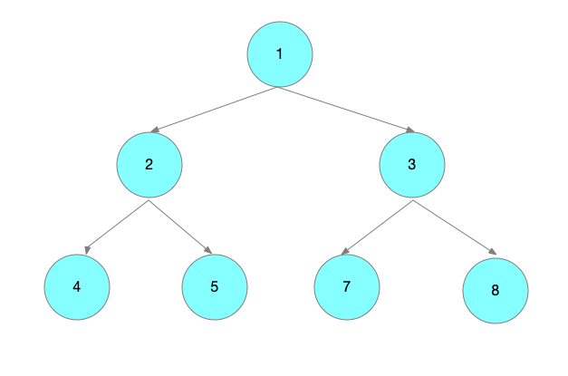
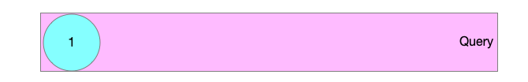
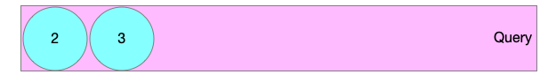
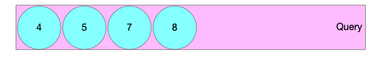

# 题目

给你一个二叉树，请你返回其按 层序遍历 得到的节点值。<!--more--> （即逐层地，从左到右访问所有节点）。

示例：
```
二叉树：[3,9,20,null,null,15,7],

    3
   / \
  9  20
    /  \
   15   7
返回其层次遍历结果：

[
  [3],
  [9,20],
  [15,7]
]

```

# 解答
## 递归法
很简单的一个递归求解。其代码如下
```go
func levelOrder(root *TreeNode) [][]int {
	res :=  make([][]int,0)
	levelOrderHelp(root,1,&res)
	return res
}


func levelOrderHelp(root *TreeNode,level int,res *[][]int){
	if root == nil {
		return
	}

	if len(*res) < level {
		*res = append(*res,[]int{root.Val})
	}else{
		(*res)[level-1] = append((*res)[level-1],root.Val)
	}

	levelOrderHelp(root.Left,level+1,res)
	levelOrderHelp(root.Right,level+1,res)
}
```


时间复杂度：$ O(n) $。递归函数 $ T(n)=2T(n/2)+1 $   
空间复杂度：$ O(n) $


## 迭代法

迭代法广度优先需要用队列作为辅助结构，我们先将根节点放到队列中，然后不断遍历队列。






 

首先拿出根节点，如果左子树/右子树不为空，就将他们放入队列中。第一遍处理完后，根节点已经从队列中拿走了，而根节点的两个孩子已放入队列中了，现在队列中就有两个节点 2 和 5。




第二次处理，会将 2 和 3 这两个节点从队列中拿走，然后再将 2 和 5 的子节点放入队列中，现在队列中就有三个节点 4 5  7 8




我们把每层遍历到的节点都放入到一个结果集中，最后返回这个结果集就可以了。


```go
func levelOrder(root *TreeNode) [][]int {
	var res [][]int
	if root == nil {
		return res
	}
	currentLevel := []*TreeNode{root}
	level := 0
	for {
		res = append(res,[]int{})
		var nextLevel []*TreeNode
		for i:=0;i<len(currentLevel);i++ {
			node := currentLevel[i]
			res[level] = append(res[level],node.Val)
			
			if node.Left != nil {
				nextLevel = append(nextLevel,node.Left)
			}

			if node.Right != nil {
				nextLevel = append(nextLevel,node.Right)
			}
		}

		level++
		currentLevel = nextLevel
		if len(currentLevel) == 0 {
			break
		}
	}

	return res
}
```

时间复杂度：每个点进队出队各一次，故渐进时间复杂度为 $ O(n) $。

空间复杂度：队列中元素的个数不超过 n*n* 个，故渐进空间复杂度为  $ O(n) $。

