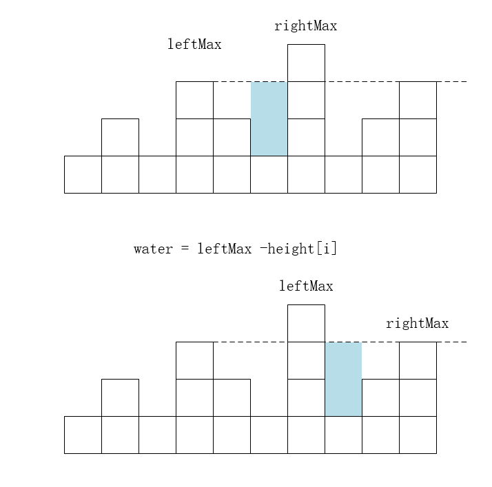

#### # 题目

给定 *n* 个非负整数表示每个宽度为 1 的柱子的高度图，计算按此排列的柱子，下雨之后能接多少雨水。

 

**示例 1：**


```
输入：height = [0,1,0,2,1,0,1,3,2,1,2,1]
输出：6
解释：上面是由数组 [0,1,0,2,1,0,1,3,2,1,2,1] 表示的高度图，在这种情况下，可以接 6 个单位的雨水（蓝色部分表示雨水）。 
```

**示例 2：**

```
输入：height = [4,2,0,3,2,5]
输出：9
```

 

**提示：**

- `n == height.length`
- `0 <= n <= 3 * 104`
- `0 <= height[i] <= 105`


# 解答

## 常规解法

初始看到了这个题目几乎没有思路。看了官方的题解这里做一下记录。

我们先不要去想全部的柱子可以接多少水。

先考虑仅仅对于位置 i，能装下多少水呢？


- 如果 height[i]  >= leftMax || height[i] >= rightMax,那么显然i柱子接不到水

- 那么在 height[i] < leftMax &&   height[i] < rightMax,那柱子可以接到多少水呢？分两种情况，当 leftMax  < rightMax 那么 height[i]接到的水就是 leftMax - height[i],反之那么 height[i]接到的水就是 rightMax - height[i],反之那么 

  

  

  

  ```go
  func trap(height []int) int {
  	if len(height) <= 2 {
  		return 0
  	}
  	leftMax := make([]int,len(height))
  	leftMax[0] = 0
  	for i := 1; i < len(height); i++ {
  		leftMax[i] = max(leftMax[i-1],height[i-1])
  	}
  
  	rightMax := height[len(height) -1 ]
  	res := 0
  	for i:= len(height) -2;i >= 1;i-- {
  		if height[i] >=  rightMax || height[i] >= leftMax[i] {
  			rightMax = max(rightMax,height[i])
  			continue
  		}
  
  
  
  		if leftMax[i] < rightMax {
  			res +=leftMax[i]  - height[i]
  		}else{
  			res += rightMax -height[i]
  		}
  
  		rightMax = max(rightMax,height[i])
  
  	}
  
  	return res
  
  }
  
  ```

  

  时间复杂度 $ O(n) $

  空间复杂度 $ O(n) $

  

## 双指针优化

这种解法的思路是完全相同的，但在实现手法上非常巧妙，采用双指针**边走边算**，节省下空间复杂度。

```go
func trap(height []int) int {
   if len(height) <= 2 {
      return 0
   }
   leftMax := 0
   rightMax := 0
   res := 0
   left := 0
   right := len(height) - 1

   for left <= right {
      leftMax = max(leftMax,height[left])
      rightMax = max(rightMax,height[right])

      if leftMax < rightMax {
         res += leftMax - height[left]
         left++
      }else{
         res += rightMax - height[right]
         right--
      }
   }

   return res
}
```


时间复杂度 $ O(n) $

空间复杂度 $ O(1) $


## 单调栈

- 保持栈底到栈顶单调递减。
- 遍历数组，如果当前元素大于栈顶元素 ，弹出栈顶元素进行计算。


```go
func trap2(height []int) int   {
   if len(height) <= 2 {
      return 0
   }

   stack := make([]int,len(height))
   pointer := -1

   res := 0
   for i:=0;i<len(height);i++ {
     	//栈不为空，且当前元素大于栈顶元素
      for pointer >= 0 && height[i] > height[stack[pointer]] {
         top := stack[pointer]
         pointer--
        	// 栈中的还存在元素，说明弹出的top还存在比它高的元素
         if pointer >= 0 {
            res += (i -  stack[pointer]  -1 ) *  (min(height[i],height[stack[pointer]]) - height[top])
         }
      }

     	// 入栈
      pointer++
      stack[pointer] = i
   }

   return res
}
```


时间复杂度 $ O(n) $

空间复杂度 $ O(1) $