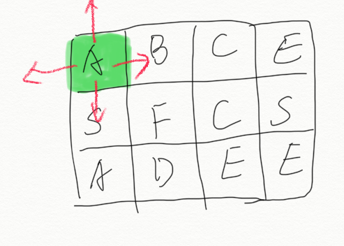

# 题目

给定一个二维网格和一个单词，找出该单词是否存在于网格中。<!--more-->

单词必须按照字母顺序，通过相邻的单元格内的字母构成，其中“相邻”单元格是那些水平相邻或垂直相邻的单元格。同一个单元格内的字母不允许被重复使用。

 

**示例:**

```
board =
[
  ['A','B','C','E'],
  ['S','F','C','S'],
  ['A','D','E','E']
]

给定 word = "ABCCED", 返回 true
给定 word = "SEE", 返回 true
给定 word = "ABCB", 返回 false
```

# 解答

我们要查找一个单词，首先要从起点开始查找,所以我们需要遍历矩阵,找到单词的起点。比如我们要查找的单词是ABCCE，那么我们首先要做的是如下的查找，起点可能不止一个，基于其中一个 S，能否找出剩下的 "BCCE" 路径。





```go
func exist(board [][]byte, word string) bool {
	for i := 0; i < len(board); i++ {
		for j:=0;j<len(board[0]);j++ {
			if search(board,word,i,j,0){
				return true
			}
		}
	}

	return false
}


func  search(board [][]byte, word string,i,j,k int)  bool{
	if k == len(word) {
		return true
	}

	if i < 0 || i >= len(board) || j < 0 || j >= len(board[0]) {
		return false
	}

	if board[i][j] != word[k] {
		return false
	}

	c := board[i][j]
	board[i][j] += ','

	result := search(board, word, i - 1, j, k + 1) ||
		search(board, word, i + 1, j, k + 1) ||
		search(board, word, i, j - 1, k + 1) ||
		search(board, word, i, j + 1, k + 1)

	board[i][j] = c

	return result
}
```