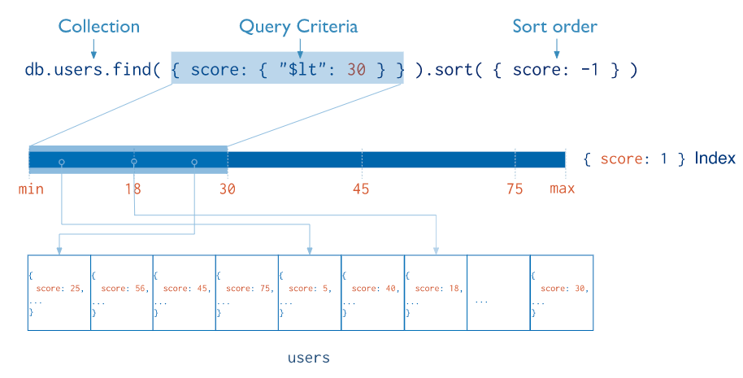

# 什么是索引


> Indexes are special data structures [[1\]](https://docs.mongodb.com/manual/indexes/#footnote-b-tree) that store a small portion of the collection's data set in an easy to traverse form（遍历）. The index stores the value of a specific field or set of fields, ordered by the value of the field. The ordering of the index entries supports efficient equality matches and range-based query operations. In addition, MongoDB can return sorted results by using the ordering in the index.




## 默认索引

MongoDB 中所有的文档也都有一个唯一的 _id 字段，在默认情况下所有的文档都使用一个长 12 字节的 ObjectId 作为默认索引


## 创建一个索引

```javascript
db.collection.createIndex( <key and index type specification>, <options> )
```

除了 MongoDB 提供的默认 `_id` 字段之外，我们还可以建立其它的单键索引，而且其中不止支持顺序的索引，还支持对索引倒排：


例如 

```javascript
db.collection.createIndex( { name: -1 } )
db.collection.createIndex( { name: 1 } )
```


# Single Field Indexes


Single Field Indexes 是用户使用文档中单个字段以升序或降序排序(1或-1)创建索引。在单个字段索引中，索引键的排序顺序没有影响，因为MongoDB可以在任意方向遍历索引。


在这里我们先导入一些数据

```
use students
db.createCollection("studentgrades")
db.studentgrades.insertMany(
    [
        {name: "Barry", subject: "Maths", score: 92},
        {name: "Kent", subject: "Physics", score: 87},
        {name: "Harry", subject: "Maths", score: 99, notes: "Exceptional Performance"},
        {name: "Alex", subject: "Literature", score: 78},
        {name: "Tom", subject: "History", score: 65, notes: "Adequate"}
    ]
)
db.studentgrades.find({},{_id:0})
```


创建索引

```javascript
> db.studentgrades.createIndex({name: 1})
{
        "createdCollectionAutomatically" : false,
        "numIndexesBefore" : 1,
        "numIndexesAfter" : 2,
        "ok" : 1
}
```

使用explain 来查看一下

```javascript
> db.studentgrades.find({"name":"Alex"}).explain();
{
        "queryPlanner" : {
                "plannerVersion" : 1,
                "namespace" : "student.studentgrades",
                "indexFilterSet" : false,
                "parsedQuery" : {
                        "name" : {
                                "$eq" : "Alex"
                        }
                },
                "queryHash" : "01AEE5EC",
                "planCacheKey" : "4C5AEA2C",
                "winningPlan" : {
                        "stage" : "FETCH",
                        "inputStage" : {
                                "stage" : "IXSCAN",
                                "keyPattern" : {
                                        "name" : 1
                                },
                                "indexName" : "name_1",
                                "isMultiKey" : false,
                                "multiKeyPaths" : {
                                        "name" : [ ]
                                },
                                "isUnique" : false,
                                "isSparse" : false,
                                "isPartial" : false,
                                "indexVersion" : 2,
                                "direction" : "forward",
                                "indexBounds" : {
                                        "name" : [
                                                "[\"Alex\", \"Alex\"]"
                                        ]
                                }
                        }
                },
                "rejectedPlans" : [ ]
        },
        "serverInfo" : {
                "host" : "MacBook-Air.mshome.net",
                "port" : 27017,
                "version" : "4.4.4",
                "gitVersion" : "8db30a63db1a9d84bdcad0c83369623f708e0397"
        },
        "ok" : 1
}
> 

```

## Create an Index on an Embedded Field

Consider a collection named `records` that holds documents that resemble the following sample document:

```
{
  "_id": ObjectId("570c04a4ad233577f97dc459"),
  "score": 1034,
  "location": { state: "NY", city: "New York" }
}
```

The following operation creates an index on the `location.state` field:

```javascript
db.records.createIndex( { "location.state": 1 } 
```


## Create an Index on Embedded Document
MongoDB 同样也支持 Embedded 字段创建索引
```javascript
db.records.createIndex( { "location": 1 } 
```


# 复合索引（Compound Index）

除了单一字段索引这种非常简单的索引类型之外，MongoDB 还支持多个不同字段组成的复合索引（Compound Index）.由于 MongoDB 中支持对同一字段的正逆序排列，所以相比于 MySQL 中的辅助索引就会出现更多的情况


```javascript
db.studentgrades.createIndex( { name: 1, subject: -1 } )
db.studentgrades.createIndex( { name: 1, subject: 1 } )
```

上面的两个索引是完全不同的，在磁盘上的 B+ 树其实也按照了完全不同的顺序进行存储，虽然 `name` 字段都是升序排列的，但是对于 `subject`来说，两个索引的处理是完全相反的。

比如当我们创建了一个一下的索引

```
db.studentgrades.createIndex( { name: 1, subject: 1 } )
```

然后执行一下操作

```javascript
db.studentgrades.find().sort({name:1,subject:1}).explain();
{
        "queryPlanner" : {
                "plannerVersion" : 1,
                "namespace" : "student.studentgrades",
                "indexFilterSet" : false,
                "parsedQuery" : {
                        
                },
                "queryHash" : "8FE28C9E",
                "planCacheKey" : "8FE28C9E",
                "winningPlan" : {
                        "stage" : "FETCH",
                        "inputStage" : {
                                "stage" : "IXSCAN",
                                "keyPattern" : {
                                        "name" : 1,
                                        "subject" : 1
                                },
                                "indexName" : "name_1_subject_1",
                                "isMultiKey" : false,
                                "multiKeyPaths" : {
                                        "name" : [ ],
                                        "subject" : [ ]
                                },
                                "isUnique" : false,
                                "isSparse" : false,
                                "isPartial" : false,
                                "indexVersion" : 2,
                                "direction" : "forward",
                                "indexBounds" : {
                                        "name" : [
                                                "[MinKey, MaxKey]"
                                        ],
                                        "subject" : [
                                                "[MinKey, MaxKey]"
                                        ]
                                }
                        }
                },
                "rejectedPlans" : [ ]
        },
        "serverInfo" : {
                "host" : "MacBook-Air.mshome.net",
                "port" : 27017,
                "version" : "4.4.4",
                "gitVersion" : "8db30a63db1a9d84bdcad0c83369623f708e0397"
        },
        "ok" : 1
}

> db.studentgrades.find().sort({"name":1,"subject":-1}).explain();
{
        "queryPlanner" : {
                "plannerVersion" : 1,
                "namespace" : "student.studentgrades",
                "indexFilterSet" : false,
                "parsedQuery" : {
                        
                },
                "queryHash" : "8CF1A7AF",
                "planCacheKey" : "8CF1A7AF",
                "winningPlan" : {
                        "stage" : "SORT",
                        "sortPattern" : {
                                "name" : 1,
                                "subject" : -1
                        },
                        "memLimit" : 104857600,
                        "type" : "simple",
                        "inputStage" : {
                                "stage" : "COLLSCAN",
                                "direction" : "forward"
                        }
                },
                "rejectedPlans" : [ ]
        },
        "serverInfo" : {
                "host" : "MacBook-Air.mshome.net",
                "port" : 27017,
                "version" : "4.4.4",
                "gitVersion" : "8db30a63db1a9d84bdcad0c83369623f708e0397"
        },
        "ok" : 1
}
> 

```

可以看到第二种查询可以直接利用索引排序好的结果


### Prefixes

这个性质和MySQL的左前缀索引是类似的，这里就不过多解释。具体可以看[官网](https://docs.mongodb.com/manual/core/index-compound/#prefixes)


# 参考 

MongoDB Indexes https://docs.mongodb.com/manual/indexes/

