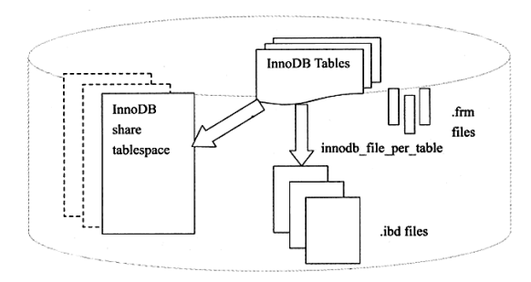
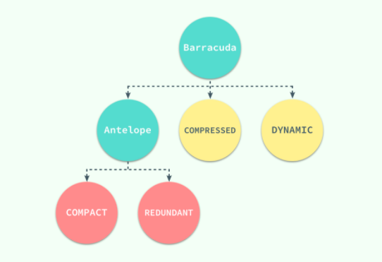
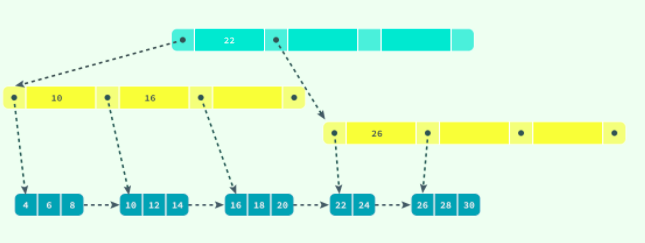
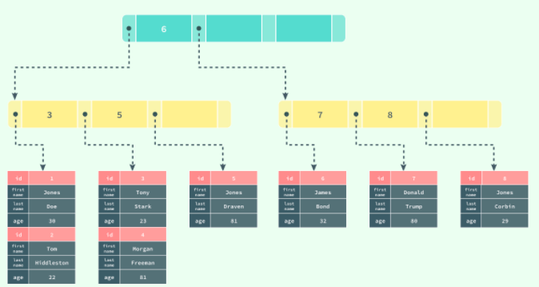
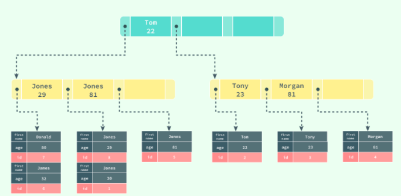

# 数据的存储


在整个数据库体系结构中，我们可以使用不同的存储引擎来存储数据，而绝大多数存储引擎都以二进制的形式存储数据；这里主要是查 InnoDB 中对数据是如何存储的。


在 InnoDB 存储引擎中，所有的数据都被**逻辑地**存放在表空间中，表空间（tablespace）是存储引擎中最高的存储逻辑单位，在表空间的下面又包括段（segment）、区（extent）、页（page）：


## 表空间（Tablespace） 

在MySQL默认配置下会有一个初始化大小为10MB，名为ibdata1的文件。该文件就是默认的表空间文件，可以通过参数 innodb_data_file_path 进行查看.

```mysql
mysql root@127.0.0.1:lyp> show variables like '%innodb_data_file%';
+-----------------------+------------------------+
| Variable_name         | Value                  |
+-----------------------+------------------------+
| innodb_data_file_path | ibdata1:12M:autoextend |
+-----------------------+------------------------+
1 row in set
Time: 0.036s
mysql root@127.0.0.1:lyp> show variables like '%innodb_data_file%';
+-----------------------+------------------------+
| Variable_name         | Value                  |
+-----------------------+------------------------+
| innodb_data_file_path | ibdata1:12M:autoextend |
+-----------------------+------------------------+
1 row in set
Time: 0.022s
mysql root@127.0.0.1:lyp>
```


设置 innodb_data_file_path 参数后，所有基于InnoDB存储引擎的表的数据都会记录到该共享表空间。若设置了`innodb_file_per_table`,那么用户可以将每个基于InnoDB存储引擎的表产生一个独立表空间。独立表空间的命名规则为 `tableName.idb`

```mysql
mysql root@127.0.0.1:lyp> show variables like '%innodb_file_per_table%';
+-----------------------+-------+
| Variable_name         | Value |
+-----------------------+-------+
| innodb_file_per_table | ON    |
+-----------------------+-------+
1 row in set
Time: 0.013s

```


这些单独的表空间仅仅存储该表的数据、索引和插入cache 等信息。其余信息还是存放在默认的表空间中。




## 段 （Segment）

表空间是由各个段组成的，常见的段有数据段、索引段、回滚段等。InnoDB存储引擎是索引组织的（index organized）,因此数据即索引、索引即数据。那么数据段即B+树的叶子节点、索引段即为B+树的非索引节点。

## 区 （Extend）

区是由连续页组成的空间，区的大小和页大小有一定关系。


## 页 （Page）

页是InnoDB磁盘管理的最小单位，在InnoDB存储引擎中，默认页的大小为16K,当然也可以通过改变 `innodb_page_size` 选项对默认大小进行修改，需要注意的是不同的页大小最终也会导致区大小的不同


| pageSize | pageCount | Extend Size |
| -------- | --------- | ----------- |
| 4k       | 256       | 1M          |
| 8k       | 128       | 1M          |
| 16k      | 64        | 1M          |
| 32k      | 64        | 2M          |
| 64k      | 64        | 4M          |

## 行（Row）


与现有的大多数存储引擎一样，InnoDB 使用页作为磁盘管理的最小单位；数据在 InnoDB 存储引擎中都是按行存储的，每个 16KB 大小的页中可以存放 2-200 行的记录。


## 如何存储记录

InnoDB 存储引擎和大多数数据库一样，记录是以行的形式存储的。MySQL 5.7 版本支持以下格式的行存储方式：



Antelope 是 InnoDB 最开始支持的文件格式，它包含两种行格式 `Compact` 和 `Redundant`，它最开始并没有名字；`Antelope` 的名字是在新的文件格式 `Barracuda` 出现后才起的，Barracuda 的出现引入了两种新的行格式 `Compressed` 和 `Dynamic`；InnoDB 对于文件格式都会向前兼容，而官方文档中也对之后会出现的新文件格式预先定义好了名字：Cheetah、Dragon、Elk 等等。


# InnoDB 数据页结构

页是 InnoDB 存储引擎管理数据的最小磁盘单位，而 B-Tree 节点就是实际存放表中数据的页面，我们在这里将要介绍页是如何组织和存储记录的；首先，一个 InnoDB 页有以下七个部分


- File Header 用来记录页的一些信息

- Page Header 记录数据页的信息状态

- Infimum 和 Supremum  虚拟的行记录，用来限定记录的边界。Infimum 记录是比该页中任何主键值都要小的值，Supremum 是该页中的最大值：

- User Records 就是整个页面中真正用于存放行记录的部分

- Free Space 就是空余空间了

- Page Directory （页目录） 存放了记录的相对位置

- File Trailer  验证和 


**B+ 树在查找对应的记录时，并不会直接从树中找出对应的行记录，它只能获取记录所在的页，将整个页加载到内存中，再通过 Page Directory 中存储的稀疏索引和 `n_owned`、`next_record` 属性取出对应的记录，不过因为这一操作是在内存中进行的，所以通常会忽略这部分查找的耗时。**


## 索引

索引是数据库中非常非常重要的概念，它是存储引擎能够快速定位记录的秘密武器，对于提升数据库的性能、减轻数据库服务器的负担有着非常重要的作用；**索引优化是对查询性能优化的最有效手段**，它能够轻松地将查询的性能提高几个数量级。


InnoDB 存储引擎在绝大多数情况下使用 B+ 树建立索引，这是关系型数据库中查找最为常用和有效的索引，但是 B+ 树索引并不能找到一个给定键对应的具体值，它只能找到数据行对应的页，然后正如上一节所提到的，数据库把整个页读入到内存中，并在内存中查找具体的数据行。


  


B+ 树是平衡树，它查找任意节点所耗费的时间都是完全相同的，比较的次数就是 B+ 树的高度


### 聚集索引和辅助索引

数据库中的 B+ 树索引可以分为聚集索引（clustered index）和辅助索引（secondary index），它们之间的最大区别就是，聚集索引中存放着一条行记录的全部信息，而辅助索引中只包含索引列和一个用于查找对应行记录的『书签』。


#### 聚集索引

InnoDB 存储引擎中的表都是使用索引组织的，也就是按照键的顺序存放；聚集索引就是按照表中主键的顺序构建一颗 B+ 树，并在叶节点中存放表中的行记录数据。

```mysql
CREATE TABLE users(
    id INT NOT NULL,
    first_name VARCHAR(20) NOT NULL,
    last_name VARCHAR(20) NOT NULL,
    age INT NOT NULL,
    PRIMARY KEY(id),
    KEY(last_name, first_name, age)
    KEY(first_name)
);
```

如果使用上面的 SQL 在数据库中创建一张表，B+ 树就会使用 `id` 作为索引的键，并在叶子节点中存储一条记录中的**所有**信息。


 


聚集索引与表的物理存储方式有着非常密切的关系，所有正常的表应该**有且仅有一个**聚集索引（绝大多数情况下都是主键），表中的所有行记录数据都是按照**聚集索引**的顺序存放的。

当我们使用聚集索引对表中的数据进行检索时，可以直接获得聚集索引所对应的整条行记录数据所在的页，不需要进行第二次操作。


#### 辅助索引

数据库将所有的非聚集索引都划分为辅助索引，但是这个概念对我们理解辅助索引并没有什么帮助；辅助索引也是通过 B+ 树实现的，但是它的叶节点并不包含行记录的全部数据，仅包含索引中的所有键和一个用于查找对应行记录的『书签』，在 InnoDB 中这个书签就是当前记录的主键。

辅助索引的存在并不会影响聚集索引，因为聚集索引构成的 B+ 树是数据实际存储的形式，而辅助索引只用于加速数据的查找，所以一张表上往往有多个辅助索引以此来提升数据库的性能。

> 一张表一定包含一个聚集索引构成的 B+ 树以及若干辅助索引的构成的 B+ 树。





如果在表 `users` 中存在一个辅助索引 `(first_name, age)`，那么它构成的 B+ 树大致就是上图这样，按照 `(first_name, age)` 的字母顺序对表中的数据进行排序，当查找到主键时，再通过聚集索引获取到整条行记录。


# 参考 


https://www.cnblogs.com/wade-luffy/p/6289183.html