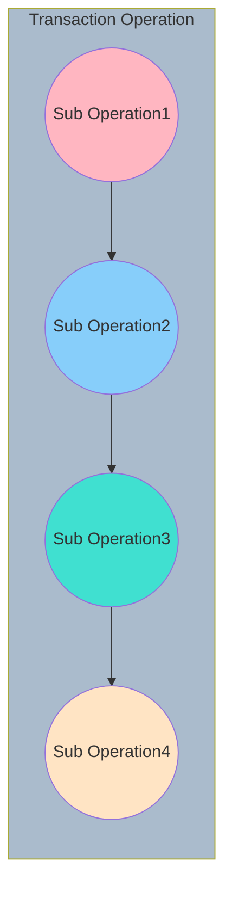

事务（Transaction）是数据库中最重要的概念之一，只要对数据库稍有了解的人都知道事务具有 ACID 四个基本属性。

InnoDB 存储引擎中事务完全服务ACID的特性，ACID以下4个词的缩写

- 原子性 Atomicity 
- 一致性 Consistency 
- 隔离型 Isolation 
- 持久性 Durability 

# 原子性

所谓的事务的原子性指的是一个事务必须被视为一个不可分割的最小工作单元，整个事务中的所有操作要么全部提交成功，要么全部失败回滚，对于一个事务来说，不可能只执行其中的一部分操作。

## 回滚日志 (UnDo log)

在MySQL事务其实和一个操作没有什么太大的区别，它是一系列的数据库操作（可以理解为 SQL）的集合。那么要保证事务的原子性,就需要在异常发生时，对已经执行的操作进行**回滚**，而在 MySQL 中，恢复机制是通过*回滚日志*（undo log）实现的，所有事务进行的修改都会先记录到这个回滚日志中，然后在对数据库中的对应行进行写入。

『浅入深出』MySQL 中事务的实现  https://draveness.me/mysql-transaction/

