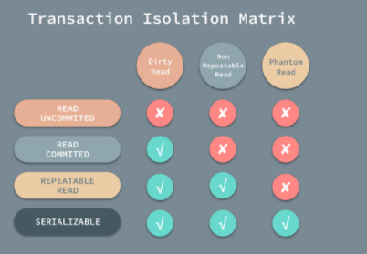
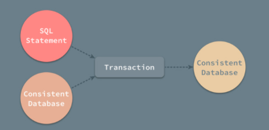

事务（Transaction）是数据库中最重要的概念之一，只要对数据库稍有了解的人都知道事务具有 ACID 四个基本属性。

InnoDB 存储引擎中事务完全服务ACID的特性，ACID以下4个词的缩写

- 原子性 Atomicity 
- 一致性 Consistency 
- 隔离型 Isolation 
- 持久性 Durability 

# 原子性

所谓的事务的原子性指的是一个事务必须被视为一个不可分割的最小工作单元，整个事务中的所有操作要么全部提交成功，要么全部失败回滚，对于一个事务来说，不可能只执行其中的一部分操作。

## 回滚日志 (UnDo log)

在MySQL事务其实和一个操作没有什么太大的区别，它是一系列的数据库操作（可以理解为 SQL）的集合。那么要保证事务的原子性,就需要在异常发生时，对已经执行的操作进行**回滚**，而在 MySQL 中，恢复机制是通过*回滚日志*（undo log）实现的，所有事务进行的修改都会先记录到这个回滚日志中，然后在对数据库中的对应行进行写入。

**回滚日志除了能够在发生错误或者用户执行 `ROLLBACK` 时提供回滚相关的信息，它还能够在整个系统发生崩溃、数据库进程直接被杀死后，当用户再次启动数据库进程时，还能够立刻通过查询回滚日志将之前未完成的事务进行回滚，这也就需要回滚日志必须先于数据持久化到磁盘上，是我们需要先写日志后写数据库的主要原因。**

**Undo log 并不能将数据库物理的恢复到执行语句或事务之前的样子，Undo log 是逻辑日志，只是将之前的数据逻辑的恢复到原来的样子。所有的修改都被逻辑的取消了，但是数据结构和页本身在回滚之后可能大不相同。比如我们事务中使用的每一条 INSERT 都对应了一条 DELETE，每一条 UPDATE 也都对应一条相反的 UPDATE 语句。**

# 持久性

当事务已经被提交之后，数据被写入到数据库中，持久化到磁盘上，无法被修改了。

## 重做日志 redo log 

重做日志是用来实现事务的持久性,即事务ACID中的D。其由两部分组成：一是内存中的重做日志缓冲(redo log buffer),其是易失的；二是重做日志文件（redo log file ）,其是持久的。

当我们在一个事务中尝试修改数据时，他的过程如下

- 先将数据从磁盘读入内存，并更新内存中缓存的数据

- 生成一条重做日志并写入重做日志缓存

- 当事务真正提交时，MySQL 会将重做日志缓存中的内容刷新到重做日志文件，

- 再将内存中的数据更新到磁盘上

  

  
# 隔离性

在理解事务的隔离型，我们需要先了解一下脏读、幻读、不可重复读的概念这些概念

## 脏读
在一个事务中，读取了其他事务未提交的数据。

如下表：

| Transaction1                      | Transaction2                         |
| --------------------------------- | ------------------------------------ |
| begin                             | begin                                |
|                                   | Update user set age =10 where id = 1 |
| select age from user where id = 1 |                                      |
| commit                            |                                      |
|                                   | Abort                                |

如上 Transaction2 执行的过程中对 `id = 1` 的用户进行了写操作，但是没有将修改的内容进行提交或者回滚，在这时 Transaction2 对同样的数据进行了读操作并提交了事务。最后Transaction2事务失败了，那么用户的age 还是原来的值，但是Transaction1读到的值确实新的值

这种情况可以用事务中的 `READ COMMIT` 解决

## 不可重复读

> 在一个事务中，同一行记录被访问了两次却得到了不同的结果。
>
> 

| Transaction1                                    | Transaction2                         |
| ----------------------------------------------- | ------------------------------------ |
| begin                                           | begin                                |
| select age from user where id = 1  (age is 5 )  |                                      |
|                                                 | Update user set age =10 where id = 1 |
|                                                 | commit                               |
| select age from user where id = 1  (age is 10 ) |                                      |

如上 Transaction1 中我们第一次查询用户 id 为 age ,假设age 为 5 ，在这之后 Transaction2 中修改了同一行数据并且提交了修改,这时候Transaction1 读取再次读取用户1 的age ,就会发现两次查询的结果不一样。

这种情况可以用事务中的 `REPEATABLE READ(可重复读)`  解决.`REPEATABLE READ` 使得 Transaction1 第二次读取到的数据依然是 age = 5 

## 幻读

>  在一个事务中，同一个范围内的记录被读取时，其他事务向这个范围添加了新的记录。

重新开启了两个事务 Transaction1和 Transaction1，在 Transaction1中我们查询全表的信息，没有得到任何记录；在Transaction2中向表中插入一条数据并提交；由于 `REPEATABLE READ` 的原因，再次查询全表的数据时，我们获得到的仍然是空集，但是在向表中插入同样的数据却出现了错误。

| Transaction1                             | Transaction2                             |
| ---------------------------------------- | ---------------------------------------- |
| begin                                    | begin                                    |
| select * from user where id = 10         |                                          |
|                                          | Insert into user (id,age) values (10,10) |
|                                          | commit                                   |
| Insert into user (id,age) values (10,10) |                                          |
| Duplicate entry '10' for '1d'            |                                          |

这种现象在数据库中就被称作幻读，虽然我们使用查询语句得到了一个空的集合，但是插入数据时却得到了错误，好像之前的查询是幻觉一样。

<u>**在标准的事务隔离级别中，幻读是由更高的隔离级别 `SERIALIZABLE` 解决的，但是它也可以通过 MySQL 提供的 Next-Key 锁解决：**</u>

## 4 种隔离级别

- `RAED UNCOMMITED （读未提交）`：使用查询语句不会加锁，可能会读到未提交的行（Dirty Read）(加记录锁解决)
- `READ COMMITED （读已提交）`：只对记录加记录锁，而不会在记录之间加间隙锁，所以允许新的记录插入到被锁定记录的附近，所以再多次使用查询语句时，可能得到不同的结果（Non-Repeatable Read）；
- `REPEATABLE READ(可重复读)`：多次读取同一范围的数据会返回第一次查询的快照，不会返回不同的数据行，但是可能发生幻读（Phantom Read）；
- `SERIALIZABLE（可序列号）`：InnoDB 隐式地将全部的查询语句加上共享锁，解决了幻读的问题；

以上的所有的事务隔离级别都不允许脏写入（Dirty Write），也就是当前事务更新了另一个事务已经更新但是还未提交的数据，大部分的数据库中都使用了 READ COMMITED 作为默认的事务隔离级别，但是 MySQL 使用了 REPEATABLE READ 作为默认配置；从 RAED UNCOMMITED 到 SERIALIZABLE，随着事务隔离级别变得越来越严格，数据库对于并发执行事务的性能也逐渐下降。

# 一致性

数据库对于 ACID 中的一致性的定义是这样的：如果一个事务原子地在一个一致地数据库中独立运行，那么在它执行之后，数据库的状态一定是一致的。对于这个概念，它的第一层意思就是对于数据完整性的约束，包括主键约束、引用约束以及一些约束检查等等，在事务的执行的前后以及过程中不会违背对数据完整性的约束，所有对数据库写入的操作都应该是合法的，并不能产生不合法的数据状态。

> A transaction must preserve database consistency - if a transaction is run atomically in isolation starting from a consistent database, the database must again be consistent at the end of the transaction.

我们可以将事务理解成一个函数，它接受一个外界的 SQL 输入和一个一致的数据库，它一定会返回一个一致的数据库。

『浅入深出』MySQL 中事务的实现  https://draveness.me/mysql-transaction/

https://mermaid-js.github.io/mermaid/#/flowchart

