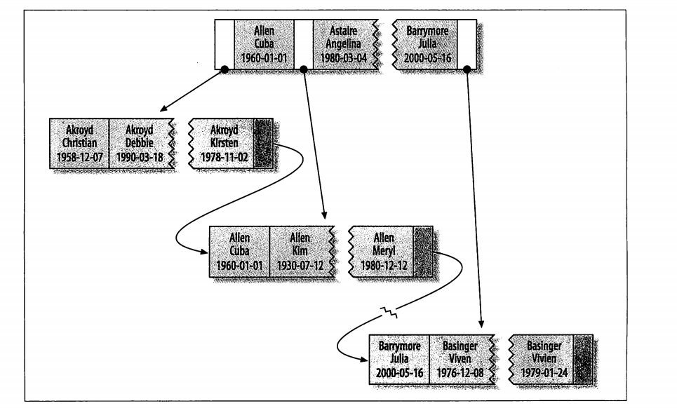
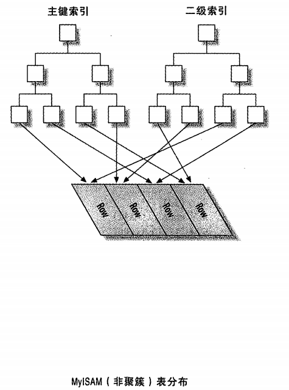
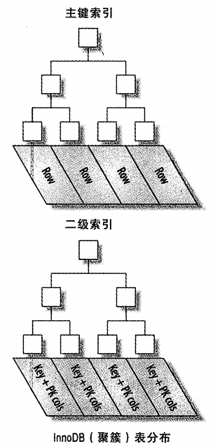

# 什么是索引

索引（在MYSQL中也叫做键\<key\>），是存储引擎用于快速找到记录的一种数据结构


# 为什么需要索引

假设数据库中一个表有$ 10^6 $条记录，DBMS的页面大小为4K，并存储100条记录(这个条件非常重要，你的表越大，你的页记录的数据也就越少，你越需要索引)。如果没有索引，查询将对整个表进行扫描，最坏的情况下，如果所有数据页都不在内存，需要读取$ 10^4 $ 个页面，如果这$ 10^4 $个页面在磁盘上随机分布，需要进行$ 10^4 $次I/O，假设磁盘每次I/O时间为10ms(忽略数据传输时间)，则总共需要100s(但实际上要好很多很多)。如果对之建立B-Tree索引，则只需要进行$ log100(10^6)=3 $ 次页面读取，最坏情况下耗时30ms。这就是索引带来的效果，很多时候，当你的应用程序进行SQL查询速度很慢时，应该想想是否可以建索引。


# 索引的类型

# B-Tree 

**B-Tree是为磁盘或其他直接存取的辅助存储设备而设计的一种平衡二叉树。B树类似于红黑树，但它们在减低磁盘I/O操作方面效率会更高。** 

在MySQL中的大多数存储引擎都支持这种索引，不过需要注意的是MySQL中的B-Tree 实际上是B+Tree树结构。


B+Tree：每一个叶子节点都包含指向下一个叶子节点的指针，从而方便叶子节点的范围遍历。B－Tree通常意味着所有的值都是按顺序存储的，并且每一个叶子页到根的距离相同，很适合查找范围数据。


假设有如下一个表：

```mysql
CREATE TABLE People (
   last_name varchar(50)    not null,
   first_name varchar(50)    not null,
   dob        date           not null,
   gender     enum('m', 'f') not null,
   key(last_name, first_name, dob)
);
```

其索引包含表中每一行的last_name、first_name和dob列。其结构大致如下：




索引存储的值按索引列中的顺序排列。可以利用B-Tree索引进行全关键字、关键字范围和关键字前缀查询，**当然，如果想使用索引，你必须保证按索引的最左边前缀(leftmost prefix of the index)来进行查询。**

B-Tree 索引的适合范围

- 匹配全值(Match the full value)：对索引中的所有列都指定具体的值。
- 匹配最左前缀(Match a leftmost prefix)：你可以利用索引查找last name为Allen的人，仅仅使用索引中的第1列。
- 匹配列前缀(Match a column prefix)：例如，你可以利用索引查找last name以J开始的人，这仅仅使用索引中的第1列。
- 匹配值的范围查询(Match a range of values)：可以利用索引查找last name在Allen和Barrymore之间的人，仅仅使用索引中第1列。
- 匹配部分精确而其它部分进行范围匹配(Match one part exactly and match a range on another part)：可以利用索引查找last name为Allen，而first name以字母K开始的人。
- 仅对索引进行查询(Index-only queries)：如果查询的列都位于索引中，则不需要读取元组的值。(覆盖索引)
- 由于B-树中的节点都是顺序存储的，所以可以利用索引进行查找(找某些值)，也可以对查询结果进行ORDER BY。


- 查询必须从索引的最左边的列开始，否则无法使用索引（这是有B+Tree 的特性决定）。
- 不能跳过某一索引列。。
- 存储引擎不能使用索引中范围条件右边的列。


# Hash 索引

哈希索引基于哈希表实现，只有精确索引所有列的查询才有效。对于每一行数据，存储引擎都会对所有的索引列计算一个哈希码，哈希码是一个较小的值，并且不同键值的行计算出来的哈希码也不一样。哈希索引将所有的哈希存储在索引中，同时在哈希表中保存指向每个数据的指针。


MySQL中，只有Memory存储引擎显示支持hash索引，是Memory表的默认索引类型，尽管Memory表也可以使用B-Tree索引。Memory存储引擎支持非唯一hash索引，如果多个值有相同的hash code，索引把它们的行指针用链表保存到同一个hash表项中。 


Hash 索引的限制

- 由于索引仅包含hash code和记录指针，所以，MySQL不能通过使用索引避免读取记录。但是访问内存中的记录是非常迅速的，不会对性造成太大的影响。
- 哈希索引数据并不是按照索引值顺序存储的，所以不能使用hash索引排序。
- Hash索引不支持键的部分匹配，因为是通过整个索引值来计算hash值的。例如，在数据列（A,B）上建立哈希索引，如果查询只有数据列A，则无法使用该索引。
- Hash索引只支持等值比较，例如使用=，IN( )和<=>。对于WHERE price>100并不能加速查询。
- 访问Hash索引的速度非常快，除非有很多哈希冲突（不同的索引列值却有相同的哈希值）。当出现哈希冲突的时候，存储引擎必须遍历链表中所有的行指针，逐行进行比较，直到找到所有符合条件的行。
- 如果哈希冲突很多的话，一些索引维护操作的代价也会很高。当从表中删除一行时，存储引擎要遍历对应哈希值的链表中的每一行，找到并删除对应行的引用，冲突越多，代价越大。


**InnoDB引擎有一个特殊的功能叫做“自适应哈希索引”。当InnoDB注意到某些索引值被使用得非常频繁时，它会在内存中基于B-Tree索引上再创建一个哈希索引，这样就像B-Tree索引也具有哈希索引的一些优点，比如快速的哈希查找。**


在使用MySQL的过程中hash索引个人是几乎用不到，所以这里就不过多的记录了。


# 空间索引和全文索引

MyISAM支持空间索引，主要用于地理空间数据类型，例如GEOMETRY。和B-TREE索引不同，这类索引无须前缀查询。空间索引会从所有到维度来索引数据。查询时，可以有效地使用任意维度来组合查询。必须使用MySQL的GIS相关函数如MBRCONTAINS()等来维护数据。MySQL的GIS支持并不完善，所以大部分人都不会使用这个特性。开源关系数据库系统中对GIS的解决方案做得比较好的是PostgreSQL的PostGIS。


全文索引是MyISAM的一个特殊索引类型，innodb的5.6以上版本也支持，它查找的是文本中的关键词主要用于全文检索。

全文索引是一种特殊类型的索引，它查找都是文本中的关键词，而不是直接比较索引中的值。全文搜索和其他几类索引匹配方式完全不一样。它有许多需要注意的细节，如停用词、词干和复数、布尔搜索等。全文索引更类似于搜索引擎做的事情，而不是简单的WHERE条件匹配。

在相同的列上同时创建全文索引和基于值对B-Tree索引不会有冲突，全文索引适用于MATCH AGAINST操作，而不是普通的WHERE条件操作。


这两个索引在MySQL的使用过程中就更不常见了，所以也就不过多记录了。


# 索引的优点

- 索引大大减小了服务器需要扫描的数据量

- 索引可以帮助服务器避免排序和临时表

- 索引可以将随机IO变成顺序IO

总之就是加快查询的速度


# 高性能的所以策略

## 独立的列


如果查询中的列不是独立的，那么MySQL久不会使用索引,比如：

```
select actor_id from actor where actor_id + 1 = 5 
```

我们需要将其优化为

```
select actor_id from actor where actor_id = 4 
```


# 前缀索引

有时候需要索引很长的字符列，这会让索引变得大且慢。这个时候通常可以索引开始的部分字符，这样可以大大节约索引空间，从而提高索引效率。这样可以节约索引空间，从而提高索引效率。但是这样会降低索引的选择性。索引的选择性指的是不重复的索引值。（索引选择性=索引基数/数据行）


# 聚簇索引

聚簇索引并不是一种单独的索引类型，而是一种数据存储方式。具体的细节依赖于其实现方法，当InnoDB的聚簇索引实际上在同一结构中保存了B-Tree索引和数据行。

**当表有聚簇索引时，它的数据行实际上存放在索引的叶子页(leaf page)中。因为无法同时把数据行存放在两个不同的地方，所以一个表只能有一个聚簇索引（不过，覆盖索引可以模拟多个聚簇索引的情况）。**


- 术语“聚簇”表示数据行和相邻的键值紧凑地存储在一起。
- 聚簇索引的二级索引：叶子节点不会保存引用的行的物理位置，而是保存行的主键值。

**对于聚簇索引的存储引擎，数据的物理存放顺序与索引顺序是一致的，即：只要索引是相邻的，那么对应的数据一定也是相邻地存放在磁盘上的，如果主键不是自增id，可以想象，它会干些什么，不断地调整数据的物理地址、分页，当然也有其他一些措施来减少这些操作，但却无法彻底避免。但，如果是自增的，那就简单了，它只需要一页一页地写，索引结构相对紧凑，磁盘碎片少，效率也高。**


**对于非聚簇索引的存储引擎，表数据存储顺序与索引顺序无关，叶结点包含索引字段值及指向数据页数据行的逻辑指针，其行数量与数据表行数据量一致。**

优点 

- 当你需要取出一定范围内的数据时，用聚簇索引也比用非聚簇索引好。

- 当通过聚簇索引查找目标数据时理论上比非聚簇索引要快，因为非聚簇索引定位到对应主键时还要多一次目标记录寻址,即多一次I/O。

- 使用覆盖索引扫描的查询可以直接使用页节点中的主键值。

缺点

- **插入速度严重依赖于插入顺序**，按照主键的顺序插入是最快的方式，否则将会出现页分裂，严重影响性能。因此，对于InnoDB表，我们一般都会定义一个自增的ID列为主键。

- **新主键的代价很高，因为将会导致被更新的行移动**。因此，对于InnoDB表，我们一般定义主键为不可更新。

- **二级索引访问需要两次索引查找，第一次找到主键值，第二次根据主键值找到行数据。**

- **采用聚簇索引插入新值比采用非聚簇索引插入新值的速度要慢很多**，因为插入要保证主键不能重复，判断主键不能重复，采用的方式在不同的索引下面会有很大的性能差距，聚簇索引遍历所有的叶子节点，非聚簇索引也判断所有的叶子节点，但是聚簇索引的叶子节点除了带有主键还有记录值，记录的大小往往比主键要大的多。这样就会导致聚簇索引在判定新记录携带的主键是否重复时进行昂贵的I/O代价。

  ## 聚簇与非聚簇表的数据存储方式


  在MySQL中，索引属于存储引擎级别的概念，不同存储引擎对索引的实现方式是不同的，本文主要讨论MyISAM和InnoDB两个存储引擎的索引实现方式。


MyISAM引擎使用B+Tree作为索引结构，叶节点的data域存放的是数据记录的地址。下图是MyISAM索引的原理图：




虽然InnoDB也使用B+Tree作为索引结构，但具体实现方式却与MyISAM截然不同。

**第一个重大区别是InnoDB的数据文件本身就是索引文件。从上文知道，MyISAM索引文件和数据文件是分离的，索引文件仅保存数据记录的地址。而在InnoDB中，表数据文件本身就是按B+Tree组织的一个索引结构，这棵树的叶节点data域保存了完整的数据记录。这个索引的key是数据表的主键，因此InnoDB表数据文件本身就是主索引。**




# 覆盖索引

如果一个索引包含（或者说覆盖）所有需要查询的字段的值，我们就称为"覆盖索引"。

覆盖索引的优点

- 索引条目通常小于数据行大小，所以如果只需要读取索引，那MySQL就会极大地减少数据访问量。

- 因为索引是按照列值顺序存储（至少在单个页内是如此），所以对于I/O密集的范围查询会比随机从磁盘每一行数据的I/O要少的多。

  对于某些存储引擎，例如MyISAM，甚至可以通过OPTIMIZE命令使得索引完全迅速排列。

- 由于InnoDB的聚簇索引，覆盖索引对InnoDB表特别有用。InnoDB的索引在叶子节点中保存了行的主键值，所以二级主键能够覆盖查询，则可以避免对主键索引的二次查询。


# 使用索引扫描来做排序

MySQL有两种方式可以生成有序的结果：通过排序操作;或者按索引顺序扫描；如果EXPLAIN出来的type 列的值为index,那么说明MySQL使用了索引来做排序。


# 参考

MySQL性能优化－－索引的选择  https://blog.csdn.net/JanHezz/article/details/102628965

高性能MySQL第五章 

 索引选择性和cardinality  https://www.cnblogs.com/amunote/p/10353366.html

前缀索引，一种优化索引大小解决方案 https://www.cnblogs.com/studyzy/p/4310653.html

说一下聚簇索引 & 非聚簇索引 https://juejin.cn/post/6844903845554814983

《高性能MySQL》读后感——聚簇索引 https://www.jianshu.com/p/54c6d5db4fe6

