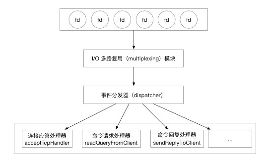

Redis 是一个事件驱动的内存数据库，服务器需要处理两种类型的事件。

- 文件事件
- 时间事件


# Reactor 

Redis 基于 Reactor 模式开发了自己的事件处理器。

 Reactor 模式。看下图：




“I/O 多路复用模块”会监听多个 FD ，当这些FD产生，accept，read，write 或 close 的文件事件。会向“文件事件分发器（dispatcher）”传送事件。

文件事件分发器（dispatcher）在收到事件之后，会根据事件的类型将事件分发给对应的 handler。


## I/O 多路复用模块

Redis 的 I/O 多路复用模块，其实是封装了操作系统提供的 select，epoll，avport 和 kqueue 这些基础函数。向上层提供了一个统一的接口，屏蔽了底层实现的细节。

一般而言 Redis 都是部署到 Linux 系统上，所以我们就看看使用 Redis 是怎么利用 linux 提供的 epoll 实现I/O 多路复用。


首先看看 epoll 提供的三个方法：

```c
/*
 * 创建一个epoll的句柄，size用来告诉内核这个监听的数目一共有多大
 */
int epoll_create(int size)；

/*
 * 可以理解为，增删改 fd 需要监听的事件
 * epfd 是 epoll_create() 创建的句柄。
 * op 表示 增删改
 * epoll_event 表示需要监听的事件，Redis 只用到了可读，可写，错误，挂断 四个状态
 */
int epoll_ctl(int epfd, int op, int fd, struct epoll_event *event)；

/*
 * 可以理解为查询符合条件的事件
 * epfd 是 epoll_create() 创建的句柄。
 * epoll_event 用来存放从内核得到事件的集合
 * maxevents 获取的最大事件数
 * timeout 等待超时时间
 */
int epoll_wait(int epfd, struct epoll_event * events, int maxevents, int timeout);
```


再看 Redis 对文件事件，封装epoll向上提供的接口：

```c

/*
 * 事件状态
 */
typedef struct aeApiState {

    // epoll_event 实例描述符
    int epfd;

    // 事件槽
    struct epoll_event *events;

} aeApiState;

/*
 * 创建一个新的 epoll 
 */
static int  aeApiCreate(aeEventLoop *eventLoop)
/*
 * 调整事件槽的大小
 */
static int  aeApiResize(aeEventLoop *eventLoop, int setsize)
/*
 * 释放 epoll 实例和事件槽
 */
static void aeApiFree(aeEventLoop *eventLoop)
/*
 * 关联给定事件到 fd
 */
static int  aeApiAddEvent(aeEventLoop *eventLoop, int fd, int mask)
/*
 * 从 fd 中删除给定事件
 */
static void aeApiDelEvent(aeEventLoop *eventLoop, int fd, int mask)
/*
 * 获取可执行事件
 */
static int  aeApiPoll(aeEventLoop *eventLoop, struct timeval *tvp)


```

所以看看这个ae_peoll.c 如何对 epoll 进行封装的：

- `aeApiCreate()` 是对 `epoll.epoll_create()` 的封装。
- `aeApiAddEvent()`和`aeApiDelEvent()` 是对 `epoll.epoll_ctl()`的封装。
- `aeApiPoll()` 是对 `epoll_wait()`的封装。

这样 Redis 的利用 epoll 实现的 I/O 复用器就比较清晰了。


再往上一层次我们需要看看 ea.c 是怎么封装的？

首先需要关注的是事件处理器的数据结构：

```c
/* File event structure */
typedef struct aeFileEvent {
    int mask; /* one of AE_(READABLE|WRITABLE|BARRIER) */ //事件处理类型
    aeFileProc *rfileProc; //读事件处理其
    aeFileProc *wfileProc; //写事件
    void *clientData; //客户端数据
} aeFileEvent;

```


除了使用 ae_peoll.c 提供的方法外,ae.c 还增加 “增删查” 的几个 API。

- 增:`aeCreateFileEvent`
- 删:`aeDeleteFileEvent`
- 查: 查包括两个维度 `aeGetFileEvents` 获取某个 fd 的监听类型和`aeWait`等待某个fd 直到超时或者达到某个状态。


# aeEventLoop 

`aeEventLoop` 在 Redis 就是负责保存待处理文件事件和时间事件的结构体，其中保存大量事件执行的上下文信息。

```c
/* State of an event based program */
typedef struct aeEventLoop {
    int maxfd;   /* highest file descriptor currently registered */
    int setsize; /* max number of file descriptors tracked */
    long long timeEventNextId;
    time_t lastTime;     /* Used to detect system clock skew */
    aeFileEvent *events; /* Registered events */
    aeFiredEvent *fired; /* Fired events */
    aeTimeEvent *timeEventHead;
    int stop;
    void *apidata; /* This is used for polling API specific data */
    aeBeforeSleepProc *beforesleep;
    aeBeforeSleepProc *aftersleep;
    int flags;
} aeEventLoop;
```

- `maxfd` 最大可处理句柄

- `setsize`参数表示了`eventloop`可以监听的网络事件fd的个数（不包含超时事件），如果当前监听的fd个数超过了setsize，eventloop将不能继续注册。

- `aeFileEvent` 存储监听的文件事件

- `aeTimeEvent` 存储监听的时间事件

- `aeFiredEvent` 用于存储待处理的文件事件

  

  

  


# 事件处理器的主循环

在 `redis-server` 启动时，首先会初始化一些 redis 服务的配置，最后会调用 `aeMain` 函数陷入 `aeEventLoop` 循环中，等待外部事件的发生：

```go
int main(int argc, char **argv) {
	...
	// 初始化服务器
	initServerConfig();
	...
	// 将服务器设置为守护进程
	if (server.daemonize) daemonize();
	// 创建并初始化服务器数据结构
	initServer();
	...
	// 运行事件处理器，一直到服务器关闭为止
	aeSetBeforeSleepProc(server.el,beforeSleep);
	aeMain(server.el);
	// 服务器关闭，停止事件循环
	aeDeleteEventLoop(server.el);
	return 0
}
```

`aeMain` 函数其实就是一个封装的 `while` 循环，循环中的代码会一直运行直到 `eventLoop` 的 `stop` 被设置为 `true`：


```c
void aeMain(aeEventLoop *eventLoop) {
    eventLoop->stop = 0;
    while (!eventLoop->stop) {
      	//开始处理事件
        aeProcessEvents(eventLoop, AE_ALL_EVENTS|
                                   AE_CALL_BEFORE_SLEEP|
                                   AE_CALL_AFTER_SLEEP);
    }
}
```


它会不停尝试调用 `aeProcessEvents` 对可能存在的多种事件进行处理，而 `aeProcessEvents` 就是实际用于处理事件的函数：

```c
nt aeProcessEvents(aeEventLoop *eventLoop, int flags) {
    int processed = 0, numevents;

    if (!(flags & AE_TIME_EVENTS) && !(flags & AE_FILE_EVENTS)) return 0;

    if (eventLoop->maxfd != -1 ||
        ((flags & AE_TIME_EVENTS) && !(flags & AE_DONT_WAIT))) {
        struct timeval *tvp;

        #1：计算 I/O 多路复用的等待时间 tvp

        numevents = aeApiPoll(eventLoop, tvp);
        for (int j = 0; j < numevents; j++) {
            aeFileEvent *fe = &eventLoop->events[eventLoop->fired[j].fd];
            int mask = eventLoop->fired[j].mask;
            int fd = eventLoop->fired[j].fd;
            int rfired = 0;

            if (fe->mask & mask & AE_READABLE) {
                rfired = 1;
                fe->rfileProc(eventLoop,fd,fe->clientData,mask);
            }
            if (fe->mask & mask & AE_WRITABLE) {
                if (!rfired || fe->wfileProc != fe->rfileProc)
                    fe->wfileProc(eventLoop,fd,fe->clientData,mask);
            }
            processed++;
        }
    }
    if (flags & AE_TIME_EVENTS) processed += processTimeEvents(eventLoop);
    return processed;
}
```

上面的代码省略了 I/O 多路复用函数的等待时间，不过不会影响我们对代码的理解，整个方法大体由两部分代码组成，一部分处理文件事件，另一部分处理时间事件。

> Redis 中会处理两种事件：时间事件和文件事件。

在一般情况下，`aeProcessEvents` 都会先**计算最近的时间事件发生所需要等待的时间**，然后调用 `aeApiPoll` 方法在这段时间中等待事件的发生，在这段时间中如果发生了文件事件，就会优先处理文件事件，否则就会一直等待，直到最近的时间事件需要触发：

```c
numevents = aeApiPoll(eventLoop, tvp);
for (j = 0; j < numevents; j++) {
    aeFileEvent *fe = &eventLoop->events[eventLoop->fired[j].fd];
    int mask = eventLoop->fired[j].mask;
    int fd = eventLoop->fired[j].fd;
    int rfired = 0;

    if (fe->mask & mask & AE_READABLE) {
        rfired = 1;
        fe->rfileProc(eventLoop,fd,fe->clientData,mask);
    }
    if (fe->mask & mask & AE_WRITABLE) {
        if (!rfired || fe->wfileProc != fe->rfileProc)
            fe->wfileProc(eventLoop,fd,fe->clientData,mask);
    }
    processed++;
}
```


文件事件如果绑定了对应的读/写事件，就会执行对应的对应的代码，并传入事件循环、文件描述符、数据以及掩码：

```c
fe->rfileProc(eventLoop,fd,fe->clientData,mask);
fe->wfileProc(eventLoop,fd,fe->clientData,mask);
```


其中 `rfileProc` 和 `wfileProc` 就是在文件事件被创建时传入的函数指针：

```c
int aeCreateFileEvent(aeEventLoop *eventLoop, int fd, int mask, aeFileProc *proc, void *clientData) {
    aeFileEvent *fe = &eventLoop->events[fd];

    if (aeApiAddEvent(eventLoop, fd, mask) == -1)
        return AE_ERR;
    fe->mask |= mask;
    if (mask & AE_READABLE) fe->rfileProc = proc;
    if (mask & AE_WRITABLE) fe->wfileProc = proc;
    fe->clientData = clientData;
    if (fd > eventLoop->maxfd)
        eventLoop->maxfd = fd;
    return AE_OK;
}
```


需要注意的是，传入的 `proc` 函数会在对应的 `mask` 位事件发生时执行。


### 时间事件

在 Redis 中会发生两种时间事件：

- 一种是定时事件，每隔一段时间会执行一次；
- 另一种是非定时事件，只会在某个时间点执行一次；

时间事件的处理在 `processTimeEvents` 中进行，我们会分三部分分析这个方法的实现：

```c
/* Process time events */
static int processTimeEvents(aeEventLoop *eventLoop) {
    int processed = 0;
    aeTimeEvent *te;
    long long maxId;
    time_t now = time(NULL);

    /* If the system clock is moved to the future, and then set back to the
     * right value, time events may be delayed in a random way. Often this
     * means that scheduled operations will not be performed soon enough.
     *
     * Here we try to detect system clock skews, and force all the time
     * events to be processed ASAP when this happens: the idea is that
     * processing events earlier is less dangerous than delaying them
     * indefinitely, and practice suggests it is. */
    if (now < eventLoop->lastTime) {
        te = eventLoop->timeEventHead;
        while(te) {
            te->when_sec = 0;
            te = te->next;
        }
    }
    eventLoop->lastTime = now;
  ......
}
```

由于对系统时间的调整会影响当前时间的获取，进而影响时间事件的执行；如果系统时间先被设置到了未来的时间，又设置成正确的值，这就会导致**时间事件会随机延迟一段时间执行**，也就是说，时间事件不会按照预期的安排尽早执行，而 `eventLoop` 中的 `lastTime` 就是用于检测上述情况的变量：

```c
typedef struct aeEventLoop {
    ...
    time_t lastTime;     /* Used to detect system clock skew */
    ...
} aeEventLoop;
```


如果发现了系统时间被改变（小于上次 `processTimeEvents` 函数执行的开始时间），就会强制所有时间事件尽早执行。

```c
static int processTimeEvents(aeEventLoop *eventLoop) {
......
		prev = NULL;
    te = eventLoop->timeEventHead;
    maxId = eventLoop->timeEventNextId-1;
    while(te) {
        long now_sec, now_ms;
        long long id;

        if (te->id == AE_DELETED_EVENT_ID) {
            aeTimeEvent *next = te->next;
            if (prev == NULL)
                eventLoop->timeEventHead = te->next;
            else
                prev->next = te->next;
            if (te->finalizerProc)
                te->finalizerProc(eventLoop, te->clientData);
            zfree(te);
            te = next;
            continue;
        }
      ......
      
          return processed;
}
```

Redis 处理时间事件时，不会在当前循环中直接移除不再需要执行的事件，而是会在当前循环中将时间事件的 `id` 设置为 `AE_DELETED_EVENT_ID`，然后再下一个循环中删除，并执行绑定的 `finalizerProc`。

```c
 			/* Make sure we don't process time events created by time events in
         * this iteration. Note that this check is currently useless: we always
         * add new timers on the head, however if we change the implementation
         * detail, this check may be useful again: we keep it here for future
         * defense. */
        if (te->id > maxId) {
            te = te->next;
            continue;
        }
        aeGetTime(&now_sec, &now_ms);
        if (now_sec > te->when_sec ||
            (now_sec == te->when_sec && now_ms >= te->when_ms))
        {
            int retval;

            id = te->id;
            te->refcount++;
            retval = te->timeProc(eventLoop, id, te->clientData);
            te->refcount--;
            processed++;
            if (retval != AE_NOMORE) {
                aeAddMillisecondsToNow(retval,&te->when_sec,&te->when_ms);
            } else {
                te->id = AE_DELETED_EVENT_ID;
            }
        }
        te = te->next;
    }
    return processed;
}
```

在移除不需要执行的时间事件之后，我们就开始通过比较时间来判断是否需要调用 `timeProc` 函数，`timeProc` 函数的返回值 `retval` 为时间事件执行的时间间隔：

- `retval == AE_NOMORE`：将时间事件的 `id` 设置为 `AE_DELETED_EVENT_ID`，等待下次 `aeProcessEvents` 执行时将事件清除；
- `retval != AE_NOMORE`：修改当前时间事件的执行时间并重复利用当前的时间事件；

以使用 `aeCreateTimeEvent` 一个创建的简单时间事件为例：

```c
long long aeCreateTimeEvent(aeEventLoop *eventLoop, long long milliseconds,
        aeTimeProc *proc, void *clientData,
        aeEventFinalizerProc *finalizerProc)
{
    long long id = eventLoop->timeEventNextId++;
    aeTimeEvent *te;

    te = zmalloc(sizeof(*te));
    if (te == NULL) return AE_ERR;
    te->id = id;
    aeAddMillisecondsToNow(milliseconds,&te->when_sec,&te->when_ms);
    te->timeProc = proc;
    te->finalizerProc = finalizerProc;
    te->clientData = clientData;
    te->prev = NULL;
    te->next = eventLoop->timeEventHead;
    te->refcount = 0;
    if (te->next)
        te->next->prev = te;
    eventLoop->timeEventHead = te;
    return id;
}
```

其中server 在初始化调用如下

```c
   /* Create the timer callback, this is our way to process many background
     * operations incrementally, like clients timeout, eviction of unaccessed
     * expired keys and so forth. */
    if (aeCreateTimeEvent(server.el, 1, serverCron, NULL, NULL) == AE_ERR) {
        serverPanic("Can't create event loop timers.");
        exit(1);
    }

```


# 参考

如何使用epoll？一个完整的C例子 http://www.yeolar.com/note/2012/07/02/epoll-example/

Redis 中的事件驱动模型 https://xilidou.com/2018/03/22/redis-event/

Redis源码分析 https://qiankunli.github.io/2019/04/20/redis_source.html

