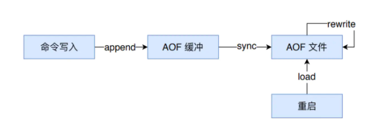

# 为什么需要持久化

持久化的作用是为了在Redis关闭或者意外宕机的情况下，能恢复内存中的数据。Redis在日常的使用场景中，有常见的两种用途：

- 当数据库使用（不推荐），此时持久化的作用显而易见；

- 做缓存使用，虽然Redis挂掉不会影响我们的数据本身，但如果Redis挂了再重启，开启了固化功能后，内存里能够快速恢复热数据，不会瞬时将压力压到数据库上，没有一个cache预热的过程。


# 分类


Redis 分别提供了 RDB 和 AOF 两种持久化机制：

- RDB 将数据库的快照（snapshot）以二进制的方式保存到磁盘中。
- AOF 则以协议文本的方式，将所有对数据库进行过写入的命令（及其参数）记录到 AOF 文件，以此达到记录数据库状态的目的。


# RDB 

## 简单使用

```c
################################ SNAPSHOTTING  ################################
#    
# Save the DB on disk:
#    
#   save <seconds> <changes>
#    
#   Will save the DB if both the given number of seconds and the given
#   number of write operations against the DB occurred.
#    
#   In the example below the behavior will be to save:
#   after 900 sec (15 min) if at least 1 key changed
#   after 300 sec (5 min) if at least 10 keys changed
#   after 60 sec if at least 10000 keys changed
#    
#   Note: you can disable saving completely by commenting out all "save" lines.
#    
#   It is also possible to remove all the previously configured save
#   points by adding a save directive with a single empty string argument
#   like in the following example:
#    
#   save ""

save 900 1
save 300 10
save 60 10000
dbfilename "dump.rdb"          #持久化文件名称
dir "/data/dbs/redis/6381"    #持久化数据文件存放的路径

```


上面是redis配置文件里默认的RDB持久化设置，前三行都是对触发RDB的一个条件，例如第一行的意思是每900秒钟里redis数据库有一条数据被修改则触发RDB，依次类推；只要有一条满足就会调用BGSAVE进行RDB持久化。第四行dbfilename指定了把内存里的数据库写入本地文件的名称，该文件是进行压缩后的二进制文件，通过该文件可以把数据库还原到生成该文件时数据库的状态。第五行dir指定了RDB文件存放的目录。


**配置文件修改需要重启redis服务，我们还可以在命令行里进行配置，即时生效，服务器重启后需重新配置**

```shell
[redis@iZ254r8s3m6Z redis]# bin/redis-cli
127.0.0.1:6379> CONFIG GET save         #查看redis持久化配置
1) "save"
2) "900 1 300 10 60 10000"
 
127.0.0.1:6379> CONFIG SET save "21600 1000" #修改redis持久化配置
OK
```


## SAVE 和 BGSAVE 

而RDB持久化也分两种：**SAVE**和**BGSAVE**


- `SAVE`是阻塞式的`RDB`持久化，当执行这个命令时redis的主进程把内存里的数据库状态写入到`RDB`文件（即上面的`dump.rdb`）中，直到该文件创建完毕的这段时间内`redis`将不能处理任何命令请求。这在很多时候对于需要提供较强可用性保证的 Redis 服务都是无法接受的。
-    `BGSAVE` 命令在后台生成 `Redis` 全部数据对应的 RDB 文件，当我们使用 `BGSAVE` 命令时，`Redis` 会立刻 `fork` 出一个子进程，子进程会执行『将内存中的数据以 `RDB` 格式保存到磁盘中』这一过程，而 `Redis` 服务在 `BGSAVE` 工作期间仍然可以处理来自客户端的请求。


## RDB 源码分析

[`rdbSaveBackground`](https://github.com/antirez/redis/blob/e916058f0ba59e964f5de3dee17f46ae08f1d385/src/rdb.c#L1343-L1378) 就是用来处理在后台将数据保存到磁盘上的函数：


```c
int rdbSaveBackground(char *filename, rdbSaveInfo *rsi) {
    pid_t childpid;

    if (hasActiveChildProcess()) return C_ERR;

    server.dirty_before_bgsave = server.dirty;
    server.lastbgsave_try = time(NULL);
    openChildInfoPipe();

    if ((childpid = redisFork(CHILD_TYPE_RDB)) == 0) {
        int retval;

        /* Child */
        redisSetProcTitle("redis-rdb-bgsave");
        redisSetCpuAffinity(server.bgsave_cpulist);
      	//子进程开始备份
        retval = rdbSave(filename,rsi);
        if (retval == C_OK) {
            sendChildCOWInfo(CHILD_TYPE_RDB, "RDB");
        }
        exitFromChild((retval == C_OK) ? 0 : 1);
    } else {
        /* Parent */
        if (childpid == -1) {
            closeChildInfoPipe();
            server.lastbgsave_status = C_ERR;
            serverLog(LL_WARNING,"Can't save in background: fork: %s",
                strerror(errno));
            return C_ERR;
        }
        serverLog(LL_NOTICE,"Background saving started by pid %d",childpid);
        server.rdb_save_time_start = time(NULL);
        server.rdb_child_pid = childpid;
        server.rdb_child_type = RDB_CHILD_TYPE_DISK;
        return C_OK;
    }
    return C_OK; /* unreached */
}
```


Redis 服务器会在触发 `BGSAVE` 时调用 `redisFork` 函数来创建子进程并调用 `rdbSave` 在子进程中对数据进行持久化。

使用 `fork` 的目的最终一定是为了不阻塞主进程来提升 Redis 服务的可用性，但是到了这里我们其实能够发现两个问题：

1. 为什么 `fork` 之后的子进程能够获取父进程内存中的数据？

   fork 后的子进程内存和父进程是一样的

2. fork` 函数是否会带来额外的性能开销，这些开销我们怎么样才可以避免？ 使用 copy-on-write 技术可以在一定程度上节省内存）


接着看`rdbSave()`函数的源码：

```c
/* Save the DB on disk. Return C_ERR on error, C_OK on success. */
// 将数据库保存在磁盘上，返回C_OK成功，否则返回C_ERR
int rdbSave(char *filename, rdbSaveInfo *rsi) {
    char tmpfile[256];
    char cwd[MAXPATHLEN]; /* Current working dir path for error messages. */
    FILE *fp = NULL;
    rio rdb;
    int error = 0;
	
  	//创建文件
    snprintf(tmpfile,256,"temp-%d.rdb", (int) getpid());
    fp = fopen(tmpfile,"w");
   //打开文件失败
  	if (!fp) {
        char *cwdp = getcwd(cwd,MAXPATHLEN);
       // 写日志信息到logfile
        serverLog(LL_WARNING,
            "Failed opening the RDB file %s (in server root dir %s) "
            "for saving: %s",
            filename,
            cwdp ? cwdp : "unknown",
            strerror(errno));
        return C_ERR;
    }

 	 // 初始化一个rio对象，该对象是一个文件对象IO
    rioInitWithFile(&rdb,fp);
    // 设置 久化转态
  	startSaving(RDBFLAGS_NONE);

    if (server.rdb_save_incremental_fsync)
        rioSetAutoSync(&rdb,REDIS_AUTOSYNC_BYTES);

  	//将数据库的内容写到rio中
    if (rdbSaveRio(&rdb,&error,RDBFLAGS_NONE,rsi) == C_ERR) {
        errno = error;
        goto werr;
    }
	.....
    return C_ERR;
}

```


这个函数最关键的是`rdbSaveRio()`,该函数已一定的编码格式将现有的数据保存到文件中。


# AOF

## AOF 持久化的实现





如上图所示，AOF 持久化功能的实现可以分为命令追加( append )、文件写入( write )、文件同步( sync )、文件重写(rewrite)和重启加载(load)。其流程如下：

- 所有的写命令会追加到 AOF 缓冲中。
- AOF 缓冲区根据对应的策略向硬盘进行同步操作。
- 随着 AOF 文件越来越大，需要定期对 AOF 文件进行重写，达到压缩的目的。
- 当 Redis 重启时，可以加载 AOF 文件进行数据恢复。


# 参考 


 https://gsmtoday.github.io/2018/07/30/Redis%E6%8C%81%E4%B9%85%E5%8C%96%E6%80%BB%E7%BB%93/