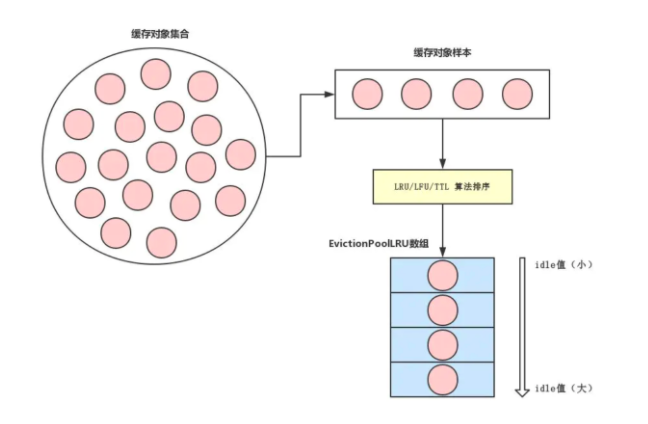

### Redis的内存淘汰

既然可以设置Redis最大占用内存大小，那么配置的内存就有用完的时候。那在内存用完的时候，还继续往Redis里面添加数据不就没内存可用了吗？

实际上Redis定义了几种策略用来处理这种情况：

- noeviction(默认策略)：对于写请求不再提供服务，直接返回错误（DEL请求和部分特殊请求除外）

- allkeys-lru：从所有key中使用LRU算法进行淘汰

- volatile-lru：从设置了过期时间的key中使用LRU算法进行淘汰

- allkeys-random：从所有key中随机淘汰数据

- volatile-random：从设置了过期时间的key中随机淘汰

- volatile-ttl：在设置了过期时间的key中，根据key的过期时间进行淘汰，越早过期的越优先被淘汰

 - volatile-lfu：在设置了过期时间的key中使用LFU算法淘汰key
- allkeys-lfu：在所有的key中使用LFU算法淘汰数据


# LRU 和 LFU 

## LRU

> **LRU(Least Recently Used)**，即最近最少使用，是一种缓存置换算法。在使用内存作为缓存的时候，缓存的大小一般是固定的。当缓存被占满，这个时候继续往缓存里面添加数据，就需要淘汰一部分老的数据，释放内存空间用来存储新的数据。这个时候就可以使用LRU算法了。其核心思想是：如果一个数据在最近一段时间没有被用到，那么将来被使用到的可能性也很小，所以就可以被淘汰掉。

## Golang 实现

```go
type Node struct {
	Next *Node
	Pre  *Node
	Key  int
	Val  int
}

type LRUCache struct {
	capacity int
	len      int
	head     *Node
	tail     *Node
	NodeMap  map[int]*Node
}

func Constructor(capacity int) LRUCache {
	l := LRUCache{
		capacity: capacity,
		len:      0,
		head:     &Node{},
		tail:     &Node{},
		NodeMap:  make(map[int]*Node),
	}

	l.head.Key = -1
	l.head.Val = -1
	l.tail.Key = -1
	l.tail.Val = -1

	l.head.Next = l.tail
	l.tail.Pre = l.head

	return l
}

func (this *LRUCache) Get(key int) int {
	node := this.get(key)
	if node == nil {
		return -1
	}

	return node.Val
}

func (this *LRUCache) get(key int) *Node {
	node, exist := this.NodeMap[key]
	if !exist {
		return nil
	}

	node.Pre.Next = node.Next
	node.Next.Pre = node.Pre


	this.head.Next.Pre = node
	node.Next = this.head.Next
	node.Pre = this.head
	this.head.Next = node

	return node
}

func (this *LRUCache) Put(key int, value int) {
	if this.capacity == 0 {
		return
	}

	node := this.get(key)
	if node != nil {
		node.Val = value
		return
	}

	node = &Node{Val: value, Key: key}
	this.len++
	this.NodeMap[key] = node

	this.head.Next.Pre = node
	node.Next = this.head.Next
	node.Pre = this.head
	this.head.Next = node

	if this.len > this.capacity {
		v := this.tail.Pre.Key
		this.tail.Pre = this.tail.Pre.Pre
		this.tail.Pre.Next = this.tail
		delete(this.NodeMap,v)
	}
}
```


## LFU 

>  LFU,全称是:Least Frequently Used，最不经常使用策略,在一段时间内,数据被使用频次最少的,优先被淘汰。\**最少使用\**（\**LFU\**）是一种用于管理计算机内存的缓存算法。主要是记录和追踪内存块的使用次数,当缓存已满并且需要更多空间时，系统将以最低内存块使用频率清除内存.采用LFU算法的最简单方法是为每个加载到缓存的块分配一个计数器。每次引用该块时，计数器将增加一。当缓存达到容量并有一个新的内存块等待插入时，系统将搜索计数器最低的块并将其从缓存中删除


##  Golang 实现

```go
type Node struct {
	next     *Node
	pre      *Node
	key      int
	value    int
	frequent int
}

type ListNode struct {
	head *Node
	tail *Node
	size int
}

// 双向链表辅助函数：添加一个节点到头节点后
func (this *ListNode) addNode(node *Node) {
	head := this.head
	node.next = head.next
	node.next.pre = node
	node.pre = head
	head.next = node
}

// 双向链表辅助函数，删除一个节点
func (this *ListNode) removeNode(node *Node) {
	node.pre.next = node.next
	node.next.pre = node.pre
}


type LFUCache struct {
	capacity    int
	size        int
	minFrequent int
	frequentMap map[int]*ListNode
	cacheMap    map[int]*Node
}

func NewLru(cap int) *LFUCache {
	l := Constructor(cap)
	return &l
}

func Constructor(capacity int) LFUCache {
	return LFUCache{
		capacity:    capacity,
		size:        0,
		minFrequent: 0,
		cacheMap:    make(map[int]*Node),
		frequentMap: make(map[int]*ListNode),
	}
}


// LFUCache辅助函数：将节点从对应的频次双向链表中删除
func (this *LFUCache) remove(node *Node) {
	this.frequentMap[node.frequent].removeNode(node)
	this.frequentMap[node.frequent].size--
}

// LFUCache辅助函数：将节点添加进对应的频次双向链表，没有则创建
func (this *LFUCache) add(node *Node) {
	if listNode, exist := this.frequentMap[node.frequent]; exist {
		listNode.addNode(node)
		listNode.size++
	} else {
		listNode = &ListNode{&Node{}, &Node{}, 0}
		listNode.head.next = listNode.tail
		listNode.tail.pre = listNode.head
		listNode.addNode(node)
		listNode.size++
		this.frequentMap[node.frequent] = listNode
	}
}
// LFUCache辅助函数：移除一个key
func (this *LFUCache) evictNode() {
	listNode := this.frequentMap[this.minFrequent]
	delete(this.cacheMap, listNode.tail.pre.key)
	listNode.removeNode(listNode.tail.pre)
	listNode.size--
}

// LFUCache辅助函数：获取一个key和修改一个key都会增加对应key的访问频次，可以独立为一个方法，完成如下任务：
// 1. 将对应node从频次列表中移出
// 2. 维护minFrequent
// 3. 该节点访问频次++，移动进下一个访问频次链表
func (this *LFUCache) triggerVisit(node *Node) {
	this.remove(node)
	if node.frequent == this.minFrequent && this.frequentMap[node.frequent].size == 0 {
		this.minFrequent++
	}
	node.frequent++
	this.add(node)
}

func (this *LFUCache) Get(key int) int {
	if node, exist := this.cacheMap[key]; exist {
		this.triggerVisit(node)
		return node.value
	}
	return -1
}


func (this *LFUCache) Put(key int, value int) {
	if this.capacity == 0 {
		return
	}
	if node, exist := this.cacheMap[key]; exist {
		this.triggerVisit(node)
		this.cacheMap[key].value = value
	} else {
		newNode := &Node{
			next:     nil,
			pre:      nil,
			key:      key,
			value:    value,
			frequent: 1,
		}
		if this.size < this.capacity {
			this.add(newNode)
			this.size++
			this.minFrequent = 1
		} else {
			this.evictNode()
			this.add(newNode)
			this.minFrequent = 1
		}
		this.cacheMap[key] = newNode
	}
}
```


# 淘汰策略源码


对于 `Redis` 策略来说，Redis 在访问数据时，都会调用[`lookupKey`](https://github.com/antirez/redis/blob/unstable/src/db.c#L55)方法

```c
/* Low level key lookup API, not actually called directly from commands
 * implementations that should instead rely on lookupKeyRead(),
 * lookupKeyWrite() and lookupKeyReadWithFlags(). */
robj *lookupKey(redisDb *db, robj *key, int flags) {
    dictEntry *de = dictFind(db->dict,key->ptr);
    if (de) {
        robj *val = dictGetVal(de);

        /* Update the access time for the ageing algorithm.
         * Don't do it if we have a saving child, as this will trigger
         * a copy on write madness. */
        if (!hasActiveChildProcess() && !(flags & LOOKUP_NOTOUCH)){
            if (server.maxmemory_policy & MAXMEMORY_FLAG_LFU) {
                updateLFU(val);
            } else {
              	// 获取lru 
                val->lru = LRU_CLOCK();
            }
        }
        return val;
    } else {
        return NULL;
    }
}

```

redis 处理命令是在这里`processCommand` ,该方法会调用 `freeMemoryIfNeededAndSafe` 来释放内存

## `freeMemoryIfNeededAndSafe`

```c
int freeMemoryIfNeededAndSafe(void) {
    if (server.lua_timedout || server.loading) return C_OK;
    return freeMemoryIfNeeded();
}
```


没有lua脚本处于超时状态且不在载入数据状态时，才会执行`freeMemoryIfNeeded()`函数

## freeMemoryIfNeeded: 根据淘汰策略清理内存

默认情况下，从节点应该忽略`maxmemory`指令，仅仅做从节点该做的事情就好

```c
if (server.masterhost && server.repl_slave_ignore_maxmemory) return C_OK;
```

如果淘汰策略是`noeviction`, 直接跳转到`cant_free`

```c
if (server.maxmemory_policy == MAXMEMORY_NO_EVICTION)
        goto cant_free; /* We need to free memory, but policy forbids. */
```

`cant_free`有如下两种情况，它能做的只有检查`lazyfree`线程（应该是redis v4添加的）是否还有任务，然后等待。

- 第一种是淘汰策略为`noeviction`
- 第二种是在当前的淘汰策略下，"nothing to free"


```c
cant_free:
    /* We are here if we are not able to reclaim memory. There is only one
     * last thing we can try: check if the lazyfree thread has jobs in queue
     * and wait... */
    if (result != C_OK) {
        latencyStartMonitor(lazyfree_latency);
        while(bioPendingJobsOfType(BIO_LAZY_FREE)) {
            if (getMaxmemoryState(NULL,NULL,NULL,NULL) == C_OK) {
                result = C_OK;
                break;
            }
            usleep(1000);
        }
        latencyEndMonitor(lazyfree_latency);
        latencyAddSampleIfNeeded("eviction-lazyfree",lazyfree_latency);
    }
    latencyEndMonitor(latency);
    latencyAddSampleIfNeeded("eviction-cycle",latency);
    return result;
```


通过`getMaxmemoryState`函数(不重要，略)，取得要释放多少空间`mem_tofrtee`，选择策略开始清理

```c
  if (getMaxmemoryState(&mem_reported,NULL,&mem_tofree,NULL) == C_OK)
        return C_OK;

    mem_freed = 0;

    latencyStartMonitor(latency);
    if (server.maxmemory_policy == MAXMEMORY_NO_EVICTION)
        goto cant_free; /* We need to free memory, but policy forbids. */

    while (mem_freed < mem_tofree) {
        int j, k, i;
        static unsigned int next_db = 0;
      	//匹配的key 
        sds bestkey = NULL;
       
				// bestkey所在的db
        int bestdbid;
        redisDb *db;
        dict *dict;
        dictEntry *de;

      	// LRU算法/LFU算法/TTL过期时间
        if (server.maxmemory_policy & (MAXMEMORY_FLAG_LRU|MAXMEMORY_FLAG_LFU) ||
            server.maxmemory_policy == MAXMEMORY_VOLATILE_TTL)
        {
            ......
        }

        /* volatile-random and allkeys-random policy */
      	 // 随机淘汰
        else if (server.maxmemory_policy == MAXMEMORY_ALLKEYS_RANDOM ||
                 server.maxmemory_policy == MAXMEMORY_VOLATILE_RANDOM)
        {
  				...... 
        }

        /* Finally remove the selected key. */
        // 删除所选的key
        if (bestkey) {
            db = server.db+bestdbid;
            robj *keyobj = createStringObject(bestkey,sdslen(bestkey));
            propagateExpire(db,keyobj,server.lazyfree_lazy_eviction);
            /* We compute the amount of memory freed by db*Delete() alone.
             * It is possible that actually the memory needed to propagate
             * the DEL in AOF and replication link is greater than the one
             * we are freeing removing the key, but we can't account for
             * that otherwise we would never exit the loop.
             *
             * AOF and Output buffer memory will be freed eventually so
             * we only care about memory used by the key space. */
            delta = (long long) zmalloc_used_memory();
            latencyStartMonitor(eviction_latency);
            if (server.lazyfree_lazy_eviction)
              	//通过异步删除
                dbAsyncDelete(db,keyobj);
            else
              	// 同步删除
                dbSyncDelete(db,keyobj);
            signalModifiedKey(NULL,db,keyobj);
            latencyEndMonitor(eviction_latency);
            latencyAddSampleIfNeeded("eviction-del",eviction_latency);
            // 计算释放了多少内存
            delta -= (long long) zmalloc_used_memory();
            mem_freed += delta;
            server.stat_evictedkeys++;
            notifyKeyspaceEvent(NOTIFY_EVICTED, "evicted",
                keyobj, db->id);
            decrRefCount(keyobj);
            keys_freed++;

            /* When the memory to free starts to be big enough, we may
             * start spending so much time here that is impossible to
             * deliver data to the slaves fast enough, so we force the
             * transmission here inside the loop. */
            if (slaves) flushSlavesOutputBuffers();

            /* Normally our stop condition is the ability to release
             * a fixed, pre-computed amount of memory. However when we
             * are deleting objects in another thread, it's better to
             * check, from time to time, if we already reached our target
             * memory, since the "mem_freed" amount is computed only
             * across the dbAsyncDelete() call, while the thread can
             * release the memory all the time. */
            if (server.lazyfree_lazy_eviction && !(keys_freed % 16)) {
                if (getMaxmemoryState(NULL,NULL,NULL,NULL) == C_OK) {
                    /* Let's satisfy our stop condition. */
                    mem_freed = mem_tofree;
                }
            }
        } else {
            goto cant_free; /* nothing to free... */
        }
    }
    result = C_OK;
```

## allkeys-random和volatile-random分支

当选择随机淘汰时，会遍历当前redis实例的每一个db，如果是所有key随机删除选择`db->dict`, 否则只选择设置了过期时间的集合: `db->expires`， 如果每一个db的`dictSize(dict)`都是0，则会进入到上面提到的`cant_free`的第二种情况

```c
          /* When evicting a random key, we try to evict a key for
             * each DB, so we use the static 'next_db' variable to
             * incrementally visit all DBs. */
            for (i = 0; i < server.dbnum; i++) {
                j = (++next_db) % server.dbnum;
                db = server.db+j;
                dict = (server.maxmemory_policy == MAXMEMORY_ALLKEYS_RANDOM) ?
                        db->dict : db->expires;
                if (dictSize(dict) != 0) {
                    de = dictGetRandomKey(dict);
                    bestkey = dictGetKey(de);
                    bestdbid = j;
                    break;
                }
            }
```


## lfu/lru/ttl分支

相关定义，可以知道，淘汰策略的核心字段在于`idle`这个属性

```c
/* ----------------------------------------------------------------------------
 * Data structures
 * --------------------------------------------------------------------------*/

/* To improve the quality of the LRU approximation we take a set of keys
 * that are good candidate for eviction across freeMemoryIfNeeded() calls.
 *
 * Entries inside the eviction pool are taken ordered by idle time, putting
 * greater idle times to the right (ascending order).
 *
 * When an LFU policy is used instead, a reverse frequency indication is used
 * instead of the idle time, so that we still evict by larger value (larger
 * inverse frequency means to evict keys with the least frequent accesses).
 *
 * Empty entries have the key pointer set to NULL. */
#define EVPOOL_SIZE 16
#define EVPOOL_CACHED_SDS_SIZE 255

struct evictionPoolEntry {
    unsigned long long idle;    /* Object idle time (inverse frequency for LFU) */
    sds key;                    /* Key name. */
    sds cached;                 /* Cached SDS object for key name. */
    int dbid;                   /* Key DB number. */
};
```

首先初始化样本集，这部分和lru/lfu/ttl并无关系，核心在于`evictionPoolPopulate`函数

```c
//初始化样本集合		
int freeMemoryIfNeeded(void) {
  					..... 
              
              
            struct evictionPoolEntry *pool = EvictionPoolLRU;

            while(bestkey == NULL) {
                unsigned long total_keys = 0, keys;

                /* We don't want to make local-db choices when expiring keys,
                 * so to start populate the eviction pool sampling keys from
                 * every DB. */
               	// 遍历每一个db，更新/维护pool样本集
                for (i = 0; i < server.dbnum; i++) {
                    db = server.db+i;
                    dict = (server.maxmemory_policy & MAXMEMORY_FLAG_ALLKEYS) ?
                            db->dict : db->expires;
                    if ((keys = dictSize(dict)) != 0) {
                         // 四个参数可以理解为：dbid, 候选集合(db->dict/db->expires), 完整集合(db->dict), 样本集合
                        evictionPoolPopulate(i, dict, db->dict, pool);
                        total_keys += keys;
                    }
                }
                 // 无key可淘汰
                if (!total_keys) break; /* No keys to evict. */

                /* Go backward from best to worst element to evict. */
     
              	 // 从后向前遍历, 并重置样本集
                for (k = EVPOOL_SIZE-1; k >= 0; k--) {
                    if (pool[k].key == NULL) continue;
                    bestdbid = pool[k].dbid;

                    if (server.maxmemory_policy & MAXMEMORY_FLAG_ALLKEYS) {
                        de = dictFind(server.db[pool[k].dbid].dict,
                            pool[k].key);
                    } else {
                        de = dictFind(server.db[pool[k].dbid].expires,
                            pool[k].key);
                    }

                    /* Remove the entry from the pool. */
                    if (pool[k].key != pool[k].cached)
                        sdsfree(pool[k].key);
                    pool[k].key = NULL;
                    pool[k].idle = 0;

                    /* If the key exists, is our pick. Otherwise it is
                     * a ghost and we need to try the next element. */
                     // 寻找到bestkey，break
                    if (de) {
                        bestkey = dictGetKey(de);
                        break;
                    } else {
                        /* Ghost... Iterate again. */
                    }
                }
            }
  ......
  return result;
}

```




##  evictionPoolPopulate: LRU/LFU算法

首先，根据`maxmemory_samples`配置，选择一定数量的样本，这个值默认为5，值越高越接近真实的LRU/LFU算法，值越低，性能越高，所以需要平衡

```c
count = dictGetSomeKeys(sampledict,samples,server.maxmemory_samples);
for (j = 0; j < count; j++) {
    // 见下一个代码块
}
```

遍历，根据策略计算出每一个样本的`idle`值，值越高，可以理解为匹配度越高，优先删除

- `volatile-ttl`策略计算`idle`值方式: 快过期的放后面
- `lru`策略计算方式: 更久没访问的放前面
- `lfu`策略计算方式方式: 访问频率更低的放在后面，频率一致，比较谁更久没访问

```c
 /* Calculate the idle time according to the policy. This is called
         * idle just because the code initially handled LRU, but is in fact
         * just a score where an higher score means better candidate. */
        if (server.maxmemory_policy & MAXMEMORY_FLAG_LRU) {
            idle = estimateObjectIdleTime(o);
        } else if (server.maxmemory_policy & MAXMEMORY_FLAG_LFU) {
            /* When we use an LRU policy, we sort the keys by idle time
             * so that we expire keys starting from greater idle time.
             * However when the policy is an LFU one, we have a frequency
             * estimation, and we want to evict keys with lower frequency
             * first. So inside the pool we put objects using the inverted
             * frequency subtracting the actual frequency to the maximum
             * frequency of 255. */
            idle = 255-LFUDecrAndReturn(o);
        } else if (server.maxmemory_policy == MAXMEMORY_VOLATILE_TTL) {
            /* In this case the sooner the expire the better. */
            idle = ULLONG_MAX - (long)dictGetVal(de);
        } else {
            serverPanic("Unknown eviction policy in evictionPoolPopulate()");
        }
```

## Redis LRU的实现

Redis维护了一个24bit的全局时钟，可以简单的理解为当前系统的时间戳，每隔一定时间会更新这个时钟，此处不拓展

```c
// server.h 595行
#define LRU_BITS 24  // 24bit的时钟
#define LRU_CLOCK_MAX ((1<<LRU_BITS)-1) // obj->lru时钟的最大值
#define LRU_CLOCK_RESOLUTION 1000 // 时钟精度，毫秒

// server.h 1017行
stuct redisServer {
    // Clock for LRU eviction
    _Atomic unsigned int lruclock;
}
```

每个key对象内部同样维护了一个24bit的时钟，后文中使用`o->lru`指代

```c
// server.h 600行
typedef struct redisObject {
    // LRU time (relative to global lru_clock)
    unsigned lru:LRU_BITS
}
```

设置全局lruclock，当lruclock的值超过LRU_CLOCK_MAX，会从头开始计算

```
// src/evict.c 70行
unsigned int getLRUClock(void) {
    return (mstime()/LRU_CLOCK_RESOLUTION) & LRU_CLOCK_MAX;
}
```

设置`o->lru`, 当新增key对象的时候会把系统的时钟赋值到这个内部对象时钟

```c
// src/evict.c 78行
unsigned int LRU_CLOCK(void) {
    unsigned int lruclock;
    if (1000/server.hz <= LRU_CLOCK_RESOLUTION) {
        lruclock = server.lruclock;
    } else {
        lruclock = getLRUClock();
    }
    return lruclock;
}
```

比如现在要进行LRU，就需要对比`lruclock`和`o->lru`，它们有两种情况

- `lruclock >= o->lru`: 这是通常情况
- `lruclock < o->lru`: 当lruclock的值超过LRU_CLOCK_MAX，会从头开始计算，因此会出现这种情况，需要计算额外的时间

```c
// src/evict.c 88行
unsigned long long estimateObjectIdleTime(robj *o) {
    unsigned long long lruclock = LRU_CLOCK();
    if (lruclock >= o->lru) {
        return (lruclock - o->lru) * LRU_CLOCK_RESOLUTION;
    } else {
        return (lruclock + (LRU_CLOCK_MAX - o->lru)) * LRU_CLOCK_RESOLUTION;
    }
}
```


## lfu 

redis lfu的实现这里就不做分析了。,可以参考这篇文章[Redis中的LFU算法](https://www.cnblogs.com/linxiyue/p/10955533.html)

# 参考

Redis内存淘汰策略已经源码分析 https://blog.calabash.top/Calabash/articles/5e902b737cbda28172f74908

Redis · lazyfree · 大key删除的福音 http://mysql.taobao.org/monthly/2018/10/05/

Redis中的LFU算法 https://www.cnblogs.com/linxiyue/p/10955533.html