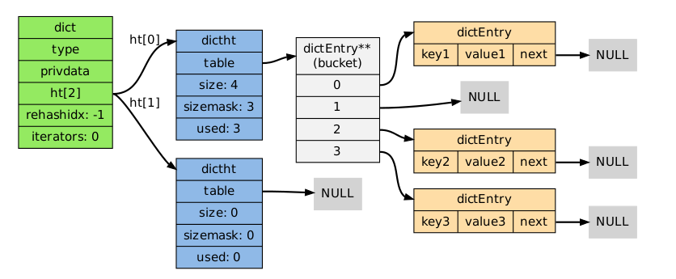

在 Redis 中，dict 的代码存放在`src/dict.c`和`src/dict.h`两个文件中。在`src/dict.h`中定义了 dict 所用到的结构体，一共有四个:

```c
typedef struct dict {
    dictType *type; // dict类型
    void *privdata; // 保存类型特定函数需要使用的参数 
    dictht ht[2];   // 保存的两个哈希表，ht[0]是真正使用的，ht[1]会在rehash时使用 
    long rehashidx; /* rehashing not in progress if rehashidx == -1 */
    unsigned long iterators; /* number of iterators currently running */
} dict;

// hash表结构
typedef struct dictht {
    dictEntry **table;// hash 表节点数组
    unsigned long size; // hash 表大小
    unsigned long sizemask;// 哈希表大小掩码，用于计算哈希表的索引值，大小总是dictht.size - 1 
    unsigned long used;//哈希表已经使用的节点数量
} dictht;


typedef struct dictType {
    uint64_t (*hashFunction)(const void *key);// 哈希函数
    void *(*keyDup)(void *privdata, const void *key);// 复制key 函数
    void *(*valDup)(void *privdata, const void *obj);// 复制val 函数
    int (*keyCompare)(void *privdata, const void *key1, const void *key2);//key 值比较函数
    void (*keyDestructor)(void *privdata, void *key);// key 值回收
    void (*valDestructor)(void *privdata, void *obj);// value 值回收
} dictType;

//保存一连串操作特定类型键值对的函数 */

//哈希表节点 
typedef struct dictEntry {
    void *key; // key 值
    union {
        void *val; // value 值
        uint64_t u64;
        int64_t s64;
        double d;
    } v;
    struct dictEntry *next;// 下一个节点
} dictEntry;
```

其结构大致如下



# 创建 dict

```go
/* Create a new hash table */
dict *dictCreate(dictType *type,
        void *privDataPtr)
{
  	//分配内存
    dict *d = zmalloc(sizeof(*d));

  	//初始化
    _dictInit(d,type,privDataPtr);
    return d;
}

/* Initialize the hash table */
int _dictInit(dict *d, dictType *type,
        void *privDataPtr)
{
  	//重置dict 
    _dictReset(&d->ht[0]);
    _dictReset(&d->ht[1]);
  	//设置类型
    d->type = type;
  	//保存类型特定函数需要使用的参数
    d->privdata = privDataPtr;
    d->rehashidx = -1;
    d->iterators = 0;
    return DICT_OK;
}
```

# 查找

```c
dictEntry *dictFind(dict *d, const void *key)
{
    dictEntry *he;
    uint64_t h, idx, table;

  	//字段的大小为0 
    if (dictSize(d) == 0) return NULL; /* dict is empty */
  //如果当前正在进行重哈希，那么将重哈希过程向前推进一步（即调用_dictRehashStep）。实际上，除了查找，插入和删除也都会触发这一动作。这就将重哈希过程分散到各个查找、插入和删除操作中去了，而不是集中在某一个操作中一次性做完。
    if (dictIsRehashing(d)) _dictRehashStep(d);
   
  //计算hash值
 	 h = dictHashKey(d, key);
    for (table = 0; table <= 1; table++) {
       //计算key 所在bucket的位置
       idx = h & d->ht[table].sizemask;
        he = d->ht[table].table[idx];
      	//遍历链表
        while(he) {
            if (key==he->key || dictCompareKeys(d, key, he->key))
                return he;
            he = he->next;
        }
      	//不处于rehash 状态，就不需要查找第二个表
        if (!dictIsRehashing(d)) return NULL;
    }
    return NULL;
}


```


# 添加key-value 到字典

dictAdd插入新的一对key和value，如果key已经存在，则插入失败。

dictReplace也是插入一对key和value，不过在key存在的时候，它会更新value。

```c
/* Add an element to the target hash table */
int dictAdd(dict *d, void *key, void *val)
{
    dictEntry *entry = dictAddRaw(d,key,NULL);

    if (!entry) return DICT_ERR;
    dictSetVal(d, entry, val);
    return DICT_OK;
}


dictEntry *dictAddRaw(dict *d, void *key, dictEntry **existing)
{
    long index;
    dictEntry *entry;
    dictht *ht;

  	//是否处于reshash过程，rehash的相关在后面在分析
    if (dictIsRehashing(d)) _dictRehashStep(d);

    /* Get the index of the new element, or -1 if
     * the element already exists. */
   //
    if ((index = _dictKeyIndex(d, key, dictHashKey(d,key), existing)) == -1)
        return NULL;

    /* Allocate the memory and store the new entry.
     * Insert the element in top, with the assumption that in a database
     * system it is more likely that recently added entries are accessed
     * more frequently. */
  	//果正在重哈希中，它会把数据插入到ht[1]；否则插入到ht[0]。
    ht = dictIsRehashing(d) ? &d->ht[1] : &d->ht[0];
    entry = zmalloc(sizeof(*entry));
    entry->next = ht->table[index];
    ht->table[index] = entry;
    ht->used++;

    /* Set the hash entry fields. */
  	//设置Value 
    dictSetKey(d, entry, key);
    return entry;
}

//查找key值需要插入的位置，如果存在
static int _dictKeyIndex(dict *d, const void *key)
{
    unsigned int h, idx, table;
    dictEntry *he;

    /* Expand the hash table if needed */
    if (_dictExpandIfNeeded(d) == DICT_ERR)
        return -1;
    /* Compute the key hash value */
    h = dictHashKey(d, key);
    for (table = 0; table <= 1; table++) {
      	//查看key在buket的位置
        idx = h & d->ht[table].sizemask;
        /* Search if this slot does not already contain the given key */
        he = d->ht[table].table[idx];
        while(he) {
         		//key值是否相等
            if (key==he->key || dictCompareKeys(d, key, he->key))
                return -1;
            he = he->next;
        }
        if (!dictIsRehashing(d)) break;
    }
    return idx;
}

```

