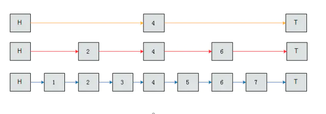
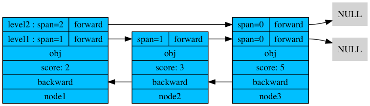

Redis里面使用skiplist是为了实现sorted set这种对外的数据结构。


我们知道在一般的有序链表中，我们需要查找数据的时间复杂度为 $ O(n) $ 。但如果是数组的话，可以使用二分查找达到O(lgn)。可以在链表中使用二分查找吗？

不可以，因为二分查找需要用到中间位置的节点，而链表不能随机访问。而skiplist就是为了让链表的达到log(n)的时间复杂度一种改造。


skiplist相邻两个节点增加一个指针，让指针指向下下个节点,如下图所示



原来的链表写成了三个链表，记从下到上的编号为0、1、2，可以发现0号链表就是原始链表，1号链表是原始链表四等分点，2号链表是原始链表的二等分点。

我们再来查找7，初始搜索范围为(H, T)：

1. 在2号链表中与4比较，7>4，更新搜索范围为(4, T)
2. 在1号链表中与6比较，7>6，更新搜索范围为(6, T)
3. 在0号链表中与7比较，7=7，查找成功。


- skipList结合了链表和二分查找的思想
- 将原始链表和一些通过“跳跃”生成的链表组成层
- 第0层是原始链表，越上层“跳跃”的步距越大，链表元素越少
- 上层链表是下层链表的子序列
- 查找时从顶层向下，不断缩小搜索范围


# 源码分析

## 数据结构


```go
* ZSETs use a specialized version of Skiplists */
typedef struct zskiplistNode {
    sds ele;
    double score; //分数
    struct zskiplistNode *backward;//后向指针
    struct zskiplistLevel {
        struct zskiplistNode *forward;//每一层中的前向指针
        unsigned int span;//x.level[i].span 表示节点x在第i层到其下一个节点需跳过的节点数。注：两个相邻节点span为1
    } level[];
} zskiplistNode;

typedef struct zskiplist {
    struct zskiplistNode *header, *tail;
    unsigned long length;//节点总数
    int level;//总层数 
} zskiplist;
```


- 节点的分值(score属性)是一个double类型的浮点数，跳跃表中的所有节点都按分值从小到大来排序。
- 节点的后退指针 ( backward 属性 ) 用于从表尾向表头方向访问节点：跟可以一次跳过多个节点的前进指针不同，因为每个节点只有一个后退指针，所以每次只能后退至前一个节点。




## 随机算法

```c
int zslRandomLevel(void) {
    int level = 1;
    while ((random()&0xFFFF) < (ZSKIPLIST_P * 0xFFFF))
        level += 1;
    return (level<ZSKIPLIST_MAXLEVEL) ? level : ZSKIPLIST_MAXLEVEL;
}
```

这个代码的伪代码大概如下

```c
randomLevel()
    level := 1
    // random()返回一个[0...1)的随机数
    while random() < p and level < MaxLevel do  
        level := level + 1
    return level
```


其中 p = 0.25  MaxLevel = 32

根据前面randomLevel()的伪码，我们很容易看出，产生越高的节点层数，概率越低。定量的分析如下：

- 节点层数至少为1。而大于1的节点层数，满足一个概率分布。
- 节点层数恰好等于1的概率为$ (1-p) $。
- 节点层数恰好等于2的概率为$ p(1-p) $)。
- 节点层数恰好等于3的概率为$ p^2(1-p) $。
- 节点层数恰好等于4的概率为$ p^3(1-p) $。
- 节点层数恰好等于32的概率为$ p^{31}(1-p) $。


## 创建跳跃表

```c
/* Create a new skiplist. */
zskiplist *zslCreate(void) {
    int j;
    zskiplist *zsl;

    zsl = zmalloc(sizeof(*zsl));
    zsl->level = 1;
    zsl->length = 0;
  	//创建头节点
    zsl->header = zslCreateNode(ZSKIPLIST_MAXLEVEL,0,NULL);

    for (j = 0; j < ZSKIPLIST_MAXLEVEL; j++) {
        zsl->header->level[j].forward = NULL;
        zsl->header->level[j].span = 0;
    }
    zsl->header->backward = NULL;
    zsl->tail = NULL;
    return zsl;
}

/* Create a skiplist node with the specified number of levels.
 * The SDS string 'ele' is referenced by the node after the call. */
zskiplistNode *zslCreateNode(int level, double score, sds ele) {
    zskiplistNode *zn =
        zmalloc(sizeof(*zn)+level*sizeof(struct zskiplistLevel));
    zn->score = score;
    zn->ele = ele;
    return zn;
}
```

## 插入数据


```c
/* Insert a new node in the skiplist. Assumes the element does not already
 * exist (up to the caller to enforce that). The skiplist takes ownership
 * of the passed SDS string 'ele'. */
zskiplistNode *zslInsert(zskiplist *zsl, double score, sds ele) {
  	// update数组用来记录每一层的最后一个分数小于待插入score的节点
    zskiplistNode *update[ZSKIPLIST_MAXLEVEL], *x;
 	 //rank数组用来记录上述插入位置的上一个节点的排名，以便于最后更新span值。
    unsigned int rank[ZSKIPLIST_MAXLEVEL];
    int i, level;

    serverAssert(!isnan(score));
   // 在各个层中查找节点的插入位置
    x = zsl->header;
   // 从高往低进行查找
    for (i = zsl->level-1; i >= 0; i--) {
        /* store rank that is crossed to reach the insert position */
        rank[i] = i == (zsl->level-1) ? 0 : rank[i+1];
      	//  前向指针不为空，前向指针所指节点的分值小于score   或者
        // 前向指针所指节点的分值相等，但成员的值小于ele的值   时 
        while (x->level[i].forward &&
                (x->level[i].forward->score < score ||
                    (x->level[i].forward->score == score &&
                    sdscmp(x->level[i].forward->ele,ele) < 0)))
        {
            rank[i] += x->level[i].span;
            x = x->level[i].forward;
        }
        update[i] = x;
    }
    /* we assume the element is not already inside, since we allow duplicated
     * scores, reinserting the same element should never happen since the
     * caller of zslInsert() should test in the hash table if the element is
     * already inside or not. */
  	 // 获取一个随机值作为新节点的层数
    level = zslRandomLevel();
  	 /* 如果新节点的层数比表中其他节点的层数都要大
     * 那么初始化表头节点中对应未使用的层，并记录到 update 数组中 */
    if (level > zsl->level) {
        for (i = zsl->level; i < level; i++) 
            rank[i] = 0
            update[i] = zsl->header;
            update[i]->level[i].span = zsl->length;
        }
        zsl->level = level;
    }
	 //创建一个节点
    x = zslCreateNode(level,score,ele);
    for (i = 0; i < level; i++) {
         // 设置新节点每一层的前向指针
        x->level[i].forward = update[i]->level[i].forward;
        update[i]->level[i].forward = x;

        /* update span covered by update[i] as x is inserted here */
        x->level[i].span = update[i]->level[i].span - (rank[0] - rank[i]);
        update[i]->level[i].span = (rank[0] - rank[i]) + 1;
    }

    /* increment span for untouched levels */
		/* 如果新节点的层数比表中其他节点的层数都要大，
     * 那么 update 数组中那些之前指向NULL，
     * 现在指向新节点的数组元素的 span 值也要加1 */
    for (i = level; i < zsl->level; i++) {
        update[i]->level[i].span++;
    }
 
		//设置前向指针和后向指针
    x->backward = (update[0] == zsl->header) ? NULL : update[0];
    if (x->level[0].forward)
        x->level[0].forward->backward = x;
    else
        zsl->tail = x;
    zsl->length++;
    return x;
}
```


## 删除节点

```c
/* Internal function used by zslDelete, zslDeleteRangeByScore and
 * zslDeleteRangeByRank. */
void zslDeleteNode(zskiplist *zsl, zskiplistNode *x, zskiplistNode **update) {
    int i;
    for (i = 0; i < zsl->level; i++) {
        if (update[i]->level[i].forward == x) {
            update[i]->level[i].span += x->level[i].span - 1;
            update[i]->level[i].forward = x->level[i].forward;
        } else {
            update[i]->level[i].span -= 1;
        }
    }
    if (x->level[0].forward) {
        x->level[0].forward->backward = x->backward;
    } else {
        zsl->tail = x->backward;
    }
    while(zsl->level > 1 && zsl->header->level[zsl->level-1].forward == NULL)
        zsl->level--;
    zsl->length--;
}
```


参考 

https://www.w3cschool.cn/hdclil/pea3uozt.html

Redis内部数据结构详解(6)——skiplist http://zhangtielei.com/posts/blog-redis-skiplist.html

Redis源码阅读笔记--跳跃表zskiplist https://zhuanlan.zhihu.com/p/49295806 

Redis Internal Data Structure : Skiplist http://blog.wjin.org/posts/redis-internal-data-structure-skiplist.html

