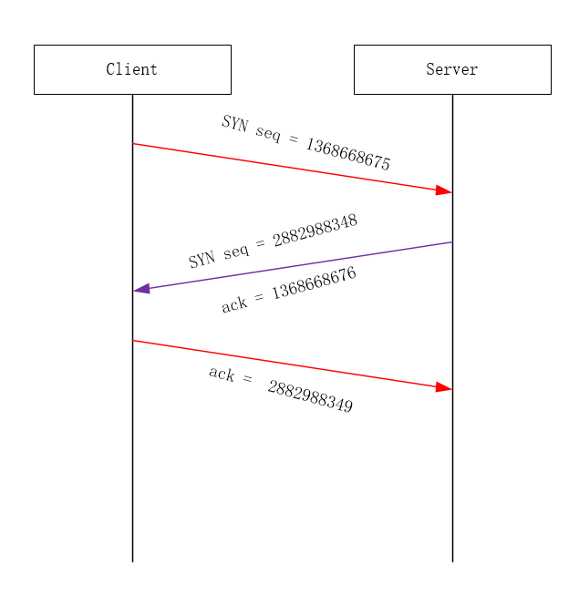
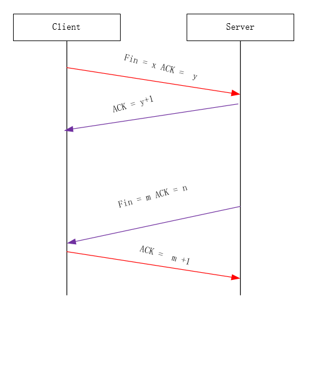
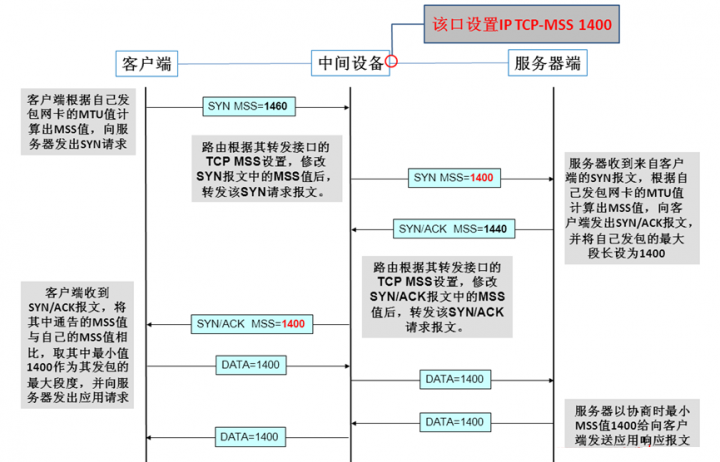

---

title: "18-tcp的连接和建立"
date: 2020-10-31T20:44:08+08:00
draft: true
tags: ["tcp","网络"]   #[]前面要有空格
categories: ["tcp/ip详解阅读笔记"]
---

**TCP是一个面向连接的协议，无论哪一个方向向另一方向发送数据，都必须先在双方之间建立一条连接。**

# 连接的建立

TCP 建立连接有三个过程

- 请求端（通常称为客户）发送一个SYN段指明客户打算连接的服务器的端口，以及初始序号（ISN，在这个例子中为1368668675）。这个SYN段为报文段1。

- 服务器发回包含服务器的初始序号的SYN报文段（报文段2）作为应答。同时，将确认序号设置为客户的ISN加1以对客户的SYN报文段进行确认。一个SYN将占用一个序号。

- 客户必须将确认序号设置为服务器的ISN加1以对服务器的SYN报文段进行确认（报文段3）。

这三个报文段完成连接的建立。这个过程也称为三次握手（three-way handshake）。

## 实验验证三次握手

192.168.1.10 这台机器的 6378 端口启一个 redis 服务 **(备注：这里由于机器ip隐私，所以192.168.1.10，192.168.1.11并发实验时真实ip)**

192.168.1.11 通过 tcpdump 这个工具来抓取数据包，命令如下

```shell
tcpdump -i eth0 -n 'port 6378 and tcp'  -X -s 0 -S
```

然后在 192.168.1.11 在这个机器运行

```shell
 telnet 192.168.1.10 6378
```
我们可以得到以下输出

```
14:58:04.199325 IP 192.168.1.10.idmgratm > 192.168.1.10.6378: Flags [S], seq 1368668675, win 29200, options [mss 1460,sackOK,TS val 3038320571 ecr 0,nop,wscale 7], length 0
	0x0000:  4510 003c 2db8 4000 4006 9e0c 0af9 ac2a  E..<-.@.@......*
	0x0010:  0af9 accb 8080 18ea 5194 3a03 0000 0000  ........Q.:.....
	0x0020:  a002 7210 6f16 0000 0204 05b4 0402 080a  ..r.o...........
	0x0030:  b519 17bb 0000 0000 0103 0307            ............
14:58:04.199708 IP 192.168.1.10.6378 > 192.168.1.11.idmgratm: Flags [S.], seq 2882988348, ack 1368668676, win 28960, options [mss 1460,sackOK,TS val 2269017029 ecr 3038320571,nop,wscale 7], length 0
	0x0000:  4500 003c 0000 4000 3f06 ccd4 0af9 accb  E..<..@.?.......
	0x0010:  0af9 ac2a 18ea 8080 abd6 e93c 5194 3a04  ...*.......<Q.:.
	0x0020:  a012 7120 e5f8 0000 0204 05b4 0402 080a  ..q.............
	0x0030:  873e 73c5 b519 17bb 0103 0307            .>s.........
14:58:04.199769 IP 192.168.1.11.idmgratm > 192.168.1.10.6378: Flags [.], ack 2882988349, win 229, options [nop,nop,TS val 3038320571 ecr 2269017029], length 0
	0x0000:  4510 0034 2db9 4000 4006 9e13 0af9 ac2a  E..4-.@.@......*
	0x0010:  0af9 accb 8080 18ea 5194 3a04 abd6 e93d  ........Q.:....=
	0x0020:  8010 00e5 6f0e 0000 0101 080a b519 17bb  ....o...........
	0x0030:  873e 73c5                                .>s.
```

通过上面的实验我们可以画出以下的握手过程



发送第一个SYN的一端将执行主动打开（active open）。接收这个SYN并发回下一个SYN的另一端执行被动打开（passive open）


#  连接的终止

> 建立一个连接需要三次握手，而终止一个连接要经过4次握手。这由TCP的半关闭（halfclose）造成的。既然一个TCP连接是全双工（即数据在两个方向上能同时传递），因此每个方向必须单独地进行关闭。这原则就是当一方完成它的数据发送任务后就能发送一个FIN来终止这个方向连接。当一端收到一个FIN，它必须通知应用层另一端几经终止了那个方向的数据传送。发送FIN通常是应用层进行关闭的结果。

同样我们可以用telnet模拟断开连接的过程

```go
18:19:17.089341 IP 192.168.1.10.6378 > 192.168.1.11.33964: Flags [F.], seq 2221282036, ack 81895238, win 227, options [nop,nop,TS val 2281089934 ecr 3050393501], length 0
  0x0000:  {4500 0034 5f2b 4000 3f06 6db1 0af9 accb  E..4_+@.?.m.....
  0x0010:  0af9 ac2a} 18ea 84ac 8466 12f4 04e1 9f46  ...*.....f.....F
	0x0020: 【8010】00e3 6f0e 0000 0101 080a 87f6 ab8e  ....o...........
  0x0030:  b5d1 4f9d                            ..O.
18:19:17.089579 IP 192.168.1.11.33964 > 192.168.1.10.6378: Flags [.], ack 2221282036, win 229, options [nop,nop,TS val 3050393501 ecr 2281089934], length 0
	0x0000:  4510 0034 6eee 4000 4006 5cde 0af9 ac2a  E..4n.@.@.\....*
	0x0010:  0af9 accb 84ac 18ea 04e1 9f46 8466 12f4  ...........F.f..
	0x0020:  【8010】 00e5 f4e3 0000 0101 080a b5d1 4f9d  ..............O.
	0x0030:  87f6 ab8e                                ....
18:19:17.089787 IP 192.168.1.11.33964 > 192.168.1.10.6378: Flags [F.], seq 81895238, ack 2221282037, win 229, options [nop,nop,TS val 3050393502 ecr 2281089934], length 0
	0x0000:  4510 0034 6eef 4000 4006 5cdd 0af9 ac2a  E..4n.@.@.\....*
	0x0010:  0af9 accb 84ac 18ea 04e1 9f46 8466 12f5  ...........F.f..
	0x0020: 【8010】 00e5 f4e0 0000 0101 080a b5d1 4f9e  ..............O.
	0x0030:  87f6 ab8e                                ....
18:19:17.089833 IP 192.168.1.10.6378 > 192.168.1.11.33964: Flags [.], ack 81895239, win 227, options [nop,nop,TS val 2281089935 ecr 3050393502], length 0
	0x0000:  4500 0034 5f2c 4000 3f06 6db0 0af9 accb  E..4_,@.?.m.....
	0x0010:  0af9 ac2a 18ea 84ac 8466 12f5 04e1 9f47  ...*.....f.....G
	0x0020:  【8010】 00e3 6f0e 0000 0101 080a 87f6 ab8f  ....o...........
	0x0030:  b5d1 4f9e                                ..O.


```

第一个报文的 8010转为二进制 为[1000000000010001] 那么其 fin 位 为 1，ack 为1 

第二个报文的 8010转为二进制 为[1000000000010001] 那么其 fin 位 为 0，ack 为1 

第三个报文的 8010转为二进制 为[1000000000010001] 那么其 fin 位 为 1，ack 为1 

第四个报文的 8010转为二进制 为[1000000000010001] 那么其 fin 位 为 0，ack 为1 




​            收到一个FIN只意味着在这一方向上没有数据流动。一个TCP连接在收到一个FIN后仍能发送数据


# TCP 最大的报文段 

最大报文段长度（MSS）表示TCP传往另一端的最大块数据的长度。当一个连接建立时，连接的双方都要通告各自的MSS。**注意最大报文段长度最为相关的一个参数是网络设备接口的MTU，以太网的MTU是1500，基本IP首部长度为20，TCP首部是20，所以MSS的值可达1460(MSS不包括协议首部，只包含应用数据)。**





# 2MSL等待状态

使用 TCP 协议通信的双方会在关闭连接时触发 `TIME_WAIT` 状态，IME_WAIT状态也称为2MSL等待状态。每个具体TCP实现必须选择一个报文段最大生存时间MSL（Maximum Segment Lifetime）。

>TIME-WAIT - represents waiting for enough time to pass to be sure the remote TCP received the acknowledgment of its connection termination request.


一个常见的关闭连接状态变化过程：

1. 当客户端没有待发送的数据时，它会向服务端发送 `FIN` 消息，发送消息后会进入 `FIN_WAIT_1` 状态；
2. 服务端接收到客户端的 `FIN` 消息后，会进入 `CLOSE_WAIT` 状态并向客户端发送 `ACK` 消息，客户端接收到 `ACK` 消息时会进入 `FIN_WAIT_2` 状态；
3. 当服务端没有待发送的数据时，服务端会向客户端发送 `FIN` 消息；
4. 客户端接收到 `FIN` 消息后，会进入 `TIME_WAIT` 状态并向服务端发送 `ACK` 消息，服务端收到后会进入 `CLOSED` 状态；
5. 客户端等待**两个最大数据段生命周期**（Maximum segment lifetime，MSL）(https://draveness.me/whys-the-design-tcp-time-wait/#fn:2)的时间后也会进入 `CLOSED` 状态；


# 复位报文段

TCP报文首部中存在一个RST位，如果该位被置1则表示这是个复位报文段。那么接收报文的一方不用继续进行交互。

> A control bit (reset), occupying no sequence space, indicating that the receiver should delete the connection without further
>interaction.  The receiver can determine, based on the  sequence number and acknowledgment fields of the incoming
> segment, whether it should honor the reset command or ignore    it.  In no case does receipt of a segment containing RST give rise to a RST in response.       


# 参考 
TCP三次握手中SYN，ACK，Seq含义 https://blog.csdn.net/qq_25948717/article/details/80382766

为什么 TCP 建立连接需要三次握手  https://draveness.me/whys-the-design-tcp-three-way-handshake/
RFC 793 https://tools.ietf.org/html/rfc793

 为什么 TCP 协议有 TIME_WAIT 状态 https://draveness.me/whys-the-design-tcp-time-wait/