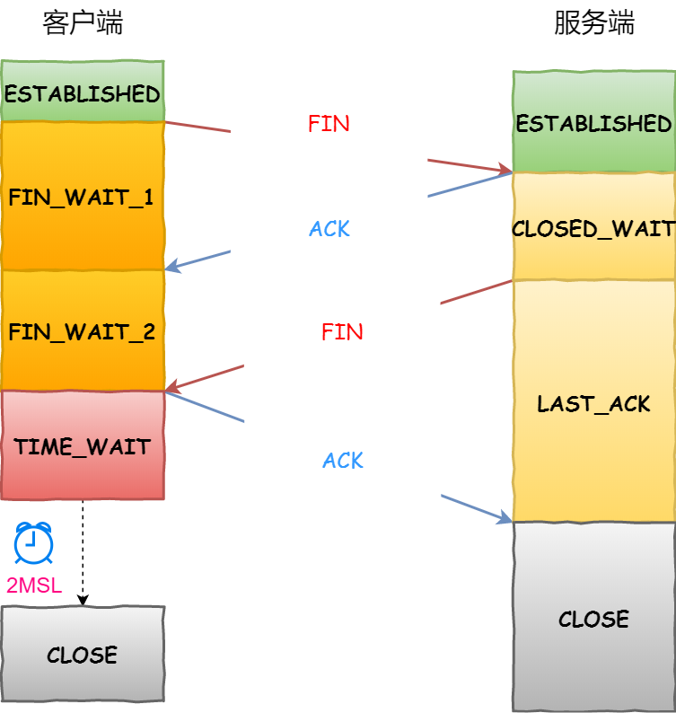
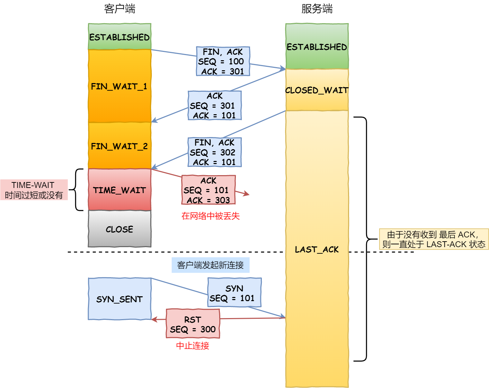

---

title: "18-tcp的连接和建立"
date: 2020-10-31T20:44:08+08:00
draft: true
tags: ["tcp","网络"]   #[]前面要有空格
categories: ["tcp/ip详解阅读笔记"]
---

# TCP 格式


- `序列号`:在建立连接时由计算机生成的随机数作为其初始值，通过 SYN 包传给接收端主机，每发送一次数据，就「累加」一次该「数据字节数」的大小。**用来解决网络包乱序问题。**
- `确认应答号`： 指下一次「期望」收到的数据的序列号，发送端收到这个确认应答以后可以认为在这个序号以前的数据都已经被正常接收。**用来解决不丢包的问题。**

- `控制位`：

  

  	-   `ACK` 该位为 `1` 时，「确认应答」的字段变为有效，TCP 规定除了最初建立连接时的 `SYN` 包之外该位必须设置为 `1` 。
  	-   `RST` 该位为 `1` 时，表示 TCP 连接中出现异常必须强制断开连接。
  	-   `SYN` 该位为 `1` 时，表示希望建立连接，并在其「序列号」的字段进行序列号初始值的设定。
  	-   `FIN` 该位为 `1` 时，表示今后不会再有数据发送，希望断开连接。当通信结束希望断开连接时，通信双方的主机之间就可以相互交换 `FIN` 位为 1 的 TCP 段。


# 什么是TCP连接

RFC 793 关于TCP 连接的定义如下

> Connections: The reliability and flow control mechanisms described above require that TCPs initialize and maintain certain status information for each data stream. The combination of this information, including sockets, sequence numbers, and window sizes, is called a connection.

简单来说就是，**用于保证可靠性和流量控制维护的某些状态信息，这些信息的组合，包括Socket、序列号和窗口大小称为连接。**


所以我们可以知道，建立一个 TCP 连接是需要客户端与服务器端达成上述三个信息的共识。

- **Socket**：由 IP 地址和端口号组成
- **序列号**：用来解决乱序问题等
- **窗口大小**：用来做流量控制


# 连接的建立

TCP 建立连接有三个过程

- 请求端（通常称为客户）发送一个SYN段指明客户打算连接的服务器的端口，以及初始序号（ISN，在这个例子中为1368668675）。这个SYN段为报文段1。

- 服务器发回包含服务器的初始序号的SYN报文段（报文段2）作为应答。同时，将确认序号设置为客户的ISN加1以对客户的SYN报文段进行确认。一个SYN将占用一个序号。

- 客户必须将确认序号设置为服务器的ISN加1以对服务器的SYN报文段进行确认（报文段3）。

这三个报文段完成连接的建立。这个过程也称为三次握手（three-way handshake）。


第一个报文—— SYN 报文

- 一开始，客户端和服务端都处于 `CLOSED` 状态。先是服务端主动监听某个端口，处于 `LISTEN` 状态

  


- 客户端会随机初始化序号（`client_isn`），将此序号置于 TCP 首部的「序号」字段中，同时把 `SYN` 标志位置为 `1` ，表示 `SYN` 报文。接着把第一个 SYN 报文发送给服务端，表示向服务端发起连接，该报文不包含应用层数据，之后客户端处于 `SYN-SENT` 状态。

第二个报文 —— SYN + ACK 报文


- 服务端收到客户端的 `SYN` 报文后，首先服务端也随机初始化自己的序号（`server_isn`），将此序号填入 TCP 首部的「序号」字段中，其次把 TCP 首部的「确认应答号」字段填入 `client_isn + 1`, 接着把 `SYN` 和 `ACK` 标志位置为 `1`。最后把该报文发给客户端，该报文也不包含应用层数据，之后服务端处于 `SYN-RCVD` 状态。


- 客户端收到服务端报文后，还要向服务端回应最后一个应答报文，首先该应答报文 TCP 首部 `ACK` 标志位置为 `1` ，其次「确认应答号」字段填入 `server_isn + 1` ，最后把报文发送给服务端，这次报文可以携带客户到服务器的数据，之后客户端处于 `ESTABLISHED` 状态。
- 服务器收到客户端的应答报文后，也进入 `ESTABLISHED` 状态。

从上面的过程可以发现**第三次握手是可以携带数据的，前两次握手是不可以携带数据的**，这也是面试常问的题(序列号)。

一旦完成三次握手，双方都处于 `ESTABLISHED` 状态，此时连接就已建立完成，客户端和服务端就可以相互发送数据了。


## 实验验证三次握手

192.168.1.10 这台机器的 6378 端口启一个 redis 服务 **(备注：这里由于机器ip隐私，所以192.168.1.10，192.168.1.11并发实验时真实ip)**

192.168.1.11 通过 tcpdump 这个工具来抓取数据包，命令如下

```shell
tcpdump -i eth0 -n 'port 6378 and tcp'  -X -s 0 -S
```

然后在 192.168.1.11 在这个机器运行

```shell
 telnet 192.168.1.10 6378
```
我们可以得到以下输出

```
14:58:04.199325 IP 192.168.1.10.idmgratm > 192.168.1.10.6378: Flags [S], seq 1368668675, win 29200, options [mss 1460,sackOK,TS val 3038320571 ecr 0,nop,wscale 7], length 0
	0x0000:  4510 003c 2db8 4000 4006 9e0c 0af9 ac2a  E..<-.@.@......*
	0x0010:  0af9 accb 8080 18ea 5194 3a03 0000 0000  ........Q.:.....
	0x0020:  a002 7210 6f16 0000 0204 05b4 0402 080a  ..r.o...........
	0x0030:  b519 17bb 0000 0000 0103 0307            ............
14:58:04.199708 IP 192.168.1.10.6378 > 192.168.1.11.idmgratm: Flags [S.], seq 2882988348, ack 1368668676, win 28960, options [mss 1460,sackOK,TS val 2269017029 ecr 3038320571,nop,wscale 7], length 0
	0x0000:  4500 003c 0000 4000 3f06 ccd4 0af9 accb  E..<..@.?.......
	0x0010:  0af9 ac2a 18ea 8080 abd6 e93c 5194 3a04  ...*.......<Q.:.
	0x0020:  a012 7120 e5f8 0000 0204 05b4 0402 080a  ..q.............
	0x0030:  873e 73c5 b519 17bb 0103 0307            .>s.........
14:58:04.199769 IP 192.168.1.11.idmgratm > 192.168.1.10.6378: Flags [.], ack 2882988349, win 229, options [nop,nop,TS val 3038320571 ecr 2269017029], length 0
	0x0000:  4510 0034 2db9 4000 4006 9e13 0af9 ac2a  E..4-.@.@......*
	0x0010:  0af9 accb 8080 18ea 5194 3a04 abd6 e93d  ........Q.:....=
	0x0020:  8010 00e5 6f0e 0000 0101 080a b519 17bb  ....o...........
	0x0030:  873e 73c5                                .>s.
```

通过上面的实验我们可以画出以下的握手过程


发送第一个SYN的一端将执行主动打开（active open）。接收这个SYN并发回下一个SYN的另一端执行被动打开（passive open）

## 为什么需要三连接


要回答这个问题我们重新来看什么是连接。[RFC 793 - Transmission Control Protocol](https://tools.ietf.org/html/rfc793)  定义如下

>The reliability and flow control mechanisms described above require that TCPs initialize and maintain 
>
>certain status information for each data stream. The combination of this information, including sockets,
>
> sequence numbers, and window sizes, is called a connection.

我们简单总结一下：用于保证可靠性和流控制机制的信息，包括 Socket、序列号以及窗口大小叫做连接。


所以，建立 TCP 连接就是通信的双方需要对上述的三种信息达成共识，连接中的一对 Socket 是由互联网地址标志符和端口组成的，窗口大小主要用来做流控制，最后的序列号是用来追踪通信发起方发送的数据包序号，接收方可以通过序列号向发送方确认某个数据包的成功接收。


### 避免历史连接

我们来看看 RFC 793 指出的 TCP 连接使用三次握手的**首要原因**：

>  *The principle reason for the three-way handshake is to prevent old duplicate connection initiations from causing confusion.*

简单来说，三次握手的**首要原因是为了防止旧的重复连接初始化造成混乱。**


网络环境是错综复杂的，往往并不是如我们期望的一样，先发送的数据包，就先到达目标主机，事实上可能会由于网络拥堵等乱七八糟的原因，会使得旧的数据包，先到达目标主机，那么这种情况下 TCP 三次握手是如何避免的呢？


客户端连续发送多次 SYN 建立连接的报文，在**网络拥堵**情况下：

- 一个「旧 SYN 报文」比「最新的 SYN 」 报文早到达了服务端；
- 那么此时服务端就会回一个 `SYN + ACK` 报文给客户端；
- 客户端收到后可以根据自身的上下文，判断这是一个历史连接（序列号过期或超时），那么客户端就会发送 `RST` 报文给服务端，表示中止这一次连接。

如果是两次握手连接，就不能判断当前连接是否是历史连接，三次握手则可以在客户端（发送方）准备发送第三次报文时，客户端因有足够的上下文来判断当前连接是否是历史连接：

- 如果是历史连接（序列号过期或超时），则第三次握手发送的报文是 `RST` 报文，以此中止历史连接；
- 如果不是历史连接，则第三次发送的报文是 `ACK` 报文，通信双方就会成功建立连接；


### 同步双方的序列号

TCP 协议的通信双方， 都必须维护一个「序列号」， 序列号是可靠传输的一个关键因素，它的作用：

- 接收方可以去除重复的数据；
- 接收方可以根据数据包的序列号按序接收；
- 可以标识发送出去的数据包中， 哪些是已经被对方收到的；

可见，序列号在 TCP 连接中占据着非常重要的作用，所以当客户端发送携带「初始序列号」的 `SYN` 报文的时候，需要服务端回一个 `ACK` 应答报文，表示客户端的 SYN 报文已被服务端成功接收，那当服务端发送「初始序列号」给客户端的时候，依然也要得到客户端的应答回应，**这样一来一回，才能确保双方的初始序列号能被可靠的同步。**


四次握手其实也能够可靠的同步双方的初始化序号，但由于**第二步和第三步可以优化成一步**，所以就成了「三次握手」。

而两次握手只保证了一方的初始序列号能被对方成功接收，没办法保证双方的初始序列号都能被确认接收。


#  连接的终止


TCP 断开连接是通过**四次挥手**方式。双方都可以主动断开连接，断开连接后主机中的「资源」将被释放。




客户端主动关闭连接 —— TCP 四次挥手

- 客户端打算关闭连接，此时会发送一个 TCP 首部 `FIN` 标志位被置为 `1` 的报文，也即 `FIN` 报文，之后客户端进入 `FIN_WAIT_1` 状态。
- 服务端收到该报文后，就向客户端发送 `ACK` 应答报文，接着服务端进入 `CLOSED_WAIT` 状态。
- 客户端收到服务端的 `ACK` 应答报文后，之后进入 `FIN_WAIT_2` 状态。
- 等待服务端处理完数据后，也向客户端发送 `FIN` 报文，之后服务端进入 `LAST_ACK` 状态。
- 客户端收到服务端的 `FIN` 报文后，回一个 `ACK` 应答报文，之后进入 `TIME_WAIT` 状态
- 服务器收到了 `ACK` 应答报文后，就进入了 `CLOSED` 状态，至此服务端已经完成连接的关闭。
- 客户端在经过 `2MSL` 一段时间后，自动进入 `CLOSED` 状态，至此客户端也完成连接的关闭。

你可以看到，每个方向都需要**一个 FIN 和一个 ACK**，因此通常被称为**四次挥手**。


## 为什么挥手需要四次

再来回顾下四次挥手双方发 `FIN` 包的过程，就能理解为什么需要四次了。

- 关闭连接时，客户端向服务端发送 `FIN` 时，仅仅表示客户端不再发送数据了但是还能接收数据。
- 服务器收到客户端的 `FIN` 报文时，先回一个 `ACK` 应答报文，而服务端可能还有数据需要处理和发送，等服务端不再发送数据时，才发送 `FIN` 报文给客户端来表示同意现在关闭连接。

从上面过程可知，服务端通常需要等待完成数据的发送和处理，所以服务端的 `ACK` 和 `FIN` 一般都会分开发送，从而比三次握手导致多了一次。


## 为什么TIME_WAIT等待的时间是 2MSL 

### MSL 

`MSL` 是 Maximum Segment Lifetime，**报文最大生存时间**，它是任何报文在网络上存在的最长时间，超过这个时间报文将被丢弃。因为 TCP 报文基于是 IP 协议的，而 IP 头中有一个 `TTL` 字段，是 IP 数据报可以经过的最大路由数，每经过一个处理他的路由器此值就减 1，当此值为 0 则数据报将被丢弃，同时发送 ICMP 报文通知源主机。

MSL 与 TTL 的区别： MSL 的单位是时间，而 TTL 是经过路由跳数。所以 **MSL 应该要大于等于 TTL 消耗为 0 的时间**，以确保报文已被自然消亡。


TIME_WAIT 等待 2 倍的 MSL，比较合理的解释是： 网络中可能存在来自发送方的数据包，当这些发送方的数据包被接收方处理后又会向对方发送响应，所以**一来一回需要等待 2 倍的时间**。

比如如果被动关闭方没有收到断开连接的最后的 ACK 报文，就会触发超时重发 Fin 报文，另一方接收到 FIN 后，会重发 ACK 给被动关闭方， 一来一去正好 2 个 MSL。

`2MSL` 的时间是从**客户端接收到 FIN 后发送 ACK 开始计时的**。如果在 TIME-WAIT 时间内，因为客户端的 ACK 没有传输到服务端，客户端又接收到了服务端重发的 FIN 报文，那么 **2MSL 时间将重新计时**。

在 Linux 系统里 `2MSL` 默认是 `60` 秒，那么一个 `MSL` 也就是 `30` 秒。**Linux 系统停留在 TIME_WAIT 的时间为固定的 60 秒**。

其定义在 Linux 内核代码里的名称为 TCP_TIMEWAIT_LEN：

```c
#define TCP_TIMEWAIT_LEN (60*HZ) /* how long to wait to destroy TIME-WAIT 
                                    state, about 60 seconds  */
```


如果要修改 TIME_WAIT 的时间长度，只能修改 Linux 内核代码里 TCP_TIMEWAIT_LEN 的值，并重新编译 Linux 内核。

> 为什么需要 TIME_WAIT 状态？

主动发起关闭连接的一方，才会有 `TIME-WAIT` 状态。

需要 TIME-WAIT 状态，主要是两个原因：

- 防止具有相同「四元组」的「旧」数据包被收到；
- 保证「被动关闭连接」的一方能被正确的关闭，即保证最后的 ACK 能让被动关闭方接收，从而帮助其正常关闭；


### 防止旧连接的数据包

假设 TIME-WAIT 没有等待时间或时间过短，被延迟的数据包抵达后会发生什么呢？


接收到历史数据的异常

- 如上图黄色框框服务端在关闭连接之前发送的 `SEQ = 301` 报文，被网络延迟了。
- 这时有相同端口的 TCP 连接被复用后，被延迟的 `SEQ = 301` 抵达了客户端，那么客户端是有可能正常接收这个过期的报文，这就会产生数据错乱等严重的问题。

所以，TCP 就设计出了这么一个机制，经过 `2MSL` 这个时间，**足以让两个方向上的数据包都被丢弃，使得原来连接的数据包在网络中都自然消失，再出现的数据包一定都是新建立连接所产生的。**


### 保证连接正确关闭

在 RFC 793 指出 TIME-WAIT 另一个重要的作用是：

>  TIME-WAIT - represents waiting for enough time to pass to be sure the remote TCP received the acknowledgment of its connection termination request.


也就是说，TIME-WAIT 作用是**等待足够的时间以确保最后的 ACK 能让被动关闭方接收，从而帮助其正常关闭。**


假设 TIME-WAIT 没有等待时间或时间过短，断开连接会造成什么问题呢？





没有确保正常断开的异常

- 如上图红色框框客户端四次挥手的最后一个 `ACK` 报文如果在网络中被丢失了，此时如果客户端 `TIME-WAIT` 过短或没有，则就直接进入了 `CLOSED` 状态了，那么服务端则会一直处在 `LASE_ACK` 状态。
- 当客户端发起建立连接的 `SYN` 请求报文后，服务端会发送 `RST` 报文给客户端，连接建立的过程就会被终止。

如果 TIME-WAIT 等待足够长的情况就会遇到两种情况：

- 服务端正常收到四次挥手的最后一个 `ACK` 报文，则服务端正常关闭连接。
- 服务端没有收到四次挥手的最后一个 `ACK` 报文时，则会重发 `FIN` 关闭连接报文并等待新的 `ACK` 报文。

所以客户端在 `TIME-WAIT` 状态等待 `2MSL` 时间后，就可以**保证双方的连接都可以正常的关闭。**


### TIME_WAIT 过多有什么危害

如果服务器有处于 `TIME-WAIT` 状态的 `TCP`，则说明是由服务器方主动发起的断开请求。

过多的 TIME-WAIT 状态主要的危害有两种：

- 第一是内存资源占用；
- 第二是对端口资源的占用，一个 `TCP` 连接至少消耗一个本地端口；

第二个危害是会造成严重的后果的，要知道，端口资源也是有限的，一般可以开启的端口为 `32768～61000`，也可以通过如下参数设置指定

```c
net.ipv4.ip_local_port_range
```


客户端受端口资源限制：

- 客户端`TIME_WAIT`过多，就会导致端口资源被占用，因为端口就65536个，被占满就会导致无法创建新的连接。

服务端受系统资源限制：

- 由于一个四元组表示 `TCP` 连接，理论上服务端可以建立很多连接，服务端确实只监听一个端口 但是会把连接扔给处理线程，所以理论上监听的端口可以继续监听。但是线程池处理不了那么多一直不断的连接了。所以当服务端出现大量 `TIME_WAIT` 时，系统资源被占满时，会导致处理不过来新的连接。


### 如何优化TIME_WAIT

- 打开 net.ipv4.tcp_tw_reuse 和 net.ipv4.tcp_timestamps 选项；

- net.ipv4.tcp_max_tw_buckets

  

#### net.ipv4.tcp_tw_reuse 和 tcp_timestamps


如下的 Linux 内核参数开启后，则可以**复用处于 TIME_WAIT 的 socket 为新的连接所用**。

有一点需要注意的是，**tcp_tw_reuse 功能只能用客户端（连接发起方），因为开启了该功能，在调用 connect() 函数时，内核会随机找一个 time_wait 状态超过 1 秒的连接给新的连接复用。**

```
net.ipv4.tcp_tw_reuse = 1
```

使用这个选项，还有一个前提，需要打开对 TCP 时间戳的支持，即

```
net.ipv4.tcp_timestamps=1（默认即为 1）
```

这个时间戳的字段是在 TCP 头部的「选项」里，用于记录 TCP 发送方的当前时间戳和从对端接收到的最新时间戳。

由于引入了时间戳，我们在前面提到的 `2MSL` 问题就不复存在了，因为重复的数据包会因为时间戳过期被自然丢弃。


#### net.ipv4.tcp_max_tw_buckets

这个值默认为 18000，当系统中处于 TIME_WAIT 的连接**一旦超过这个值时，系统就会将后面的 TIME_WAIT 连接状态重置。**

这个方法过于暴力，而且治标不治本，带来的问题远比解决的问题多，不推荐使用。


## 实验4次挥手

```go
18:19:17.089341 IP 192.168.1.10.6378 > 192.168.1.11.33964: Flags [F.], seq 2221282036, ack 81895238, win 227, options [nop,nop,TS val 2281089934 ecr 3050393501], length 0
  0x0000:  {4500 0034 5f2b 4000 3f06 6db1 0af9 accb  E..4_+@.?.m.....
  0x0010:  0af9 ac2a} 18ea 84ac 8466 12f4 04e1 9f46  ...*.....f.....F
	0x0020: 【8010】00e3 6f0e 0000 0101 080a 87f6 ab8e  ....o...........
  0x0030:  b5d1 4f9d                            ..O.
18:19:17.089579 IP 192.168.1.11.33964 > 192.168.1.10.6378: Flags [.], ack 2221282036, win 229, options [nop,nop,TS val 3050393501 ecr 2281089934], length 0
	0x0000:  4510 0034 6eee 4000 4006 5cde 0af9 ac2a  E..4n.@.@.\....*
	0x0010:  0af9 accb 84ac 18ea 04e1 9f46 8466 12f4  ...........F.f..
	0x0020:  【8010】 00e5 f4e3 0000 0101 080a b5d1 4f9d  ..............O.
	0x0030:  87f6 ab8e                                ....
18:19:17.089787 IP 192.168.1.11.33964 > 192.168.1.10.6378: Flags [F.], seq 81895238, ack 2221282037, win 229, options [nop,nop,TS val 3050393502 ecr 2281089934], length 0
	0x0000:  4510 0034 6eef 4000 4006 5cdd 0af9 ac2a  E..4n.@.@.\....*
	0x0010:  0af9 accb 84ac 18ea 04e1 9f46 8466 12f5  ...........F.f..
	0x0020: 【8010】 00e5 f4e0 0000 0101 080a b5d1 4f9e  ..............O.
	0x0030:  87f6 ab8e                                ....
18:19:17.089833 IP 192.168.1.10.6378 > 192.168.1.11.33964: Flags [.], ack 81895239, win 227, options [nop,nop,TS val 2281089935 ecr 3050393502], length 0
	0x0000:  4500 0034 5f2c 4000 3f06 6db0 0af9 accb  E..4_,@.?.m.....
	0x0010:  0af9 ac2a 18ea 84ac 8466 12f5 04e1 9f47  ...*.....f.....G
	0x0020:  【8010】 00e3 6f0e 0000 0101 080a 87f6 ab8f  ....o...........
	0x0030:  b5d1 4f9e                                ..O.


```

第一个报文的 8010转为二进制 为[1000000000010001] 那么其 fin 位 为 1，ack 为1 

第二个报文的 8010转为二进制 为[1000000000010001] 那么其 fin 位 为 0，ack 为1 

第三个报文的 8010转为二进制 为[1000000000010001] 那么其 fin 位 为 1，ack 为1 

第四个报文的 8010转为二进制 为[1000000000010001] 那么其 fin 位 为 0，ack 为1 


​            收到一个FIN只意味着在这一方向上没有数据流动。一个TCP连接在收到一个FIN后仍能发送数据


# TCP 最大的报文段 

最大报文段长度（MSS）表示TCP传往另一端的最大块数据的长度。当一个连接建立时，连接的双方都要通告各自的MSS。**注意最大报文段长度最为相关的一个参数是网络设备接口的MTU，以太网的MTU是1500，基本IP首部长度为20，TCP首部是20，所以MSS的值可达1460(MSS不包括协议首部，只包含应用数据)。**


# 2MSL等待状态

使用 TCP 协议通信的双方会在关闭连接时触发 `TIME_WAIT` 状态，IME_WAIT状态也称为2MSL等待状态。每个具体TCP实现必须选择一个报文段最大生存时间MSL（Maximum Segment Lifetime）。

>TIME-WAIT - represents waiting for enough time to pass to be sure the remote TCP received the acknowledgment of its connection termination request.


一个常见的关闭连接状态变化过程：

1. 当客户端没有待发送的数据时，它会向服务端发送 `FIN` 消息，发送消息后会进入 `FIN_WAIT_1` 状态；
2. 服务端接收到客户端的 `FIN` 消息后，会进入 `CLOSE_WAIT` 状态并向客户端发送 `ACK` 消息，客户端接收到 `ACK` 消息时会进入 `FIN_WAIT_2` 状态；
3. 当服务端没有待发送的数据时，服务端会向客户端发送 `FIN` 消息；
4. 客户端接收到 `FIN` 消息后，会进入 `TIME_WAIT` 状态并向服务端发送 `ACK` 消息，服务端收到后会进入 `CLOSED` 状态；
5. 客户端等待**两个最大数据段生命周期**（Maximum segment lifetime，MSL）(https://draveness.me/whys-the-design-tcp-time-wait/#fn:2)的时间后也会进入 `CLOSED` 状态；


# 复位报文段

TCP报文首部中存在一个RST位，如果该位被置1则表示这是个复位报文段。那么接收报文的一方不用继续进行交互。

> A control bit (reset), occupying no sequence space, indicating that the receiver should delete the connection without further
>interaction.  The receiver can determine, based on the  sequence number and acknowledgment fields of the incoming
> segment, whether it should honor the reset command or ignore    it.  In no case does receipt of a segment containing RST give rise to a RST in response.       


# 参考 
TCP三次握手中SYN，ACK，Seq含义 https://blog.csdn.net/qq_25948717/article/details/80382766

为什么 TCP 建立连接需要三次握手  https://draveness.me/whys-the-design-tcp-three-way-handshake/
RFC 793 https://tools.ietf.org/html/rfc793

 为什么 TCP 协议有 TIME_WAIT 状态 https://draveness.me/whys-the-design-tcp-time-wait/

TCP报头中的URG 与 PSH标志不同之处与作用  https://blog.csdn.net/a1414345/article/details/72486567