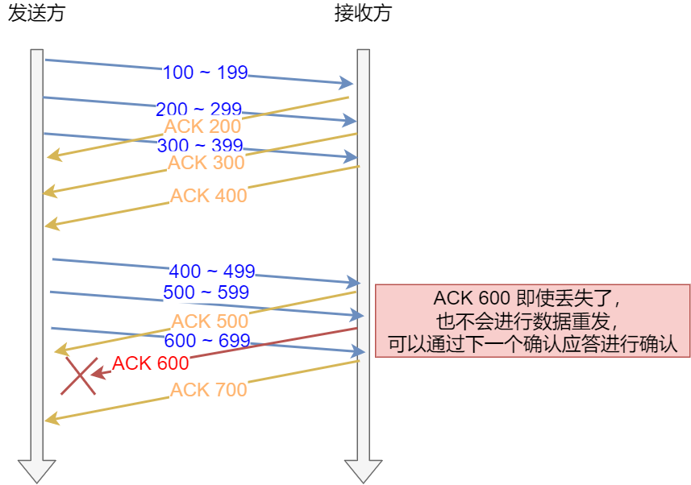
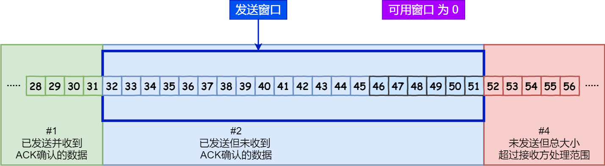
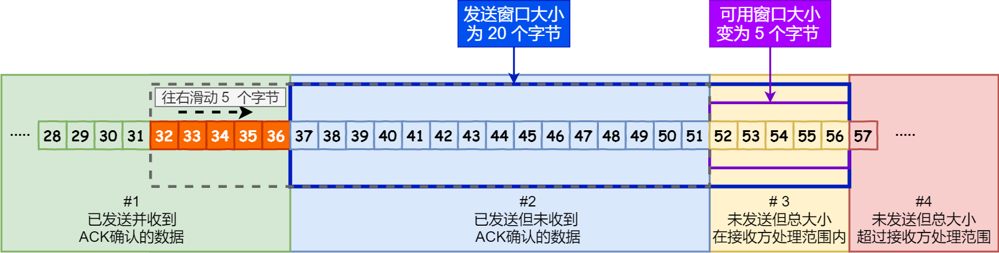
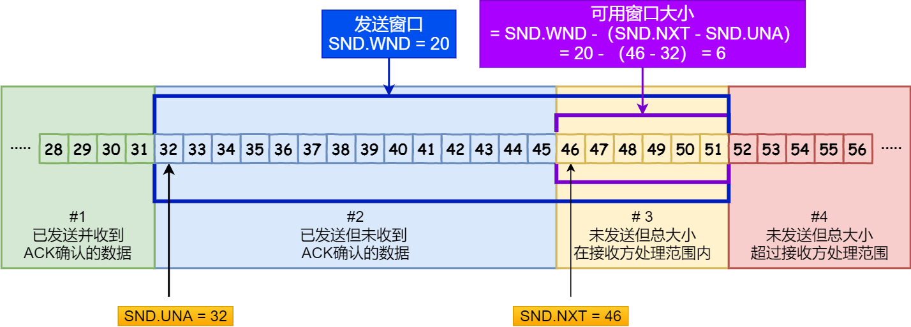
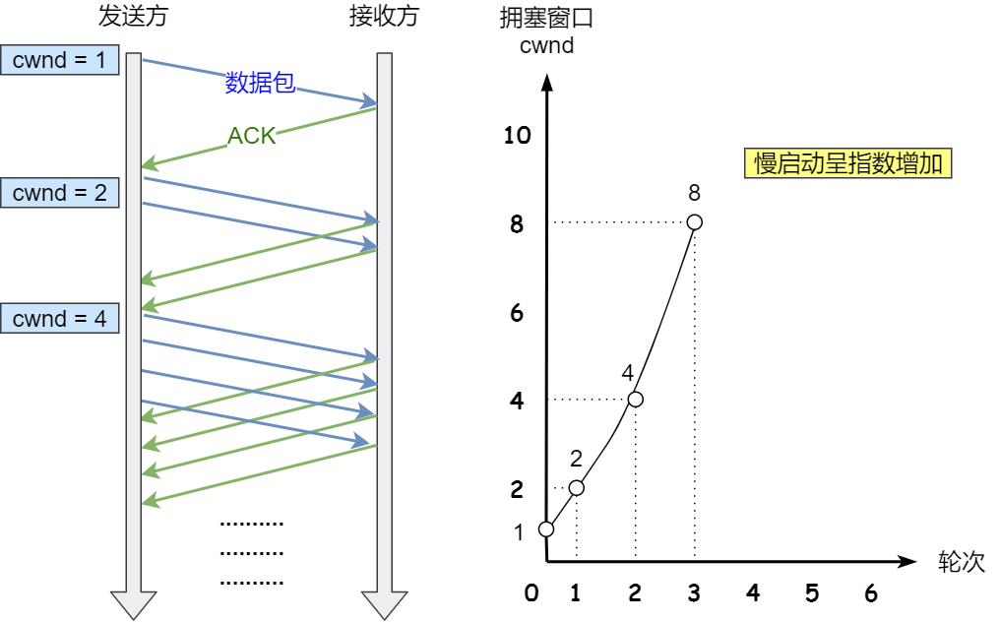
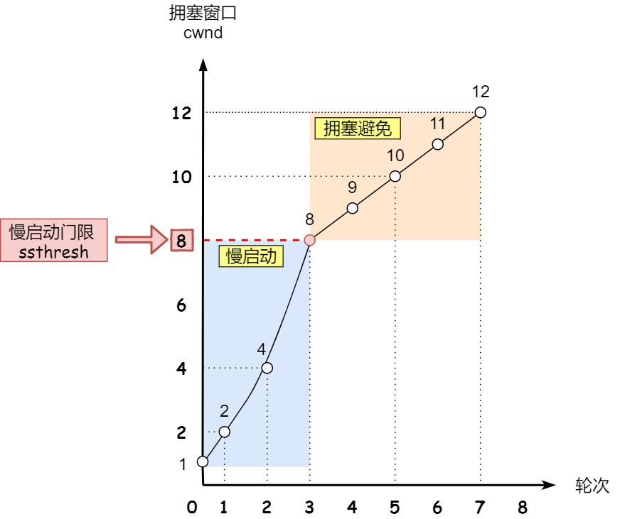

# 滑动窗口

## 为什么是需要滑动窗口

这一章主要要介绍了TCP所使用的被称为滑动窗口协议的另一种形式的流量控制方法。该协议允许发送方在停止并等待确认前可以连续发送多个分组。由于发送方不必每发一个分组就停下来等待确认，因此该协议可以加速数据的传输。

不过这一章没有一开始就说明为何需要滑动动窗口来验证，而是先做了一个实验，然后在来说明TCP 滑动窗口协议。导致个人在阅读的时候有些模糊，特别是对于为何需要滑动窗口协议这一块比较模糊。所以也找了一些资料做了补充。


想一个问题，先不管滑动窗口协议，如何来保证发送方与接收方之间，每个包都能被收到。并且是按次序的呢？


这样的传输方式有一个缺点：数据包的**往返时间越长，通信的效率就越低**。

为解决这个问题，TCP 引入了`窗口`这个概念。即使在往返时间较长的情况下，它也不会降低网络通信的效率。

那么有了`窗口`，就可以指定窗口大小，窗口大小就是指**无需等待确认应答，而可以继续发送数据的最大值**。

窗口的实现实际上是操作系统开辟的一个缓存空间，发送方主机在等到确认应答返回之前，必须在缓冲区中保留已发送的数据。如果按期收到确认应答，此时数据就可以从缓存区清除。

假设窗口大小为 `3` 个 TCP 段，那么发送方就可以「连续发送」 `3` 个 TCP 段，并且中途若有 ACK 丢失，可以通过「下一个确认应答进行确认」。如下图





图中的 ACK 600 确认应答报文丢失，也没关系，因为可以通过下一个确认应答进行确认，只要发送方收到了 ACK 700 确认应答，就意味着 700 之前的所有数据「接收方」都收到了。这个模式就叫**累计确认**或者**累计应答**。

## 窗口大小

TCP 头里有一个字段叫 `Window`，也就是窗口大小。

**这个字段是接收端告诉发送端自己还有多少缓冲区可以接收数据。于是发送端就可以根据这个接收端的处理能力来发送数据，而不会导致接收端处理不过来。**

所以，通常窗口的大小是由`接收方的窗口`大小来决定的。

发送方发送的数据大小不能超过接收方的窗口大小，否则接收方就无法正常接收到数据。


## 发送方的滑动窗口

我们先来看看发送方的窗口，下图就是发送方缓存的数据，根据处理的情况分成四个部分，其中深蓝色方框是发送窗口，紫色方框是可用窗口：


- \#1  是已发送并收到 ACK确认的数据：1~31 字节
- \#2 是已发送但未收到 ACK确认的数据：32~45 字节
- \#3 是未发送但总大小在接收方处理范围内（接收方还有空间）：46~51字节
- \#4 是未发送但总大小超过接收方处理范围（接收方没有空间）：52字节以后

在下图，当发送方把数据「全部」都一下发送出去后，可用窗口的大小就为 0 了，表明可用窗口耗尽，在没收到 ACK 确认之前是无法继续发送数据了。



在下图，当收到之前发送的数据 `32~36` 字节的 ACK 确认应答后，如果发送窗口的大小没有变化，则**滑动窗口往右边移动 5 个字节，因为有 5 个字节的数据被应答确认**，接下来 `52~56` 字节又变成了可用窗口，那么后续也就可以发送 `52~56` 这 5 个字节的数据了。




TCP 滑动窗口方案使用三个指针来跟踪在四个传输类别中的每一个类别中的字节。其中两个指针是绝对指针（指特定的序列号），一个是相对指针（需要做偏移）。




SND.WND、SND.UN、SND.NXT

- `SND.WND`：表示发送窗口的大小（大小是由接收方指定的）；
- `SND.UNA`：是一个绝对指针，它指向的是已发送但未收到确认的第一个字节的序列号，也就是 #2 的第一个字节。
- `SND.NXT`：也是一个绝对指针，它指向未发送但可发送范围的第一个字节的序列号，也就是 #3 的第一个字节。


- 指向 #4 的第一个字节是个相对指针，它需要 `SND.UNA` 指针加上 `SND.WND` 大小的偏移量，就可以指向 #4 的第一个字节了。

那么可用窗口大小的计算就可以是：


$$
可用窗口大 = SND.WND -（SND.NXT - SND.UNA）
$$


##  接收方窗口

接下来我们看看接收方的窗口，接收窗口相对简单一些，根据处理的情况划分成三个部分：

- \#1 + #2 是已成功接收并确认的数据（等待应用进程读取）；
- \#3 是未收到数据但可以接收的数据；
- \#4 未收到数据并不可以接收的数据；


# 

接收窗口

其中三个接收部分，使用两个指针进行划分:

- `RCV.WND`：表示接收窗口的大小，它会通告给发送方。
- `RCV.NXT`：是一个指针，它指向期望从发送方发送来的下一个数据字节的序列号，也就是 #3 的第一个字节。
- 指向 #4 的第一个字节是个相对指针，它需要 `RCV.NXT` 指针加上 `RCV.WND` 大小的偏移量，就可以指向 #4 的第一个字节了。


接收窗口和发送窗口的大小并不是相等，接收窗口的大小是**约等于**发送窗口的大小的。

因为滑动窗口并不是一成不变的。比如，当接收方的应用进程读取数据的速度非常快的话，这样的话接收窗口可以很快的就空缺出来。那么新的接收窗口大小，是通过 `TCP` 报文中的 Windows 字段来告诉发送方。那么这个传输过程是存在时延的，所以接收窗口和发送窗口是约等于的关系。

## 实验

tcp server 代码

```go
func main() {
	address := "0.0.0.0:7099"

	// Create a listening socket.
	l, err := net.Listen("tcp", address)
	if err != nil {
		log.Fatal(err)
	}
	defer l.Close()

	for {
		// Accept new connections.
		c, err := l.Accept()
		if err != nil {
			log.Println(err)
			return
		}

		// Process newly accepted connection.
		go handleConnection(c)
	}
}


func handleConnection(c net.Conn) {
	fmt.Printf("Serving %s\n", c.RemoteAddr().String())

	for {
		// Read what has been sent from the client.
		netData, err := ioutil.ReadAll(c)
		if err != nil {
			log.Println(err)
			return
		}

		if len(netData) == 0 {
			break
		}else{
			log.Println(len(netData))
			log.Printf("%s\n",string(netData))
		}
	}
	c.Close()
}
```

client 的 代码

```go
const letterBytes = "abcdefghijklmnopqrstuvwxyzABCDEFGHIJKLMNOPQRSTUVWXYZ"

func RandStringBytes(n int) string {
	b := make([]byte, n)
	for i := range b {
		b[i] = letterBytes[rand.Intn(len(letterBytes))]
	}
	log.Println(len(b))
	return string(b)
}

func main() {
	address := "xx.xxx.xxx.xxx:7099"

	raddr, err := net.ResolveTCPAddr("tcp", address)
	if err != nil {
		log.Fatal(err)
	}

	// Establish a connection with the server.
	conn, err := net.DialTCP("tcp", nil, raddr)
	if err != nil {
		log.Fatal(err)
	}
	defer conn.Close()
	if err != nil {
		log.Println(err)
	}

	fmt.Println("Sending Gophers down the pipe...")

	for i:=0;i<10;i++ {
		_, err = conn.Write([]byte(RandStringBytes(1600)))
		if err != nil {
			log.Fatal(err)
		} else {
			log.Println("Send Data Success")
		}
	}


}

```

tcpdump 抓包

```shell
tcpdump -i en0  -nn 'port 7099 and tcp'
```


```
16:24:36.634707 IP 192.168.137.234.52472 > xx.xxx.xxx.xxx.7099: Flags [S], seq 377573753, win 65535, options [mss 1460,nop,wscale 6,nop,nop,TS val 381235038 ecr 0,sackOK,eol], length 0
16:24:36.703271 IP xx.xxx.xxx.xxx.7099 > 192.168.137.234.52472: Flags [S.], seq 285576607, ack 377573754, win 28960, options [mss 1460,sackOK,TS val 3224609562 ecr 381235038,nop,wscale 7], length 0
16:24:36.703398 IP 192.168.137.234.52472 > xx.xxx.xxx.xxx.7099: Flags [.], ack 1, win 2058, options [nop,nop,TS val 381235106 ecr 3224609562], length 0
16:24:36.704044 IP 192.168.137.234.52472 > xx.xxx.xxx.xxx.7099: Flags [.], seq 1:1449, ack 1, win 2058, options [nop,nop,TS val 381235106 ecr 3224609562], length 1448
16:24:36.704048 IP 192.168.137.234.52472 > xx.xxx.xxx.xxx.7099: Flags [P.], seq 1449:1601, ack 1, win 2058, options [nop,nop,TS val 381235106 ecr 3224609562], length 152
16:24:36.704169 IP 192.168.137.234.52472 > xx.xxx.xxx.xxx.7099: Flags [.], seq 1601:3049, ack 1, win 2058, options [nop,nop,TS val 381235106 ecr 3224609562], length 1448
16:24:36.704171 IP 192.168.137.234.52472 > xx.xxx.xxx.xxx.7099: Flags [P.], seq 3049:3201, ack 1, win 2058, options [nop,nop,TS val 381235106 ecr 3224609562], length 152
16:24:36.734082 IP xx.xxx.xxx.xxx.7099 > 192.168.137.234.52472: Flags [.], ack 1601, win 252, options [nop,nop,TS val 3224609592 ecr 381235106], length 0
16:24:36.734090 IP xx.xxx.xxx.xxx.7099 > 192.168.137.234.52472: Flags [.], ack 3201, win 277, options [nop,nop,TS val 3224609593 ecr 381235106], length 0
16:24:36.734180 IP 192.168.137.234.52472 > xx.xxx.xxx.xxx.7099: Flags [.], seq 3201:4649, ack 1, win 2058, options [nop,nop,TS val 381235136 ecr 3224609592], length 1448
16:24:36.734182 IP 192.168.137.234.52472 > xx.xxx.xxx.xxx.7099: Flags [.], seq 4649:6097, ack 1, win 2058, options [nop,nop,TS val 381235136 ecr 3224609592], length 1448
16:24:36.734183 IP 192.168.137.234.52472 > xx.xxx.xxx.xxx.7099: Flags [.], seq 6097:7545, ack 1, win 2058, options [nop,nop,TS val 381235136 ecr 3224609592], length 1448
16:24:36.734264 IP 192.168.137.234.52472 > xx.xxx.xxx.xxx.7099: Flags [.], seq 7545:8993, ack 1, win 2058, options [nop,nop,TS val 381235136 ecr 3224609593], length 1448
16:24:36.734266 IP 192.168.137.234.52472 > xx.xxx.xxx.xxx.7099: Flags [.], seq 8993:10441, ack 1, win 2058, options [nop,nop,TS val 381235136 ecr 3224609593], length 1448
16:24:36.800145 IP xx.xxx.xxx.xxx.7099 > 192.168.137.234.52472: Flags [.], ack 6097, win 322, options [nop,nop,TS val 3224609623 ecr 381235136], length 0
16:24:36.800153 IP xx.xxx.xxx.xxx.7099 > 192.168.137.234.52472: Flags [.], ack 7545, win 345, options [nop,nop,TS val 3224609624 ecr 381235136], length 0
16:24:36.800155 IP xx.xxx.xxx.xxx.7099 > 192.168.137.234.52472: Flags [.], ack 10441, win 390, options [nop,nop,TS val 3224609624 ecr 381235136], length 0
16:24:36.800242 IP 192.168.137.234.52472 > xx.xxx.xxx.xxx.7099: Flags [.], seq 10441:11889, ack 1, win 2058, options [nop,nop,TS val 381235201 ecr 3224609623], length 1448
16:24:36.800244 IP 192.168.137.234.52472 > xx.xxx.xxx.xxx.7099: Flags [.], seq 11889:13337, ack 1, win 2058, options [nop,nop,TS val 381235201 ecr 3224609623], length 1448
16:24:36.800245 IP 192.168.137.234.52472 > xx.xxx.xxx.xxx.7099: Flags [.], seq 13337:14785, ack 1, win 2058, options [nop,nop,TS val 381235201 ecr 3224609623], length 1448
16:24:36.800329 IP 192.168.137.234.52472 > xx.xxx.xxx.xxx.7099: Flags [FP.], seq 14785:16001, ack 1, win 2058, options [nop,nop,TS val 381235201 ecr 3224609623], length 1216
16:24:36.830640 IP xx.xxx.xxx.xxx.7099 > 192.168.137.234.52472: Flags [.], ack 13337, win 435, options [nop,nop,TS val 3224609688 ecr 381235201], length 0
16:24:36.830700 IP xx.xxx.xxx.xxx.7099 > 192.168.137.234.52472: Flags [.], ack 16002, win 477, options [nop,nop,TS val 3224609689 ecr 381235201], length 0
16:24:36.832988 IP xx.xxx.xxx.xxx.7099 > 192.168.137.234.52472: Flags [F.], seq 1, ack 16002, win 477, options [nop,nop,TS val 3224609692 ecr 381235201], length 0
16:24:36.833137 IP 192.168.137.234.52472 > xx.xxx.xxx.xxx.7099: Flags [.], ack 2, win 2058, options [nop,nop,TS val 381235232 ecr 3224609692], length 0
```

可以看到数据包确实可以一次发送出好几个。

# 流量控制

、发送方不能无脑的发数据给接收方，要考虑接收方处理能力。

如果一直无脑的发数据给对方，但对方处理不过来，那么就会导致触发重发机制，从而导致网络流量的无端的浪费。

为了解决这种现象发生，**TCP 提供一种机制可以让「发送方」根据「接收方」的实际接收能力控制发送的数据量，这就是所谓的流量控制。**

下面举个栗子，为了简单起见，假设以下场景：

- 客户端是接收方，服务端是发送方
- 假设接收窗口和发送窗口相同，都为 `200`
- 假设两个设备在整个传输过程中都保持相同的窗口大小，不受外界影响


1. 客户端向服务端发送请求数据报文。
2. 务端收到请求报文后，发送确认报文和 80 字节的数据，于是可用窗口 `Usable` 减少为 120 字节，同时 `SND.NXT` 指针也向右偏移 80 字节后，指向 321，`这意味着下次发送数据的时候，序列号是 321。`
3. 客户端收到 80 字节数据后，于是接收窗口往右移动 80 字节，`RCV.NXT` 也就指向 321，**这意味着客户端期望的下一个报文的序列号是 321**，接着发送确认报文给服务端。
4. 服务端再次发送了 120 字节数据，于是可用窗口耗尽为 0，服务端无法再继续发送数据。
5. 客户端收到 120 字节的数据后，于是接收窗口往右移动 120 字节，`RCV.NXT` 也就指向 441，接着发送确认报文给服务端。
6. 服务端收到对 80 字节数据的确认报文后，`SND.UNA` 指针往右偏移后指向 321，于是可用窗口 `Usable` 增大到 80。
7. 服务端收到对 120 字节数据的确认报文后，`SND.UNA` 指针往右偏移后指向 441，于是可用窗口 `Usable` 增大到 200。
8. 服务端可以继续发送了，于是发送了 160 字节的数据后，`SND.NXT` 指向 601，于是可用窗口 `Usable` 减少到 40。
9. 客户端收到 160 字节后，接收窗口往右移动了 160 字节，`RCV.NXT` 也就是指向了 601，接着发送确认报文给服务端。
10. 服务端收到对 160 字节数据的确认报文后，发送窗口往右移动了 160 字节，于是 `SND.UNA` 指针偏移了 160 后指向 601，可用窗口 `Usable` 也就增大至了 200。


## 操作系统缓冲区与滑动窗口的关系

前面的流量控制例子，我们假定了发送窗口和接收窗口是不变的，但是实际上，发送窗口和接收窗口中所存放的字节数，都是放在操作系统内存缓冲区中的，而操作系统的缓冲区，会**被操作系统调整**。

当应用进程没办法及时读取缓冲区的内容时，也会对我们的缓冲区造成影响。

> 那操作系统的缓冲区，是如何影响发送窗口和接收窗口的呢？


*我们先来看看第一个例子。*

当应用程序没有及时读取缓存时，发送窗口和接收窗口的变化。

考虑以下场景：

- 客户端作为发送方，服务端作为接收方，发送窗口和接收窗口初始大小为 `360`；
- 服务端非常的繁忙，当收到客户端的数据时，应用层不能及时读取数据


1. 客户端发送 140 字节数据后，可用窗口变为 220 （360 - 140）。
2. 服务端收到 140 字节数据，**但是服务端非常繁忙，应用进程只读取了 40 个字节，还有 100 字节占用着缓冲区，于是接收窗口收缩到了 260 （360 - 100）**，最后发送确认信息时，将窗口大小通告给客户端。
3. 客户端收到确认和窗口通告报文后，发送窗口减少为 260。
4. 客户端发送 180 字节数据，此时可用窗口减少到 80。
5. 服务端收到 180 字节数据，**但是应用程序没有读取任何数据，这 180 字节直接就留在了缓冲区，于是接收窗口收缩到了 80 （260 - 180）**，并在发送确认信息时，通过窗口大小给客户端。
6. 客户端收到确认和窗口通告报文后，发送窗口减少为 80。
7. 客户端发送 80 字节数据后，可用窗口耗尽。
8. 服务端收到 80 字节数据，**但是应用程序依然没有读取任何数据，这 80 字节留在了缓冲区，于是接收窗口收缩到了 0**，并在发送确认信息时，通过窗口大小给客户端。
9. 客户端收到确认和窗口通告报文后，发送窗口减少为 0。

可见最后窗口都收缩为 0 了，也就是发生了窗口关闭。当发送方可用窗口变为 0 时，发送方实际上会定时发送窗口探测报文，以便知道接收方的窗口是否发生了改变，这个内容后面会说，这里先简单提一下。


当服务端系统资源非常紧张的时候，操心系统可能会直接减少了接收缓冲区大小，这时应用程序又无法及时读取缓存数据，那么这时候就有严重的事情发生了，会出现数据包丢失的现象。


1. 客户端发送 140 字节的数据，于是可用窗口减少到了 220。
2. **服务端因为现在非常的繁忙，操作系统于是就把接收缓存减少了 120 字节，当收到 140 字节数据后，又因为应用程序没有读取任何数据，所以 140 字节留在了缓冲区中，于是接收窗口大小从 360 收缩成了 100**，最后发送确认信息时，通告窗口大小给对方。
3. 此时客户端因为还没有收到服务端的通告窗口报文，所以不知道此时接收窗口收缩成了 100，客户端只会看自己的可用窗口还有 220，所以客户端就发送了 180 字节数据，于是可用窗口减少到 40。
4. 服务端收到了 180 字节数据时，**发现数据大小超过了接收窗口的大小，于是就把数据包丢失了。**
5. 客户端收到第 2 步时，服务端发送的确认报文和通告窗口报文，尝试减少发送窗口到 100，把窗口的右端向左收缩了 80，此时可用窗口的大小就会出现诡异的负值。


所以，如果发生了先减少缓存，再收缩窗口，就会出现丢包的现象。

**为了防止这种情况发生，TCP 规定是不允许同时减少缓存又收缩窗口的，而是采用先收缩窗口，过段时间再减少缓存，这样就可以避免了丢包情况。**

### 窗口关闭

在前面我们都看到了，TCP 通过让接收方指明希望从发送方接收的数据大小（窗口大小）来进行流量控制。

**如果窗口大小为 0 时，就会阻止发送方给接收方传递数据，直到窗口变为非 0 为止，这就是窗口关闭。**


#### 窗口关闭潜在的危险

接收方向发送方通告窗口大小时，是通过 `ACK` 报文来通告的。

那么，当发生窗口关闭时，接收方处理完数据后，会向发送方通告一个窗口非 0 的 ACK 报文，如果这个通告窗口的 ACK 报文在网络中丢失了，那麻烦就大了。


这会导致发送方一直等待接收方的非 0 窗口通知，接收方也一直等待发送方的数据，如不采取措施，这种相互等待的过程，会造成了死锁的现象。


为了解决这个问题，TCP 为每个连接设有一个持续定时器，**只要 TCP 连接一方收到对方的零窗口通知，就启动持续计时器。**

如果持续计时器超时，就会发送**窗口探测 ( Window probe ) 报文**，而对方在确认这个探测报文时，给出自己现在的接收窗口大小。


### 糊涂窗口综合症

如果接收方太忙了，来不及取走接收窗口里的数据，那么就会导致发送方的发送窗口越来越小。

到最后，**如果接收方腾出几个字节并告诉发送方现在有几个字节的窗口，而发送方会义无反顾地发送这几个字节，这就是糊涂窗口综合症**。

要知道，我们的 `TCP + IP` 头有 `40` 个字节，为了传输那几个字节的数据，要达上这么大的开销，这太不经济了。


接收方的窗口大小是 360 字节，但接收方由于某些原因陷入困境，假设接收方的应用层读取的能力如下：

- 接收方每接收 3 个字节，应用程序就只能从缓冲区中读取 1 个字节的数据；
- 在下一个发送方的 TCP 段到达之前，应用程序还从缓冲区中读取了 40 个额外的字节；


每个过程的窗口大小的变化，在图中都描述的很清楚了，可以发现窗口不断减少了，并且发送的数据都是比较小的了。

所以，糊涂窗口综合症的现象是可以发生在发送方和接收方：

- 接收方可以通告一个小的窗口
- 而发送方可以发送小数据


于是，要解决糊涂窗口综合症，就解决上面两个问题就可以了

- 让接收方不通告小窗口给发送方
- 让发送方避免发送小数据


>  怎么让接收方不通告小窗口呢？

接收方通常的策略如下:

当「窗口大小」小于 min( MSS，缓存空间/2 ) ，也就是小于 MSS 与 1/2 缓存大小中的最小值时，就会向发送方通告窗口为 `0`，也就阻止了发送方再发数据过来。

等到接收方处理了一些数据后，窗口大小 >= MSS，或者接收方缓存空间有一半可以使用，就可以把窗口打开让发送方发送数据过来。


> 怎么让发送方避免发送小数据呢？

发送方通常的策略:

使用 Nagle 算法，该算法的思路是延时处理，它满足以下两个条件中的一条才可以发送数据：

- 要等到窗口大小 >= `MSS` 或是 数据大小 >= `MSS`
- 收到之前发送数据的 `ack` 回包

只要没满足上面条件中的一条，发送方一直在囤积数据，直到满足上面的发送条件。

另外，Nagle 算法默认是打开的，如果对于一些需要小数据包交互的场景的程序，比如，telnet 或 ssh 这样的交互性比较强的程序，则需要关闭 Nagle 算法。

可以在 Socket 设置 `TCP_NODELAY` 选项来关闭这个算法（关闭 Nagle 算法没有全局参数，需要根据每个应用自己的特点来关闭）

```c
setsockopt(sock_fd, IPPROTO_TCP, TCP_NODELAY, (char *)&value, sizeof(int));
```


# PUSH 位标志

> PUSH标志位所表达的是发送方通知接收方传输层应该尽快的将这个报文段交给应用层。传输层及以下的数据往往是由系统所带的协议栈进行处理的，客户端在收到一个个报文之后，经由协议栈解封装之后会立马把数据交给应用层去处理吗？如果说在收到报文之后立马就交给上层，这时候应用层由于数据不全，可能也不会进行处理。而且每来一个报文就交一次，效率很低。因此传输层一般会是隔几个报文，统一上交数据。什么时候上交数据呢，就是在发送方将PUSH标志位置1的时候。那么什么时候标志位会置1呢，通常是发送端觉得传输的数据应用层可以进行处理了的时候。

# 拥塞控制

> 为什么要有拥塞控制呀，不是有流量控制了吗？

前面的流量控制是避免「发送方」的数据填满「接收方」的缓存，但是并不知道网络的中发生了什么。

一般来说，计算机网络都处在一个共享的环境。因此也有可能会因为其他主机之间的通信使得网络拥堵。

**在网络出现拥堵时，如果继续发送大量数据包，可能会导致数据包时延、丢失等，这时 TCP 就会重传数据，但是一重传就会导致网络的负担更重，于是会导致更大的延迟以及更多的丢包，这个情况就会进入恶性循环被不断地放大….**

所以，TCP 不能忽略网络上发生的事，它被设计成一个无私的协议，当网络发送拥塞时，TCP 会自我牺牲，降低发送的数据量。

于是，就有了**拥塞控制**，控制的目的就是**避免「发送方」的数据填满整个网络。**

为了在「发送方」调节所要发送数据的量，定义了一个叫做「**拥塞窗口**」的概念。

> 什么是拥塞窗口？和发送窗口有什么关系呢？

**拥塞窗口 cwnd**是发送方维护的一个的状态变量，它会根据**网络的拥塞程度动态变化的**。

我们在前面提到过发送窗口 `swnd` 和接收窗口 `rwnd` 是约等于的关系，那么由于加入了拥塞窗口的概念后，此时发送窗口的值是swnd = min(cwnd, rwnd)，也就是拥塞窗口和接收窗口中的最小值。

拥塞窗口 `cwnd` 变化的规则：

- 只要网络中没有出现拥塞，`cwnd` 就会增大；
- 但网络中出现了拥塞，`cwnd` 就减少；


>  那么怎么知道当前网络是否出现了拥塞呢

其实只要「发送方」没有在规定时间内接收到 ACK 应答报文，也就是**发生了超时重传，就会认为网络出现了用拥塞。**

> 拥塞控制有哪些控制算法？

拥塞控制主要是四个算法：

- 慢启动
- 拥塞避免
- 拥塞发生
- 快速恢复


##  慢启动

> 迄今为止，在本章所有的例子中，发送方一开始便向网络发送多个报文段，直至达到接收方通告的窗口大小为止。当发送方和接收方处于同一个局域网时，这种方式是可以的。但是如果在发送方和接收方之间存在多个路由器和速率较慢的链路时迄今为止，就有可能出现一些问题。
>


之所以需要慢启动是因为现实的网络环境是复杂的，如果一开始就发送大量的数据，达到网络最大的承载量，会导致tcp报文丢失，延时。而丢失和延迟情况的出现发送端必然会重发报文，这就有加大了网络的拥塞。而慢启动的本质就是通过一点点的加大发送量，探查出最佳的发送报文数量。


慢启动为发送方的T C P增加了另一个窗口：拥塞窗口 (congestion window)，记为c w n d。

- 当另一个网络的主机建立 T C P连接时，拥塞窗口被初始化为 1个报文端。（即一个MSS大小的数据）
- 当收到一个 ACK 确认应答后，cwnd 增加 1，于是一次能够发送 2 个
- 当收到 2 个的 ACK 确认应答后， cwnd 增加 2，于是就可以比之前多发2 个，所以这一次能够发送 4 个



可以看出慢启动算法，发包的个数是**指数性的增长**。

接下来我们需要考虑的一个问题就是，慢启动需要增长到什么时候呢？有一个叫慢启动门限 `ssthresh` （slow start threshold）状态变量。

- 当 `cwnd` < `ssthresh` 时，使用慢启动算法。
- 当 `cwnd` >= `ssthresh` 时，就会使用「拥塞避免算法」。


## 拥塞避免算法

前面说道，当拥塞窗口 `cwnd` 「超过」慢启动门限 `ssthresh` 就会进入拥塞避免算法。

一般来说 `ssthresh` 的大小是 `65535` 字节。

那么进入拥塞避免算法后，它的规则是：**每当收到一个 ACK 时，cwnd 增加 1/cwnd。**

接上前面的慢启动的栗子，现假定 `ssthresh` 为 `8`：





所以，我们可以发现，拥塞避免算法就是将原本慢启动算法的指数增长变成了线性增长，还是增长阶段，但是增长速度缓慢了一些。

就这么一直增长着后，网络就会慢慢进入了拥塞的状况了，于是就会出现丢包现象，这时就需要对丢失的数据包进行重传。

当触发了重传机制，也就进入了「拥塞发生算法」。


## 拥塞发生

当网络出现拥塞，也就是会发生数据包重传，重传机制主要有两种：

- 超时重传
- 快速重传

这两种使用的拥塞发送算法是不同的，接下来分别来说说。

> 发生超时重传的拥塞发生算法


### 发生超时重传的拥塞发生算法

当发生了「超时重传」，则就会使用拥塞发生算法。

这个时候，ssthresh 和 cwnd 的值会发生变化：

- `ssthresh` 设为 `cwnd/2`，
- `cwnd` 重置为 `1`


拥塞发送 —— 超时重传

接着，就重新开始慢启动，慢启动是会突然减少数据流的。这真是一旦「超时重传」，马上回到解放前。但是这种方式太激进了，反应也很强烈，会造成网络卡顿。


###发生快速重传的拥塞发生算法

还有更好的方式，前面我们讲过「快速重传算法」。当接收方发现丢了一个中间包的时候，发送三次前一个包的 ACK，于是发送端就会快速地重传，不必等待超时再重传。

TCP 认为这种情况不严重，因为大部分没丢，只丢了一小部分，则 `ssthresh` 和 `cwnd` 变化如下：

- `cwnd = cwnd/2` ，也就是设置为原来的一半;
- `ssthresh = cwnd`;
- 进入快速恢复算法


## 快速恢复

快速重传和快速恢复算法一般同时使用，快速恢复算法是认为，你还能收到 3 个重复 ACK 说明网络也不那么糟糕，所以没有必要像 `RTO` 超时那么强烈。

正如前面所说，进入快速恢复之前，`cwnd` 和 `ssthresh` 已被更新了：

- `cwnd = cwnd/2` ，也就是设置为原来的一半;
- `ssthresh = cwnd`;

然后，进入快速恢复算法如下


- 拥塞窗口 `cwnd = ssthresh + 3` （ 3 的意思是确认有 3 个数据包被收到了）；
- 重传丢失的数据包；
- 如果再收到重复的 ACK，那么 cwnd 增加 1；
- 如果收到新数据的 ACK 后，把 cwnd 设置为第一步中的 ssthresh 的值，原因是该 ACK 确认了新的数据，说明从 duplicated ACK 时的数据都已收到，该恢复过程已经结束，可以回到恢复之前的状态了，也即再次进入拥塞避免状态


 快速重传和快速恢复

也就是没有像「超时重传」一夜回到解放前，而是还在比较高的值，后续呈线性增长。


# 参考

一篇带你读懂TCP之“滑动窗口”协议  https://juejin.im/post/6844903809995505671

TSO 介绍和操作  https://liqiang.io/post/tcp-segmentation-offload-introduction-and-operation-2f0b8949

报文超过 MTU https://gohalo.me/post/linux-network-mtu-oversize.html

30张图解： TCP 重传、滑动窗口、流量控制、拥塞控制   


聊一聊TCP协议中的tcp push标志位 https://blog.csdn.net/javajiawei/article/details/81987949