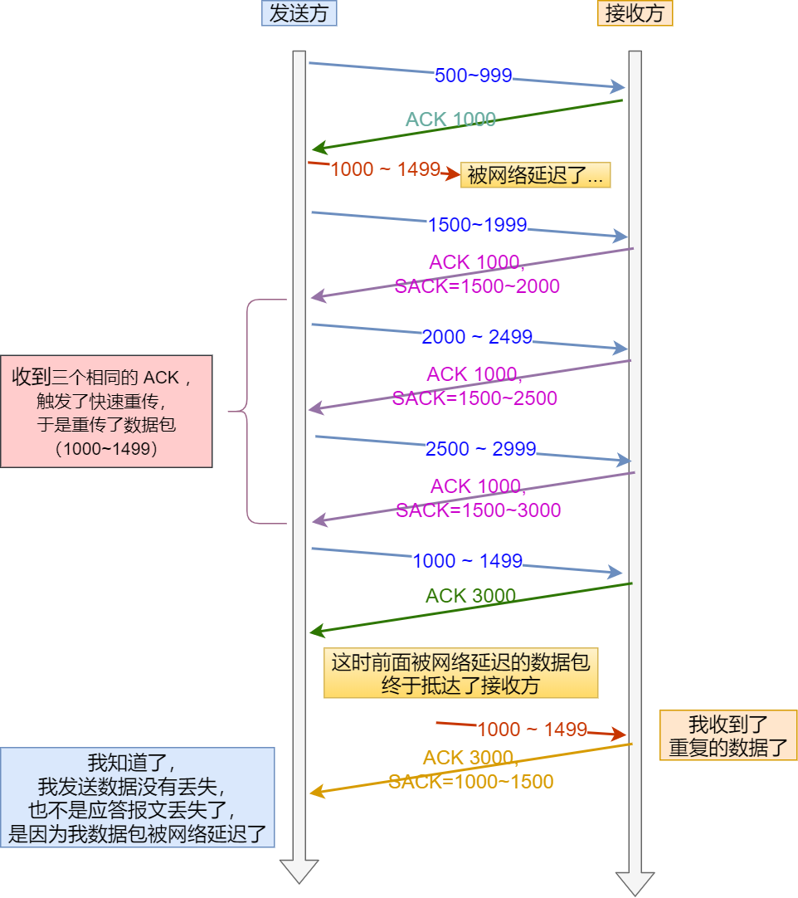

TCP 实现可靠传输的方式之一，是通过序列号与确认应答。

在 TCP 中，当发送端的数据到达接收主机时，接收端主机会返回一个确认应答消息，表示已收到消息。


但在错综复杂的网络，并不一定能如上图那么顺利能正常的数据传输，万一数据在传输过程中丢失了呢？

所以 TCP 针对数据包丢失的情况，会用`重传机制`解决。

常见的重传机制：

- 超时重传
- 快速重传
- SACK
- D-SACK


#  超时重传

重传机制的其中一个方式，就是在发送数据时，设定一个定时器，当超过指定的时间后，没有收到对方的 `ACK` 确认应答报文。

TCP 会在以下两种情况发生超时重传：

- 数据包丢失
- 确认应答丢失


**对任何实现而言，关键之处就在于超时和重传的策略，即怎样决定超时间隔和如何确定重传的频率。**


在分析超时重传之前，我们需要连接RTT 和 RTO两个概念。


-  `RTT`（Round-Trip Time 往返时延），所谓的`RTT` 其实就是**数据从网络一端传送到另一端所需的时间**，也就是包的往返时间。

- `RTO`（Retransmission Timeout 超时重传时间）


那么RTO 应该被设置成多少比较好呢？

如果RTO 被设置的比较长


可以看到如果RTO过长，那么等待重传的时间会过长，导致其效率过低。

如果RTO被设置的比较短：


当RTO过小的时候，会导致可能并没有丢就重发，于是重发的就快，会增加网络拥塞，导致更多的超时，更多的超时导致更多的重发。


上图中有两种超时时间不同的情况：

- 当超时时间 **RTO 较大**时，重发就慢，丢了老半天才重发，没有效率，性能差；

- 当超时时间 **RTO 较小**时，会导致可能并没有丢就重发，于是重发的就快，会增加网络拥塞，导致更多的超时，更多的超时导致更多的重发。

  

  

所以为了兼顾效率和网络的通畅，**超时重传时间 RTO 的值应该略大于报文往返 RTT 的值**。


## RTO 的计算

至此，可能大家觉得超时重传时间 `RTO` 的值计算，也不是很复杂嘛。

好像就是在发送端发包时记下 `t0` ，然后接收端再把这个 `ack` 回来时再记一个 `t1`，于是 `RTT = t1 – t0`。没那么简单，`这只是一个采样，不能代表普遍情况`。


实际上「报文往返 RTT 的值」是经常变化的，因为我们的网络也是时常变化的。也就因为「报文往返 RTT 的值」 是经常波动变化的，所以「超时重传时间 RTO 的值」应该是一个**动态变化的值**。

我们来看看 Linux 是如何计算 `RTO` 的呢？

估计往返时间，通常需要采样以下两个：

- 需要` TCP` 通过采样 `RTT` 的时间，然后进行加权平均，算出一个平滑 `RTT` 的值，而且这个值还是要不断变化的，因为网络状况不断地变化。

- 除了采样 `RTT`，还要采样 `RTT` 的波动范围，这样就避免如果` RTT` 有一个大的波动的话，很难被发现的情况。

  


# 快速重传

TCP 还有另外一种`快速重传（Fast Retransmit）`机制，`它不以时间为驱动，而是以数据驱动重传`。


快速重传机制，是如何工作的呢？如下图所示


在上图，发送方发出了 1，2，3，4，5 份数据：

- 第一份 Seq1 先送到了，于是就 Ack 回 2；
- 结果 Seq2 因为某些原因没收到，Seq3 到达了，于是还是 Ack 回 2；
- 后面的 Seq4 和 Seq5 都到了，但还是 Ack 回 2，因为 Seq2 还是没有收到；
- **发送端收到了三个 Ack = 2 的确认，知道了 Seq2 还没有收到，就会在定时器过期之前，重传丢失的 Seq2。**
- 最后，收到了 Seq2，此时因为 Seq3，Seq4，Seq5 都收到了，于是 Ack 回 6 。


**所以快速重传的工作方法其实就是当发送方收到三个相同的ACK报文时，会在定时器过期之前，重传丢失的报文段。**


快速重传的机制虽然解决了超时重传的时间问题，当它依然还有另外一个问题。

`那就是需要重传的时候，只重传超时的数据包还是重传这个报文以及之后的所有报文呢？`


举一个小例子

- 服务发送5个片段给客户端，seg1(seq=1,len=80),seg2(seq=81,len=120), seg3(seq=201,len=160),seg4(seq=361,len=140),seg5(seq=401,len=300)

- 服务器收到seg1的ACK = 81，所以此时seg1变成发送并已经确认范畴的数据包，被移除滑动窗口，此时服务器又可以多发80 byte数据

- 假设seg2由于某些原因丢失，这个时候服务器仍然可以像客户端发送数据，**但是服务器会等待seg2的ACK，否则窗口无法滑动**。

- seg2丢失了，即使后面的seg3，seg4,seg5收到了，客户端也无法告知服务器已经收到了seg3,seg4,seg5,试想一下，如果窗口也够大，服务器可以继续持续发送更多的片段，那么这些片段被客户端接收，只能存放到队列中，无法进行确认。

  


所以如果我们只重传超时的数据包，但是如果比较坏的情况下，丢失了很多封包呢？  那就需要一个一个的等待超时了，很浪费时间。

如果我们重传这个片段以及之后的所有包，这种方法在最坏的状况下，看起来效率还是挺高的，但是如果只有一个包丢失，就去重传后面所有接受到的包，流量浪费也是很严重的。

对于这个问题，RFC2018提供了一个SACK的方法，有效的解决这个问题。

# SACK 

SACK是一个TCP的选项，来允许TCP单独确认非连续的片段，用于告知真正丢失的包，只重传丢失的片段。添加sack功能需要在TCP包
头加两个选项，一个是开启选项（enabling option），另一个是sack选项（sack option）本身。开启sack选项后，receiver会将自己收到了哪些包，没收到哪些包的信息记录在sack段中告诉给sender，这样sender便可以一次性重传所有的丢包。


## Enabling option 

enabling option是一个占两字节的选项，在建立连接时通过SYN来告诉对方自己是否支持sack。

```c
       TCP Sack-Permitted Option:

       Kind: 4

       +---------+---------+
       | Kind=4  | Length=2|
       +---------+---------+
```

开启sack后，从receiver向sender发送的ack会在sack option字段中携带一些确认信息，
而不是单纯的duplicate ack。

```
TCP SACK Option
Kind: 5
Length: Variable
                          +-------------+-------------+
                          | Kind = 5    |   Length    |
+------------+------------+-------------+-------------+
|            Left Edge of list Block                  |
+------------+------------+-------------+-------------+
|            Right Edge of list Block                 |
+------------+------------+-------------+-------------+
|                                                     |
/                      .  .  .                        /
|                                                     |
+------------+------------+-------------+-------------+
|            Left Edge of list Block                  |
+------------+------------+-------------+-------------+
|            Right Edge of list Block                 |
+------------+------------+-------------+-------------+
```

```
 A SACK option that specifies n blocks will have a length of 8*n+2
   bytes, so the 40 bytes available for TCP options can specify a
   maximum of 4 blocks.  It is expected that SACK will often be used in
   conjunction with the Timestamp option used for RTTM [Jacobson92],
   which takes an additional 10 bytes (plus two bytes of padding); thus
   a maximum of 3 SACK blocks will be allowed in this case.
```


sack选项一般占40字节，其中kind占4字节，length占4字节，剩下32字节，每8字节为一个sack段，一个sack段用来记录一个连续block的开始序号和结束序号，所以最多只能记录4段连续的block。在实际情况中，经常会最多只有三段block，因为sack会经常与时间戳选项结合，用于测量RTT，这需要占用额外的8字节。


# Duplicate SACK

Duplicate SACK 又称 D-SACK，`其主要使用了 SACK 来告诉「发送方」有哪些数据被重复接收了`。


例子

## ACK 丢包


- **于是「接收方」发现数据是重复收到的，于是回了一个 SACK = 3000~3500**，告诉「发送方」 3000~3500 的数据早已被接收了，因为 ACK 都到了 4000 了，已经意味着 4000 之前的所有数据都已收到，所以这个 SACK 就代表着 `D-SACK`。
- 这样「发送方」就知道了，数据没有丢，是「接收方」的 ACK 确认报文丢了。


## 网络延迟





网络延时

- 数据包（1000~1499） 被网络延迟了，导致「发送方」没有收到 Ack 1500 的确认报文。
- 而后面报文到达的三个相同的 ACK 确认报文，就触发了快速重传机制，但是在重传后，被延迟的数据包（1000~1499）又到了「接收方」；
- **所以「接收方」回了一个 SACK=1000~1500，因为 ACK 已经到了 3000，所以这个 SACK 是 D-SACK，表示收到了重复的包。**
- 这样发送方就知道快速重传触发的原因不是发出去的包丢了，也不是因为回应的 ACK 包丢了，而是因为网络延迟了。

可见，`D-SACK` 有这么几个好处：

1. 可以让「发送方」知道，是发出去的包丢了，还是接收方回应的 ACK 包丢了;
2. 可以知道是不是「发送方」的数据包被网络延迟了;
3. 可以知道网络中是不是把「发送方」的数据包给复制了;

在 Linux 下可以通过 `net.ipv4.tcp_dsack` 参数开启/关闭这个功能（Linux 2.4 后默认打开）。


# 参考

30张图解： TCP 重传、滑动窗口、流量控制、拥塞控制   https://www.cnblogs.com/xiaolincoding/p/12732052.html

TCP-IP详解：SACK选项（Selective Acknowledgment）https://blog.csdn.net/wdscq1234/article/details/52503315

TCP Selective Acknowledgment Options https://tools.ietf.org/html/rfc2018

TCP重点系列之sack介绍 https://allen-kevin.github.io/2017/03/01/TCP%E9%87%8D%E7%82%B9%E7%B3%BB%E5%88%97%E4%B9%8Bsack%E4%BB%8B%E7%BB%8D/

