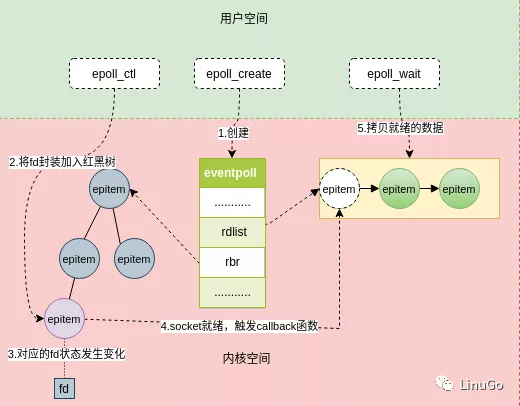

# 什么是epoll？

epoll是Linux下多路复用IO接口select/poll的增强版本，它能显著提高程序在大量并发连接中只有少量活跃的情况下的系统CPU利用率，因为它会复用文件描述符集 合来传递结果而不用迫使开发者每次等待事件之前都必须重新准备要被侦听的文件描述符集合，另一点原因就是获取事件的时候，它无须遍历整个被侦听的描述符 集，只要遍历那些被内核IO事件异步唤醒而加入Ready队列的描述符集合就行了。epoll除了提供select/poll那种IO事件的电平触发 （Level Triggered）外，还提供了边沿触发（Edge Triggered），这就使得用户空间程序有可能缓存IO状态，减少epoll_wait/epoll_pwait的调用，提高应用程序效率。Linux2.6内核中对/dev/epoll设备的访问的封装（system epoll）。


# epoll 的工作方式

LT(level triggered) 是默认/缺省的工作方式，同时支持 block和no_block socket。这种工作方式下，内核会通知你一个fd是否就绪，然后才可以对这个就绪的fd进行I/O操作。就算你没有任何操作，系统还是会继续提示fd已经就绪，不过这种工作方式出错会比较小，传统的select/poll就是这种工作方式的代表。

ET(edge-triggered) 是高速工作方式，仅支持no_block socket，这种工作方式下，当fd从未就绪变为就绪时，内核会通知fd已经就绪，并且内核认为你知道该fd已经就绪，不会再次通知了，除非因为某些操作导致fd就绪状态发生变化。如果一直不对这个fd进行I/O操作，导致fd变为未就绪时，内核同样不会发送更多的通知，因为only once。所以这种方式下，出错率比较高，需要增加一些检测程序。

LT可以理解为水平触发，只要有数据可以读，不管怎样都会通知。而ET为边缘触发，只有状态发生变化时才会通知，可以理解为电平变化。


# epoll 的是三个函数


使用epoll很简单，只需要

```
#include <sys/epoll.h>
```

有三个关键函数：

```c
int epoll_create(int size);

int epoll_ctl(int epfd, int op, int fd, struct epoll_events* event);

int epoll_wait(int epfd, struct epoll_event* events, int maxevents, int timeout);
```




## epoll create 

```c
int epoll_create(int size);
```

epoll_create()创建一个epoll的事例，通知内核需要监听size个fd。size指的并不是最大的后备存储设备，而是衡量内核内部结构大小的一个提示。当创建成功后，会占用一个fd，所以记得在使用完之后调用close()，否则fd可能会被耗尽。

Note:自从Linux2.6.8版本以后，size值其实是没什么用的，不过要大于0，因为内核可以动态的分配大小，所以不需要size这个提示了。

创建还有另外一个函数

```
int epoll_create1(int flag);
```

这个函数是在linux 2.6.27中加入的，当你在看陈硕的muduo时可以看到这个函数，其实它和epoll_create差不多，不同的是epoll_create1函数的参数是flag，当flag是0时，表示和epoll_create函数完全一样，不需要size的提示了。

当flag = EPOLL_CLOEXEC，创建的epfd会设置FD_CLOEXEC

当flag = EPOLL_NONBLOCK，创建的epfd会设置为非阻塞


## epoll 时间注册

```c
int epoll_ctl(int epfd, int op, int fd, struct epoll_event* event);
```


select是在监听时告诉内核要监听的事件，而epoll_ctl是先注册需要监听的事件。

第一个参数epfd，为epoll_create返回的的epoll fd。

第二个参数op表示操作值。有三个操作类型，

```
EPOLL_CTL_ADD  // 注册目标fd到epfd中，同时关联内部event到fd上

EPOLL_CTL_MOD // 修改已经注册到fd的监听事件

EPOLL_CTL_DEL // 从epfd中删除/移除已注册的fd，event可以被忽略，也可以为NULL
```

第三个参数fd表示需要监听的fd。

第四个参数event表示需要监听的事件。

```c
typedef union epoll_data {
void        *ptr;
int          fd;
uint32_t     u32;
uint64_t     u64;
} epoll_data_t;

struct epoll_event {
uint32_t     events;      /* Epoll events */
epoll_data_t data;        /* User data variable */
};
```


# 参考 

Linux编程之epoll https://www.cnblogs.com/skyfsm/p/7102367.html


