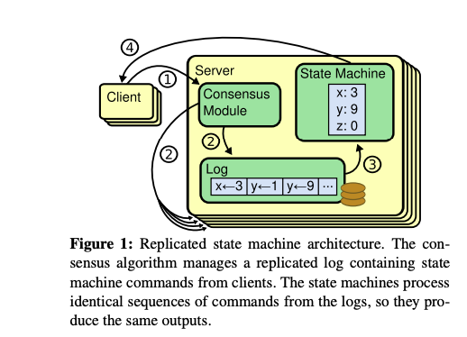
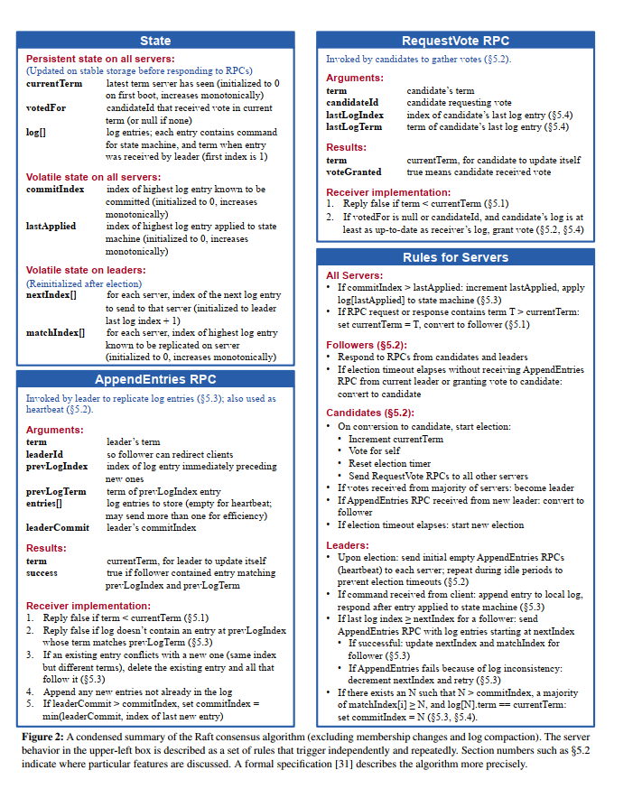
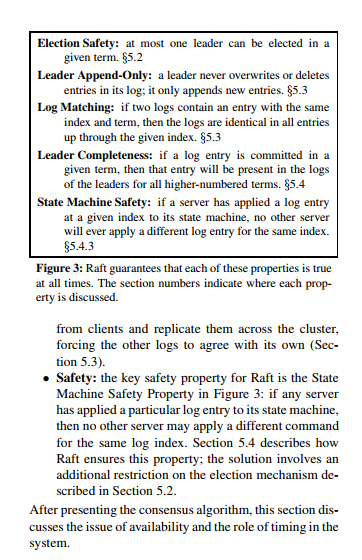
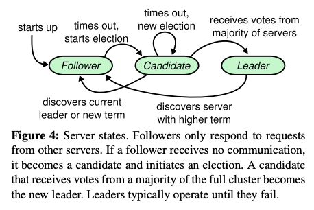
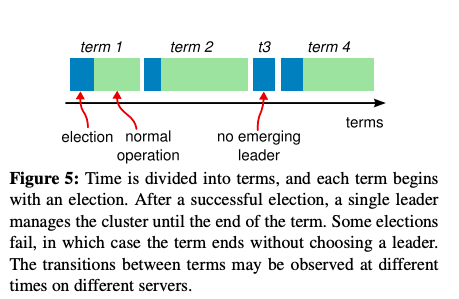
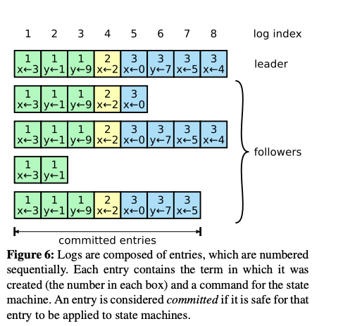
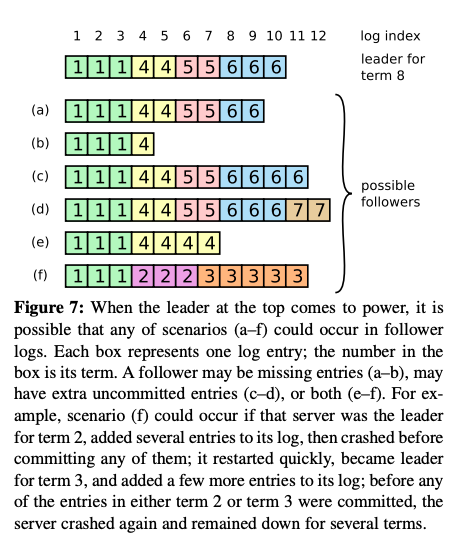
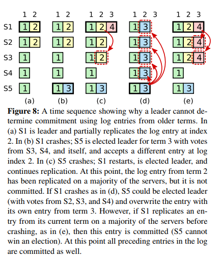

# 介绍


## 什么是一致性算法

>  Consensus algorithms allow a collection of machines to work as a coherent group that can survive the failures of some of its members.Because of this, they play a key role in building reliable large-scale software systems.

一致性算法允许多台机器作为一个集群协同工作，并且在其中的某几台机器出故障时集群仍然能正常工作。正因为如此，一致性算法在建立可靠的大规模软件系统方面发挥了关键作用。


## 为什么设计Raft 

在分布式学术理论界，最耀眼的还是大名鼎鼎的Paxos。但Paxos是：少数真正理解的人觉得简单，尚未理解的人觉得很难，大多数人都是一知半解。本人也花了很多时间、看了很多材料也没有真正理解。直到看到raft的论文，两位研究者也提到，他们也花了很长的时间来理解Paxos，他们也觉得很难理解，最后Raft 使用了特定的技术来提高可理解性，包括分解（Raft 分离 leader 选举，日志复制和安全）和状态空间减少（相对于 Paxos ，Raft 减少了不确定性程度和服务器之间彼此不一致的方式 ）。


> The result of this work is a consensus algorithm called Raft. In designing Raft we applied specific techniques to improve understandability, including decomposition (Raft separates leader election, log replication, and safety) and state space reduction (relative to Paxos, Raft reduces the degree of nondeterminism and the ways servers can be inconsistent with each other)

Raft 算法在许多方面和现有的一致性算法都很相似（主要是 Oki 和 Liskov 的 Viewstamped Replication），但是它也有一些独特的特性：

- **强领导者（Strong leader）：**和其他一致性算法相比，Raft 使用一种更强的领导能力形式。比如，日志条目只从领导者发送给其他的服务器。这种方式简化了对复制日志的管理并且使得 Raft 算法更加易于理解。
- **领导选举（Leader election）：**Raft 算法使用一个随机计时器来选举领导者。这种方式只是在任何一致性算法都必须实现的心跳机制上增加了一点机制。在解决冲突的时候会更加简单快捷。
- **成员关系调整（Membership changes）：**Raft 使用一种共同一致的方法来处理集群成员变换的问题，在这种方法下，处于调整过程中的两种不同的配置集群中大多数机器会有重叠，这就使得集群在成员变换的时候依然可以继续工作。

> - Strong leader: Raft uses a stronger form of leadership than other consensus algorithms. For example, log entries only flow from the leader to other servers. This simplifies the management of the replicated log and makes Raft easier to understand.
>
> - Leader election: Raft uses randomized timers to elect leaders. This adds only a small amount of mechanism to the heartbeats already required for any consensus algorithm, while resolving conflicts simply and rapidly. 
> -  Membership changes: Raft’s mechanism for changing the set of servers in the cluster uses a new joint consensus approach where the majorities of two different configurations overlap during transitions. This allows the cluster to continue operating normally during configuration changes.


# 复制状态机（Replicated state machines）

一致性算法是在[复制状态机[37\]](https://www.cs.cornell.edu/fbs/publications/SMSurvey.pdf)的背景下产生的。 在这种方法中，一组服务器上的状态机计算相同状态的相同副本，并且即使某些服务器宕机，也可以继续运行。

>  Consensus algorithms typically arise in the context of replicated state machines [37]. In this approach, state machines on a collection of servers compute identical copies of the same state and can continue operating even if some of the servers are down


## 什么是复制状态机

> Replicated state machines are used to solve a variety of fault tolerance problems in distributed systems. For example, large-scale systems that have a single cluster leader, such as GFS [8], HDFS [38], and RAMCloud [33], typically use a separate replicated state machine to manage leader election and store configuration information that must survive leader crashes. Examples of replicated state machines include Chubby [2] and ZooKeeper .


## Replicated state machines 实现



> Replicated state machines are typically implemented using a replicated log, as shown in Figure 1. Each server stores a log containing a series of commands, which its state machine executes in order. Each log contains the same commands in the same order, so each state machine processes the same sequence of commands. Since the state machines are deterministic, each computes the same state and the same sequence of outputs.

复制状态机通常使用复制日志实现，如图1所示。每个服务器存储一个包含一系列命令的日志，其状态机按顺序执行日志中的命令。 每个日志中命令都相同并且顺序也一样，因此每个状态机处理相同的命令序列。 这样就能得到相同的状态和相同的输出序列。

> Keeping the replicated log consistent is the job of the consensus algorithm. The consensus module on a server receives commands from clients and adds them to its log. It communicates with the consensus modules on other servers to ensure that every log eventually contains the same requests in the same order, even if some servers fail. Once commands are properly replicated, each server’s state machine processes them in log order, and the outputs are returned to clients. As a result, the servers appear to form a single, highly reliable state machine

一致性算法的工作就是保证复制日志的一致性。 每台服务器上的一致性模块接收来自客户端的命令，并将它们添加到其日志中。 它与其他服务器上的一致性模块通信，以确保每个日志最终以相同的顺序包含相同的命令，即使有一些服务器失败。 一旦命令被正确复制，每个服务器上的状态机按日志顺序处理它们，并将输出返回给客户端。 这样就形成了高可用的复制状态机。

>Consensus algorithms for practical systems typically have the following properties: 
>
>-  They ensure safety (never returning an incorrect result) under all non-Byzantine conditions, including network delays, partitions, and packet loss, duplication, and reordering. •
>- They are fully functional (available) as long as any majority of the servers are operational and can communicate with each other and with clients. Thus, a typical cluster of five servers can tolerate the failure of any two servers. Servers are assumed to fail by stopping; they may later recover from state on stable storage and rejoin the cluster. 
>-  They do not depend on timing to ensure the consistency of the logs: faulty clocks and extreme message delays can, at worst, cause availability problems.
>
>- In the common case, a command can complete as soon as a majority of the cluster has responded to a single round of remote procedure calls; a minority of slow servers need not impact overall system performance

实际系统中的一致性算法通常具有以下属性：

- 它们确保在所有非拜占庭条件下（包括网络延迟，分区和数据包丢失，重复和乱序）的安全性（不会返回不正确的结果）。
- 只要任何大多数（过半）服务器都可以运行，并且可以相互通信和与客户通信，一致性算法就可用。 因此，五台服务器的典型集群可以容忍任何两台服务器的故障。 假设服务器突然宕机; 它们可以稍后从状态恢复并重新加入群集。
- 它们不依赖于时序来确保日志的一致性：错误的时钟和极端消息延迟可能在最坏的情况下导致可用性问题。
- 在通常情况下，只要集群的大部分（过半服务器）已经响应了单轮远程过程调用，命令就可以完成; 少数（一半以下）慢服务器不需要影响整个系统性能。

### 


# Raft 的实现

Raft 是一种用来管理第 2 节中描述的复制日志的算法。图 2 是该算法的浓缩，可用作参考，图 3 列举了该算法的一些关键特性。图中的这些内容将在剩下的章节中逐一介绍。





## Raft 的基础

> A Raft cluster contains several servers; five is a typical number, which allows the system to tolerate two failures. At any given time each server is in one of three states: leader, follower, or candidate.In normal operation there is exactly one leader and all of the other servers are followers。Followers are passive: they issue no requests on their own but simply respond to requests from leaders and candidates. The leader handles all client requests (if a client contacts a follower, the follower redirects it to the leader). The third state, candidate, is used to elect a new leader as described in Section 5.2. Figure 4 shows the states and their transitions; the transitions are discussed below.

一个典型的 Raft 集群包含多个节点。在任意时刻，每个节点都将处于以下三个状态之一：

- leader：处理所有来自客户端的请求，封装为可重入的日志记录（log entry），并将其复制给其他 follower 节点，并在收到超过半数的确认后将日志提交。
- follower：follower 是被动的，他们自己不产生请求，只处理 leaders 和 candidates 的请求并回应。
- candidate：follower 被选举成为 leader 之前的状态。

Raft 集群的节点之间只存在两种 RPC 调用：

- **RequestVote RPC**：发起于 candidate 节点，作用于其他节点，用于收集选票，只有当 candidate 当前日志的 term 和 index 都比当前节点
- **AppendEntries RPC**：发起于 leader 节点，作用于 follower 节点，用于将 leader 的 log entries 复制给 follower。当 AppendEntries RPC 不包含 log entry 时，则其作为心跳（heartbeat）告知所有 follower 节点 leader 的存活。





> Raft divides time into terms of arbitrary length, as shown in Figure 5. Terms are numbered with consecutive integers. Each term begins with an election, in which one or more candidates attempt to become leader as described in Section 5.2. If a candidate wins the election, then it serves as leader for the rest of the term. In some situations an election will result in a split vote. In this case the term will end with no leader; a new term (with a new election) will begin shortly. Raft ensures that there is at most one leader in a given term

Raft 把时间分割成任意长度的任期（term），如图 5 所示。任期用连续的整数标记。每一段任期从一次选举开始，一个或者多个 candidate 尝试成为 leader 。如果一个 candidate 赢得选举，然后他就在该任期剩下的时间里充当 leader 。在某些情况下，一次选举无法选出 leader 。在这种情况下，这一任期会以没有 leader 结束；一个新的任期（包含一次新的选举）会很快重新开始。Raft 保证了在任意一个任期内，最多只有一个 leader 。



不同的服务器节点观察到的任期转换的次数可能不同，在某些情况下，一个服务器节点可能没有看到 leader 选举过程或者甚至整个任期全程。任期在 Raft 算法中充当逻辑时钟的作用，这使得服务器节点可以发现一些过期的信息比如过时的 leader 。每一个服务器节点存储一个当前任期号，该编号随着时间单调递增。服务器之间通信的时候会交换当前任期号；如果一个服务器的当前任期号比其他的小，该服务器会将自己的任期号更新为较大的那个值。如果一个 candidate 或者 leader 发现自己的任期号过期了，它会立即回到 follower 状态。如果一个节点接收到一个包含过期的任期号的请求，它会直接拒绝这个请求。

> Different servers may observe the transitions between terms at different times, and in some situations a server may not observe an election or even entire terms. Terms act as a logical clock [14] in Raft, and they allow servers to detect obsolete information such as stale leaders. Each server stores a current term number, which increases monotonically over time. Current terms are exchanged whenever servers communicate; if one server’s current term is smaller than the other’s, then it updates its current term to the larger value. If a candidate or leader discovers that its term is out of date, it immediately reverts to follower state. If a server receives a request with a stale term number, it rejects the request.


## Leader election 

这一小节是Raft 核心的实现之一，需要比较详细的分析

> Raft uses a heartbeat mechanism to trigger leader election. When servers start up, they begin as followers. A server remains in follower state as long as it receives valid  RPCs from a leader or candidate. Leaders send periodic heartbeats (AppendEntries RPCs that carry no log entries) to all followers in order to maintain their authority. If a follower receives no communication over a period of time called the election timeout, then it assumes there is no viable leader and begins an election to choose a new leader.
>
> To begin an election, a follower increments its current term and transitions to candidate state. It then votes for itself and issues RequestVote RPCs in parallel to each of the other servers in the cluster. A candidate continues in this state until one of three things happens: (a) it wins the election, (b) another server establishes itself as leader, or (c) a period of time goes by with no winner. These outcomes are discussed separately in the paragraphs below.

当一个 follower 节点在一个选举超时时间（election timeout）内都没有接收到心跳或请求，则其将其自身 term 加 1，并转换自身状态为 candidate 。然后投票给自己并且并行地向集群中的其他服务器节点发送 RequestVote RPC（让其他节点投票个自己）。然后投票给自己并且并行地向集群中的其他服务器节点发送 RequestVote RPC

- 它自己赢得了选举
- 其他的服务器节点成为 leader 
- 没有任何获胜者


### 自己赢得选举

>  A candidate wins an election if it receives votes from a majority of the servers in the full cluster for the same term. Each server will vote for at most one candidate in a given term, on a first-come-first-served basis (note: Section 5.4 adds an additional restriction on votes). The majority rule ensures that at most one candidate can win the election for a particular term (the Election Safety Property in Figure 3). Once a candidate wins an election, it becomes leader. It then sends heartbeat messages to all of the other servers to establish its authority and prevent new elections.

当一个 candidate 获得集群中过半服务器节点针对同一个任期的投票，它就赢得了这次选举并成为 leader 。对于同一个任期，每个服务器节点只会投给一个 candidate ，按照先来先服务（first-come-first-served）的原则 。

###  其他服务器赢得了选举

>  While waiting for votes, a candidate may receive an AppendEntries RPC from another server claiming to be leader. If the leader’s term (included in its RPC) is at least as large as the candidate’s current term, then the candidate recognizes the leader as legitimate and returns to follower state. If the term in the RPC is smaller than the candidate’s current term, then the candidate rejects the RPC and continues in candidate state

在等待投票期间，candidate 可能会收到另一个声称自己是 leader 的服务器节点发来的 AppendEntries RPC 。`如果这个 leader 的任期号（包含在RPC中）不小于 candidate 当前的任期号，那么 candidate 会承认该 leader 的合法地位并回到 follower 状态。 如果 RPC 中的任期号比自己的小，那么 candidate 就会拒绝这次的 RPC 并且继续保持 candidate 状态。`


###没有任务获胜者

> The third possible outcome is that a candidate neither wins nor loses the election: if many followers become candidates at the same time, votes could be split so that no candidate obtains a majority. When this happens, each candidate will time out and start a new election by incrementing its term and initiating another round of RequestVote RPCs. However, without extra measures split votes could repeat indefinitely

第三种情况就是多个follower 同时成为candidate,然后这些candidate 瓜分这些选票，导致没有一个candidate 获取过半的选票。当这种情况发生时，每一个 Candidate 都会超时，然后通过增加当前任期号来开始一轮新的选举。然而，如果没有其他机制的话，该情况可能会无限重复。


> Raft uses randomized election timeouts to ensure that split votes are rare and that they are resolved quickly. To prevent split votes in the first place, election timeouts are chosen randomly from a fixed interval (e.g., 150–300ms). This spreads out the servers so that in most cases only a single server will time out; it wins the election and sends heartbeats before any other servers time out. The same mechanism is used to handle split votes. Each candidate restarts its randomized election timeout at the start of an election, and it waits for that timeout to elapse before starting the next election; this reduces the likelihood of another split vote in the new election. Section 9.3 shows that this approach elects a leader rapidly

Raft 使用了随机设置选举的超时时间的算法来时这种情况极少发生，即使发生了也能快速解决。为了阻止选票一开始就被瓜分，选举超时时间是从一个固定的区间（例如 150-300 毫秒）随机选择。这样可以把服务器都分散开以至于在大多数情况下只有一个服务器会选举超时；然后该服务器赢得选举并在其他服务器超时之前发送心跳。同样的机制被用来解决选票被瓜分的情况。每个 candidate 在开始一次选举的时候会重置一个随机的选举超时时间，然后一直等待直到选举超时；这样减小了在新的选举中再次发生选票瓜分情况的可能性。


# 日志复制 （Log replicaion ）

> Once a leader has been elected, it begins servicing client requests. Each client request contains a command to be executed by the replicated state machines. The leader appends the command to its log as a new entry, then issues AppendEntries RPCs in parallel to each of the other servers to replicate the entry. When the entry has been safely replicated (as described below), the leader applies the entry to its state machine and returns the result of that execution to the client. If followers crash or run slowly, or if network packets are lost, the leader retries AppendEntries RPCs indefinitely (even after it has responded to the client) until all followers eventually store all log entries.

Leader 一旦被选举出来，就开始为客户端请求提供服务。客户端的每一个请求都包含一条将被复制状态机执行的指令。Leader 把该指令作为一个新的条目追加到日志中去，然后并行的发起 AppendEntries RPC 给其他的服务器，让它们复制该条目。当该条目被安全地复制（下面会介绍），leader 会应用该条目到它的状态机中（状态机执行该指令）然后把执行的结果返回给客户端。如果 follower 崩溃或者运行缓慢，或者网络丢包， Leader 会不断地重试 AppendEntries RPC（即使已经回复了客户端）直到所有的 follower 最终都存储了所有的日志条目。


日志以图 6 展示的方式组织。每个日志条目存储一条状态机指令和 leader 收到该指令时的任期号。任期号用来检测多个日志副本之间的不一致情况，同时也用来保证图 3 中的某些性质。每个日志条目都有一个整数索引值来表明它在日志中的位置。





> The leader decides when it is safe to apply a log entry to the state machines; such an entry is called committed. Raft guarantees that committed entries are durable and will eventually be executed by all of the available state machines. A log entry is committed once the leader that created the entry has replicated it on a majority of the servers (e.g., entry 7 in Figure 6). This also commits all preceding entries in the leader’s log, including entries created by previous leaders. Section 5.4 discusses some subtleties when applying this rule after leader changes, and it also shows that this definition of commitment is safe. The leader keeps track of the highest index it knows to be committed, and it includes that index in future AppendEntries RPCs (including heartbeats) so that the other servers eventually find out. Once a follower learns that a log entry is committed, it applies the entry to its local state machine (in log order).

Raft 算法保证所有已经提交的日志条目都是持久化的并且最终会被所有可用的状态机执行。一旦创建该日志条目的 leader 将它复制到过半的服务器上，该日志条目就会被提交（例如在图 6 中的条目 7）。同时，leader 日志中该日志条目之前的所有日志条目也都会被提交，包括由其他 leader 创建的条目。

5.4 节讨论在 leader 变更之后应用该规则的一些细节，并且证明了这种提交的规则是安全的。

Leader 追踪将会被提交的日志条目的最大索引，未来的所有 AppendEntries RPC 都会包含该索引，这样其他的服务器才能最终知道哪些日志条目需要被提交。Follower 一旦知道某个日志条目已经被提交就会将该日志条目应用到自己的本地状态机中（按照日志的顺序）。

> We designed the Raft log mechanism to maintain a high level of coherency between the logs on different servers. Not only does this simplify the system’s behavior and make it more predictable, but it is an important component of ensuring safety. Raft maintains the following properties, which together constitute the Log Matching Property in Figure 3: 
>
> -  If two entries in different logs have the same index and term, then they store the same command. 
> -  If two entries in different logs have the same index and term, then the logs are identical in all preceding entries

Raft 中的每个日志记录都带有一个 term 号以及一个 log index 来唯一标识。日志记录具有两个特性：

- 如果两条不同节点的某两个日志记录具有相同的 term 和 index 号，则两条记录一定是**完全相同的**。
- 如果两条不同节点的某两个日志记录具有相同的 term 和 index 号，则两条记录之前的**所有记录**也一定是**完全相同**的。

> The first property follows from the fact that a leader creates at most one entry with a given log index in a given term, and log entries never change their position in the log. 

上面的第一个特性是通过 Leader 在某一个tern 之内的一个日志索引处最多只能创建一个日志条目，同时日志条目在日志中的位置也从来不会改变。


> The second property is guaranteed by a simple consistency check performed by AppendEntries. When sending an AppendEntries RPC, the leader includes the index and term of the entry in its log that immediately precedes the new entries. If the follower does not find an entry in its log with the same index and term, then it refuses the new entries. The consistency check acts as an induction step: the initial empty state of the logs satisfies the Log Matching Property, and the consistency check preserves the Log Matching Property whenever logs are extended. As a result, whenever AppendEntries returns successfully, the leader knows that the follower’s log is identical to its own log up through the new entries.

第二个特性是由 AppendEntries RPC 执行一个简单的一致性检查所保证的。在发送 AppendEntries RPC 的时候，leader 会将前一个日志条目的索引位置和任期号包含在里面。如果 follower 在它的日志中找不到包含相同索引位置和任期号的条目，那么他就会拒绝该新的日志条目。一致性检查就像一个归纳步骤：一开始空的日志状态肯定是满足 Log Matching Property（日志匹配特性） 的，然后一致性检查保证了日志扩展时的日志匹配特性。因此，每当 AppendEntries RPC 返回成功时，leader 就知道 follower 的日志一定和自己相同（从第一个日志条目到最新条目）。


> During normal operation, the logs of the leader and followers stay consistent, so the AppendEntries consistency check never fails. However, leader crashes can leave the logs inconsistent (the old leader may not have fully replicated all of the entries in its log). These inconsistencies can compound over a series of leader and follower crashes. Figure 7 illustrates the ways in which followers’ logs may differ from that of a new leader. A follower may be missing entries that are present on the leader, it may have extra entries that are not present on the leader, or both. Missing and extraneous entries in a log may span multiple terms. 




> In Raft, the leader handles inconsistencies by forcing the followers’ logs to duplicate its own. This means that conflicting entries in follower logs will be overwritten with entries from the leader’s log. Section 5.4 will show that this is safe when coupled with one more restriction.

在 Raft 算法中，leader 通过强制 follower 复制它的日志来解决不一致的问题。这意味着 follower 中跟 leader 冲突的日志条目会被 leader 的日志条目覆盖。5.4 节会证明通过增加一个限制可以保证安全性。


> To bring a follower’s log into consistency with its own, the leader must find the latest log entry where the two logs agree, delete any entries in the follower’s log after that point, and send the follower all of the leader’s entries after that point. All of these actions happen in response to the consistency check performed by AppendEntries RPCs. The leader maintains a nextIndex for each follower, which is the index of the next log entry the leader will send to that follower. When a leader first comes to power, it initializes all nextIndex values to the index just after the last one in its log (11 in Figure 7). If a follower’s log is inconsistent with the leader’s, the AppendEntries consistency check will fail in the next AppendEntries RPC. After a rejection, the leader decrements nextIndex and retries the AppendEntries RPC. Eventually nextIndex will reach a point where the leader and follower logs match. When this happens, AppendEntries will succeed, which removes any conflicting entries in the follower’s log and appends entries from the leader’s log (if any). Once AppendEntries succeeds, the follower’s log is consistent with the leader’s, and it will remain that way for the rest of the term.

Raft 为了解决这种问题，使用下面的方式强制将自己的日志复制给 followers：

1. 选举成功后，leader 从来不会覆盖，删除或者修改其日志。
2. 选举成功后，leader 会初始化一个数组 `nextIndex[]`，长度为集群中其他 follower 个数，并初始化数组中所有值为当前自身日志的 index+1。`nextIndex[]` 中，对应的值表示本 leader 将给对应 follower 发送的下一条日志 index。
3. leader 根据 `nextIndex[]`，给对应 follower 发送对应的日志。若 follower 对比其前一条 log 不一致，则会拒绝 leader 发来的请求。此时 leader 就将其在 `nextIndex[]` 中的对应值减一。
4. leader 不断重试，直到 follower 比对成功。follower 接受 AppendEntries RPC，并抛弃所有有冲突的日志。
5. leader 按照自身日志顺序将日志正常复制给 follower，并不断将 `nextIndex[]` 对应值 +1，直到对应值“追上”自身日志的 index 为止。


通过以上的方式，Raft 实现了对从 leader 到 followers 的日志复制，并确保少于一半的节点故障不会影响系统的正常运行和性能。


# 安全性

> The previous sections described how Raft elects leaders and replicates log entries. However, the mechanisms described so far are not quite sufficient to ensure that each state machine executes exactly the same commands in the same order. For example, a follower might be unavailable while the leader commits several log entries, then it could be elected leader and overwrite these entries with new ones; as a result, different state machines might execute different command sequences.

前面的章节里描述了 Raft 算法是如何进行 leader 选举和日志复制的。然而，到目前为止描述的机制并不能充分地保证每一个状态机会按照相同的顺序执行相同的指令。例如，一个 follower 可能会进入不可用状态，在此期间，leader 可能提交了若干的日志条目，然后这个 follower 可能会被选举为 leader 并且用新的日志条目覆盖这些日志条目；结果，不同的状态机可能会执行不同的指令序列。


## Election restriction (选举约束)

如果仅根据前文所述的方式进行重新选举 leader 时，如果新选举出的 leader 的日志不完全包含上一个 leader 的日志，即使这些“丢失的”日志已经被复制到了大多数 follower 节点（甚至已经被提交），新的 leader 还是会把它们直接覆盖掉。这种结果显然是不正确的。

> Raft uses the voting process to prevent a candidate from winning an election unless its log contains all committed entries. A candidate must contact a majority of the cluster in order to be elected, which means that every committed entry must be present in at least one of those servers. If the candidate’s log is at least as up-to-date as any other log in that majority (where “up-to-date” is defined precisely below), then it will hold all the committed entries. The RequestVote RPC implements this restriction: the RPC includes information about the candidate’s log, and the voter denies its vote if its own log is more up-to-date than that of the candidate.

Candidate 为了赢得选举必须与集群中的过半节点通信，这意味着至少其中一个服务器节点包含了所有已提交的日志条目。（如果最新的commit log 不包含在里面，显然该log 是不会通过的）如果 candidate 的日志至少和过半的服务器节点一样新（接下来会精确地定义“新”），那么他一定包含了所有已经提交的日志条目。RequestVote RPC 执行了这样的限制： RPC 中包含了 candidate 的日志信息，如果投票者自己的日志比 candidate 的还新，它会拒绝掉该投票请求。


> Raft determines which of two logs is more up-to-date by comparing the index and term of the last entries in the logs. If the logs have last entries with different terms, then the log with the later term is more up-to-date. If the logs end with the same term, then whichever log is longer is more up-to-date


Raft 同步比较 term 和 index 来得出谁是更新的日志。

```
if node1.term > node2.term {
		return node1
}else if node1.term < node2.term {
		return node2 
}else{
	if len(node1.logs) >= len(node2.logs) {
		return node1 
	}else{
	  return node2  
	}
}
```


## Committing entries from previous terms 提交之前任期内的日志条目

> As described in Section 5.3, a leader knows that an entry from its current term is committed once that entry is stored on a majority of the servers. If a leader crashes before committing an entry, future leaders will attempt to finish replicating the entry. However, a leader cannot immediately conclude that an entry from a previous term is committed once it is stored on a majority of servers. Figure 8 illustrates a situation where an old log entry is stored on a majority of servers, yet can still be overwritten by a future leader




1. 在(a) 中，S1是 leader ，S2复制了索引位置 2 的日志条目。 \<term1\> 
2. 在(b) 中，S1 crashes,S5 被 S3 S4 和 S5 选举成新的leader,然后从客户端接收了一条不一样的日志条目放在了并将其写入引位置 2 的日志条目。\<term2\> 
3. 在(c) 中， S5 crashes了,S1 重新启动了，选举成功，继续复制日志。此时，来自任期 2 的那条日志已经被复制到了集群中的大多数机器上，但是还没有被提交。\<term3\> 
4. 在（d ) 中，如果S1 又 crashes 了，S5 有被选举成了，S5 可以重新被选举成功（通过来自 S2，S3 和 S4 的选票），然后覆盖了他们在索引 2 处的日志。\<term4\> 
5. 但是，如果 S1 crashes之前，如果 S1 在自己的任期里复制了日志条目到大多数机器上，如 (e) 中，然后这个条目就会被提交（S5 就不可能选举成功）。在这种情况下，之前的所有日志也被提交了。(备注：这种情况是作为d的参照组)


> To eliminate problems like the one in Figure 8, Raft never commits log entries from previous terms by counting replicas. Only log entries from the leader’s current term are committed by counting replicas; once an entry from the current term has been committed in this way, then all prior entries are committed indirectly because of the Log Matching Property. There are some situations where a leader could safely conclude that an older log entry is committed (for example, if that entry is stored on every server), but Raft takes a more conservative approach for simplicity.


**`为了解决该问题Raft对于当前任期之前任期提交的日志，并不通过判断是否已经在半数以上集群节点写入成功来作为能否提交的依据。只有当前leader任期内的日志是通过比较写入数量是否超过半数来决定是否可以提交的。对于任期之前的日志，Raft采用的方式，是只要提交成功了当前任期的日志，那么在日志之前的日志就认为提交成功了。`**

# 参考 
Raft 算法原文 https://raft.github.io/raft.pdf
Raft算法原理 https://www.codedump.info/post/20180921-raft/
ETCD 原理分析（一）- Raft 算法原理 https://blog.didiyun.com/index.php/2019/02/27/etcd-raft/

Two-Phase Commit https://www.cs.princeton.edu/courses/archive/fall16/cos418/docs/L6-2pc.pdf