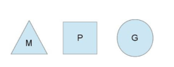
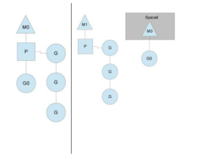

#### 1. golang中除了加Mutex锁以外还有哪些方式安全读写共享变量

Golang中Goroutine 可以通过 Channel 进行安全读写共享变量,还可以通过原子性操作进行.

#### 2. 无缓冲Chan的发送和接收是否同步

```
ch := make(chan int)    无缓冲的channel由于没有缓冲发送和接收需要同步.
ch := make(chan int, 2) 有缓冲channel不要求发送和接收操作同步. 
```

- channel无缓冲时，发送阻塞直到数据被接收，接收阻塞直到读到数据。
- channel有缓冲时，当缓冲满时发送阻塞，当缓冲空时接收阻塞。


#### 3. Golang并发机制以及它所使用的CSP并发模型．

在计算机科学中，通信顺序过程（communicating sequential processes，CSP）是一种描述并发系统中交互模式的正式语言，它是并发数学理论家族中的一个成员，被称为过程算法（process algebras），或者说过程计算（process calculate），是基于消息的通道传递的数学理论。

CSP模型是上个世纪七十年代提出的,不同于传统的多线程通过共享内存来通信，CSP讲究的是“以通信的方式来共享内存”。用于描述两个独立的并发实体通过共享的通讯 channel(管道)进行通信的并发模型。 CSP中channel是第一类对象，它不关注发送消息的实体，而关注与发送消息时使用的channel。

Golang中channel 是被单独创建并且可以在进程之间传递，它的通信模式类似于 boss-worker 模式的，一个实体通过将消息发送到channel 中，然后又监听这个 channel 的实体处理，两个实体之间是匿名的，这个就实现实体中间的解耦，其中 channel 是同步的一个消息被发送到 channel 中，最终是一定要被另外的实体消费掉的，在实现原理上其实类似一个阻塞的消息队列。

Goroutine 是Golang实际并发执行的实体，它底层是使用协程(coroutine)实现并发，coroutine是一种运行在用户态的用户线程，类似于greenthread，go底层选择使用coroutine的出发点是因为，

它具有以下特点：

- 用户空间 避免了内核态和用户态的切换导致的成本.
- 可以由语言和框架层进行调度.
- 更小的栈空间允许创建大量的实例.

Golang中的Goroutine的特性:

Golang内部有三个对象: P对象(processor) 代表上下文（或者可以认为是cpu），M(work thread)代表工作线程，G对象（goroutine）.

正常情况下一个cpu对象启一个工作线程对象，线程去检查并执行goroutine对象。碰到goroutine对象阻塞的时候，会启动一个新的工作线程，以充分利用cpu资源。 所有有时候线程对象会比处理器对象多很多.

我们用如下图分别表示P、M、G:



G（Goroutine）: 我们所说的协程，为用户级的轻量级线程，每个Goroutine对象中的sched保存着其上下文信息。

M（Machine）: 对Os内核级线程的封装，数量对应真实的CPU数（真正干活的对象）。

P（Processor）: 逻辑处理器,即为G和M的调度对象，用来调度G和M之间的关联关系，其数量可通过GOMAXPROCS()来设置，默认为核心数。

在单核情况下，所有Goroutine运行在同一个线程（M0）中，每一个线程维护一个上下文（P），任何时刻，一个上下文中只有一个Goroutine，其他Goroutine在runqueue中等待。

一个Goroutine运行完自己的时间片后，让出上下文，自己回到runqueue中（如下图所示）。

当正在运行的G0阻塞的时候（可以需要IO），会再创建一个线程（M1），P转到新的线程中去运行。




当M0返回时，它会尝试从其他线程中“偷”一个上下文过来，如果没有偷到，会把Goroutine放到`Global runqueue`中去，然后把自己放入线程缓存中。 上下文会定时检查Global runqueue。

Golang是为并发而生的语言，Go语言是为数不多的在语言层面实现并发的语言；也正是Go语言的并发特性，吸引了全球无数的开发者。

Golang的CSP并发模型，是通过Goroutine和Channel来实现的。

Goroutine 是Go语言中并发的执行单位。有点抽象，其实就是和传统概念上的”线程“类似，可以理解为”线程“。 Channel是Go语言中各个并发结构体(Goroutine)之前的通信机制。通常Channel，是各个Goroutine之间通信的”管道“，有点类似于Linux中的管道。

通信机制channel也很方便，传数据用`channel <- data`，取数据用`<-channel`。

在通信过程中，传数据`channel <- data`和取数据`<-channel`必然会成对出现，因为这边传，那边取，两个goroutine之间才会实现通信。

而且不管是传还是取，肯定阻塞，直到另外的goroutine传或者取为止。

因此GPM的简要概括即为: 事件循环,线程池,工作队列.


#### 4. Golang中常用的并发模型

Golang中常用的并发模型有三种:

- 通过channel通知实现并发控制

无缓冲的通道指的是通道的大小为0，也就是说，这种类型的通道在接收前没有能力保存任何值，它要求发送 goroutine 和接收 goroutine 同时准备好，才可以完成发送和接收操作。

从上面无缓冲的通道定义来看，发送 goroutine 和接收 gouroutine 必须是同步的，同时准备后，如果没有同时准备好的话，先执行的操作就会阻塞等待，直到另一个相对应的操作准备好为止。这种无缓冲的通道我们也称之为同步通道。

```
func main() {
    ch := make(chan struct{})
    go func() {
        fmt.Println("start working")
        time.Sleep(time.Second * 1)
        ch <- struct{}{}
    }()

    <-ch

    fmt.Println("finished")
}
```

当主 goroutine 运行到 `<-ch` 接受 channel 的值的时候，如果该 channel 中没有数据，就会一直阻塞等待，直到有值。 这样就可以简单实现并发控制


- 通过sync包中的WaitGroup实现并发控制

Goroutine是异步执行的，有的时候为了防止在结束main函数的时候结束掉Goroutine，所以需要同步等待，这个时候就需要用 WaitGroup了，在 sync 包中，提供了 WaitGroup,它会等待它收集的所有 goroutine 任务全部完成。

在WaitGroup里主要有三个方法:

- Add, 可以添加或减少 goroutine的数量.
- Done, 相当于Add(-1).
- Wait, 执行后会堵塞主线程，直到WaitGroup 里的值减至0.

在主 goroutine 中 Add(delta int) 索要等待goroutine 的数量。在每一个 goroutine 完成后 Done() 表示这一个goroutine 已经完成，当所有的 goroutine 都完成后，在主 goroutine 中 WaitGroup 返回。

```
func main(){
    var wg sync.WaitGroup
    var urls = []string{
        "http://www.golang.org/",
        "http://www.google.com/",
    }
    for _, url := range urls {
        wg.Add(1)
        go func(url string) {
            defer wg.Done()
            http.Get(url)
        }(url)
    }
    wg.Wait()
}
```

在Golang官网中对于WaitGroup介绍是`A WaitGroup must not be copied after first use`,在 WaitGroup 第一次使用后，不能被拷贝。

应用示例:

```
func main(){
 wg := sync.WaitGroup{}
    for i := 0; i < 5; i++ {
        wg.Add(1)
        go func(wg sync.WaitGroup, i int) {
            fmt.Printf("i:%d", i)
            wg.Done()
        }(wg, i)
    }
    wg.Wait()
    fmt.Println("exit")
}
```

运行:

```
i:1i:3i:2i:0i:4fatal error: all goroutines are asleep - deadlock!

goroutine 1 [semacquire]:
sync.runtime_Semacquire(0xc000094018)
        /home/keke/soft/go/src/runtime/sema.go:56 +0x39
sync.(*WaitGroup).Wait(0xc000094010)
        /home/keke/soft/go/src/sync/waitgroup.go:130 +0x64
main.main()
        /home/keke/go/Test/wait.go:17 +0xab
exit status 2
```

它提示所有的 `goroutine` 都已经睡眠了，出现了死锁。这是因为 wg 给拷贝传递到了 goroutine 中，导致只有 Add 操作，其实 Done操作是在 wg 的副本执行的。

因此 Wait 就会死锁。

这个第一个修改方式:将匿名函数中 wg 的传入类型改为 `*sync.WaitGroup`,这样就能引用到正确的`WaitGroup`了。

这个第二个修改方式:将匿名函数中的 wg 的传入参数去掉，因为Go支持闭包类型，在匿名函数中可以直接使用外面的 wg 变量.

- 在Go 1.7 以后引进的强大的Context上下文，实现并发控制.

通常,在一些简单场景下使用 channel 和 WaitGroup 已经足够了，但是当面临一些复杂多变的网络并发场景下 channel 和 WaitGroup 显得有些力不从心了。

比如一个网络请求 Request，每个 Request 都需要开启一个 goroutine 做一些事情，这些 goroutine 又可能会开启其他的 goroutine，比如数据库和RPC服务。

所以我们需要一种可以跟踪 goroutine 的方案，才可以达到控制他们的目的，这就是Go语言为我们提供的 Context，称之为上下文非常贴切，它就是goroutine 的上下文。

它是包括一个程序的运行环境、现场和快照等。每个程序要运行时，都需要知道当前程序的运行状态，通常Go 将这些封装在一个 Context 里，再将它传给要执行的 goroutine 。

context 包主要是用来处理多个 goroutine 之间共享数据，及多个 goroutine 的管理。

context 包的核心是 struct Context，接口声明如下：

```go
// A Context carries a deadline, cancelation signal, and request-scoped values
// across API boundaries. Its methods are safe for simultaneous use by multiple
// goroutines.
type Context interface {
    // Done returns a channel that is closed when this `Context` is canceled
    // or times out.
    // Done() 返回一个只能接受数据的channel类型，当该context关闭或者超时时间到了的时候，该channel就会有一个取消信号
    Done() <-chan struct{}

    // Err indicates why this Context was canceled, after the Done channel
    // is closed.
    // Err() 在Done() 之后，返回context 取消的原因。
    Err() error

    // Deadline returns the time when this Context will be canceled, if any.
    // Deadline() 设置该context cancel的时间点
    Deadline() (deadline time.Time, ok bool)

    // Value returns the value associated with key or nil if none.
    // Value() 方法允许 Context 对象携带request作用域的数据，该数据必须是线程安全的。
    Value(key interface{}) interface{}
}
```

Context 对象是线程安全的，你可以把一个 Context 对象传递给任意个数的 gorotuine，对它执行取消操作时，所有 goroutine 都会接收到取消信号。

一个 Context 不能拥有 Cancel 方法，同时我们也只能 Done channel 接收数据。其中的原因是一致的：接收取消信号的函数和发送信号的函数通常不是一个。

典型的场景是：父操作为子操作操作启动 goroutine，子操作也就不能取消父操作。


#### 5.Go中对nil的Slice和空Slice的处理是一致的吗

首先Go的JSON 标准库对 `nil slice` 和 空 `slice` 的处理是不一致.

通常错误的用法，会报数组越界的错误，因为只是声明了slice，却没有给实例化的对象。

```
var slice []int
slice[1] = 0
```

此时slice的值是nil，这种情况可以用于需要返回slice的函数，当函数出现异常的时候，保证函数依然会有nil的返回值。

empty slice 是指slice不为nil，但是slice没有值，slice的底层的空间是空的，此时的定义如下：

```
slice := make([]int,0）
slice := []int{}
```

当我们查询或者处理一个空的列表的时候，这非常有用，它会告诉我们返回的是一个列表，但是列表内没有任何值。

总之，`nil slice` 和 `empty slice`是不同的东西,需要我们加以区分的.


#### 6. 协程和线程和进程的区别

- 进程

进程是具有一定独立功能的程序关于某个数据集合上的一次运行活动,进程是系统进行资源分配和调度的一个独立单位。

每个进程都有自己的独立内存空间，不同进程通过进程间通信来通信。由于进程比较重量，占据独立的内存，所以上下文进程间的切换开销（栈、寄存器、虚拟内存、文件句柄等）比较大，但相对比较稳定安全。

- 线程

线程是进程的一个实体,线程是内核态,而且是CPU调度和分派的基本单位,它是比进程更小的能独立运行的基本单位.线程自己基本上不拥有系统资源,只拥有一点在运行中必不可少的资源(如程序计数器,一组寄存器和栈),但是它可与同属一个进程的其他的线程共享进程所拥有的全部资源。

线程间通信主要通过共享内存，上下文切换很快，资源开销较少，但相比进程不够稳定容易丢失数据。

- 协程

协程是一种用户态的轻量级线程，协程的调度完全由用户控制。协程拥有自己的寄存器上下文和栈。 协程调度切换时，将寄存器上下文和栈保存到其他地方，在切回来的时候，恢复先前保存的寄存器上下文和栈，直接操作栈则基本没有内核切换的开销，可以不加锁的访问全局变量，所以上下文的切换非常快。

#### 7.Golang的内存模型中为什么小对象多了会造成GC压力

通常小对象过多会导致GC三色法消耗过多的GPU。优化思路是，减少对象分配.


#### 8.什么是channel，为什么它可以做到线程安全

Channel是Go中的一个核心类型，可以把它看成一个管道，通过它并发核心单元就可以发送或者接收数据进行通讯(communication),Channel也可以理解是一个先进先出的队列，通过管道进行通信。

Golang的Channel,发送一个数据到Channel和从Channel接收一个数据都是原子性的。

Go的设计思想就是, 不要通过共享内存来通信，而是通过通信来共享内存，前者就是传统的加锁，后者就是Channel。

也就是说，设计Channel的主要目的就是在多任务间传递数据的，本身就是安全的。


